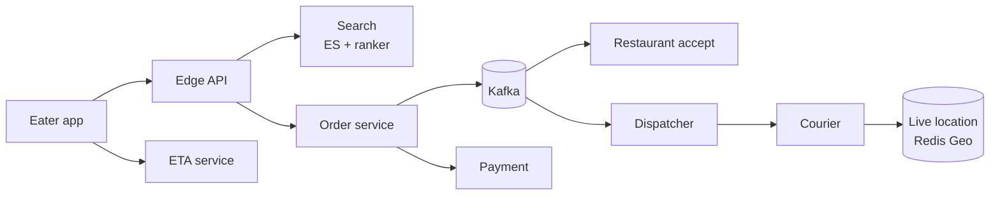

# Food Delivery (Swiggy / Zomato / DoorDash)

> Restaurant discovery + order + courier dispatch + live tracking. Three-sided marketplace.

<span class="phase-status phase-done">Phase 16 — Tier 2</span>

---

## 1. 🎤 Scenario

> *"Design DoorDash. Eaters browse restaurants, place orders. Restaurants accept + cook. Couriers pick up + deliver. Live tracking, ETA prediction."*

## 2. ❓ Clarifying questions

1. Multi-region? Yes — per-city operations.
2. Promised ETA? Soft commit; SLA penalty if late.
3. Multi-stop orders (batched)? Yes for couriers.
4. Payment? Card + wallet + cash on delivery (regional).
5. Restaurant POS integration? Out of scope v1.

## 3. ✅ Requirements

**Functional**: search restaurants, place order, restaurant ack, courier dispatch, live tracking, payment, refund.

**Non-functional**: 30 M orders/day; p99 search < 300 ms; ETA error within ±5 min; courier-eater-restaurant tri-party real-time location.

**Out**: ad targeting, loyalty program.

## 4. 📐 Capacity

- 30 M orders/day = ~350/sec avg, ~5 K/sec dinner peak.
- Active restaurants: 1 M.
- Active couriers: 2 M.
- Location updates: courier every 5 s × 200 K active = **40 K/sec** writes.
- ETA inferences: 30 M × 4 (browse, place, prep, en route) = **120 M/day**.

## 5. 🏛️ Architecture



## 6. 💾 Data model

- **Restaurants** (Postgres + ES index): location, hours, menu, ratings.
- **Orders** (sharded by `(city_id, day)` in Postgres): state machine.
- **Couriers** (Cassandra + Redis Geo for live): position, status.
- **ETA model store** (S3 + feature store).
- **Payments** (separate service, idempotent on `order_id`).

## 7. 🌐 API

```
GET  /v1/search?lat&lng&q
POST /v1/orders {restaurant_id, items, address}
GET  /v1/orders/{id}/track   (SSE / WebSocket)
POST /v1/couriers/location {lat, lng}
```

## 8. 🧩 Component deep-dive

### Order state machine

```python
from enum import Enum

class OrderState(Enum):
    CREATED = 1
    PAID = 2
    R_ACCEPTED = 3
    PREPARING = 4
    READY = 5
    PICKED_UP = 6
    DELIVERED = 7
    CANCELLED = 99

ALLOWED = {
    OrderState.CREATED:    {OrderState.PAID, OrderState.CANCELLED},
    OrderState.PAID:       {OrderState.R_ACCEPTED, OrderState.CANCELLED},
    OrderState.R_ACCEPTED: {OrderState.PREPARING, OrderState.CANCELLED},
    OrderState.PREPARING:  {OrderState.READY, OrderState.CANCELLED},
    OrderState.READY:      {OrderState.PICKED_UP},
    OrderState.PICKED_UP:  {OrderState.DELIVERED},
}

def transition(order, target):
    if target not in ALLOWED.get(order.state, set()):
        raise InvalidTransition(order.state, target)
    order.state = target
```

### Dispatcher (assignment)

```python
def dispatch(order):
    restaurant = order.restaurant
    candidates = redis.geosearch(
        "couriers:active",
        longitude=restaurant.lng, latitude=restaurant.lat,
        radius_km=5.0, unit="km", count=20,
    )
    # Score by ETA + courier idle time + recent rejections
    scored = sorted(
        candidates,
        key=lambda c: eta_to_pickup(c, restaurant) + c.idle_time_s * -0.1,
    )
    for c in scored:
        if offer_to(c, order, ttl_s=15):
            return c
    raise NoCourierAvailable
```

??? note "Why offer with TTL?"

    Couriers can decline (out of range, going off shift). 15 s timeout → roll to next candidate. Avoids stuck orders.

### ETA model

```python
def eta_minutes(order, courier):
    prep = features.predict_prep_time(order.restaurant, order.items)
    travel = haversine(courier.loc, order.restaurant.loc) / courier.avg_kph * 60
    last_mile = features.predict_last_mile(order.address)
    return prep + travel + last_mile
```

## 9. 📈 Scaling

| Stage | Setup |
|---|---|
| Day 1 | Single Postgres, Sidekiq worker for dispatch |
| Year 1 | Per-city sharding; Redis Geo; ML ETA |
| Year 3 | Multi-region; batched dispatch (1 courier → multi orders); surge pricing |

## 10. ☁️ Cloud

AWS: RDS multi-AZ + ElastiCache + MSK + ECS for services. CloudFront for app assets. SES for emails; SNS for push.

## 11. 🏠 On-prem

Postgres + Patroni for HA; Redis Cluster; Kafka; Kubernetes for services.

## 12. 🏗️ Architecture deep-dive

??? question "How to handle restaurant peak (8 PM rush)?"

    Pre-warm with predicted demand → couriers staged near hotspots; pricing surge if demand > supply; defer low-priority orders to slower lanes.

??? question "Live tracking — why WebSocket / SSE?"

    Polling every 5 s × 1 M concurrent eaters = expensive. WS push only on courier movement → 10× cheaper. Fall back to long-poll for old browsers.

## 13. 🧨 Bottlenecks

| Bottleneck | Fix |
|---|---|
| 40 K/sec location writes | Redis Geo (fast); batch write Cassandra hourly for history |
| Restaurant accept latency | Auto-ack after N seconds based on past behaviour |
| Multi-stop dispatch combinatorial | Greedy 2-stop batching only; offline OR-tools for nightly optimisation |
| Refund disputes | Order log + chat history + ML risk score |

## 14. 🔒 Security

- PII encrypted (address, phone).
- Driver identity verification (background check).
- Anti-fraud: device fingerprint, velocity rules on new accounts.
- Tip amount immutable post-rating window (30 days); audit log.
- PCI: never store full PAN; tokenise via Stripe.

## 15. 📊 Monitoring

Order p50/p95 cycle time per region; courier idle %; cancellation rate; ETA error distribution; payment failure rate.

## 16. 🧱 Reliability

- Sagas for cross-service ops (payment ↔ order ↔ inventory).
- Idempotent payment on `order_id` (one charge max).
- Failover: per-region active-passive with order replay from Kafka.
- Stale-courier reaper: > 60 s without heartbeat → mark offline; reassign.

## 17. ❓ Follow-ups

??? question "How is surge pricing computed?"

    Per H3 hex cell, every 30 s: `multiplier = clip(1 + a * (demand/supply - 1), 1, 3)`. Eater shows price upfront; courier sees boost.

??? question "Refund flow?"

    User taps refund → CS service evaluates; if approved, payment service issues partial/full reversal idempotently. Order moves to `CANCELLED_REFUNDED`.

??? question "Multi-stop courier route?"

    Solve TSP within 5 stops greedily (already too slow optimal). For longer routes, batch-decompose; use OR-tools nightly to fine-tune supply curves.

??? question "Restaurant kitchen display fairness?"

    Orders sorted by promised pickup time, not by submit time. Late orders auto-prioritised when kitchen capacity opens.

## 18. 🐍 Snippet

```python
# H3 demand/supply ratio
import h3
def cell_state(lat, lng, res=8):
    cell = h3.geo_to_h3(lat, lng, res)
    return cell, demand_count(cell), supply_count(cell)
```

## 19. 🌍 Real-world

- *DoorDash engineering blog* — dispatch + ETA posts.
- *Uber Eats: Marketplace architecture* — Uber engineering.
- *Swiggy tech blog* — search + ranking posts.
- *DeepETA* — Uber's neural-net ETA paper.

## 20. 🃏 Cheatsheet

- Three-sided: eater × restaurant × courier; modelled as state machine.
- Order saga across payment, dispatch, courier services.
- Redis Geo for live courier location (40 K/sec writes feasible).
- Dispatcher: score candidates by ETA + idle time; offer with 15 s TTL.
- ML ETA = prep + travel + last-mile; features from past orders.
- Surge per H3 hex cell; recomputed every 30 s.
- WebSocket / SSE for live tracking; falls back to polling.
