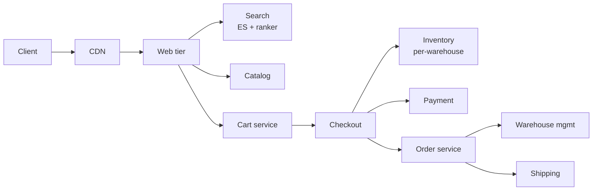

# E-commerce (Amazon-scale)

> Catalog browse, cart, checkout, inventory, fulfilment. The classic SD problem with too many moving parts.

<span class="phase-status phase-done">Phase 16 — Tier 2</span>

---

## 1. 🎤 Scenario

> *"Design Amazon. Browse 500 M SKUs, add to cart, checkout with payment, inventory across warehouses, ship globally. Black Friday spike of 100×."*

## 2. ❓ Clarifying questions

1. Marketplace (third-party sellers) or first-party? Both.
2. Shipping options? Standard, express, same-day.
3. Returns? Yes — RMA flow.
4. International? Yes — multi-currency, customs.
5. B2B / wholesale? Out of scope v1.

## 3. ✅ Requirements

**Functional**: catalog, search, cart, checkout, payment, inventory, order tracking, returns.

**Non-functional**: 1 B page-views/day; 30 M orders/day; 99.99% available; checkout p99 < 500 ms; eventual consistency on inventory acceptable for browse, strong consistency at checkout.

**Out**: ad bidding, recommendation training, video.

## 4. 📐 Capacity

- 1 B PV × 5 KB = **5 PB/day** front-end traffic (CDN absorbs ~80%).
- 500 M SKUs × 4 KB = **2 TB** catalog metadata.
- 30 M orders × 50 fields × 1 KB = **1.5 TB/day** orders.
- Black Friday: 30 M → 3 B orders/day capability needed for 1 day.

## 5. 🏛️ Architecture



## 6. 💾 Data model

- **Catalog** (DynamoDB / sharded MySQL + ES): SKU, attributes, pricing.
- **Inventory** (Cassandra per-warehouse partition): atomic decrement.
- **Cart** (Redis with persistence): TTL 30d.
- **Orders** (Postgres sharded by `(year, hash(customer))`): saga state.
- **Payments** (separate, idempotent on `order_id`).
- **Search** (Elasticsearch).

## 7. 🌐 API

```
GET  /v1/products?q=&filters=
POST /v1/cart/items {sku, qty}
POST /v1/checkout/{cart_id}            → 202 {order_id}
GET  /v1/orders/{id}
POST /v1/orders/{id}/return
```

## 8. 🧩 Component deep-dive

### Inventory reservation (avoid overselling)

```python
import time

def reserve(sku, qty, order_id, ttl_s=900):
    """Atomic decrement with reservation; releases if not committed."""
    key = f"inv:{sku}"
    pipe = redis.pipeline()
    pipe.watch(key)
    avail = int(pipe.hget(key, "available") or 0)
    if avail < qty:
        pipe.unwatch()
        raise OutOfStock(sku)
    pipe.multi()
    pipe.hincrby(key, "available", -qty)
    pipe.hincrby(key, "reserved", qty)
    pipe.zadd(f"reservations:{sku}", {order_id: time.time() + ttl_s})
    pipe.execute()
```

A sweeper restores expired reservations to `available` if the order didn't commit.

### Checkout saga

```python
def checkout(cart_id):
    order = create_order(cart_id)            # step 1
    try:
        for item in order.items:
            reserve(item.sku, item.qty, order.id)
        charge_payment(order)                # step 3
        confirm(order)                       # step 4 — moves reserved → committed
    except PaymentFailed:
        compensate(order)                    # release reservations + cancel order
        raise
    except OutOfStock:
        compensate(order)
        raise
    return order
```

### Catalog read fanout (cache + DB)

```python
def get_product(sku):
    if (cached := redis.get(f"prod:{sku}")):
        return decode(cached)
    p = db.get(sku)
    redis.set(f"prod:{sku}", encode(p), ex=300)
    return p
```

## 9. 📈 Scaling

| Stage | Setup |
|---|---|
| Day 1 | LAMP monolith |
| Year 1 | SOA: catalog, cart, order, payment as services |
| Year 3 | Per-region inventory; ES sharded; ML ranker; saga choreography via Kafka |
| Year 5+ | Per-marketplace tenancy; ad platform; first-party DSP |

## 10. ☁️ Cloud

AWS: ALB + ECS + RDS Aurora + DynamoDB + ES + ElastiCache + S3 + CloudFront. Spend dominated by EC2 + S3.

## 11. 🏠 On-prem

Tiered: edge with HAProxy + Varnish; app on Kubernetes; DBs on bare-metal (Postgres + Cassandra + ES).

## 12. 🏗️ Architecture deep-dive

??? question "Why per-warehouse inventory partitioning?"

    Each warehouse has physical truth; aggregating across is eventual. Local strong consistency for shipping decisions; global view is approximate (\"5 in stock\").

??? question "Saga vs 2PC?"

    2PC blocks on coordinator failure → unacceptable for checkout. Sagas use compensating actions; partial failures roll forward (refund) instead of locking.

## 13. 🧨 Bottlenecks

| Bottleneck | Fix |
|---|---|
| Hot SKU on Black Friday | Pre-warm cache; queue reservations; throttle to inventory rate |
| Cart explosion (millions abandoned) | TTL aggressively; archive after 30d |
| Search latency on 500 M SKUs | Pre-rank top 10 K candidates by per-category index |
| Payment provider timeout | Multi-provider failover; idempotent retry |
| Inventory write hotspot per SKU | Per-warehouse + per-listing partitioning |

## 14. 🔒 Security

- PCI DSS: tokenise card via Stripe/Adyen; never store PAN.
- 3DS / OTP for high-risk transactions.
- PII encrypted at rest; access audited.
- Bot mitigation at edge (Captcha, rate limit on `/cart` and `/checkout`).
- Seller fraud detection: ML risk score + manual review.

## 15. 📊 Monitoring

Conversion funnel (view → cart → checkout → paid); checkout p99; inventory accuracy; payment failure %; cart abandonment.

## 16. 🧱 Reliability

- Multi-region active-active for browse; active-passive for checkout (single source of truth per region).
- Inventory: pessimistic on write (Redis + watch); reconcile against warehouse hourly.
- Payment idempotency keys persisted 30d.
- Chaos drills before peak season.

## 17. ❓ Follow-ups

??? question "How to handle Black Friday 100× spike?"

    **Pre-prep**: capacity reservations 4 weeks out; cache warm-up. **In-event**: queue at edge (politely "you're #N in line"); throttle low-margin pages; SLA-tier customers. **Post**: replay logs to compute losses + tune.

??? question "How is "in stock at 5 warehouses" displayed?"

    Aggregate count from each warehouse partition with 30-60s freshness lag. At checkout, choose the warehouse closest to delivery address that has stock.

??? question "Returns process?"

    User initiates RMA → label generated → returned to nearest warehouse → graded (resellable / refurb / scrap). Refund issued on grade. Order state machine adds RETURNED, REFUNDED.

??? question "Personalised search ranking?"

    Two stages: candidate gen (BM25 from ES) → re-rank top 200 with ML model using user history + location + time-of-day.

??? question "Inventory sync to marketplace sellers?"

    Sellers push inventory feeds (FTP / API) every N minutes. Daily reconcile against actual sales. Penalise sellers who oversell repeatedly.

## 18. 🐍 Snippet

```python
# Idempotency key for payment
def charge(order_id, amount, idem_key):
    if existing := db.get(("idem", idem_key)):
        return existing.txn_id
    txn = stripe.charge(amount, source=order.card_token, idempotency_key=idem_key)
    db.set(("idem", idem_key), txn.id, ex=86400 * 30)
    return txn.id
```

## 19. 🌍 Real-world

- *Amazon DynamoDB paper* — original.
- *Working Backwards* (Bryar/Carr) — operating model.
- *Black Friday at Amazon* — public talks.
- *Stripe checkout architecture* — engineering blog.

## 20. 🃏 Cheatsheet

- Saga checkout: reserve → charge → confirm; compensate on failure.
- Inventory: per-warehouse Redis with watch; reservation TTL.
- Cart in Redis with persistence; 30d TTL.
- Catalog cached aggressively (5 min TTL); CDN at edge.
- Multi-region active-active for browse; active-passive for checkout.
- Idempotent payment on `order_id`.
- Black Friday: pre-warm + queue + throttle low-margin paths.
