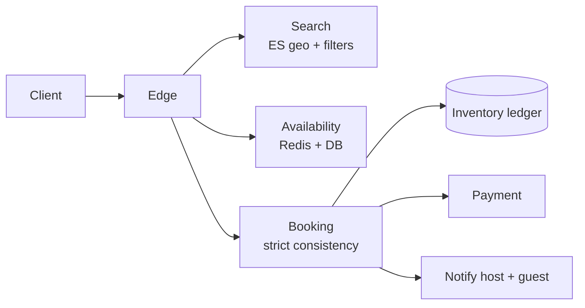

# Hotel / Stay Booking (Booking.com / Airbnb)

> Inventory + availability + booking with consistency. The two-sided marketplace where over-booking is unforgivable.

<span class="phase-status phase-done">Phase 16 — Tier 2</span>

---

## 1. 🎤 Scenario

> *"Design Booking.com. 1 M properties, 100 K bookings/day, search by location/dates/filters, prevent double-booking, handle cancellations."*

## 2. ❓ Clarifying questions

1. Property types? Hotels, vacation rentals, B&B.
2. Booking model? Instant book + request-to-book.
3. Inventory model? Per-room-type or per-unit?
4. Cancellation policies? Multiple — flexible, moderate, strict.
5. Multi-currency? Yes.

## 3. ✅ Requirements

**Functional**: search by location/date, view, book, pay, cancel, review.

**Non-functional**: search p99 < 300 ms; booking strongly consistent (no double-book); 99.99% available.

**Out**: dynamic pricing engine, host onboarding flow.

## 4. 📐 Capacity

- 1 M properties × 5 room types × 365 days = **1.8 B availability rows**.
- Search QPS 50 K avg, 200 K peak.
- 100 K bookings/day = ~1/sec avg, 30/sec peak.
- Reviews: 30 M total, ~10 K/day new.

## 5. 🏛️ Architecture



## 6. 💾 Data model

- **Properties** (Postgres): id, location (lat,lng), amenities, photos.
- **Inventory ledger** (Postgres or sharded MySQL): `(property_id, room_type, date) → available_count`. Strong consistency on writes.
- **Bookings** (Postgres): `id | property | room | start | end | guest | state | price`.
- **Search** (Elasticsearch): geo + filter index.
- **Reviews** (Postgres + ES for search).

## 7. 🌐 API

```
GET  /v1/search?lat&lng&checkin&checkout&guests
GET  /v1/properties/{id}/availability?from&to
POST /v1/bookings {property_id, room_type, checkin, checkout, guests}
DELETE /v1/bookings/{id}
```

## 8. 🧩 Component deep-dive

### Booking with strong consistency

```python
def book(property_id, room_type, checkin, checkout, guest_id):
    with db.transaction():
        # Lock affected dates row-by-row (FOR UPDATE) within one txn
        for d in date_range(checkin, checkout):
            row = db.execute(
                "SELECT available FROM inventory WHERE property_id=%s AND room_type=%s AND date=%s FOR UPDATE",
                (property_id, room_type, d),
            ).one()
            if row.available < 1:
                raise NoAvailability(d)
            db.execute(
                "UPDATE inventory SET available = available - 1 WHERE …",
                (property_id, room_type, d),
            )
        booking_id = db.insert("bookings", state="PENDING_PAYMENT", …)
    charge_payment(booking_id)
    db.execute("UPDATE bookings SET state='CONFIRMED' WHERE id=%s", (booking_id,))
    return booking_id
```

??? note "Why FOR UPDATE rather than CAS?"

    Booking spans a date range. Holding row locks for the full range gives a clean atomic check-and-decrement; CAS per-row would race on partial failures. The lock is held for milliseconds.

### Search with geo + availability blend

```python
def search(lat, lng, checkin, checkout, filters):
    # Stage 1: ES top-200 by geo + filters
    candidates = es.search(
        index="properties",
        body={
            "query": {"bool": {
                "filter": [
                    {"geo_distance": {"distance": "10km", "location": {"lat": lat, "lon": lng}}},
                    *filter_clauses(filters),
                ]
            }},
            "size": 200,
        },
    )
    # Stage 2: filter by live availability
    available = []
    for p in candidates:
        if availability_cache.has_capacity(p.id, checkin, checkout):
            available.append(p)
    return rank(available[:50])
```

Two-stage: ES for ranked filter; in-process availability check on top-200.

## 9. 📈 Scaling

| Stage | Setup |
|---|---|
| Day 1 | Single Postgres + ES |
| Year 1 | Sharded inventory by property_id; per-region ES |
| Year 3 | Eventual-consistent availability cache + strongly-consistent ledger |
| Year 5 | Multi-currency + multi-region active-active for read; active-passive for booking |

## 10. ☁️ Cloud

AWS RDS Aurora (multi-AZ) for ledger; ES on managed; ElastiCache for availability cache; CloudFront for media.

## 11. 🏠 On-prem

Postgres + Patroni; Elasticsearch cluster; HAProxy; Kubernetes.

## 12. 🏗️ Architecture deep-dive

??? question "Why a separate availability cache?"

    Search reads availability for many candidates. Hitting Postgres for each is too slow. Cache aggregates per-property over date ranges with 30 s freshness; final book consults the ledger.

??? question "Can search be eventually consistent?"

    Yes — better to occasionally show \"available\" properties that aren't, than to artificially exclude. The booking API rejects with `NoAvailability` if the cache is stale.

## 13. 🧨 Bottlenecks

| Bottleneck | Fix |
|---|---|
| Hot property (a famous suite) | Per-property write serialisation; queue concurrent attempts |
| Search hot spots (top destinations) | ES filter caches; geo-region replicas |
| Black-out dates / minimum stay rules | Pre-compute valid (start, length) pairs per property |
| Currency FX freshness | Cache rates 1 min; book at locked rate from quote time |

## 14. 🔒 Security

- PII encrypted (passport scans for ID-required stays).
- Card via PCI tokenisation.
- Anti-fraud: device fingerprint, velocity, IP geolocation mismatch.
- Verified-host badges; KYC on payouts.
- Rate limit search to thwart scrapers.

## 15. 📊 Monitoring

Search p50/p99; booking conversion rate; failed bookings (out of stock at confirmation); payment failure %; ledger lag vs cache.

## 16. 🧱 Reliability

- Booking is strongly consistent within a region; cross-region replication asynchronous.
- Saga: book → pay → confirm; compensate releases ledger inventory + cancels booking.
- Outbox pattern for notifications (host + guest get told reliably).

## 17. ❓ Follow-ups

??? question "How to prevent double-booking under DB replica lag?"

    Read & write to the same primary for booking. Strong consistency = primary only. Search can read replicas.

??? question "Cancellation refund policy enforcement?"

    Policy stored on booking at create time (not at property — host could change). Cancel evaluates `(now, checkin, policy)` → refund %.

??? question "Minimum-stay constraint?"

    Materialise per-property `(date, min_stay)`; reject bookings violating. Hosts edit; cache invalidated.

??? question "Surge for high-demand dates?"

    Per-property dynamic pricing model; suggested but host decides. Out of scope for booking flow; the price stamped on the booking holds.

??? question "Multi-room booking (group of friends)?"

    Treat as N bookings under one cart; saga reserves all-or-nothing. If one room unavailable, all roll back.

## 18. 🐍 Snippet

```python
# Compute nightly rate × stay length with currency lock
def quote(property_id, checkin, checkout, currency):
    nightly = pricing.get(property_id, checkin, checkout)
    fx = fx_cache.get_rate(nightly.currency, currency)
    quoted_total = sum(n.amount * fx for n in nightly)
    return Quote(total=quoted_total, fx=fx, expires_at=time.time()+600)
```

## 19. 🌍 Real-world

- *Airbnb engineering blog* — search ranker, payments, internationalisation.
- *Booking.com tech blog* — A/B testing at scale.
- *Two Phase Commit considered harmful* — Pat Helland.
- *MySQL at Airbnb* — sharding + Vitess.

## 20. 🃏 Cheatsheet

- Inventory ledger `(property, room, date)`; FOR UPDATE locks during book.
- Two-stage search: ES geo top-200 → in-process availability filter top-50.
- Booking saga: book → pay → confirm; outbox for notifications.
- Currency locked at quote time (10 min TTL).
- Cancellation policy snapshot on booking, not property.
- Strong consistency only on booking; search can be eventual.
- Hot property → per-id serialisation queue.
