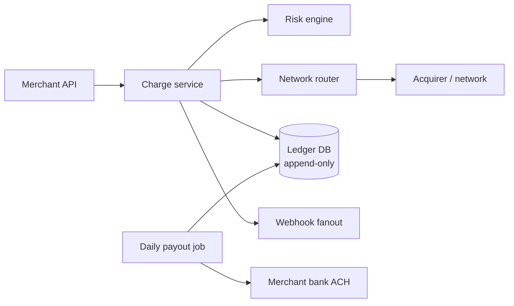

# Payment System (Stripe / PayPal / UPI)

> Move money. The interview where idempotency, ledger correctness, and reconciliation matter more than throughput.

<span class="phase-status phase-done">Phase 16 — Tier 2</span>

---

## 1. 🎤 Scenario

> *"Design Stripe. Merchants charge customers' cards. Subscriptions, refunds, payouts to merchant bank, multi-currency, fraud detection."*

## 2. ❓ Clarifying questions

1. Card networks (Visa/MC) or also wallets (Apple/Google Pay)? Both.
2. Recurring billing? Yes.
3. Multi-currency with FX? Yes.
4. Payout cadence? Daily T+2.
5. Compliance? PCI DSS Level 1, SOC 2.

## 3. ✅ Requirements

**Functional**: charge, refund, capture, subscriptions, payouts, dispute handling.

**Non-functional**: 1 K txn/sec sustained, 10 K peak; 99.999% during business hours; **double-spend impossible**; auditable ledger.

**Out**: KYC onboarding (separate), ACH/SEPA direct (own track).

## 4. 📐 Capacity

- 100 M txns/day = ~1.2 K/sec avg.
- Black Friday peak ~10 K/sec.
- Ledger entries: 2 per txn × 100 M = **200 M rows/day**.
- 5 years retention → **350 B rows** in cold tier.

## 5. 🏛️ Architecture



## 6. 💾 Data model

- **Ledger** (Postgres + sharded by entity_id; append-only): every state change a row. `(txn_id, account, amount, currency, type, ts)`.
- **Idempotency keys** (Redis + Postgres mirror): `key → (txn_id, response)`.
- **Cards** (tokenised; PAN never stored — token vault is HSM-backed).
- **Subscriptions** (Postgres): customer, plan, next_invoice_at.
- **Webhook deliveries** (Cassandra): per-merchant queue with retry state.

## 7. 🌐 API

```
POST /v1/charges
  Idempotency-Key: <uuid>
  { amount, currency, source, customer, capture: true|false }
→ 201 { id, status: succeeded|requires_action|failed }

POST /v1/refunds {charge_id, amount}
POST /v1/subscriptions {customer, plan_id}
```

## 8. 🧩 Component deep-dive

### Idempotent charge

```python
def charge(idem_key, amount, currency, source):
    # Look up first; return cached response if seen
    if cached := idem_store.get(idem_key):
        return cached.response
    # Reserve key
    if not idem_store.set_nx(idem_key, "in_progress", ex=86400):
        raise IdempotencyConflict
    try:
        risk_score = risk.evaluate(amount, source)
        if risk_score > THRESHOLD:
            return finalise(idem_key, status="declined", reason="risk")
        net_resp = network.authorise(amount, currency, source)
        ledger.append(double_entry(amount, currency, net_resp.txn_id))
        return finalise(idem_key, status="succeeded", net=net_resp)
    except NetworkTimeout:
        # Critical: must not lose state
        ledger.append({"type": "AUTH_TIMEOUT", "key": idem_key, "amount": amount})
        raise
```

??? note "Double-entry bookkeeping"

    Every txn debits one account and credits another, equal amounts. The sum across all accounts is always zero. Reconciliation = "does ledger sum = 0?". Easy to detect bugs.

### Network router (multi-acquirer)

```python
def authorise(amount, currency, card):
    primary = router.choose(card.brand, currency)
    try:
        return primary.authorise(amount, card)
    except (Decline503, NetworkTimeout):
        backup = router.choose(card.brand, currency, exclude={primary})
        return backup.authorise(amount, card)
```

Stripe famously uses multiple acquirers and shadow-traffics them to learn cost-vs-success rates per (BIN, country, time-of-day).

### Webhook delivery with retries

```python
def deliver_webhook(merchant, event):
    for attempt in [0, 30, 300, 3600, 43200]:        # ramp to 12h
        time.sleep(attempt)
        try:
            r = requests.post(merchant.webhook_url, json=event, timeout=10,
                              headers={"Stripe-Signature": sign(event)})
            if r.status_code < 300:
                return
        except (ConnectionError, Timeout):
            pass
    deadletter.append(merchant, event)
```

## 9. 📈 Scaling

| Stage | Setup |
|---|---|
| Day 1 | Single Postgres ledger + Stripe Connect monolith |
| Year 1 | Per-merchant sharded ledger; Redis for idempotency |
| Year 3 | Multi-region active-active w/ leader per merchant; geo-routed acquirers |
| Year 5 | ML risk + dispute prediction; treasury management |

## 10. ☁️ Cloud

PCI-compliant zone (separate VPC, hardened AMI). RDS for ledger; ElastiCache; KMS-backed token vault; isolated outbound network for acquirer calls.

## 11. 🏠 On-prem

PCI bare-metal; HSMs for token vault (Thales / SafeNet); MariaDB Galera for ledger; HAProxy; Kafka for events.

## 12. 🏗️ Architecture deep-dive

??? question "Why append-only ledger?"

    Mutable state = bugs corrupt history. Append-only = every change is auditable, replayable, reversible by adding a compensating entry. Banks and exchanges have done this for centuries.

??? question "Idempotency vs at-least-once?"

    Customer's network can timeout — they retry — without idempotency we charge twice. Server-side: every mutating call requires `Idempotency-Key`; first-write wins; replay returns cached response.

## 13. 🧨 Bottlenecks

| Bottleneck | Fix |
|---|---|
| Acquirer outage | Multi-acquirer + circuit breaker + retry queue |
| Ledger contention on hot merchant | Per-merchant shard; lock-free append (insert-only) |
| Webhook 5xx storm at one merchant | Per-merchant queue; back off; cap concurrency |
| Currency FX update lag | 1-min cached rates; quote at submission, lock |
| Disputes spike | Async ML triage; bucket by reason code |

## 14. 🔒 Security

- PCI DSS L1 audit annually; segmented networks.
- PAN tokenised at edge; HSM-backed tokens; ephemeral decryption only at network call.
- TLS 1.3 + mTLS to acquirers.
- Rate limit by merchant + per-card.
- Anti-replay nonces; signed webhooks.
- Anomaly detection: large spike from new merchant → freeze.

## 15. 📊 Monitoring

Authorisation success rate per BIN; p99 latency to network; ledger lag; idempotency cache hit; webhook delivery success; chargeback rate.

## 16. 🧱 Reliability

- Two-region active-active with synchronous ledger replication on confirmed txns.
- Daily reconciliation against bank settlement files; auto-flag mismatches.
- Replay-from-ledger: if cache is corrupt, rebuild balances from append log.
- Test in production: shadow new code paths against 1% traffic before promote.

## 17. ❓ Follow-ups

??? question "How is a refund recorded?"

    Append a new ledger entry with `type=REFUND` and reverse signs of the original. Net balance for merchant decreases; customer card receives credit. Network call reverses real money.

??? question "What if the network confirms but our DB write fails?"

    Acquirer is the source of truth for that auth code. Reconciliation job at end of day matches our records vs theirs; we materialise missing entries.

??? question "Subscription billing logic?"

    `subscriptions` table with `next_invoice_at`. Cron evaluates due ones; creates invoice; charges. Failed charges → smart retry (Stripe's "Smart Retries" tries best time per BIN).

??? question "Settlement timing?"

    Auth = hold (customer card balance reduced). Capture = move to merchant pending. Daily payout = ACH transfer to merchant bank with N-day rolling reserve.

??? question "How do you handle disputes / chargebacks?"

    Network notifies; create dispute case; gather evidence (receipts, IP, shipping); submit by deadline. Track win rate per merchant; price risk into fee.

## 18. 🐍 Snippet

```python
# Double-entry helper
def double_entry(amount, currency, txn_id, debit_acct, credit_acct):
    return [
        {"txn_id": txn_id, "account": debit_acct,  "amount": -amount, "currency": currency},
        {"txn_id": txn_id, "account": credit_acct, "amount": +amount, "currency": currency},
    ]
```

## 19. 🌍 Real-world

- *Stripe engineering blog* — idempotency, smart retries.
- *Square's payment ledger* — public talks.
- *Patterns of Enterprise Application Architecture* (Fowler) — ledger patterns.
- *PCI DSS spec* — official document.
- *PayPal payments architecture* — engineering blogs.

## 20. 🃏 Cheatsheet

- **Idempotency-Key on every mutating call**; cached response 24h.
- **Append-only double-entry ledger** — every state change is a row.
- Card data **tokenised**; PAN never stored.
- Multi-acquirer with failover; per-(BIN, country) routing.
- Webhook delivery: exponential retry up to 12h; signed payload.
- Daily reconciliation against bank settlement.
- PCI DSS L1 segmented network, HSM token vault.
