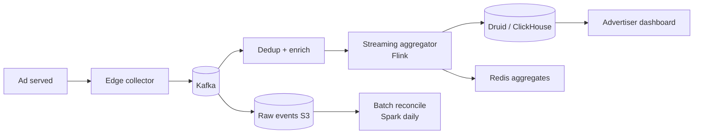

# Ad Click Tracking & Aggregation

> Count clicks at billion-event/day scale, dedupe replay attacks, attribute correctly, expose dashboards in seconds.

<span class="phase-status phase-done">Phase 16 — Tier 2</span>

---

## 1. 🎤 Scenario

> *"Design ad-click tracking. Every click on every served ad globally must be logged, deduped, attributed (impression → click → conversion), and aggregated for advertiser dashboards within 5 minutes."*

## 2. ❓ Clarifying questions

1. Volume? 100 B impressions/day, 1 B clicks/day.
2. Latency? Real-time aggregation < 5 min lag.
3. Attribution window? 7 days standard; 30d for some.
4. Fraud detection? Yes — bot, click farms, replay.
5. Multi-currency budget tracking? Yes.

## 3. ✅ Requirements

**Functional**: log impressions, clicks, conversions; attribute click→conv; aggregate per `(advertiser, campaign, ad, geo, hour)`.

**Non-functional**: 1 B clicks/day = ~12 K/sec avg, 100 K/sec peak; 99.99% capture; idempotent against replay.

**Out**: real-time auction (separate RTB system), creative serving.

## 4. 📐 Capacity

- Impressions 100 B/day = 1.2 M/sec avg.
- Clicks 1 B/day = 12 K/sec avg, 100 K/sec peak.
- Each event ~500 B → **600 GB/day** clicks; **50 TB/day** impressions.
- Pre-aggregated rollups: ~1 GB/day per advertiser.

## 5. 🏛️ Architecture



## 6. 💾 Data model

- **Click event**: `{click_id, ad_id, campaign_id, user_id_hashed, ts, ip, ua, referrer, signature}`.
- **Dedup keys** (Redis with 24h TTL): `click_id` SET NX.
- **Raw store** (S3 / GCS in Parquet, partitioned by hour).
- **OLAP** (Druid or ClickHouse): time-partitioned columnstore for dashboards.
- **Pre-aggregates** (Redis HASH): per-campaign-hour counters.

## 7. 🌐 API

```
GET /v1/track/click?click_id=&ad_id=&sig=…   → 302 redirect to advertiser URL
GET /v1/dashboard/{campaign}?from&to&group_by=hour
```

## 8. 🧩 Component deep-dive

### Click handler (idempotent + signed)

```python
import hmac, time

def handle_click(req):
    if not verify_sig(req.params, secret=AD_SIGNING_KEY):
        return 400
    click_id = req.params["click_id"]
    if not redis.set(f"click:{click_id}", 1, ex=86400, nx=True):
        return 302, redirect_url(req)              # already counted; still redirect
    event = build_event(req)
    kafka.produce("clicks", key=click_id, value=event)
    return 302, redirect_url(req)
```

??? note "Why redirect even on duplicate?"

    User experience must not break. Replays don't double-count, but the ad's redirect URL still resolves.

### Streaming aggregation (Flink-style)

```python
# Pseudocode for the Flink job
clicks = kafka_source("clicks")
windowed = (
    clicks
    .key_by(lambda e: (e.campaign_id, e.hour_bucket))
    .window(TumblingEventTime(minutes=1))
    .aggregate(CountAgg())
)
windowed.sink(druid)         # rolled into 1-min buckets
windowed.sink(redis)         # near-realtime cache for dashboards
```

### Bot / fraud filter

```python
def is_likely_bot(event) -> bool:
    if event.ua in known_bot_uas:                       return True
    if recent_clicks_from_ip(event.ip, last_min=1) > 30: return True
    if click_through_time_ms(event.imp_id, event.ts) < 150: return True
    return False
```

Genuine clicks have a > 200 ms gap between impression and click. Sub-150 ms = headless or pre-fetcher.

## 9. 📈 Scaling

| Stage | Setup |
|---|---|
| Day 1 | One web server logs to Postgres |
| Year 1 | Kafka + nightly Spark batch + Redshift |
| Year 3 | Streaming Flink → Druid for sub-min latency |
| Year 5 | Edge collectors per region; multi-tier rollup |

## 10. ☁️ Cloud

AWS Kinesis or MSK + Flink on EMR + Druid on EC2 + S3. CloudFront for edge collectors. ~$100/M clicks at moderate scale.

## 11. 🏠 On-prem

Kafka cluster + Flink on YARN + Druid + HDFS for raw. NGINX edge collectors per region.

## 12. 🏗️ Architecture deep-dive

??? question "Why dual-write to Druid + Redis?"

    Druid for arbitrary OLAP (any group-by, any time range). Redis for sub-second hot dashboard reads (current campaign-hour counters). Druid lag is 30-60 s; Redis is < 5 s.

??? question "Lambda vs Kappa?"

    Kappa (streaming-only) for hot path; periodic batch (Spark) for daily reconciliation against S3 to fix gaps. Lambda's complexity (two pipelines) usually isn't worth it.

## 13. 🧨 Bottlenecks

| Bottleneck | Fix |
|---|---|
| Hot key (huge advertiser) | Salt aggregation key with shard suffix; merge in dashboard |
| Backpressure on Kafka | Multiple partitions per topic; producer-side batching |
| Druid ingest lag during a spike | Pre-aggregate at Flink before pushing to Druid |
| Replay attack on click_id | Sig + Redis dedup; reject after expiry window |
| Slow dashboard query | Materialised views per `(campaign, day)` |

## 14. 🔒 Security

- HMAC signature in URL = only legitimate ad servers can mint clicks.
- IP geolocation must match user's claimed country (advertisers buy by geo).
- PII: hash user_id; never store raw email/IP — k-anonymise aggregations.
- Rate limit per IP at edge.
- Fraud feedback loop: confirmed bots → IP blocklist + ML retrain.

## 15. 📊 Monitoring

Click ingest QPS; dedup rate; bot rejection %; Flink consumer lag; Druid query p99; Redis hit ratio; per-advertiser anomaly detection.

## 16. 🧱 Reliability

- **At-least-once** Kafka with idempotent producer.
- Aggregator checkpoints to S3; replay on failure.
- Daily batch reconcile S3 raw vs Druid totals — alert if drift > 0.1%.
- Multi-region: clicks logged locally, replicated to global aggregator with 1-min lag.

## 17. ❓ Follow-ups

??? question "How to attribute conversion to click?"

    On conversion (purchase): look up last click for this user (within attribution window). Last-click attribution is default; can also do data-driven (Shapley) for premium advertisers.

??? question "What if the same ad is clicked twice in 100ms?"

    Second is dedupe-rejected (same `click_id`). If different `click_id` (legitimate fast click) but same user + ad in N seconds, also flagged as suspicious — billed once.

??? question "Sub-second dashboard freshness?"

    Push streaming aggregates to Redis with 5-second windows. Dashboard polls Redis for "last 5 min", joins with Druid for older data.

??? question "How is fraud quantified?"

    Daily fraud report; reduce advertiser bill by detected fraud %; refund. Build trust through transparency.

??? question "Click tracking pixels vs server redirect?"

    Both. Pixel for impression (img tag fires HEAD). Click is a server-side redirect with full event capture. Pixel can be blocked by ad-blockers; redirect is harder to block.

## 18. 🐍 Snippet

```python
# Per-bucket counter with hot-key salting
def incr(advertiser, campaign, ts):
    bucket = ts // 60
    salt = (hash(advertiser) + bucket) % 16
    redis.hincrby(f"agg:{advertiser}:{campaign}:{bucket}:{salt}", "clicks", 1)

def total(advertiser, campaign, bucket):
    return sum(int(redis.hget(f"agg:{advertiser}:{campaign}:{bucket}:{s}", "clicks") or 0)
               for s in range(16))
```

## 19. 🌍 Real-world

- *Druid paper* (Yang et al., SIGMOD 2014).
- *Apache Flink* — event-time semantics docs.
- *Google Ads Conversions* — public docs on attribution.
- *Facebook Ads Manager* — feature landing pages describe tradeoffs.

## 20. 🃏 Cheatsheet

- HMAC-signed click URL; dedup via Redis SET NX on `click_id`.
- Kafka in, Flink stream-aggregate by `(campaign, minute)`.
- Druid for OLAP; Redis for sub-second hot path.
- Bot filter: UA + IP-rate + impression-to-click gap < 150 ms.
- Daily Spark reconcile vs S3 raw to catch gaps.
- Hot-key salting for huge advertisers.
- Last-click attribution default; Shapley for premium.
