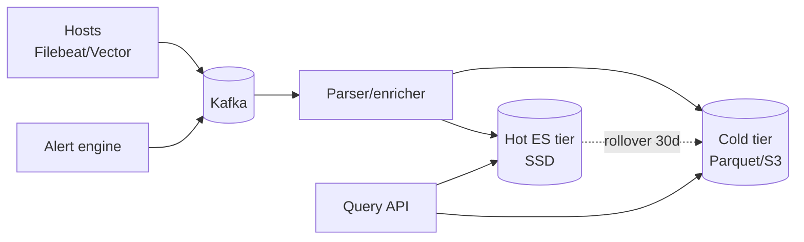

# Distributed Logging (Splunk / ELK)

> Ingest petabytes of logs from 100K hosts, index by structured + free-text, query in seconds, retain for years.

<span class="phase-status phase-done">Phase 16 — Tier 2</span>

---

## 1. 🎤 Scenario

> *"Design a logging system. Ingest 1 TB/min from 100K hosts; structured + unstructured; queryable by user/service/keyword/time; alert on patterns; retain 90d hot, 2y cold."*

## 2. ❓ Clarifying questions

1. Log shape? JSON (structured) + plain text (legacy).
2. Retention? Hot 90d; warm 1y; cold 5y.
3. Query types? Free-text + structured filters + aggregations.
4. Real-time alerts? Yes.
5. Multi-tenant? Yes.

## 3. ✅ Requirements

**Functional**: ingest, index, query, alert, dashboard.

**Non-functional**: 1 TB/min ingest = ~17 GB/sec; query p99 < 5 s for 24h window; 99.99% available; full-text search.

**Out**: log shipper agent itself (use Filebeat/Fluentbit); APM tracing (separate, OpenTelemetry).

## 4. 📐 Capacity

- 1 TB/min × 60 × 24 = **1.4 PB/day** raw.
- Compression ~10× → **140 TB/day** stored.
- 90d hot tier = **12.6 PB**.
- Index overhead ~25% → **3.2 PB** index.

## 5. 🏛️ Architecture



## 6. 💾 Data model

- **Hot index** (Elasticsearch / OpenSearch): time-partitioned by hour or day; 1 index per `(tenant, day)`.
- **Cold tier** (S3 in Parquet, partitioned by `(tenant, day, hour)`): queryable via Athena / Presto.
- **Schema-on-read** for free-text fields; explicit mapping for known fields.

## 7. 🌐 API

```
POST /v1/ingest                 (gRPC stream from agent)
GET  /v1/search?q=…&from&to&tenant
POST /v1/alerts {query, threshold, channel}
```

## 8. 🧩 Component deep-dive

### Parser / enricher

```python
def parse_line(line: str) -> dict:
    if line.startswith("{"):
        try: return json.loads(line)
        except: pass
    # Heuristic regex for legacy formats (apache, syslog)
    for pattern in PATTERNS:
        if (m := pattern.match(line)):
            return m.groupdict()
    return {"raw": line}

def enrich(event):
    event["tenant_id"] = derive_tenant(event)
    event["host_az"]   = host_meta(event["host"]).get("az")
    return event
```

### Index rollover

```python
def maybe_rollover(index):
    info = es.indices.stats(index)
    size_gb = info["primaries"]["store"]["size_in_bytes"] / 1e9
    if size_gb > 50 or info["primaries"]["docs"]["count"] > 50_000_000:
        new = next_index_name(index)
        es.indices.create(new, settings=DEFAULT_SETTINGS)
        es.indices.update_aliases({
            "actions": [
                {"add": {"index": new, "alias": "logs-write"}},
                {"remove": {"index": index, "alias": "logs-write"}},
            ]
        })
```

??? note "ILM (Index Lifecycle Management)"

    Hot (SSD, replicated 1) for 7d → warm (HDD, no replica) for 30d → cold (S3 searchable snapshot) for 1y → delete.

### Query path

```python
def search(query_str, from_ts, to_ts, tenant):
    indices = resolve_indices(tenant, from_ts, to_ts)
    return es.search(
        index=",".join(indices),
        body={
            "query": {"bool": {
                "must": [{"query_string": {"query": query_str}}],
                "filter": [
                    {"term":  {"tenant_id": tenant}},
                    {"range": {"@timestamp": {"gte": from_ts, "lte": to_ts}}},
                ],
            }},
            "size": 200,
        },
    )
```

## 9. 📈 Scaling

| Stage | Setup |
|---|---|
| Day 1 | Single ES + Filebeat |
| Year 1 | Kafka buffer + 20-node ES + nightly archive to S3 |
| Year 3 | Per-tenant indices; tiered storage; ILM policies |
| Year 5 | OpenSearch + searchable snapshots; ML log clustering for anomaly |

## 10. ☁️ Cloud

AWS: MSK + OpenSearch managed + S3. Or Datadog/Splunk Cloud as fully managed (10× cost). Per-GB ingest pricing dominates.

## 11. 🏠 On-prem

Self-managed ES cluster (50+ nodes); Kafka 12-node; Ceph for cold; Grafana for dashboards; ElastAlert for alerts.

## 12. 🏗️ Architecture deep-dive

??? question "Why Kafka in front of ES?"

    Buffer ingest spikes; allow ES upgrades without log loss; replay on indexing bug. Kafka 7d retention is the safety net.

??? question "Why per-tenant per-day index?"

    Easy retention (drop a day's index = O(1)). Easy isolation (one noisy tenant doesn't drag others). Easy resharding (different tenants on different node groups).

## 13. 🧨 Bottlenecks

| Bottleneck | Fix |
|---|---|
| Hot tenant overwhelms shard | Dedicated nodes for top-N tenants; rate limit at ingest |
| Mapping explosion (random JSON keys) | Block ingestion of fields > N depth; flatten/strip dynamic keys |
| Slow free-text query over 90d | Fall back to S3 + Presto; recommend narrowing time range |
| Indexing CPU bottleneck | Parse in Kafka consumer (Vector/Logstash) before ES |
| Cardinality explosion (per-user labels) | Tag keys allowlist; reject high-card unknown labels |

## 14. 🔒 Security

- mTLS from agents to collectors.
- Multi-tenant isolation in ES via document-level security.
- PII redaction in parser stage (regex + ML).
- Audit log of every search query (compliance).
- RBAC: tenant admins can grant role-based access to subindices.

## 15. 📊 Monitoring

Ingest GB/sec per tenant; query p50/p99; ES heap usage; Kafka lag; tier transition rate; alert false-positive rate.

## 16. 🧱 Reliability

- Replication factor 1 in hot tier (cost); shadow shards in warm.
- Snapshot to S3 hourly; restorable.
- DLQ for parse failures; sampled re-ingest.
- Cross-AZ Kafka; ES quorum across AZs.

## 17. ❓ Follow-ups

??? question "How to alert on log patterns?"

    Per-rule continuous query: `count(WHERE level=ERROR AND service=X) over 5min > N`. ElastAlert / Sigma rules. Push to PagerDuty / Slack.

??? question "How to handle log spikes (deploy bug spamming logs)?"

    Per-source token bucket at ingest; circuit-break + drop with metric. Alert ops; merchant gets a "you are being throttled" notice.

??? question "Schema-on-read vs schema-on-write?"

    Both. Known fields (`@timestamp`, `level`, `service`) get mapped explicitly. Unknown JSON keys flatten to keyword fields up to N depth, then stripped.

??? question "How to query across tiers transparently?"

    Hot ES + cold S3 union. ES handles last 30d natively; pre-Athena handler delegates older ranges. Latency budget shifts: cold queries get 30 s deadline.

??? question "Cost optimisation?"

    Tier aggressively. Compress (zstd) raw S3. Drop low-value fields (debug spam) at parse stage. Sample DEBUG to 1%. Track \"$ per GB queried\" as a KPI.

## 18. 🐍 Snippet

```python
# Per-source rate limit at collector
class IngestThrottle:
    def __init__(self, limit_per_sec=10000):
        self.limit = limit_per_sec
        self.bucket = {}            # source → (tokens, last)

    def allow(self, src):
        now = time.time()
        toks, last = self.bucket.get(src, (self.limit, now))
        toks = min(self.limit, toks + (now - last) * self.limit)
        if toks >= 1:
            self.bucket[src] = (toks - 1, now)
            return True
        self.bucket[src] = (toks, now)
        return False
```

## 19. 🌍 Real-world

- *Splunk architecture* — public docs.
- *Elastic Common Schema* — ECS spec.
- *Vector logs ingestion* — Datadog's open-source.
- *Twitter's Heron logging* — engineering blog.
- *Loki (Grafana)* — index-by-labels-only design.

## 20. 🃏 Cheatsheet

- Agents → Kafka buffer → parser → ES (hot) + S3 (cold).
- Per-tenant per-day indices; ILM transitions hot → warm → cold → delete.
- Schema-on-read with allowlist + mapping for known fields.
- Free-text via ES; archival via Athena / Presto on Parquet.
- Alert engine = continuous query on Kafka stream.
- mTLS + per-tenant document-level security in ES.
- Rate-limit per source to handle log floods gracefully.
