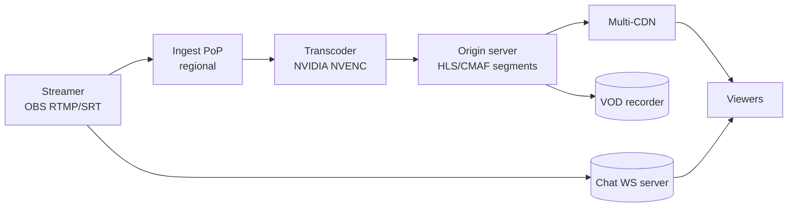

# Live Streaming (Twitch / YouTube Live)

> Real-time video from one streamer to millions of viewers with < 5 s lag. Different from VOD: ingest is the hard part.

<span class="phase-status phase-done">Phase 16 — Tier 2</span>

---

## 1. 🎤 Scenario

> *"Design Twitch. 100K concurrent streamers; viewers watch with < 5 s glass-to-glass; chat per stream; clip + replay later."*

## 2. ❓ Clarifying questions

1. Latency target? Standard 5-10 s; "low-latency" mode 2 s.
2. Resolutions? 240p–1080p; 60fps for gaming.
3. Chat? Yes — IRC-style.
4. Recording → VOD? Yes.
5. Monetisation? Subscriptions, donations.

## 3. ✅ Requirements

**Functional**: ingest stream, transcode to ABR ladder, fan out to viewers, real-time chat, clip + record → VOD.

**Non-functional**: 100K concurrent streamers; 10M concurrent viewers; glass-to-glass < 5 s; 99.99% during peak.

**Out**: live shopping integrations, advanced ML moderation.

## 4. 📐 Capacity

- 100 K streamers × 6 Mbps avg = **600 Gbps** ingest.
- 10 M viewers × 3 Mbps avg = **30 Tbps** egress (CDN-fronted).
- Transcode: 100 K × 5 ladder rungs × 1 vCPU = **500 K vCPU** if pure-CPU; GPU/ASIC cuts 10-30×.

## 5. 🏛️ Architecture



## 6. 💾 Data model

- **Stream metadata** (Postgres): `stream_id, streamer_id, title, started_at, status`.
- **Segment storage** (S3 / origin): 2-6 s chunks, .ts or .m4s.
- **Manifest** (HLS .m3u8 / DASH .mpd) updated each segment.
- **Chat** (Redis pub/sub + Cassandra archive).
- **VOD** (S3 + DASH manifest assembled post-stream).

## 7. 🌐 API

```
POST /v1/streams/start            → 201 {ingest_url: rtmp://…/key, stream_id}
GET  /v1/streams/{id}/manifest.m3u8
WS   /v1/chat/{stream_id}
POST /v1/clips {stream_id, start_s, duration_s}
```

## 8. 🧩 Component deep-dive

### Ingest with SRT for lower latency

- **RTMP** legacy; 5+ s latency; well-supported.
- **SRT** UDP-based; 1-2 s latency; resilient to packet loss.
- **WebRTC** for sub-second; viewer-side complexity.

```python
# Pseudocode for ingest server
def on_packet(stream_key, pkt):
    if not auth(stream_key):
        disconnect()
    pipeline.push(stream_key, pkt)            # decode → segment → transcode
```

### ABR ladder

| Rung | Resolution | Bitrate |
|---|---|---|
| 0 | 1080p60 | 6 Mbps (H.264) / 4 Mbps (H.265) |
| 1 | 720p60  | 3.5 Mbps |
| 2 | 720p30  | 2 Mbps |
| 3 | 480p30  | 1 Mbps |
| 4 | 360p30  | 600 kbps |

Audio passes through (AAC 128 kbps).

### LL-HLS for low latency

- Standard HLS: 3 segments × 6 s = 18 s lag.
- **LL-HLS / CMAF chunked transfer**: partial segments; ~2-3 s lag.
- Each chunk pushed to CDN as it's encoded; manifest updated frequently.

### Chat fan-out

```python
class ChatRoom:
    def __init__(self, stream_id):
        self.stream_id = stream_id
        self.subscribers = set()      # WebSocket connections

    async def post(self, user, msg):
        if rate_limit_breach(user, self.stream_id):
            return
        event = {"u": user, "m": moderate(msg), "ts": time.time()}
        # Sample for huge rooms (500K viewers) — only show subset
        if len(self.subscribers) > 50_000:
            sample = random.sample(self.subscribers, 50_000)
        else:
            sample = self.subscribers
        for sub in sample:
            sub.send_nowait(event)
        archive.append(self.stream_id, event)
```

## 9. 📈 Scaling

| Stage | Setup |
|---|---|
| Day 1 | Single ingest + nginx-rtmp + ffmpeg transcoder |
| Year 1 | PoP ingest + GPU transcoder fleet + multi-CDN |
| Year 3 | Per-region origin; LL-HLS; per-stream chat shards |
| Year 5 | Edge transcode (on the CDN); ML auto-clip generation |

## 10. ☁️ Cloud

AWS Elemental MediaLive + MediaPackage + CloudFront. Or self-managed: ECS for ingest, GPU EC2 for transcode, S3 for segments.

## 11. 🏠 On-prem

Bare-metal NVIDIA T4/L4 GPUs for transcode; nginx-rtmp / SRS for ingest; Varnish for caching; CDN partner for global egress.

## 12. 🏗️ Architecture deep-dive

??? question "Why a regional ingest PoP, not direct to origin?"

    Long-haul UDP loss is brutal. Streamer connects to nearest PoP (< 30 ms RTT), PoP backhauls to origin over reliable backbone. SRT or QUIC handles the residual loss.

??? question "Why CMAF instead of pure HLS?"

    CMAF chunked transfer enables LL-HLS. Same `.m4s` works for HLS and DASH viewers — single pipeline.

## 13. 🧨 Bottlenecks

| Bottleneck | Fix |
|---|---|
| Transcoder hot during peak | GPU transcoders (1 GPU = 8-16 simultaneous streams); spot fleet |
| CDN cache miss during a viral stream | Pre-warm; tiered cache; multi-CDN to spread load |
| Chat hot spot (1 M concurrent in one room) | Sharded fanout; sample messages; archive only |
| Streamer's wonky upload | Adaptive ingest bitrate; show "buffering" indicator |
| Replay ingest lag (VOD assembly) | Build manifest on the fly; stitch on first replay request |

## 14. 🔒 Security

- Stream keys are secrets; rotate per session.
- DDoS at ingest: signed URLs + per-streamer rate limit.
- Chat moderation: ML (toxicity classifier) + creator-set wordlists + temp bans.
- DRM (Widevine/FairPlay) for premium content.
- Geo-blocking per content rights.

## 15. 📊 Monitoring

Ingest jitter / packet loss; transcoder queue depth; CDN hit ratio; viewer concurrent count; chat msg/sec; per-region p99 startup time.

## 16. 🧱 Reliability

- Dual ingest (streamer's OBS pushes to two PoPs); origin de-dupes.
- Transcoder redundancy: hot standby per stream; failover < 2 s.
- Multi-CDN: switch viewers between Akamai/CloudFront/Fastly via headers/dynamic rewrites.
- Chat: multi-region replicated; eventual archive.

## 17. ❓ Follow-ups

??? question "Why not WebRTC for everything?"

    WebRTC scales poorly fan-out (peer relays / SFU). For 1-to-many > 1 K, HLS/CMAF over CDN is dramatically cheaper. Use WebRTC for sub-second use cases (auctions, sports betting) at small scale.

??? question "How is glass-to-glass measured?"

    Streamer overlays a timestamp; viewer reads it; difference = end-to-end latency. Sample per minute.

??? question "Clipping a moment from a live stream?"

    Recorder keeps last N hours of segments. Clip API references `(stream_id, start_s, duration_s)`; new VOD object created from existing segments — zero re-encode.

??? question "Multi-bitrate per viewer?"

    Player measures bandwidth + buffer; selects best ladder rung. Switching is mid-segment-boundary safe with CMAF.

??? question "How to handle a lone Brazilian streamer with 5 M global viewers?"

    Origin in São Paulo; segments push to regional caches via CDN tiered cache (mid-tier in São Paulo + EU + US). Edge POPs do the bulk delivery to viewers.

## 18. 🐍 Snippet

```python
# CDN tier-cache fetch with stale-while-revalidate
def fetch_segment(seg_url):
    cached = edge_cache.get(seg_url)
    if cached and cached.fresh:
        return cached.body
    body = origin.get(seg_url, timeout=2.0)
    edge_cache.set(seg_url, body, ttl=15)
    return body
```

## 19. 🌍 Real-world

- *Twitch engineering blog* — IVS, transcoder fleet posts.
- *YouTube Live* — engineering talks.
- *Apple HLS spec* — RFC 8216 + LL-HLS draft.
- *DASH-IF* — MPEG-DASH ecosystem.
- *Mux engineering blog* — practical streaming infra.

## 20. 🃏 Cheatsheet

- Ingest: RTMP/SRT to regional PoP; backhaul to origin.
- Transcode on GPU; ABR ladder 240p–1080p60.
- Output: CMAF chunked → LL-HLS for ~2 s lag.
- Multi-CDN egress; tiered cache for hot streams.
- Chat: sharded WebSocket; sample for huge rooms.
- VOD: stitched from live segments; zero re-encode.
- Glass-to-glass < 5 s; LL mode < 2 s with CMAF.
