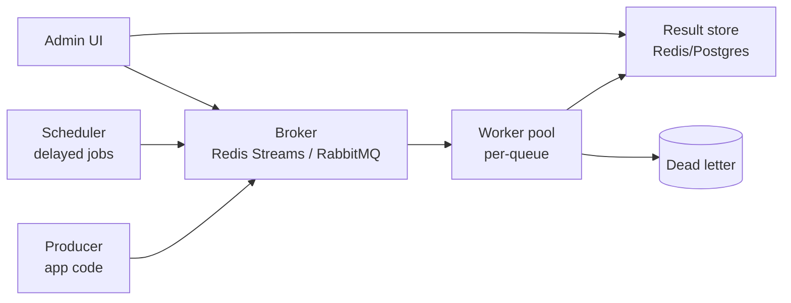

# Distributed Task Queue (Celery / Sidekiq)

> Schedule, dispatch, retry millions of background jobs/day across worker fleets without losing one.

<span class="phase-status phase-done">Phase 16 — Tier 2</span>

---

## 1. 🎤 Scenario

> *"Design a job queue for async work — emails, image processing, billing crons. 10 M jobs/day, priority lanes, delayed execution, retries, dead-lettering."*

## 2. ❓ Clarifying questions

1. Latency? Most jobs < 1 s queue→start; some scheduled hours/days out.
2. Ordering? Per-key FIFO sometimes (per-user emails); else best-effort.
3. Idempotency? Workers must tolerate duplicate delivery.
4. Priority? Yes — 3 lanes (high / normal / low).
5. Visibility? UI to inspect queue, retry, kill.

## 3. ✅ Requirements

**Functional**: enqueue, schedule (delayed), dequeue (priority), ack, retry w/ backoff, dead-letter, cancel.

**Non-functional**: 10 M jobs/day = ~120/sec avg, 1 K/sec peak; at-least-once; durable; horizontal worker scale.

**Out**: workflow orchestration (separate — Airflow/Temporal); cross-region replication.

## 4. 📐 Capacity

- 10 M jobs/day × 1 KB payload = **10 GB/day** in queue storage.
- Concurrent in-flight: peak 50 K (workers × prefetch).
- Retention of completed: 7d for audit → ~70 GB.

## 5. 🏛️ Architecture



## 6. 💾 Data model

- **Queues** (Redis Streams or RabbitMQ): `q:high`, `q:normal`, `q:low`.
- **Delayed jobs** (Redis ZSET keyed by `eta_ts`).
- **Job record** (Postgres): `id, queue, payload, attempts, state, created_at, last_error`.
- **Dead-letter** (Redis list + Postgres mirror).
- **Idempotency key** (optional, per producer): SETNX in Redis 24h.

## 7. 🌐 API

```
POST /v1/jobs {queue, type, payload, eta?, priority?, idempotency_key?}
GET  /v1/jobs/{id}
POST /v1/jobs/{id}/retry
POST /v1/jobs/{id}/cancel
GET  /v1/queues/{name}/stats
```

## 8. 🧩 Component deep-dive

### Enqueue with idempotency

```python
def enqueue(job_type, payload, queue="normal", eta=None, idem_key=None):
    if idem_key and not redis.set(f"idem:{idem_key}", 1, ex=86400, nx=True):
        return existing_job_id(idem_key)
    job_id = ulid()
    record = {"id": job_id, "type": job_type, "payload": payload,
              "queue": queue, "attempts": 0, "state": "QUEUED"}
    db.insert("jobs", record)
    if eta and eta > time.time():
        redis.zadd("delayed", {job_id: eta})
    else:
        redis.xadd(f"q:{queue}", {"job_id": job_id})
    return job_id
```

### Scheduler promotes due jobs

```python
def promote_due():
    while True:
        now = time.time()
        due = redis.zrangebyscore("delayed", 0, now, start=0, num=200)
        for job_id in due:
            queue = db.get("jobs", job_id).queue
            redis.xadd(f"q:{queue}", {"job_id": job_id})
            redis.zrem("delayed", job_id)
        time.sleep(1)
```

### Worker loop with retries

```python
def worker(queue):
    consumer = redis.xreadgroup_consumer(f"q:{queue}", group="workers", name=hostname())
    while True:
        for stream_id, msg in consumer.read(block_ms=5000, count=10):
            job = db.get("jobs", msg["job_id"])
            try:
                with timeout(seconds=job_timeout(job.type)):
                    handlers[job.type](job.payload)
                db.update("jobs", job.id, state="DONE")
                consumer.ack(stream_id)
            except Exception as e:
                handle_failure(job, e)
                consumer.ack(stream_id)

def handle_failure(job, e):
    job.attempts += 1
    if job.attempts >= MAX_ATTEMPTS:
        db.update("jobs", job.id, state="DEAD", last_error=str(e))
        redis.lpush("dlq", job.id)
        return
    backoff = min(60 * 2 ** job.attempts, 3600)
    redis.zadd("delayed", {job.id: time.time() + backoff})
    db.update("jobs", job.id, attempts=job.attempts, last_error=str(e))
```

??? note "Why ack BEFORE state update?"

    Inverse here — ack happens after handler completes so a crashed worker re-delivers via consumer-group pending list. Use `XPENDING` to reclaim stuck jobs from dead workers.

## 9. 📈 Scaling

| Stage | Setup |
|---|---|
| Day 1 | Redis + Celery |
| Year 1 | Redis Streams + per-queue worker pools + DLQ UI |
| Year 3 | Sharded Redis cluster; per-tenant rate limit; multi-AZ |
| Year 5 | Multi-broker (Kafka for high-volume; RabbitMQ for routing) |

## 10. ☁️ Cloud

AWS SQS + Lambda (managed). Or ECS workers + ElastiCache Redis. SQS is dead simple but lacks priority lanes natively — use multiple queues.

## 11. 🏠 On-prem

Redis Sentinel; RabbitMQ cluster; Kubernetes HPA on queue depth; Prometheus for queue lag.

## 12. 🏗️ Architecture deep-dive

??? question "Why Redis Streams over RabbitMQ?"

    Redis Streams: simple, fast, durable since 5.0, consumer groups built in. RabbitMQ: richer routing (topic exchanges), per-message TTL. Pick by team familiarity; both work.

??? question "Why a separate scheduler vs delayed broker?"

    RabbitMQ delayed-message plugin works but doesn't scale beyond a few million in flight. Redis ZSET as a heap of `eta` is O(log N) and trivial to shard.

## 13. 🧨 Bottlenecks

| Bottleneck | Fix |
|---|---|
| Slow handler holds worker | Per-task timeout; SIGKILL after grace; capacity planning per queue |
| Poison message loops | Max-attempts → DLQ; DLQ alarms |
| Delayed ZSET grows unbounded | Periodic cleanup of cancelled jobs; shard by `hash(job_id) % N` |
| Hot tenant starves others | Per-tenant fair-share scheduling; rate limits |
| Worker prefetch hoarding | Tune `prefetch_count` low for slow tasks |

## 14. 🔒 Security

- mTLS between producers/brokers/workers.
- Payloads encrypted at rest if PII (KMS envelope).
- Per-team auth on queues; can't enqueue cross-team without grant.
- Audit log every retry/cancel from UI.

## 15. 📊 Monitoring

Queue depth per priority; oldest message age; worker utilisation; failure rate; DLQ size; per-task type p95 duration.

## 16. 🧱 Reliability

- At-least-once via consumer-group pending → reclaim on worker death.
- Idempotent handlers required (document and lint).
- DLQ replay tool with rate limit (don't tsunami the system after a fix).
- Multi-AZ broker; producer fallback to local disk on broker outage.

## 17. ❓ Follow-ups

??? question "How to enforce per-tenant rate limits?"

    Token bucket per tenant in Redis; worker checks before invoking handler. Alternatively dedicated queue per tenant capped by worker pool size.

??? question "Cancellation of an already-running job?"

    Cooperative: handler periodically checks `redis.exists(f"cancel:{job_id}")`. Hard kill: process supervisor sends SIGTERM after marking cancelled.

??? question "Exactly-once?"

    Pure exactly-once is impossible across distributed boundaries; combine at-least-once delivery + idempotent handlers (dedup by job_id in side effects).

??? question "Long-running jobs (hours)?"

    Separate "long" queue with longer visibility timeout; periodic heartbeats to extend lock; checkpoint progress in DB so retry can resume.

??? question "Workflows / DAGs?"

    Out of scope — use Temporal / Airflow for orchestration; this queue is the executor underneath.

## 18. 🐍 Snippet

```python
# Reclaim stuck jobs from dead workers
def reclaim(queue, group, idle_ms=300_000):
    pending = redis.xpending(f"q:{queue}", group, idle=idle_ms, count=100)
    for entry in pending:
        redis.xclaim(f"q:{queue}", group, hostname(), idle_ms, [entry.id])
```

## 19. 🌍 Real-world

- *Sidekiq enterprise docs* — at-least-once semantics.
- *Celery design docs* — broker tradeoffs.
- *Temporal workflows* — durable execution model.
- *AWS SQS dev guide* — visibility timeout patterns.
- *Uber Cadence* — predecessor to Temporal.

## 20. 🃏 Cheatsheet

- Broker: Redis Streams or RabbitMQ; consumer groups for at-least-once.
- Delayed jobs in Redis ZSET keyed by ETA; scheduler promotes.
- Idempotent handlers; per-attempt exponential backoff to ZSET.
- Max attempts → DLQ; UI for replay/cancel.
- Priority via separate queues + worker pool weighting.
- Reclaim XPENDING for crashed-worker recovery.
- Per-tenant rate limit + queue isolation for noisy neighbours.
