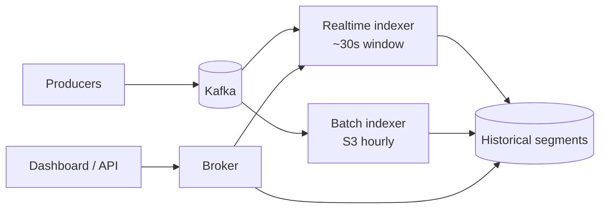

# Real-Time Analytics (Druid / Pinot)

> Sub-minute dashboards on event streams. The trick is pre-aggregation, columnar storage, and a streaming hot tier.

<span class="phase-status phase-done">Phase 16 — Tier 2</span>

---

## 1. 🎤 Scenario

> *"Design a real-time analytics dashboard. Ingest 1 M events/sec; arbitrary group-by/filter queries return < 2 s; data fresh within 30 s."*

## 2. ❓ Clarifying questions

1. Event shape? Semi-structured JSON; ~30 fields.
2. Query patterns? Group-by + sum/count; time series.
3. Cardinality? Up to 10 M unique users; ~10 K dimensions per pivot.
4. Retention? 30d hot, 1y cold.
5. Concurrency? 100 dashboard users simultaneously.

## 3. ✅ Requirements

**Functional**: ingest stream, slice/dice queries, time-series, top-N, approximate distinct count.

**Non-functional**: 1 M events/sec ingest; freshness < 30 s; query p99 < 2 s.

**Out**: ML/forecasting (separate); ad-hoc joins (use a warehouse).

## 4. 📐 Capacity

- 1 M events/sec × 86 400 = **86 B/day**; 500 B avg = **43 TB/day** raw.
- Pre-aggregated rollups ~10× compression → **4 TB/day** stored.
- 30d hot = **120 TB**. 1y cold = ~1.4 PB on S3.

## 5. 🏛️ Architecture



## 6. 💾 Data model

- **Segment** (Druid term): 1 hr × 1 partition; columnar; bitmap indexes per dimension.
- **Rollup**: aggregate at ingest by `(timestamp_bucket, all dimensions)` → fewer rows.
- **Approximate sketches**: HLL for distinct count, theta for set ops.

## 7. 🌐 API

```
POST /v1/ingest    (streaming, schema-validated)
POST /v1/query     {sql or native druid spec}
GET  /v1/datasource/{name}/schema
```

## 8. 🧩 Component deep-dive

### Rollup at ingest

```python
def rollup(events, granularity_s=60):
    grouped = defaultdict(lambda: {"count": 0, "sum_revenue": 0, "users": HLL()})
    for e in events:
        bucket = e["ts"] // granularity_s * granularity_s
        key = (bucket, e["country"], e["device"], e["ad_id"])
        agg = grouped[key]
        agg["count"] += 1
        agg["sum_revenue"] += e["revenue"]
        agg["users"].add(e["user_id"])
    return [{"ts": k[0], "country": k[1], "device": k[2], "ad_id": k[3],
             **v} for k, v in grouped.items()]
```

??? note "Why HLL for distinct?"

    Exact distinct count requires hash sets growing with cardinality. HyperLogLog uses ~12 KB to estimate billions of uniques with ~1% error, mergeable across segments.

### Query routing

```python
def query(sql, time_range):
    parsed = parse(sql)
    needs_rt = (now() - time_range.start) < HOT_WINDOW    # 1h
    targets = []
    if needs_rt: targets.append(realtime_workers_for(parsed.datasource))
    targets.append(historical_workers_for(parsed.datasource, time_range))
    partial_results = parallel_dispatch(targets, parsed)
    return merge(parsed, partial_results)
```

### Approx top-N

```python
# Map: each segment outputs its top-K candidates
def segment_top_k(rows, dim, metric, k=100):
    counter = Counter()
    for r in rows:
        counter[r[dim]] += r[metric]
    return counter.most_common(k * 2)   # K' > K so merge has tail

# Reduce: broker merges all (K * num_segments) candidates → final K
```

## 9. 📈 Scaling

| Stage | Setup |
|---|---|
| Day 1 | ClickHouse single node |
| Year 1 | Druid cluster + Kafka |
| Year 3 | Tiered storage; multi-tenant; SQL layer (Apache Calcite) |
| Year 5 | GPU acceleration for top-N; vector search for embedding queries |

## 10. ☁️ Cloud

AWS: MSK + Druid on EC2 + S3 deep storage. Or managed: Imply (Druid SaaS), StarTree (Pinot), Tinybird, Rockset.

## 11. 🏠 On-prem

Druid 6-tier (broker, coordinator, overlord, MM, historical, router); ZooKeeper; deep storage on Ceph; Kafka 12 nodes.

## 12. 🏗️ Architecture deep-dive

??? question "Druid vs ClickHouse vs Pinot?"

    Druid: best for streaming + OLAP, mature segment lifecycle. ClickHouse: best raw query speed, simpler ops, less streaming-native. Pinot: LinkedIn-bred, similar to Druid; superior for real-time inverted indexes on text.

??? question "Why pre-aggregate at ingest?"

    Raw event count is too large to scan at query time. Rollup reduces 1 B/day → 100 M aggregated rows. Loses some queryability (can't filter on dropped dimensions) but trade is worth it for dashboards.

## 13. 🧨 Bottlenecks

| Bottleneck | Fix |
|---|---|
| High-cardinality dim (user_id) blows index | Don't index; use HLL for distinct only |
| Late-arriving events fall outside window | Reopen segment for grace period; or write to "late" segment + merge nightly |
| Hot dimension cardinality explosion | Cap unique values per dim per segment; reject overflow |
| Query for very long range | Break into per-day sub-queries; parallel; merge |
| Coordinator GC pause | Larger heap; G1; offload metadata to MySQL |

## 14. 🔒 Security

- Per-tenant datasource isolation; row-level filters at broker.
- API key + RBAC for query API.
- Audit log of all queries (PII compliance).
- Encrypt S3 deep storage with KMS.

## 15. 📊 Monitoring

Ingest lag (Kafka offset vs commit); segment handoff latency; query p99 per datasource; broker memory; failed segments.

## 16. 🧱 Reliability

- Realtime tasks replicated 2× (primary + standby).
- Deep storage in S3 = durable source of truth; reconstruct historicals anytime.
- Coordinator HA via leader election (ZooKeeper).
- Backfill: replay Kafka or S3 logs into batch indexer.

## 17. ❓ Follow-ups

??? question "Sub-second freshness?"

    Memory-only realtime tier; smaller segment granularity (5 s vs 1 min). Trade more segment overhead. Use Pinot's "near-realtime" for sub-200 ms.

??? question "Approximate vs exact?"

    Default to approximate (HLL, theta, quantiles) for distinct/percentile. Mark UI as "approx ±1%". Exact runs as overnight batch.

??? question "Joins?"

    Druid has limited join support — use lookups (small dim tables broadcast) or denormalise at ingest. For complex joins, push to Trino over Druid + warehouse.

??? question "Schema evolution?"

    Add new dim columns: backfill nulls. Remove: leave column, stop ingesting. Rename: alias.

??? question "Cost control?"

    Tier hot/cold; sample low-value events to 10%; drop debug fields at ingest; auto-rollup more aggressively for older data.

## 18. 🐍 Snippet

```python
# HLL merge across partial results
class HLL:
    def __init__(self, p=12):
        self.p = p
        self.m = 1 << p
        self.regs = bytearray(self.m)

    def add(self, item):
        h = mmh3.hash64(str(item))[0] & ((1 << 64) - 1)
        idx = h >> (64 - self.p)
        rank = (h << self.p) | (1 << (self.p - 1))
        self.regs[idx] = max(self.regs[idx], (rank).bit_length() - 64)

    def merge(self, other):
        for i in range(self.m):
            self.regs[i] = max(self.regs[i], other.regs[i])
```

## 19. 🌍 Real-world

- *Druid paper* (Yang et al., SIGMOD 2014).
- *Pinot at LinkedIn* — engineering blog.
- *ClickHouse architecture* — Yandex docs.
- *Imply blog* — Druid operational patterns.
- *Apache Calcite* — SQL layer.

## 20. 🃏 Cheatsheet

- Kafka in → realtime indexer (30 s window) + batch indexer (hourly to S3).
- Rollup at ingest by (time_bucket, dims) with HLL for distinct.
- Columnar segments + bitmap indexes for fast filter.
- Broker scatters across realtime + historicals; merges.
- Approx top-N: map K' > K, reduce, return K.
- Lookups for star joins; denormalise for complex joins.
- Tier hot SSD → cold S3; deep storage = source of truth.
