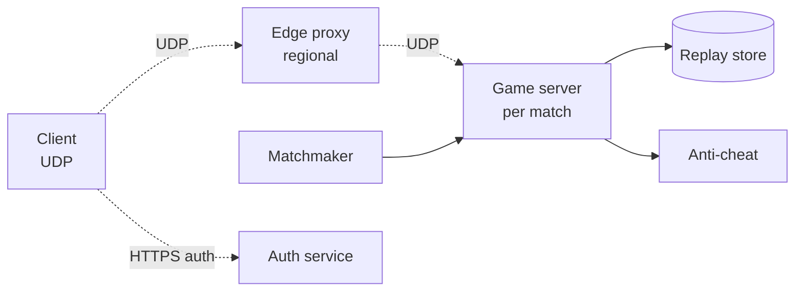

# Online Multiplayer Game (Fortnite / League)

> Real-time game state across 100s of clients per match. UDP, prediction, anti-cheat.

<span class="phase-status phase-done">Phase 16 — Tier 2</span>

---

## 1. 🎤 Scenario

> *"Design the netcode for a 100-player battle royale. < 80 ms tick, anti-cheat, regional matchmaking, 10 M concurrent players globally."*

## 2. ❓ Clarifying questions

1. Game model? FPS / battle royale; authoritative server.
2. Tick rate? 30-60 Hz.
3. Latency budget? p99 RTT to server < 60 ms.
4. Reconnect on drop? Yes.
5. Replays / spectators? Yes — recorded match data.

## 3. ✅ Requirements

**Functional**: matchmake, join match, sync state, reconcile prediction, spectate, replay.

**Non-functional**: 100-player matches; p99 server tick < 16 ms; reliable matchmake < 60 s; anti-cheat.

**Out**: cosmetics store, voice chat (separate WebRTC service).

## 4. 📐 Capacity

- 10 M concurrent / 100 = **100 K concurrent matches**.
- 60 Hz × 100 players = **6 K state updates/sec/match**.
- Per-player downstream ~100 KB/s = **10 MB/s/match downstream** = **1 TB/s** globally.
- Match duration 20 min → 12 GB recorded per match if naive; delta-encoded → 1 GB.

## 5. 🏛️ Architecture



## 6. 💾 Data model

- **Match state** (in-memory on game server): entity list, positions, health.
- **Snapshots** (delta-encoded): every tick, broadcast diff since last ack.
- **Player session** (Redis): `(player_id, match_id, server_addr)`.
- **Replay** (S3, columnar by entity): post-match upload.
- **Matchmaking pool** (Redis sorted set by MMR rating).

## 7. 🌐 API

```
POST /v1/auth/login                 → token + user
POST /v1/match/queue                → 200 {ticket_id, mmr}
GET  /v1/match/queue/{ticket}       → 200 {server_addr, match_id, port, secret}
UDP  → game server (after auth handshake)
GET  /v1/replays/{match_id}
```

## 8. 🧩 Component deep-dive

### Authoritative server tick

```python
def tick(match):
    inputs = drain_input_queue(match)        # client commands since last tick
    for cmd in inputs:
        if anti_cheat.suspicious(cmd):
            kick(cmd.player_id); continue
        apply(match.state, cmd)
    physics_step(match.state, dt=1/60)
    snapshot = make_snapshot(match.state)
    for p in match.players:
        send_delta(p, snapshot, since=p.last_acked_tick)
```

### Client-side prediction + reconciliation

```python
# Client predicts locally
def on_input(cmd):
    apply(local_state, cmd)
    pending.append((cmd, local_state.snapshot()))
    send(cmd, seq=cmd.seq)

# When authoritative snapshot arrives
def on_server_snapshot(snap):
    if snap.last_processed_seq != pending[-1].seq:
        # Server diverged — rewind, reapply un-acked
        local_state = snap.state
        for cmd, _ in pending_after(snap.last_processed_seq):
            apply(local_state, cmd)
```

### Matchmaking by MMR

```python
def matchmake():
    while True:
        candidates = redis.zrangebyscore("queue", "-inf", "+inf", start=0, num=100)
        # Group by close MMR (±50) and same region; expand range over time waited
        groups = group_by_mmr_window(candidates, window=50)
        for g in groups:
            if len(g) >= 100:
                spawn_match(g[:100])
                redis.zrem("queue", *[p.id for p in g[:100]])
        time.sleep(1)
```

??? note "Why expanding MMR window?"

    Player waited 5 min — relax window to ±200 to fill match. Quality vs latency trade.

### Anti-cheat snapshot

```python
def suspicious(cmd):
    if cmd.movement_delta > MAX_PER_TICK: return True
    if cmd.aim_to_kill_time_ms < 50:      return True   # superhuman flick
    if cmd.fire_rate > weapon.max_rate:   return True
    return False
```

## 9. 📈 Scaling

| Stage | Setup |
|---|---|
| Day 1 | Single region; one game server fleet |
| Year 1 | Multi-region edge POPs; matchmake per region |
| Year 3 | Cross-region matchmaking with backfill; reserved server pools per region |
| Year 5 | Edge compute for state; rollback netcode for fighting; ML anti-cheat |

## 10. ☁️ Cloud

GCP / AWS dedicated game-server fleets (Agones on GKE, GameLift on AWS). Bare-metal often preferred for jitter.

## 11. 🏠 On-prem

Bare-metal game servers (low jitter); private fibre between regions; UDP load balancers (Linux IPVS, custom).

## 12. 🏗️ Architecture deep-dive

??? question "Why UDP not TCP?"

    TCP head-of-line blocking — one lost packet stalls all subsequent. Games tolerate loss (skip a tick) better than wait. UDP + custom reliability for important messages (chat, kill confirms).

??? question "Authoritative server vs lockstep?"

    Authoritative for FPS (anti-cheat). Lockstep (RTS like StarCraft) sends only inputs; deterministic sim everywhere. Lockstep cheaper bandwidth, harder to make deterministic across hardware.

## 13. 🧨 Bottlenecks

| Bottleneck | Fix |
|---|---|
| Tick rate slip under load | Spatial partitioning; only update entities near players |
| Cheaters via packet manipulation | Server-authoritative state; client only sends inputs |
| Match-fill time during low pop | Cross-region; bot fill (with disclosure) |
| Region routing latency | BGP anycast for matchmake; DNS GeoIP for match server |
| Replay storage cost | Delta + zstd; retain full only for last N days |

## 14. 🔒 Security

- Token-based UDP handshake; rotating per-match secrets.
- DDoS scrubbing at edge (Cloudflare Spectrum / AWS Shield).
- Anti-cheat: server-authoritative + statistical anomaly + kernel-mode client (BattlEye / EAC).
- Replay tamper-proof: server signs.
- Account: 2FA; device fingerprint for ban evasion.

## 15. 📊 Monitoring

Tick budget overshoot %; per-player ping p99; matchmake queue time p50; cheat detection rate; server crash MTTR; replay upload success.

## 16. 🧱 Reliability

- Hot-standby game server: shadows state; takes over on primary crash within 1 tick.
- Match recovery: server state checkpointed every 5 s; restore on crash.
- Region failover: matchmake fallback to nearby region; warn user of higher ping.
- Graceful disconnect: 30 s reconnect window; bot fills in meanwhile.

## 17. ❓ Follow-ups

??? question "Latency compensation for hit detection?"

    Server rewinds world to client's perceived state (ping/2 ago) when validating a shot. "Lag compensation" — feels fair to shooter, slightly unfair to victim who already moved.

??? question "How does region selection work?"

    Client pings 3-5 regional servers at login; picks lowest. Matchmaker prefers same region; expands if queue stalls.

??? question "Replay synchronisation across spectators?"

    Spectators connect via separate read-only stream from server; can also play recorded replay file with seek.

??? question "Voice chat?"

    Separate WebRTC SFU service; not on game UDP path. Push-to-talk routed via match ID for team isolation.

??? question "Deterministic vs floating-point physics?"

    Deterministic for lockstep (fixed-point math). For FPS, server-authoritative with tolerant reconciliation works.

## 18. 🐍 Snippet

```python
# Delta-encoded snapshot (only changed fields)
def make_delta(prev, curr):
    delta = {"tick": curr.tick, "changes": {}}
    for eid, ent in curr.entities.items():
        if eid not in prev.entities or prev.entities[eid] != ent:
            delta["changes"][eid] = diff(prev.entities.get(eid), ent)
    delta["removed"] = list(set(prev.entities) - set(curr.entities))
    return delta
```

## 19. 🌍 Real-world

- *Glenn Fiedler — Gaffer on Games* — networking series, gold standard.
- *Valve Source engine networking* — public docs on lag compensation.
- *Riot Games engineering blog* — League's matchmaking + netcode.
- *Epic Online Services* — Fortnite's backend.
- *Quake III Arena network code* — open source.

## 20. 🃏 Cheatsheet

- UDP from client; authoritative server runs sim at 30-60 Hz.
- Client-side prediction + server reconciliation; rewind on diverge.
- Delta-encoded snapshots; per-client ack of last seen tick.
- Matchmake by MMR window expanding with wait time.
- Anti-cheat: server-authoritative + kernel module + statistical.
- Replay = delta log to S3; retain by tier.
- Hot-standby per match; reconnect window 30 s.
