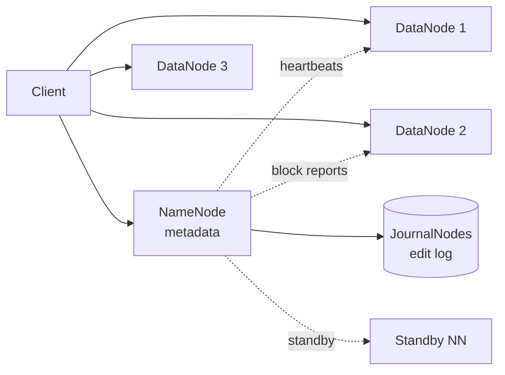

# Distributed File System (HDFS / GFS)

> Petabyte-scale append-mostly file storage on commodity hardware. Replicate, tolerate failures, expose POSIX-ish semantics.

<span class="phase-status phase-done">Phase 17 — Tier 3</span>

---

## 1. 🎤 Scenario

> *"Design HDFS. Store EB of data on 10K nodes; large sequential reads/writes; tolerate disk + node failures; 3× replication or erasure coding."*

## 2. ❓ Clarifying questions

1. Workload? Large files (GB+); append-only; batch reads.
2. Random writes? No — immutable after close.
3. Consistency? Single writer per file; readers see fully-written blocks.
4. Replication factor? 3 default; EC for cold data.
5. Hadoop ecosystem? Yes — POSIX-ish.

## 3. ✅ Requirements

**Functional**: create, append, read, delete files; directory tree; permissions; snapshots.

**Non-functional**: scale to EB; 99.99% durability; tolerate per-day disk failures; sequential read throughput > 1 GB/s/client.

**Out**: random writes, full POSIX (use Ceph or local FS).

## 4. 📐 Capacity

- 10 K nodes × 12 disks × 16 TB = **1.9 EB raw**.
- 3× replication → **640 PB usable**; EC (10+4) → 1.4 EB usable.
- Block size 256 MB → 1 EB = **4 B blocks** → metadata pressure.

## 5. 🏛️ Architecture



## 6. 💾 Data model

- **NameNode** (in-memory tree): inodes (files/dirs), block list per file, replica locations.
- **DataNode**: stores blocks as plain files on local disk; periodic block reports to NN.
- **Edit log** (JournalNodes): durable append log of metadata mutations.
- **fsimage**: periodic checkpoint of NN state.

## 7. 🌐 API

```
CREATE /v1/files {path, replication}      → file_handle
APPEND <handle> [bytes]                    → block_id, locations
READ <path, offset, length>                → block locations + offsets
RENAME, DELETE, MKDIR, LIST
```

## 8. 🧩 Component deep-dive

### Block placement

```python
def place_block(replicas=3):
    # Standard HDFS heuristic
    n1 = local_node_or_random()                    # writer's host
    n2 = random_node_in_other_rack(exclude=[n1])   # different rack
    n3 = random_node_in_same_rack_as(n2, exclude=[n2])
    return [n1, n2, n3]
```

??? note "Why same-rack second + third copy?"

    Rack-level redundancy: lose a whole rack, still have copy on n1. Same-rack second & third reduces cross-rack network usage during writes.

### Write pipeline

```python
def write_block(client, block_id, replicas):
    # Pipeline: client → DN1 → DN2 → DN3, each forwards before disk-flushing
    pipe = open_pipeline(replicas)
    for chunk in client.stream():
        pipe.send(chunk)
    pipe.close()                # flush + ack from tail
    namenode.commit(block_id, replicas)
```

### NameNode failover

```python
class NameNode:
    def mutate(self, op):
        edit_log.append(op)              # synchronous to QJM (3+ JNs)
        self.apply(op)
        if op.size > CHECKPOINT_THRESHOLD:
            schedule_checkpoint()

# Standby tails JNs; takes over on primary failure via ZKFC
```

### Erasure coding

For cold data: RS(10, 4) — 10 data blocks + 4 parity. 1.4× overhead vs 3× replication; tolerates 4 failures vs 2.

## 9. 📈 Scaling

| Stage | Setup |
|---|---|
| Day 1 | Single NN + few DNs |
| Year 1 | HA NN with QJM; RBF for federation |
| Year 3 | Federated NNs; tiered storage; EC for cold |
| Year 5 | Object storage backend; metadata in distributed KV (Ozone) |

## 10. ☁️ Cloud

S3 / GCS as storage layer. EMRFS = HDFS API on S3. Or Azure ADLS, native Hadoop on Azure.

## 11. 🏠 On-prem

Bare-metal DataNodes (12+ HDD, JBOD); 10 GbE network; NameNode dedicated host with NVMe; ZooKeeper for HA election.

## 12. 🏗️ Architecture deep-dive

??? question "Why a single NameNode?"

    Metadata fits in one server's RAM (1 GB ≈ 1 M files). Single source of truth simplifies semantics. Federation when one NN can't hold it all (split namespace by prefix).

??? question "Why no random writes?"

    Replicating + journaling random writes is hugely expensive. Append-only matches Hadoop workload (write once, read many). Random writes go to a layer above (HBase).

## 13. 🧨 Bottlenecks

| Bottleneck | Fix |
|---|---|
| NameNode RAM ceiling | Federation; HDFS Ozone (KV-backed metadata) |
| Tiny files | HAR archives; SequenceFile bundles |
| Slow rebalance after disk fail | Throttled background; prioritise under-replicated |
| Hot block (popular dataset) | Increase replication for hot files; client-side cache |
| Block report storm at NN startup | Staggered restart; FBR (full block reports) on schedule |

## 14. 🔒 Security

- Kerberos for cluster-wide auth.
- Wire encryption (SASL).
- HDFS Transparent Encryption (per-zone EZ keys via KMS).
- Ranger / Sentry for fine-grained ACL.

## 15. 📊 Monitoring

Under-replicated block count; NN heap %; missing blocks; DN heartbeat lag; client p99 read latency; rebalance bandwidth.

## 16. 🧱 Reliability

- 3× rep → 11 nines durability with cross-rack placement.
- Journal nodes quorum (3+) for edit log durability.
- Block scanner: DN scrubs disks weekly for silent corruption.
- Snapshots: copy-on-write metadata; cheap point-in-time recovery.

## 17. ❓ Follow-ups

??? question "Why not Ceph?"

    Ceph: full POSIX, random writes, RADOS object layer. HDFS: simpler, append-only, optimised for big-data batch. Pick by workload.

??? question "Tiering hot/cold?"

    Heat-aware policy: ARCHIVE storage type for cold blocks → moved to dense JBOD nodes; SSD for hot.

??? question "Cross-DC replication?"

    DistCp for batch; alternatively per-cluster with a federation namespace and async block-level replication (ViewFS / RBF + Hadoop's HDFS Async Replication).

??? question "Reading while writing?"

    Reader sees blocks committed up to last hflush; tail of file in-progress not visible until close. Hflush sync on append.

??? question "Small files problem?"

    NN holds metadata for every block. Millions of tiny files exhaust RAM. Solutions: HAR (archive bundles), SequenceFile, switch to HBase, or HDFS Ozone (KV metadata).

## 18. 🐍 Snippet

```python
# Choose 3 datanodes with rack diversity
def pick_replicas(local_node, racks):
    same_rack = [n for n in racks[local_node.rack] if n != local_node]
    other_racks = [n for r, ns in racks.items() if r != local_node.rack for n in ns]
    n2 = random.choice(other_racks)
    n3 = random.choice([n for n in racks[n2.rack] if n != n2])
    return [local_node, n2, n3]
```

## 19. 🌍 Real-world

- *GFS paper* (Ghemawat et al., SOSP 2003).
- *HDFS architecture guide* — Apache.
- *Tachyon / Alluxio* — caching layer over HDFS.
- *HDFS Ozone* — next-gen object store from Hadoop community.
- *Colossus* — Google's GFS successor (papers / talks).

## 20. 🃏 Cheatsheet

- NameNode = metadata; DataNodes = blocks; QJM = edit log durability.
- Block size 128-256 MB; 3× replication default; EC for cold.
- Rack-aware placement: 1 local, 1 other rack, 1 same other rack.
- Append-only; readers see hflushed bytes.
- Federation when NN heap saturates; Ozone for billions of files.
- Kerberos + KMS-encrypted EZs for security.
- Snapshots = COW metadata, near-free.
