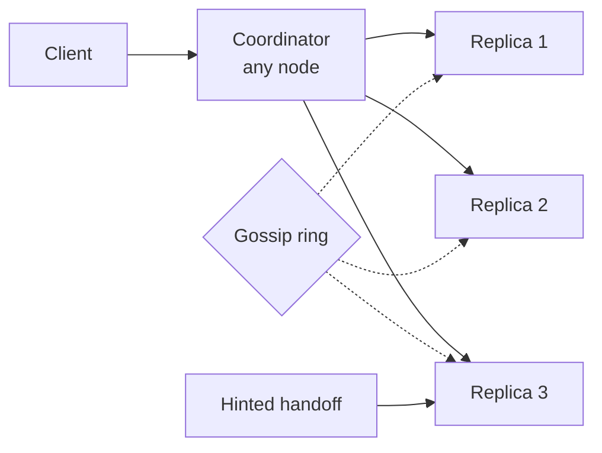

# Distributed KV Store (DynamoDB / Cassandra)

> Eventually-consistent KV at any scale. Consistent hashing, vector clocks, quorum reads.

<span class="phase-status phase-done">Phase 17 — Tier 3</span>

---

## 1. 🎤 Scenario

> *"Design a Dynamo-style KV store. PUT/GET keyed by string; tunable consistency; tolerate node failures; scale to PB and millions of QPS."*

## 2. ❓ Clarifying questions

1. Consistency? Eventual default; tunable per-request (R, W, N).
2. Schema? Schemaless or wide-column (Cassandra-style).
3. Cross-region? Active-active.
4. Range scans? Optional — Cassandra yes, Dynamo limited.
5. Multi-tenant? Yes.

## 3. ✅ Requirements

**Functional**: PUT, GET, DELETE; tunable R/W; conditional writes; TTL.

**Non-functional**: scale linearly with nodes; 99.999% availability; p99 < 10 ms intra-region; tolerate AZ failure.

**Out**: SQL joins, transactions across keys.

## 4. 📐 Capacity

- 1 PB data; 1 M QPS read, 100 K QPS write.
- 1 KB avg value × 1 B keys = 1 TB metadata-ish.
- 3-replica → 3 PB raw; 100 nodes × 30 TB.

## 5. 🏛️ Architecture



## 6. 💾 Data model

- **Ring**: tokens via consistent hashing with vnodes (256/node).
- **Replica set**: N preference list = N nodes following key's token.
- **Sloppy quorum**: if a primary is down, write goes to next live node with a *hint*.
- **Storage engine**: LSM tree (memtable → SSTable + bloom + summary).

## 7. 🌐 API

```
PUT key value, consistency=QUORUM, ttl?
GET key, consistency=ONE|QUORUM|ALL
DELETE key   (tombstone)
CAS key expected new   (conditional)
```

## 8. 🧩 Component deep-dive

### Coordinator forwards to replicas

```python
def get(key, R):
    replicas = ring.preference_list(key, N=3)
    futures = [send_get(r, key) for r in replicas]
    responses = wait_for(futures, count=R, timeout_ms=50)
    if conflict(responses):
        merged = read_repair_resolve(responses)
        async_repair(replicas, key, merged)
        return merged
    return responses[0].value
```

### Vector clocks for conflict resolution

```python
class VClock:
    def __init__(self): self.entries = {}     # node_id → counter
    def increment(self, node_id):
        self.entries[node_id] = self.entries.get(node_id, 0) + 1
    def descends_from(self, other):
        return all(self.entries.get(k, 0) >= v for k, v in other.entries.items())

def merge_concurrent(values):
    surviving = []
    for v in values:
        if not any(o.vc.descends_from(v.vc) and o is not v for o in values):
            surviving.append(v)
    return surviving               # if > 1 → siblings; client resolves
```

### Anti-entropy via Merkle trees

```python
def repair_replicas(node_a, node_b, key_range):
    tree_a = node_a.merkle(key_range)
    tree_b = node_b.merkle(key_range)
    diffs = compare(tree_a, tree_b)
    for k in diffs:
        latest = pick_winner(node_a.get(k), node_b.get(k))
        node_a.put(k, latest); node_b.put(k, latest)
```

??? note "Last-write-wins vs vector clocks"

    LWW (Cassandra default): trivial, but loses concurrent writes silently. Vector clocks (Riak / Dynamo): preserves siblings; client app reconciles. Trade simplicity vs correctness.

## 9. 📈 Scaling

| Stage | Setup |
|---|---|
| Day 1 | Single MySQL |
| Year 1 | Cassandra cluster, 10 nodes, RF=3 |
| Year 3 | Multi-DC; per-DC quorum; RF per DC |
| Year 5 | Tiered storage; serverless on-demand pricing |

## 10. ☁️ Cloud

DynamoDB (managed; Dynamo-style); Bigtable (Spanner cousin). For self-managed: Cassandra on EC2 with EBS; Scylla (C++ rewrite, 10× perf).

## 11. 🏠 On-prem

Cassandra / ScyllaDB on dense NVMe nodes; rack/AZ awareness in topology config; CCM for ops.

## 12. 🏗️ Architecture deep-dive

??? question "Why consistent hashing with vnodes?"

    Without vnodes, adding a node = redistributing huge chunks. Vnodes (256/host) give each new node small slices from many existing → faster joins/leaves.

??? question "Quorum math (R + W > N)?"

    Strong consistency requires reads + writes overlap on at least one replica. With N=3, W=2 R=2 satisfies. Lower R/W = faster, weaker.

## 13. 🧨 Bottlenecks

| Bottleneck | Fix |
|---|---|
| Hot key | Replicate hot keys to extra hosts; client-side caching |
| Compaction backlog | Time-window compaction for time-series; throttle |
| Tombstone explosion | Lower gc_grace; avoid mass deletes |
| Cross-DC link saturation | Async replication; RF separately per DC |
| Wide partitions (Cassandra anti-pattern) | Bucket keys by date/hash to bound partition size |

## 14. 🔒 Security

- mTLS between nodes + clients.
- Per-keyspace authentication; role-based.
- Encryption at rest via KMS.
- Audit log of admin operations.

## 15. 📊 Monitoring

Per-node read/write latency; pending compactions; SSTable count; gossip status; hinted handoff queue size; cross-DC lag.

## 16. 🧱 Reliability

- RF=3 within DC; RF=3 across 2 DCs = 6 copies; tolerates DC loss.
- Hinted handoff: temporary owner stores write for absent primary; replay on recovery.
- Read repair: detect divergence on each read; lazy fix.
- Scheduled anti-entropy with Merkle trees.

## 17. ❓ Follow-ups

??? question "Strong consistency option?"

    Use linearizable variant (Spanner / FaunaDB). Or sloppy quorum + Paxos per partition (Cassandra LWT — slow but works).

??? question "Range queries?"

    Cassandra supports within partition (clustering keys). Cross-partition scans are full-cluster ops — paginate.

??? question "Schema evolution?"

    Add columns at any time (sparse rows). Drop = mark tombstone-only. Incompatible types require new column.

??? question "How to handle node death?"

    Gossip detects within seconds; remove from preference list; clients failover. Replace via `nodetool removenode` or replace_address; bootstrap from peers.

??? question "Compaction strategies?"

    Size-tiered (SSTables of similar size merged): write-friendly. Leveled (overlapping levels): read-friendly. TWCS (time-window): for TTL/TS data.

## 18. 🐍 Snippet

```python
# Bloom filter check before SSTable disk read
class SSTable:
    def get(self, key):
        if not self.bloom.might_contain(key):
            return None
        offset = self.summary.lookup(key)            # sparse index → page offset
        return self.disk.read_kv(offset, key)
```

## 19. 🌍 Real-world

- *Dynamo paper* (DeCandia et al., SOSP 2007).
- *Bigtable paper* (Chang et al., OSDI 2006).
- *Cassandra: structured storage at scale* — Lakshman/Malik.
- *ScyllaDB internals* — C++/Seastar architecture.
- *DynamoDB at AWS re:Invent* — annual deep dives.

## 20. 🃏 Cheatsheet

- Consistent hashing ring with vnodes; replication factor N (typ 3).
- Coordinator forwards to N replicas; reply when R or W ack.
- Vector clocks (or LWW timestamps) for conflict resolution.
- Hinted handoff for transient down nodes.
- Anti-entropy via Merkle trees on schedule.
- LSM storage: memtable → SSTable + bloom; size-tiered or leveled compaction.
- R + W > N for read-your-write; tunable per call.
