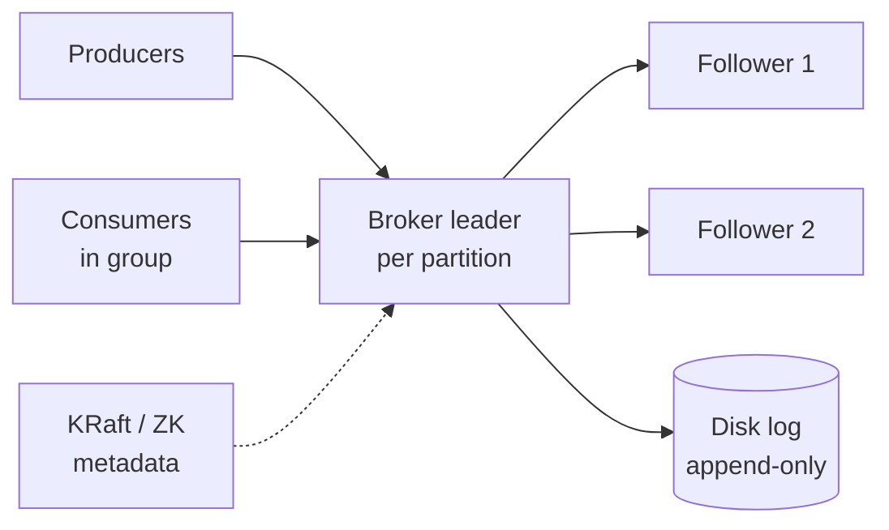

# Pub/Sub System (Kafka / Pulsar)

> Durable distributed log. Producers append, consumers replay. Partitioned, replicated, ordered within partition.

<span class="phase-status phase-done">Phase 17 — Tier 3</span>

---

## 1. 🎤 Scenario

> *"Design Kafka. Producers publish to topics; consumers subscribe in groups; messages durable for days; ordered within partition; millions msgs/sec."*

## 2. ❓ Clarifying questions

1. Ordering? Per-partition strict.
2. Delivery? At-least-once default; exactly-once optional.
3. Retention? 7d default; some topics infinite.
4. Multi-tenant? Yes — quotas per tenant.
5. Stream processing on top? Yes (Kafka Streams).

## 3. ✅ Requirements

**Functional**: produce, consume (group), commit offset, replay, partition rebalance.

**Non-functional**: 5 M msg/sec; p99 produce ack < 10 ms; durable across broker failures; horizontal scale.

**Out**: queue semantics with priority/delay (use SQS/Sidekiq).

## 4. 📐 Capacity

- 5 M msg/sec × 1 KB = **5 GB/sec** ingest = 432 TB/day.
- 7d retention × RF=3 = **9 PB on disk**.
- 100 brokers × 100 TB = 10 PB.

## 5. 🏛️ Architecture



## 6. 💾 Data model

- **Topic**: partitioned ordered log; partition count fixed at create.
- **Partition**: append-only log on disk, segmented by size/time (`*.log` + `*.index`).
- **Offset**: monotonic int per message in partition.
- **Consumer group**: shared subscription; one partition assigned to one consumer at a time.
- **Metadata** (KRaft / ZooKeeper): topic configs, ISR membership.

## 7. 🌐 API

```
PRODUCE topic key value [partition?]
CONSUME group from offset
COMMIT offset
ADMIN create_topic, alter_partitions, list_consumer_groups
```

## 8. 🧩 Component deep-dive

### Producer with batching + idempotence

```python
class Producer:
    def __init__(self):
        self.batches = defaultdict(list)        # (topic, partition) → msgs
        self.seq = defaultdict(int)             # per-partition seq for idempotency

    def send(self, topic, key, value):
        part = hash(key) % topic.partitions if key else round_robin()
        self.batches[(topic, part)].append((self.seq[(topic, part)], key, value))
        self.seq[(topic, part)] += 1
        if self.batches_ready((topic, part)):
            self.flush((topic, part))

    def flush(self, tp):
        leader = metadata.leader_of(tp)
        ack = leader.produce(tp, self.batches[tp], acks="all")  # waits for ISR
        if ack == OK: self.batches[tp].clear()
```

### Replication with ISR

```python
def append(partition, msgs):
    leader_log.append(msgs)
    for follower in followers:
        follower.fetch_async(partition, leader_log.tail())
    # commit when high-watermark = min ack across in-sync replicas
    hw = min(f.last_ack_offset for f in in_sync_replicas)
    publish_high_watermark(hw)
```

??? note "Why high-watermark?"

    Consumers only see messages up to HW (acked by all ISR). Below HW = durably replicated. If leader crashes, new leader has HW data → no data loss.

### Consumer group rebalance

```python
def rebalance(group, topic):
    consumers = list_consumers(group)
    partitions = list_partitions(topic)
    assignment = round_robin_assign(consumers, partitions)
    for c in consumers:
        c.send("ASSIGN", assignment[c])
    wait_for_acks()
    coordinator.commit(assignment)
```

Rebalance freezes consumption briefly. Cooperative rebalance reduces freeze (only changed partitions move).

## 9. 📈 Scaling

| Stage | Setup |
|---|---|
| Day 1 | 3-broker cluster |
| Year 1 | Tiered storage to S3; 30 brokers |
| Year 3 | KRaft (Kafka without ZK); cross-region MirrorMaker |
| Year 5 | Multi-tenant SaaS; quotas; per-topic SLOs |

## 10. ☁️ Cloud

AWS MSK or Confluent Cloud (managed). GCP Pub/Sub, Azure Event Hubs (proprietary but Kafka-compatible).

## 11. 🏠 On-prem

Bare-metal brokers with NVMe (1-3 TB each); 25 GbE network; ZooKeeper (or KRaft); Confluent Schema Registry + Kafka Connect.

## 12. 🏗️ Architecture deep-dive

??? question "Kafka vs Pulsar?"

    Kafka: simpler, dominant. Pulsar: separates compute (broker) from storage (BookKeeper) — easier scale-out, true geo-replication built-in. Kafka winning on community + ecosystem.

??? question "Why per-partition ordering only?"

    Strict total order across partitions = single bottleneck. Per-partition order = scales linearly with partitions; users pick partition key for ordering granularity.

## 13. 🧨 Bottlenecks

| Bottleneck | Fix |
|---|---|
| Hot partition | Re-key with salt + downstream regroup; or repartition |
| Slow consumer in group | Auto-pauses partition; lag grows; alarm |
| Unclean leader election | Disable; sacrifice availability for no data loss |
| Disk fill | Tiered storage; aggressive retention; cleanup policy=compact |
| Rebalance storms | Static membership; cooperative protocol |

## 14. 🔒 Security

- TLS + SASL/SCRAM auth.
- ACLs per topic/group.
- Multi-tenant via quotas + naming convention.
- Encryption at rest (LUKS / KMS).
- Audit log via Kafka itself (`__audit` topic).

## 15. 📊 Monitoring

Producer ack rate; under-replicated partitions; consumer lag; ISR shrinks/expands; controller failovers; broker disk %.

## 16. 🧱 Reliability

- RF=3, min-in-sync=2, acks=all → no message loss with up to 1 broker failure.
- KRaft quorum survives minority loss.
- Tiered storage offloads cold to S3 — cheap retention.
- MirrorMaker 2 replicates to DR cluster.

## 17. ❓ Follow-ups

??? question "Exactly-once semantics?"

    Idempotent producer (per-partition seq) + transactions across partitions (write to multiple topics atomically). Consumer reads only committed messages. ~10% overhead.

??? question "Compacted topics?"

    Retain only latest value per key — like a changelog/state store. Used by Kafka Streams + Connect for state recovery.

??? question "Out-of-order events?"

    Producer-side: partition by event-key, retries within session. Consumer-side: timestamp-based sorting in window with grace period.

??? question "Schema management?"

    Schema Registry: producers register Avro/Protobuf; consumers fetch. Forward/backward compat enforced. Avoids "JSON soup" problems.

??? question "Cross-region?"

    MirrorMaker 2 (async, eventual). Active-active needs care: source-prefixed topics, dedup by header.

## 18. 🐍 Snippet

```python
# Tiered storage: offload segments older than N days to S3
def offload(broker, age_threshold_h=72):
    for partition in broker.partitions:
        for seg in partition.segments:
            if seg.age_h > age_threshold_h and not seg.in_s3:
                s3.upload(seg.path, key=f"{partition.id}/{seg.base_offset}")
                seg.in_s3 = True
                if seg.age_h > LOCAL_RETENTION_H:
                    os.remove(seg.path)
```

## 19. 🌍 Real-world

- *Kafka: a Distributed Messaging System for Log Processing* (LinkedIn, NetDB 2011).
- *Apache Pulsar architecture* — Yahoo paper.
- *Confluent blog* — exactly-once, transactions, KRaft.
- *Designing Data-Intensive Applications* (Kleppmann) — Ch 11.
- *Pravega + BookKeeper* — log abstraction.

## 20. 🃏 Cheatsheet

- Topic = partitioned log; per-partition strict order.
- RF=3, acks=all, min-ISR=2 → durable.
- Idempotent producer + transactions = exactly-once.
- Consumer group: 1 partition → 1 consumer; cooperative rebalance.
- High-watermark gates consumer visibility.
- Tiered storage to S3 for cold retention.
- KRaft replaces ZooKeeper.
