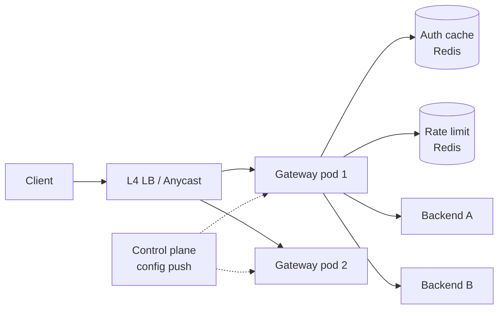

# API Gateway (Kong / Envoy / AWS API Gateway)

> Front door to the microservice mesh. Auth, rate limit, routing, observability, plugin chain.

<span class="phase-status phase-done">Phase 17 — Tier 3</span>

---

## 1. 🎤 Scenario

> *"Design an API Gateway. Route 100K req/sec to 200 backend services; auth, rate limit, transform, log; SLA 99.99%."*

## 2. ❓ Clarifying questions

1. Protocols? HTTP/1.1, HTTP/2, gRPC, WebSocket.
2. Auth methods? OAuth2, API key, mTLS, JWT.
3. Plugins? Yes — pluggable filter chain.
4. Multi-tenant? Yes — per-tenant configs.
5. Latency budget added? < 5 ms p99 overhead.

## 3. ✅ Requirements

**Functional**: routing (host/path), TLS termination, auth, rate limit, request/response transform, retries, logging, tracing.

**Non-functional**: 100 K rps; < 5 ms p99 added; hot-reload config; 99.99% available.

**Out**: service mesh (sidecar pattern; this is north-south).

## 4. 📐 Capacity

- 100 K rps × 8 hr peak = ~3 B requests/day.
- Logs ~500 B each → 1.5 TB/day.
- Config: 1 K routes × ~5 plugins = 5 K rules; reload < 1 s.

## 5. 🏛️ Architecture



## 6. 💾 Data model

- **Routes** (config, in-memory): `(host, path, method) → upstream + plugins[]`.
- **API keys / JWT verifiers** (Redis cache + DB origin).
- **Rate limit counters** (Redis with token bucket per key).
- **Logs** (Kafka → ES/S3).

## 7. 🌐 API

```
[control plane]
POST /v1/routes        {host, path, upstream, plugins}
POST /v1/consumers     {auth_creds, rate_limit_plan}

[data plane — what clients hit]
* Any HTTP request → routed → response
```

## 8. 🧩 Component deep-dive

### Plugin chain

```python
# Each plugin is a coroutine that may short-circuit
PLUGINS = [tls_terminate, auth_jwt, rate_limit, transform_request,
           proxy, transform_response, logger, tracer]

async def handle(req):
    ctx = Context(req=req)
    for p in PLUGINS:
        await p.run(ctx)
        if ctx.short_circuit:                # e.g. 429 from rate_limit
            return ctx.response
    return ctx.response
```

### JWT verification with cache

```python
def verify_jwt(token):
    kid = parse_header(token).kid
    key = jwks_cache.get(kid)
    if not key:
        key = fetch_from_idp(kid)             # JWKS endpoint
        jwks_cache.set(kid, key, ex=600)
    payload = jwt.decode(token, key=key, alg="RS256")
    if payload.exp < time.time(): raise Expired
    return payload
```

### Distributed rate limiter (token bucket)

```python
LUA = """
local cap = tonumber(ARGV[1]); local rate = tonumber(ARGV[2])
local now = tonumber(ARGV[3]); local cost = tonumber(ARGV[4])
local toks = tonumber(redis.call('HGET', KEYS[1], 'toks') or cap)
local last = tonumber(redis.call('HGET', KEYS[1], 'ts')   or now)
toks = math.min(cap, toks + (now-last)*rate)
if toks < cost then redis.call('HSET', KEYS[1], 'toks', toks, 'ts', now); return 0 end
redis.call('HSET', KEYS[1], 'toks', toks-cost, 'ts', now)
redis.call('EXPIRE', KEYS[1], 60); return 1
"""
def allow(consumer, cap, rate):
    return redis.eval(LUA, 1, f"rl:{consumer}", cap, rate, time.time(), 1) == 1
```

??? note "Why Lua atomicity?"

    Get-modify-set on Redis without WATCH races. Lua runs single-threaded inside Redis = atomic.

### Hot-reload config

```python
def watch_config():
    last_version = 0
    while True:
        new_cfg = control_plane.fetch_since(last_version)
        if new_cfg:
            atomic_swap(routes_table, build_table(new_cfg))
            last_version = new_cfg.version
        time.sleep(2)
```

## 9. 📈 Scaling

| Stage | Setup |
|---|---|
| Day 1 | nginx with conf.d |
| Year 1 | Kong with Postgres backend |
| Year 3 | Envoy + xDS control plane (Istio-style) |
| Year 5 | Anycast multi-region; per-region quota |

## 10. ☁️ Cloud

AWS API Gateway (managed). For self-managed: Envoy / Kong on EKS. CloudFlare API Shield as edge layer.

## 11. 🏠 On-prem

Envoy / nginx OpenResty / Kong; etcd for config; HAProxy in front; Prometheus for telemetry.

## 12. 🏗️ Architecture deep-dive

??? question "Why a gateway instead of direct-to-service?"

    Cross-cutting concerns (auth, rate limit, TLS, logs) implemented once at the edge, not 200 times per service. Also: client's surface area = stable contract; backends evolve.

??? question "Envoy vs Kong vs nginx?"

    Envoy: most modern, dynamic config via xDS, gRPC native. Kong: plugin ecosystem, Postgres-backed. nginx OpenResty: Lua plugins, mature but static-ish config.

## 13. 🧨 Bottlenecks

| Bottleneck | Fix |
|---|---|
| TLS handshake CPU | TLS session resumption; HW offload (AES-NI); ECDSA over RSA |
| Auth IDP latency | JWKS cache; async revocation list |
| Plugin chain blocking | Async I/O; budget per plugin (kill after 5 ms) |
| Backend slow → gateway thread starvation | Per-upstream connection pool; circuit breaker |
| Config reload thunder | Atomic swap; gradual ramp |

## 14. 🔒 Security

- TLS 1.3 termination; HSTS; cert rotation via ACME.
- mTLS to backends.
- WAF rules (ModSecurity / OWASP CRS).
- Bot detection via challenge / fingerprint.
- Per-client allowlist for admin APIs.

## 15. 📊 Monitoring

Per-route p50/p99; 4xx/5xx rate; auth failures; rate-limit hit rate; backend timeouts; config reload time.

## 16. 🧱 Reliability

- Stateless gateway pods; HPA on CPU + connection count.
- Graceful drain on rolling deploy.
- Per-upstream circuit breaker; outlier detection ejects flaky pods.
- Active health checks + passive (5xx → eject).

## 17. ❓ Follow-ups

??? question "Canary / blue-green via gateway?"

    Route split with weights: `90% v1, 10% v2`. Per-header overrides for staff testing.

??? question "Request coalescing?"

    Same upstream call from 1 K concurrent clients → fan-in to single upstream call (singleflight). Risk: shared response semantics; only safe for read-only idempotent endpoints.

??? question "WebSocket / streaming through gateway?"

    Envoy supports WS and gRPC streaming natively. Plugin chain runs once at handshake, not per frame.

??? question "How to migrate a backend's path?"

    Add new route; transform plugin rewrites old → new; deprecation header set; monitor; remove old.

??? question "Per-tenant isolation under noisy neighbour?"

    Per-tenant connection pool + concurrency cap; bulkhead.

## 18. 🐍 Snippet

```python
# Circuit breaker around upstream call
class CircuitBreaker:
    def __init__(self, threshold=10, cooldown=30):
        self.fails = 0; self.opened_at = None
        self.threshold = threshold; self.cooldown = cooldown

    def call(self, fn, *a):
        if self.opened_at and time.time() - self.opened_at < self.cooldown:
            raise CircuitOpen
        try:
            r = fn(*a); self.fails = 0; self.opened_at = None; return r
        except Exception:
            self.fails += 1
            if self.fails >= self.threshold: self.opened_at = time.time()
            raise
```

## 19. 🌍 Real-world

- *Envoy proxy docs* — xDS, filters, circuit breakers.
- *Kong gateway* — plugin SDK.
- *Netflix Zuul 2* — async filter chain.
- *Istio service mesh* — north-south + east-west.
- *AWS API Gateway docs* — managed patterns.

## 20. 🃏 Cheatsheet

- Plugin chain: TLS → auth → rate limit → transform → proxy → log/trace.
- Stateless pods; control plane pushes config.
- JWKS cache for JWT; Redis Lua for distributed rate limiter.
- Per-upstream circuit breaker + outlier ejection.
- Hot-reload via atomic swap of routes table.
- mTLS to backends; WAF at edge.
- Anycast multi-region for global SLAs.
