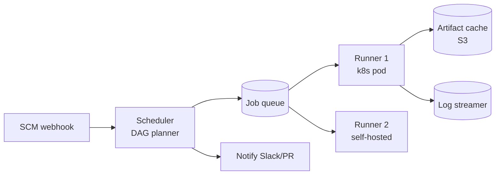

# CI/CD Pipeline (Jenkins / GitHub Actions)

> Build, test, deploy on every commit at scale. DAG of jobs, artifact cache, parallelism, secrets.

<span class="phase-status phase-done">Phase 17 — Tier 3</span>

---

## 1. 🎤 Scenario

> *"Design a CI/CD platform. 10K developers, 100K pipeline runs/day, polyglot (Go/Python/JS), artifact registry, secrets, deploy gates."*

## 2. ❓ Clarifying questions

1. Repo hosts? Git (GitHub-like).
2. Pipeline-as-code? Yes — YAML in repo.
3. Self-hosted runners + cloud runners? Both.
4. Cache scope? Per-repo + per-branch.
5. Compliance? Audit log; reproducible builds.

## 3. ✅ Requirements

**Functional**: trigger on push/PR/cron; DAG of jobs; per-job container; cache; artifacts; deploy with approval; logs.

**Non-functional**: 100 K runs/day = ~1.2/sec; queue → start < 10 s; tolerate runner death; secret isolation.

**Out**: SCM hosting (separate); package registry (separate).

## 4. 📐 Capacity

- 100 K runs/day × 5 jobs avg × 3 min = **1.5 M job-min/day** = ~1 K runners hot.
- Logs: 1 KB/sec × 100 K runs × 3 min = **18 GB/day** logs.
- Artifacts: avg 100 MB × 100 K = **10 TB/day** to cache; LRU evict.

## 5. 🏛️ Architecture



## 6. 💾 Data model

- **Workflow YAML** (in repo): jobs, needs (DAG), matrix, env.
- **Run**: `(run_id, repo, sha, status, started_at)`.
- **Job**: `(job_id, run_id, name, runner, status, deps[], started_at)`.
- **Logs**: streamed to S3 by job_id; tailed via WS.
- **Cache** (S3 with key = `hash(deps)`): pulled at job start; pushed on success.
- **Secrets** (vault): scoped per-repo / per-environment.

## 7. 🌐 API

```
POST /v1/runs           {repo, sha, workflow}
GET  /v1/runs/{id}
GET  /v1/runs/{id}/jobs/{job_id}/logs   (WS stream)
POST /v1/runs/{id}/cancel
POST /v1/runs/{id}/approve {env}
```

## 8. 🧩 Component deep-dive

### DAG scheduler

```python
def schedule_run(workflow, sha):
    jobs = topo_sort(workflow.jobs)            # respects `needs:`
    state = {j.id: "PENDING" for j in jobs}
    while not all_done(state):
        ready = [j for j in jobs if state[j.id] == "PENDING"
                 and all(state[d] == "DONE" for d in j.needs)]
        for j in ready:
            queue.publish(j, runner_pool=j.runner_label)
            state[j.id] = "QUEUED"
        finished = wait_for_any_completion()
        for f in finished:
            state[f.job_id] = "DONE" if f.success else fail_dependents(jobs, f)
```

### Runner picks job + restores cache

```python
def runner_loop():
    while True:
        job = queue.consume(timeout=30)
        if not job: continue
        ctx = build_ctx(job)
        cache_key = hash(ctx.lockfile + job.cache_inputs)
        if (blob := s3.get(f"cache/{cache_key}")):
            extract(blob, ctx.workspace)
        result = run_in_container(job.image, job.steps, ctx)
        if result.success and not cache_hit:
            s3.put(f"cache/{cache_key}", tar(ctx.workspace))
        upload_logs(job.id, ctx.log_path)
        queue.ack(job, result)
```

### Container isolation

```python
def run_in_container(image, steps, ctx):
    secrets = vault.fetch(ctx.repo, ctx.env)            # short-lived
    container = docker.create(image,
        mounts=[ctx.workspace],
        env={**ctx.env_vars, **secrets},
        network="restricted",                            # only allowlisted egress
        rlimits={"cpu": 4, "mem": 8e9})
    for step in steps:
        rc = container.exec(step.cmd, timeout=step.timeout or 1200)
        if rc != 0 and not step.continue_on_error: return Failure(step)
    return Success()
```

??? note "Ephemeral runners?"

    Recreate runner per job. Compromised job can't snoop next job's secrets. Cost: container startup overhead — mitigated with warm pool.

## 9. 📈 Scaling

| Stage | Setup |
|---|---|
| Day 1 | Single Jenkins host |
| Year 1 | Jenkins controller + 50 ephemeral agents |
| Year 3 | K8s-native runners (Tekton); per-team isolation |
| Year 5 | Multi-region; runners in same DC as artifact registry to avoid egress |

## 10. ☁️ Cloud

GitHub Actions / GitLab CI / CircleCI. AWS CodeBuild + CodePipeline. Or self-managed Tekton on EKS.

## 11. 🏠 On-prem

Jenkins + Kubernetes plugin; Harbor for image registry; HashiCorp Vault for secrets; MinIO for artifact cache.

## 12. 🏗️ Architecture deep-dive

??? question "Why DAG over linear?"

    Parallelism. `test-go` + `test-python` + `lint` can run together; only `deploy` waits on all. DAG with `needs:` exposes structure.

??? question "Caching strategy?"

    Key by hash of dependency manifest (`go.sum`, `package-lock.json`). Restore matches by exact key, fall back to prefix match. Push only on key miss.

## 13. 🧨 Bottlenecks

| Bottleneck | Fix |
|---|---|
| Runner cold start | Warm pool of stand-by pods |
| Hot repo (1000 PRs/day) | Per-repo concurrency cap; merge queue |
| Log spam | Truncate per-step at N MB; sample rest |
| Cache thrash on monorepo | Multi-key cache; prefix fallback |
| Secrets fetch latency | Per-runner short-lived vault token cached |

## 14. 🔒 Security

- Ephemeral runners; no shared state across jobs.
- Secrets from vault, scoped per-environment, redacted from logs.
- OIDC federation: jobs assume cloud roles per-run, no static creds.
- SBOM + signed artifacts (cosign / sigstore) for supply chain.
- PR from fork: no secrets; require maintainer approval.

## 15. 📊 Monitoring

Queue → start time; per-job duration p50/p99; runner utilisation; cache hit ratio; deploy success rate; secret-fetch errors.

## 16. 🧱 Reliability

- Job retry on infra error (runner crash, network) but not on test failure.
- Deduplicate concurrent runs on same `(repo, sha)` if requested.
- Snapshot logs as job runs; survive runner death.
- Approval gates for prod deploy; minimum 2 humans.

## 17. ❓ Follow-ups

??? question "How to handle PR from fork securely?"

    Run with no secrets; only public-cache; require maintainer label to elevate. Fork code never touches prod secrets.

??? question "Reproducible builds?"

    Pinned image SHA; lockfile-based deps; deterministic timestamps; bit-for-bit assertion via `diffoscope` in nightly run.

??? question "Deploy approval workflow?"

    Pipeline pauses at `environment: production`; requires N approvers from team list; audit logged with reason text.

??? question "Monorepo path-based filtering?"

    Cache build state per top-level package; skip jobs unaffected by changed files.

??? question "How are flaky tests handled?"

    Auto-retry on first failure (mark "flaky"); track flake rate per test; quarantine if > X% flaky.

## 18. 🐍 Snippet

```python
# Topo sort with cycle detection
def topo_sort(jobs):
    deps = {j.id: set(j.needs) for j in jobs}
    out = []
    while deps:
        ready = [jid for jid, d in deps.items() if not d]
        if not ready: raise CycleError(deps)
        for jid in ready:
            out.append(jid); del deps[jid]
            for d in deps.values(): d.discard(jid)
    return [next(j for j in jobs if j.id == jid) for jid in out]
```

## 19. 🌍 Real-world

- *Tekton Pipelines* — k8s-native CI primitives.
- *GitHub Actions internals* — public docs on runners + caches.
- *Bazel remote cache* — content-addressed build artifacts.
- *Sigstore / cosign* — supply chain signing.
- *Spinnaker* — multi-cloud delivery.

## 20. 🃏 Cheatsheet

- DAG scheduler from YAML; `needs:` defines dependencies.
- Runners = ephemeral containers; warm pool for cold-start.
- Cache key = hash(lockfile); restore by exact + prefix.
- Secrets via vault with short-lived OIDC tokens; redact in logs.
- Artifacts to S3; cosign-signed; LRU evict.
- PR from fork = no secrets; maintainer-gated.
- Approval gates + audit log for prod deploy.
