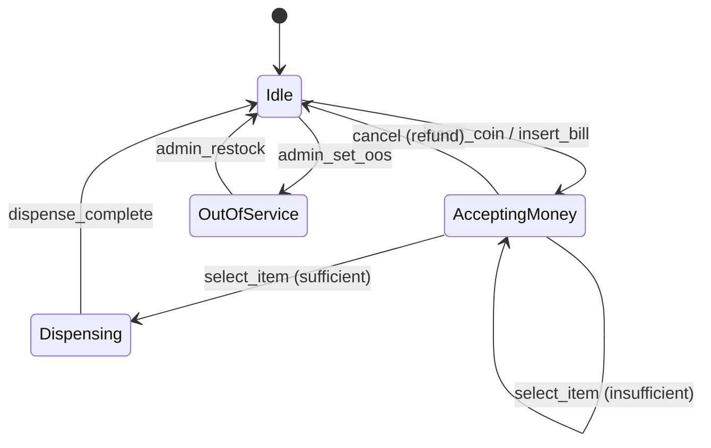

# Design a Vending Machine

> Coins go in, items come out. The interview problem that's *really* about state machines and the State pattern.

<span class="phase-status phase-done">Phase 13 — classic LLD</span>

---

## 🎤 Problem

> *"Design a vending machine. Users insert coins, select an item, and the machine dispenses it (with change). Show inventory. Handle out-of-stock and insufficient-payment cases."*

A 30-45 minute LLD round. Interviewer expects:

1. **Clarifying questions**.
2. **State machine** explicit (this is the headline).
3. **Code** for state transitions + dispense logic.
4. **Restock + admin** as extension.

---

## ❓ Clarifying questions

1. **Payment?** Coins only? Cash? Card? App?
2. **Items?** Fixed slots (e.g. A1..C5)?
3. **Change?** Should the machine give change? In what denominations?
4. **Cancellation?** Can the user request a refund mid-purchase?
5. **Inventory limits?** Per slot capacity?
6. **Admin functions?** Restock, view sales?
7. **Multiple selections?** One item per session, or many?

**Default assumptions**:

- Coins (1, 5, 10, 25 cents) + bills (1, 5, 10).
- Fixed slots; price per slot.
- Change given in available denominations.
- Cancel at any time; refund inserted amount.
- One item per session.

---

## 🏛️ State machine

Five states drive the entire machine.



State pattern: each state is a class. The machine delegates user actions to its current state.

---

## 🔧 Code

### Enums + value objects

```python
from abc import ABC, abstractmethod
from dataclasses import dataclass, field
from enum import Enum


class Coin(Enum):
    PENNY    = 1
    NICKEL   = 5
    DIME     = 10
    QUARTER  = 25

class Bill(Enum):
    ONE   = 100
    FIVE  = 500
    TEN   = 1000


@dataclass
class Item:
    code: str            # "A1", "B3"
    name: str
    price_cents: int


@dataclass
class Slot:
    item: Item
    count: int           # remaining
```

### State pattern

```python
class State(ABC):
    """Base for all VendingMachine states."""

    def __init__(self, machine: "VendingMachine"):
        self.machine = machine

    def insert_coin(self, c: Coin):
        raise InvalidOperation("cannot insert coin in this state")

    def insert_bill(self, b: Bill):
        raise InvalidOperation("cannot insert bill in this state")

    def select_item(self, code: str):
        raise InvalidOperation("cannot select item in this state")

    def cancel(self):
        raise InvalidOperation("cannot cancel in this state")
```

### Concrete states

```python
class IdleState(State):
    def insert_coin(self, c: Coin):
        self.machine.balance_cents += c.value
        self.machine.set_state(AcceptingMoneyState(self.machine))

    def insert_bill(self, b: Bill):
        self.machine.balance_cents += b.value
        self.machine.set_state(AcceptingMoneyState(self.machine))


class AcceptingMoneyState(State):
    def insert_coin(self, c: Coin):
        self.machine.balance_cents += c.value

    def insert_bill(self, b: Bill):
        self.machine.balance_cents += b.value

    def select_item(self, code: str):
        slot = self.machine.slots.get(code)
        if slot is None or slot.count == 0:
            raise OutOfStock(code)
        if self.machine.balance_cents < slot.item.price_cents:
            short = slot.item.price_cents - self.machine.balance_cents
            raise InsufficientFunds(short)
        self.machine.set_state(DispensingState(self.machine))
        self.machine.dispense(slot)

    def cancel(self):
        refund = self.machine.balance_cents
        self.machine.balance_cents = 0
        self.machine.refund(refund)
        self.machine.set_state(IdleState(self.machine))


class DispensingState(State):
    """Transient: dispense() in machine flips us back to Idle."""
    pass


class OutOfServiceState(State):
    """Admin-only restock allowed."""
    pass
```

### The machine (Facade + Context for State)

```python
class VendingMachine:
    def __init__(self, slots: list[Slot], change_pool: dict[Coin, int]):
        self.slots: dict[str, Slot] = {s.item.code: s for s in slots}
        self.change_pool = change_pool          # how many of each coin in stock
        self.balance_cents = 0
        self.state: State = IdleState(self)

    # --- public API ---

    def insert_coin(self, c: Coin):  self.state.insert_coin(c)
    def insert_bill(self, b: Bill):  self.state.insert_bill(b)
    def select(self, code: str):     self.state.select_item(code)
    def cancel(self):                self.state.cancel()

    def set_state(self, s: State):
        self.state = s

    # --- mechanism ---

    def dispense(self, slot: Slot):
        slot.count -= 1
        change = self._make_change(self.balance_cents - slot.item.price_cents)
        self.balance_cents = 0
        # Physical: drop item + drop change. Then return to Idle.
        self.set_state(IdleState(self))
        return slot.item, change

    def refund(self, cents: int) -> dict[Coin, int]:
        return self._make_change(cents)

    def _make_change(self, cents: int) -> dict[Coin, int]:
        """Greedy works for standard US denominations."""
        result: dict[Coin, int] = {}
        for c in sorted(Coin, key=lambda x: -x.value):
            available = self.change_pool.get(c, 0)
            qty = min(cents // c.value, available)
            if qty > 0:
                result[c] = qty
                cents -= qty * c.value
                self.change_pool[c] -= qty
        if cents > 0:
            raise CannotMakeChange(cents)
        return result

    # --- admin ---

    def restock(self, code: str, units: int):
        self.slots[code].count += units

    def set_out_of_service(self):
        self.set_state(OutOfServiceState(self))
```

### Walkthrough

```python
slots = [
    Slot(Item("A1", "Coke", 125), count=5),
    Slot(Item("A2", "Chips", 75), count=3),
]
change_pool = {Coin.QUARTER: 10, Coin.DIME: 10, Coin.NICKEL: 10, Coin.PENNY: 20}

vm = VendingMachine(slots, change_pool)
vm.insert_bill(Bill.ONE)        # balance = 100
vm.insert_coin(Coin.QUARTER)    # balance = 125 (Idle → AcceptingMoney)
vm.select("A1")                 # dispenses Coke; change = {} (exact)
                                # state returns to Idle
```

---

## 🎯 Patterns + SOLID applied

| Decision | Pattern / principle |
|---|---|
| `IdleState`, `AcceptingMoneyState`, … as classes | **State** — eliminates `if state == X: …` chains. |
| Each state delegates only valid actions | LSP — `select_item` in `IdleState` raises, while in `AcceptingMoneyState` it works. |
| `_make_change` is a discrete responsibility | SRP. |
| `Coin` / `Bill` enums | Type safety. |
| Adding a Card-payment state = new class | OCP. |
| `cancel()` is **Command** in a richer design | (Optional extension.) |

---

## 🚀 Extensions

??? question "Make-change algorithm — is greedy always correct?"

    Greedy works for **canonical** coin systems (standard US, Euro). For arbitrary denominations, greedy can fail. Example: coins {1, 3, 4} + target 6 → greedy picks {4, 1, 1} (3 coins); optimal is {3, 3} (2). For non-canonical denominations, use DP. Mention this in the interview — shows DS depth.

??? question "Card / phone payment?"

    Add a `PaymentMethod` strategy. `select_item` first authorises payment; if approved, dispense. State stays in `AcceptingMoneyState` until payment confirmed; if declined, revert.

??? question "Concurrent users?"

    A physical vending machine is single-user, but software simulators may have many. Per-machine lock; or model the full state machine inside a session if multi-user.

??? question "What if the machine runs out of change mid-session?"

    `_make_change` raises `CannotMakeChange`. The machine should refuse the selection up-front: when computing whether sufficient funds + can-give-change, skip items where exact change isn't possible. Many real machines either refuse or round down to the user's loss.

??? question "Hardware failures?"

    Add a `FaultState`. Servo motor stuck → transition to `FaultState`, drop into `OutOfService`, page maintenance. Surface via admin API.

??? question "Inventory observability?"

    Observer pattern: state changes + dispense events fire to a Logger and a remote telemetry service. Operators see real-time stock.

??? question "Audit log of all transactions?"

    Append-only log of `(timestamp, action, balance_before, balance_after, item)`. Useful for billing reconciliation + dispute resolution.

---

## ⏱️ Pacing

| Minute | What |
|---|---|
| 0–3 | Clarifying questions. |
| 3–8 | State machine drawn. |
| 8–25 | Code: enums, state classes, machine. |
| 25–35 | Extensions: change algorithm, faults, card payment. |
| 35–45 | Q&A. |

---

## 🪤 Common mistakes

??? warning "If/elif chain on a `state` string"

    Becomes unmaintainable as states grow. The **point** of this problem is the State pattern.

??? warning "Modeling money as floats"

    Floating point + currency = bugs. Use **integer cents** everywhere.

??? warning "Forgetting the change problem"

    Many candidates dispense and ignore change. Probe it.

??? warning "Side effects in state classes"

    States should change machine state + delegate to mechanisms (e.g. `machine.dispense(slot)`). Avoid putting hardware logic inside state classes.

??? warning "Singleton machine"

    Tempting but wrong; for testing you want fresh instances. Constructor injection beats singletons.

---

## ➡️ Where this connects

- [Design patterns](../03-design-patterns.md) — State, Strategy.
- [SOLID](../02-solid-principles.md) — OCP via state classes.
- Other LLD: [Parking Lot](01-parking-lot.md), [Elevator](02-elevator-system.md), [LRU Cache](03-lru-cache.md).
