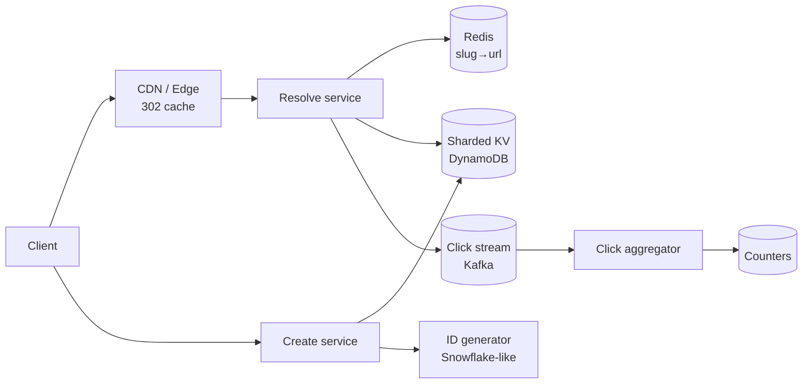

# Mock 3 — System Design Round (60 min)

> **Setup**: senior engineer interview at a large product company. Problem: design **TinyURL**. The transcript shows the *rhythm* of a good SD interview — when to slow down, when to push details, when to accept "good enough."

Phase 14 — Mock Interview

---

## 🎬 Transcript

### 0-3 min: framing

> **I**: We've got 60 minutes. I want you to design TinyURL — a URL shortener. End goal is a working architecture, not the cleanest one. I'll keep prodding; treat me as a senior teammate.
>
> **C**: Got it. Before I dive in I want to confirm the scope and estimate the load. Can I ask 5-6 questions up front?

??? tip "What just happened"

    Asking permission for clarifying questions sets a budget — the interviewer knows you won't ramble for 15 min.

### 3-10 min: clarifying + capacity

> **C**: Functional first.
>
> 1. Are short URLs **user-supplied** (custom slugs) or system-generated, or both?
> 2. Do they expire? If yes — default TTL or per-link?
> 3. Do we track click analytics? Per-link click counts?
> 4. Authentication required to create? Anonymous OK?
> 5. Editable? Delete? Or immutable?
>
> Non-functional:
>
> 6. Read-to-write ratio? "Real" Bitly is ~1000:1.
> 7. Geographic distribution — global or regional?
> 8. Latency target on resolve?
>
> **I**: System-generated; custom slug optional but second-priority. No expiry by default; per-link expiry optional. Yes click counts, daily granularity is fine. Anonymous OK; rate-limited. Immutable. Read-write 1000:1. Global. p99 resolve under 50 ms.
>
> **C**: Capacity. 100 M new URLs/day = ~1200 writes/sec, peak maybe 5×. Reads at 1000:1 = 1.2 M/sec, peak ~6 M. Storage: 100 M × 365 × 5 yr ≈ 180 B URLs total. At ~500 B per record (URL, slug, owner, ts, counters), that's ~90 TB.
>
> **I**: Good. What about the slug itself?
>
> **C**: Base62 (`a-zA-Z0-9`), 7 chars = 3.5 trillion combos. Plenty of headroom.

??? tip "What just happened"

    The candidate framed numbers from constraints, not "everyone has 1B users." Specific reasoning beats round figures.

### 10-25 min: high-level architecture

> **C**: Let me sketch.

> **I**: Walk me through a write.
>
> **C**: User POSTs long URL. Create service generates a 64-bit numeric ID via a Snowflake-style generator (per-host machine ID + ms timestamp + sequence). Encode to base62 → 7-char slug. Persist `(slug, long_url, owner, created_at)` in DynamoDB, primary key = slug. Return slug to user. ~10 ms p99.
>
> **I**: What if two users want the same custom slug?
>
> **C**: Conditional write — `PutItem` with `attribute_not_exists(slug)`. Race-safe.
>
> **I**: Why DynamoDB and not, say, MySQL?
>
> **C**: Read pattern is point-lookup by slug. No range queries on URLs. Writes scale linearly. DDB gives me automatic partitioning and predictable per-key latency. Could be Cassandra, FoundationDB, or even sharded MySQL. The choice isn't load-bearing for the design.

??? tip "What just happened"

    "The choice isn't load-bearing" earns trust. Real engineers don't pretend tech choice is sacred when it isn't.

### 25-35 min: read path + caching

> **C**: Read path: GET `/abc1234`. Edge CDN caches the **302 redirect** by slug for, say, 5 min — most clicks hit edge, never touch backend. p99 from edge = a few ms. On miss, edge hits resolve service → Redis → DynamoDB. Once we have the URL, fire-and-forget a click event to Kafka for analytics.
>
> **I**: What happens if the URL is updated? You said immutable, but what about the rare delete?
>
> **C**: Two options. (1) Treat slug as truly immutable — delete just sets a tombstone, edge cache still serves until TTL expires (5 min). (2) Active invalidation — delete pushes a purge to the CDN. Option 1 is dramatically cheaper and the 5 min staleness is acceptable for a delete. I'd pick 1.
>
> **I**: How does click-counting work without slowing the redirect?
>
> **C**: Resolve service writes a Kafka message with `(slug, ts, ip_geohash, user_agent_class)`. Async aggregator reads Kafka, batches per slug per minute, flushes to a counter store (could be DynamoDB with atomic ADD, or a separate columnar store like ClickHouse if we want analytics queries). The redirect path doesn't wait on this.
>
> **I**: What if the aggregator goes down?
>
> **C**: Kafka retains 7 days. Aggregator restarts and replays from its last offset. Idempotency is fine because counts are monotonic adds; we use exactly-once between Kafka → aggregator → DDB via transactional offsets and idempotent batch IDs.

??? tip "What just happened"

    Each follow-up answered with the *trade-off it's making*, not "we just do X." That's the tell.

### 35-50 min: scaling + bottlenecks

> **I**: 6 M reads/sec peak. What breaks first?
>
> **C**: Realistically the CDN swallows 95-99% of that. So backend sees ~60-300 K/sec. DynamoDB partitioned by slug handles that fine. Hot key risk: a slug that goes viral — say the link to a major news event — could overload one partition. Two mitigations: (1) Redis in front of DDB caches the hottest 1% of slugs; (2) edge cache absorbs the spike anyway.
>
> **I**: What about the ID generator? Single point of failure?
>
> **C**: Snowflake-style avoids that — each create-service host has a unique machine ID baked in (assigned at boot via ZooKeeper / Etcd). Each host generates its own IDs locally with no coordination. Only failure mode is two hosts boot with the same machine ID, which the boot-time assignment prevents.
>
> **I**: How do you handle abuse — someone shortens a million phishing URLs?
>
> **C**: Three layers. (1) Per-IP rate limit at edge. (2) URL safety check at create — Google Safe Browsing API + an internal denylist; either reject or quarantine pending review. (3) For successful abuses, takedown flow — slug marked `deleted` in DDB, CDN purge, internal report.

### 50-55 min: deeper trade-offs

> **I**: If I told you we have to support **billing — pay per shorten** — what changes?
>
> **C**: We add an auth/quota service. Create requests carry a JWT. Quota service checks user's plan and remaining quota in Redis (with periodic flush to a billing-grade store, probably Postgres for ACID). On exceed, 402 Payment Required. The async billing pipeline reconciles every hour from Kafka events to catch any drift.
>
> **I**: Is the redirect still anonymous in that world?
>
> **C**: Yes — owner is metadata on the link, not the visitor. We don't gate reads on auth.

### 55-60 min: reflection + candidate questions

> **I**: If you had unlimited time, what's the next thing you'd dig into?
>
> **C**: The analytics pipeline — I waved my hands at "exactly-once Kafka → aggregator." The reality of that has a lot of footguns: re-balancing, late events, schema evolution. I'd want a real proposal for windowing semantics before claiming it works.
>
> **C**: My questions. What's the trade-off your team most regrets making in the current system? And: how does on-call work for this service?

??? tip "What just happened"

    "What I'd dig into next" is a pre-empted self-criticism — better than waiting for the interviewer to find a hole.

---

## 🟢 What was good

- Up-front budget for clarifying questions ("can I ask 5-6?").
- Specific capacity numbers reasoned from question constraints.
- Each tech choice flagged with "this isn't load-bearing" or "the alternatives are X and the trade-off is Y."
- CDN as the primary scaling lever — many candidates overlook it.
- Asked the right ID generator question (collision under reboot).
- Self-critical: identified the analytics path as the wave-handed part.

## 🟡 What was weak

- Glossed over the **schema** — what columns, what indexes? An interviewer might pull on that.
- Didn't discuss **multi-region**: where does the DynamoDB primary live? Cross-region replication? Latency from APAC?
- Skipped **observability** — what metrics, alarms, SLOs?
- Didn't address **slug squatting / vanity URL competition** in detail.

## 🔁 How to do it better

1. **Reserve 5 min for "non-glamour" sections**: schema, monitoring, deploy, region. Senior interviewers grade on whether you naturally cover these without prompting.
2. **Quote one specific failure mode per component**. "Redis full" → eviction policy. "Kafka lag" → consumer auto-scaling. "DDB hot partition" → adaptive capacity.
3. **Sketch latency budget end-to-end**: "edge 5 ms + resolve 8 ms + redis 1 ms + ddb 6 ms = 20 ms p99 → 50 ms target gives 2.5× margin." Numbers like this are extremely high signal.

---

## 🃏 Cheatsheet for system design rounds

- 5-7 min for clarifying + capacity. No more.
- Sketch a Mermaid-like diagram with explicit read/write paths.
- Lead with "why this tech and not X" *unprompted*.
- Cache layers: client → edge → service-local → distributed.
- One specific failure mode per component.
- Budget the latency end-to-end and show the math.
- Reserve 3 min for "the part I'd dig into more given time" — it's pre-empted criticism.
