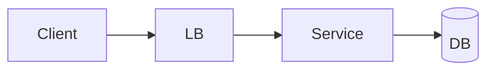

# Tooling

> The editors, debuggers, and drawing tools worth setting up *before* prep starts. Spend an hour configuring; save weeks of friction.

<span class="phase-status phase-done">Phase 14 — Resources</span>

---

## Code editors

### VS Code (default recommendation)

- **Why**: best balance of interview-friendly + production-friendly. The same setup works for daily work and for a clean "interview profile."
- **Extensions for prep**:
  - Python (Microsoft) — debugger, IntelliSense, Jupyter
  - Pylance — type checking
  - Code Runner — `Ctrl+Alt+N` to run any file
  - GitLens — git blame inline
  - Markdown All in One — for note-taking
  - Mermaid Preview — render Mermaid diagrams
- **Settings worth tweaking**: format on save, ruler at 100, trailing-whitespace highlight.

### JetBrains (PyCharm / IntelliJ)

- **Why**: deepest refactoring + debugging. Worth using if you live in IntelliJ daily.
- **For interviews**: heavyweight, slow boot, but the debugger is best-in-class.

### Neovim

- **Why**: if you already use it. Don't learn it for interviews.

### Don't use:
- **Browser-based IDEs** during prep — keystrokes don't transfer.
- **Cursor / AI-heavy editors** when *practicing*. You won't have AI in the interview. Use them for daily work; turn them off when grinding.

---

## Online coderpad-style sandboxes (practice in the actual environment)

Most onsite interviews use one of these. Get fluent in the one your target company uses:

- **CoderPad** (`coderpad.io`) — most common; has a free practice pad
- **HackerRank** — service companies + some product
- **CodeSignal** — Amazon, Quora, Robinhood
- **Karat live coding pad** — proxy interviews
- **Google Docs** — yes, really, for some at Google. Practice typing code into a doc.
- **Whiteboard.fi** — for whiteboard practice

**Tip**: each sandbox has different keyboard shortcuts and quirks (CoderPad's auto-indent is aggressive; CodeSignal has built-in test runners). Don't discover them on interview day.

---

## Terminal / shell

- **iTerm2** (macOS) or **Windows Terminal** (Windows) or **kitty / alacritty** (Linux) — modern terminals.
- **zsh** + **oh-my-zsh** — for the alias ecosystem.
- **`fzf`** — fuzzy finder for files / history. Once you have it, you can't live without it.
- **`ripgrep` (rg)** — 10× faster than grep.
- **`fd`** — friendly find replacement.
- **`bat`** — `cat` with syntax highlighting.

---

## Debuggers

### Python

- **`pdb` / `breakpoint()`** — built-in. Just type `breakpoint()` in code; runs `pdb` at that line.
- **`ipdb`** — pdb with IPython features (tab completion).
- **VS Code Python debugger** — graphical, breakpoints, watch.

### General

- **`py-spy`** — production-safe Python profiler (samples without instrumenting).
- **`gdb` / `lldb`** — for native code; rarely needed for interviews.
- **Chrome DevTools** — for any frontend / Node work.

---

## Drawing / diagramming

For system design rounds, you'll need to draw. Pick **one** and get fast at it:

### Excalidraw (`excalidraw.com`)

- **Why**: hand-drawn aesthetic, very fast, no account needed.
- Best for live system design over screen-share.

### Whimsical / Miro / Mural

- **Why**: better for collaboration.
- More setup; slower to draw quickly.

### Draw.io / diagrams.net

- **Why**: best for "professional" architecture diagrams (clean ortho lines).
- Slower to use under pressure.

### Mermaid

- **Why**: text-based; embedable in markdown.
- Used throughout this bible. Great for documentation; not for interviews.



### Hand drawing on paper / iPad

- Underrated. If you have an iPad + Apple Pencil, it's the lowest-friction option for whiteboard rehearsal.

**My recommendation**: Excalidraw for live interviews; Mermaid for notes; pen-and-paper for solo practice.

---

## Note-taking / spaced repetition

- **Anki** — flashcards with spaced repetition. **Use this** for memorising patterns, complexities, idioms.
- **Obsidian** — markdown notes with backlinks. Great for building a personal knowledge base.
- **Notion** — collaborative notes. Slower than Obsidian for solo prep.
- **Logseq** — outline-first, daily-notes-first.

**Anki deck recommendations**:
- Big-O complexities (table from `01-big-o-cheatsheet.md`)
- Python STL one-liners (from `02-python-stl-cheatsheet.md`)
- Pattern templates (from `03-pattern-templates.md`)
- Top 10 leadership-principle stories (one card per: tag → 30s setup → 3min action → 30s result)

5-15 min/day on Anki for 6 weeks beats most active studying.

---

## Time management / focus

- **Pomodoro timers** — 25 min on / 5 min off. Apps: Pomofocus.io, Be Focused (macOS), Focus To-Do.
- **Forest** — gamified focus timer; planting trees keeps you off the phone.
- **RescueTime** / **Toggl** — track where time actually goes.

---

## Audio recording (for live mocks)

- **Mac**: built-in screen recorder (`Cmd+Shift+5`) records audio.
- **Windows**: built-in Game Bar (`Win+G`) or **OBS Studio**.
- **Linux**: **OBS Studio** is the standard.

OBS Studio is overkill for screen+audio but worth the 30 min setup if you'll be recording mocks.

---

## Browser productivity

- **Vimium** / **Surfingkeys** — keyboard navigation.
- **Tab Wrangler** — auto-close stale tabs.
- **OneTab** — collapse 50 tabs into one.
- **Reader View** — strip ads/sidebars from articles.
- **Bear / Pocket / Instapaper** — read-later for engineering blog posts.

---

## CLI productivity for studying

```bash
# Quickly time a Python solution
time python3 solution.py

# Compare two files (e.g., expected vs actual)
diff -u expected.txt actual.txt

# Continuous test runner (re-runs on save)
ls *.py | entr -c python3 test.py

# JSON pretty-print + jq filtering
cat data.json | jq '.users | map(select(.active))'

# Quick HTTP server for testing
python3 -m http.server 8000
```

---

## VS Code interview-mode profile

Create a separate profile (VS Code 1.75+) that:
- Disables Copilot / AI features
- Disables auto-imports (you should know your imports)
- Uses minimal theme (no distractions)
- Has a single workspace folder pointed at `~/interview-prep/`

Switch profiles when going from "real work" to "practice" mode.

---

## Hardware

- **Mechanical keyboard** — if you're going to type for 6 hours of mocks, comfort matters.
- **External monitor** — even a cheap one. Coderpad on one screen, problem statement on the other.
- **Webcam at eye level** — interviewers form first impressions in 2 seconds. Looking down at a laptop cam is awful.
- **Wired headphones** — better mic clarity than wireless. Even cheap ones beat AirPods for voice.
- **Lighting** — face a window or buy a $30 ring light. Bad lighting on Zoom is professional malpractice in 2026.

---

## What NOT to invest time in

- Your editor's color theme. Pick one in 5 minutes; never touch again.
- The "perfect" Anki deck. Start with 50 cards; refine over weeks.
- A productivity system (GTD, BASB, etc.). Use the simplest thing that works.
- Studying tools instead of studying.

---

## The 30-minute setup (do this today)

1. VS Code + Python extension installed.
2. Create `~/interview-prep/` folder. `cd` into it.
3. Try one easy LeetCode locally (`Two Sum`). Confirm test runs.
4. Sign up for Pramp; book first mock for next week.
5. Install Excalidraw bookmark in browser.
6. Install Anki; download top-100 LeetCode patterns deck.
7. Schedule one 25-min Pomodoro daily for the next 30 days.

Now you're set up.
