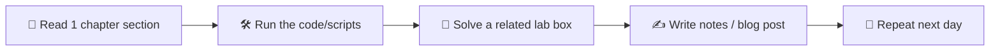

# 🧭 How to Use This Course

## The 70/20/10 Rule

| Time Allocation | Activity |
|----------------:|----------|
| **70 %** | Hands-on labs (TryHackMe, HackTheBox, your own VMs, CTFs) |
| **20 %** | Reading docs (this site, official tool documentation, RFCs, papers) |
| **10 %** | Watching content (DEF CON / Black Hat / Offensivecon talks, tool walkthroughs) |

If you flip these ratios, you become someone who **reads about** hacking. Your goal is to **do** it.

## Daily Workflow

### The note-taking habit

Every professional pentester keeps an **engagement notebook**. Build that habit now.

- Tool: **Obsidian** (free, local-first, perfect for security notes)
- Alternatives: CherryTree, Joplin, Notion, plain markdown + Git
- Structure: one folder per topic (`networking/`, `web/`, `ad/`), one file per technique
- Format each note as: *What it is* → *How to detect/find it* → *How to exploit (lab)* → *How to defend* → *Sample command/output*

### The "two-VM" rule

When you learn an attack:

1. Run it on a **purposely vulnerable VM** (Metasploitable, DVWA, AD lab)
2. Then watch what it looks like from the **defender's VM** (Wireshark, Sysmon, ELK)

This is the *purple team* habit. It doubles your value on a resume.

## Recommended Sequence

You can technically skip around, but I recommend this order:

1. **Phase 1 in full.** No exceptions. Skipping fundamentals is the #1 reason people fail OSCP.
2. **Phase 2 in full.** Recon and enumeration are 80 % of every engagement.
3. **Phase 3** — start with **Web App Security** (largest hiring market) and **Active Directory** (most-asked in interviews).
4. **Phase 5** alongside Phase 3. Building blue-team awareness while you learn offense makes you twice as marketable.
5. **Phase 4** — pick **2 specializations** that match your target role:
    - Going for SOC/DFIR? → Malware Analysis + Cloud
    - Going for pentest? → Exploit Dev + Cloud
    - Going for ICS/critical infra? → IoT/ICS + RE
6. **Phase 6** — start the certifications track around the time you finish Phase 3.

## Pace Yourself

Burnout is real and the field is enormous. Pick a sustainable pace.

!!! example "Sample 12-month plan (12 hrs/week)"
    - **Months 1–2**: Phase 1 + Security+ exam
    - **Months 3–4**: Phase 2 + start TryHackMe (Pre-Security → Offensive Pentesting paths)
    - **Months 5–7**: Phase 3 (Web + AD) + PortSwigger Web Security Academy
    - **Months 8–9**: Phase 4 (pick 2) + HackTheBox CPTS path
    - **Months 10–11**: Phase 5 + start OSCP prep (PWK course)
    - **Month 12**: OSCP exam + start applying

## What to Skip

You **don't** need to memorize:

- Every CVE number ever issued
- Every Metasploit module
- Every Nmap NSE script
- The full RFC for every protocol

You **do** need to know:

- *Where* to look things up fast
- *Why* each major class of bug exists
- *How* to recognize a class of vulnerability you've never seen before

## Study Tools

- **Anki** for flashcards — port numbers, OWASP categories, Linux commands
- **CyberChef** — bookmark it. Daily tool.
- **GTFOBins / LOLBAS** — bookmark. Reference during privesc.
- **HackTricks** — best free reference site in the field
- **Obsidian** — your second brain
- **GitHub** — push your scripts as you write them. Your future employer will look.

Ready? → [Set up your lab](lab-setup.md)
