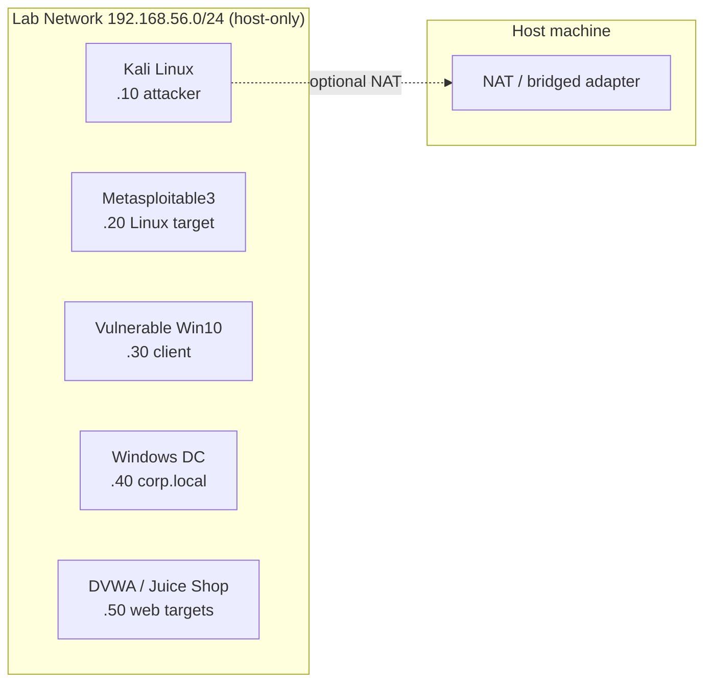

# 🧪 Lab Setup

You will not learn this discipline by reading. You learn by breaking and fixing things in a safe lab. This chapter walks you through building one.

## Lab Goals

A good practice lab gives you:

1. **Isolation** — your experiments cannot reach the public internet or your home network unintentionally.
2. **Reproducibility** — VMs you can snapshot, revert, and rebuild.
3. **A diverse target set** — Linux, Windows, vulnerable web apps, AD environment.
4. **Performance** — enough RAM/CPU to run 3–5 VMs simultaneously.

## Hardware Targets

| Tier | RAM | CPU | Disk | Notes |
|------|-----|-----|------|-------|
| Minimum | 16 GB | 4 cores | 256 GB SSD | Single attacker + 1–2 targets |
| Comfortable | 32 GB | 6+ cores | 512 GB SSD | Full small AD lab |
| Luxury | 64 GB | 8+ cores | 1 TB NVMe | Multiple AD forests, cloud emulation |

If you don't have local hardware, [free-tier cloud VPS](#cloud-fallback) work for individual targets but not for an isolated network with sniffing.

## Choose a Hypervisor

| Hypervisor | Cost | Strengths | Weakness |
|------------|------|-----------|----------|
| **VMware Workstation Pro** (Win/Linux) | Free for personal use (since 2024) | Best snapshot mgmt, good networking | Closed-source |
| **VMware Fusion** (macOS) | Free for personal use | Native on Apple Silicon | Macs only |
| **VirtualBox** | Free / GPL | Cross-platform, scriptable (Vagrant) | Slower; quirky on Apple Silicon |
| **Proxmox VE** | Free | Bare-metal, manage many VMs | Needs dedicated hardware |
| **Hyper-V** | Free with Win Pro | Performant on Windows | Conflicts with VMware/VirtualBox if running |
| **UTM / QEMU/KVM** | Free | Apple Silicon ARM Linux/Windows ARM VMs | Less polished UI |

**Recommendation:** VMware Workstation Pro on x86 Windows/Linux, VMware Fusion on Mac, UTM on Apple Silicon when forced.

## Network Topology

Build an **isolated lab network** so attackers and targets see only each other.



In VMware:

1. **Edit → Virtual Network Editor**
2. Add a host-only adapter (`VMnet2`)
3. Subnet `192.168.56.0/24`, **disable** "Use local DHCP" if you want static IPs, or enable it for simplicity
4. **Disable** "Connect a host virtual adapter" if you do not want your host to participate (cleaner isolation)

In VirtualBox:

```bash
VBoxManage hostonlyif create
VBoxManage hostonlyif ipconfig vboxnet0 --ip 192.168.56.1
```

Each VM is then attached to `Host-only adapter → vboxnet0` (or `VMnet2` in VMware).

!!! tip "Two adapters per attacker"
    Give Kali two NICs: one **host-only** for the lab, one **NAT** for downloads/updates. Keep NAT off when actually attacking targets so traffic can't leak.

### Static IP plan

| Host | IP | Notes |
|------|----|----|
| Gateway / virtual switch | 192.168.56.1 | (only if hypervisor exposes it) |
| Kali (attacker) | 192.168.56.10 | |
| Metasploitable3 (Linux) | 192.168.56.20 | |
| Vulnerable Windows 10 | 192.168.56.30 | |
| Domain Controller (Server 2022) | 192.168.56.40 | DNS for `corp.local` |
| Domain-joined member | 192.168.56.41 | |
| Web targets (Docker on Kali or own VM) | 192.168.56.50 | DVWA, Juice Shop, bWAPP |

## Build the Attacker — Kali Linux

1. Download the **VMware** or **VirtualBox** image: <https://www.kali.org/get-kali/#kali-virtual-machines>
2. Import → boot → default creds: `kali` / `kali` (change on first login).
3. Update:
   ```bash
   sudo apt update && sudo apt full-upgrade -y
   sudo apt install -y kali-linux-large
   ```
4. Snapshot **before** any heavy customization. Name it `clean-base`.

Set hostname and a strong root/user password:

```bash
sudo hostnamectl set-hostname kali-attacker
passwd
```

Install `tmux`, `zsh`, `oh-my-zsh`, `pyenv` — quality-of-life tools that pay for themselves the first day. (See [Tooling](tooling.md) for the full list.)

### Alternative: Parrot OS

Parrot Security is a fine alternative — slightly lighter, AppArmor profiles by default. Pick one and stick to it during your study so muscle memory builds.

## Vulnerable Targets to Install

### Linux

| Target | Why | Where |
|--------|-----|-------|
| **Metasploitable 2 / 3** | Classic kitchen-sink VM | Rapid7 / GitHub |
| **VulnHub VMs** (Kioptrix, Mr-Robot, Sickos…) | OSCP-style standalone | <https://www.vulnhub.com> |
| **HackTheBox retired boxes** | Modern challenges | <https://www.hackthebox.com> |
| **TryHackMe rooms** | Beginner → advanced, browser lab | <https://tryhackme.com> |
| **Damn Vulnerable Web App (DVWA)** | Web fundamentals | Docker: `vulnerables/web-dvwa` |
| **OWASP Juice Shop** | Modern JS web app | `bkimminich/juice-shop` |
| **WebGoat** | OWASP teaching app | `webgoat/webgoat` |
| **bWAPP** | Many vulnerabilities | `raesene/bwapp` |

Run web targets fast with Docker on Kali:

```bash
sudo apt install -y docker.io
sudo usermod -aG docker $USER  # log out / back in
docker run -d -p 80:80   vulnerables/web-dvwa
docker run -d -p 3000:3000 bkimminich/juice-shop
docker run -d -p 8080:8080 webgoat/webgoat
```

### Windows

| Target | Why |
|--------|-----|
| **Windows 10/11 Eval** | Endpoint pentesting practice |
| **Windows Server 2022 Eval** | Domain Controller |
| **Metasploitable3 (Win2008 variant)** | Classic Win attacks |

Microsoft offers free 90-day evaluation copies — search "Windows Server evaluation."

### Active Directory Lab

A full mini-AD lab teaches you 80 % of real-world internal pentest skills. Two great quick-builds:

- **GOAD** (Game of Active Directory) — multi-domain, vuln-by-design — <https://github.com/Orange-Cyberdefense/GOAD>
- **Vulnerable AD** — single-domain misconfig generator — <https://github.com/wazehell/vulnerable-AD>
- **DetectionLab** — AD + Splunk + Velociraptor — <https://github.com/clong/DetectionLab>

These automate building 4–6 VMs with Vagrant + Ansible. **Plan ≥ 32 GB RAM** and a few hours of build time.

## Cloud Fallback

If you don't have local resources:

- **TryHackMe** — browser-based attacker box + targets, $10 / month
- **HackTheBox** — Pwnbox + retired/active machines, free + paid tiers
- **PortSwigger Web Security Academy** — free, browser-based, web only
- **PentesterLab** — paid, well-curated exercises
- **AWS / GCP / Azure free tier** — spin up your own targets (mind their ToS)

## Sanity Check

After setup you should be able to:

```bash
# From Kali
ping -c 2 192.168.56.20            # Linux target reachable
nmap -sV -T4 192.168.56.20         # Service scan works
curl -s http://192.168.56.50       # Web target serves HTML
sudo tcpdump -i any -c 5 host 192.168.56.20    # Sniffing works
```

If all four succeed, your lab is ready.

## Snapshot Etiquette

Snapshot **before** any irreversible operation:

- Before installing anything from an untrusted source
- Before running malware analysis
- Before running an exploit that could brick the target

Periodically delete old snapshot trees — each snapshot consumes disk in a copy-on-write chain that slows VM I/O over time.

## Backup Plan

- Export your customized Kali as an OVA every few months.
- Push your `~/notes/` and `~/projects/` to a private Git repo.
- Keep a `lab-state.md` documenting current IPs, creds, and what each VM is for.

→ Next: [Tooling](tooling.md)
