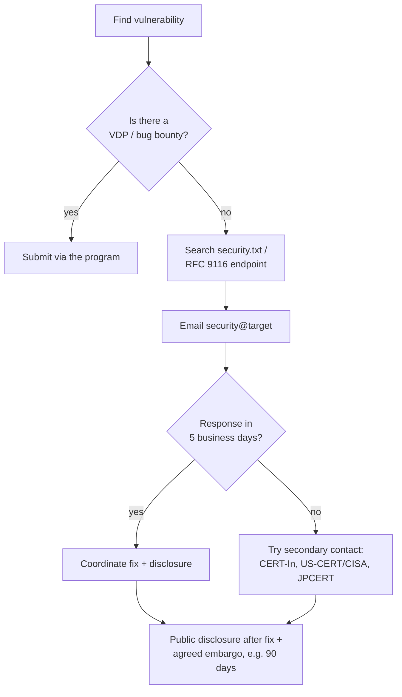

# ⚖️ Legal & Ethics

This is the most important chapter in the entire site. Read it twice.

!!! danger "There is no 'I was just learning'"
    Curiosity is not a legal defense. People go to prison every year for unauthorized scans, brute-force attempts against unfamiliar logins, and "harmless" testing of services they don't own. **You can do real damage to your career before it begins.**

## The Hard Rules

1. **Test only systems you own or have explicit written authorization to test.**
2. **Get the authorization in writing.** A verbal "go ahead" is not enough.
3. **Stay within scope.** A target list of `192.168.1.0/24` does not include `10.0.0.0/8`.
4. **Stay within methods.** If you're authorized for "external web testing," do not deploy persistence on a server.
5. **Stop and report** when you reach the agreed objective. Don't keep going for fun.
6. **Report responsibly.** Disclose to the right contact, give time to fix, never weaponize against the org.

## What "Authorization" Looks Like

A real engagement always has at least:

| Document | Purpose |
|----------|---------|
| **Master Services Agreement (MSA)** | Legal relationship between firms |
| **Statement of Work (SOW)** | Project scope, deliverables, timeline |
| **Rules of Engagement (RoE)** | Specific dos/don'ts for the test |
| **Authorization Letter** | "Get out of jail" letter signed by an executive |

The authorization letter typically lists:

- Company name, signing authority, date range
- Source IP ranges of the testers
- Target IP ranges, domains, applications
- Permitted techniques (and prohibited ones)
- Emergency contacts
- "If law enforcement asks, here is the contact"

Carry the letter (or have a digital copy ready) the entire engagement.

## The Laws You Must Know

This is **not legal advice**. Talk to a lawyer for any specific situation. But every practitioner should know these.

### United States

#### Computer Fraud and Abuse Act (CFAA), 18 U.S.C. § 1030

The federal law against unauthorized access. Key clauses:

- **§1030(a)(2)** — intentionally accessing a computer without authorization or exceeding authorized access, and obtaining information.
- **§1030(a)(5)** — knowingly causing damage to a protected computer.
- **§1030(a)(7)** — extortion involving threats to a computer.

Penalties run from misdemeanors to **20 years federal prison**, plus civil liability.

The 2021 Supreme Court ruling *Van Buren v. United States* narrowed "exceeds authorized access" — but unauthorized access remains broadly enforced. **Consent is the dividing line.**

#### Other US laws to be aware of

- **Electronic Communications Privacy Act (ECPA)** / **Wiretap Act** — intercepting communications
- **DMCA §1201** — circumventing technical protection measures (research safe harbor exists, narrowly)
- **Stored Communications Act** — accessing electronic stored communications
- **State laws** — many states have their own versions; California's CCPA / CPRA imposes data-handling duties even on testers
- **HIPAA, GLBA, FERPA, SOX** — sectoral regulations that affect what data you can touch

### India

#### Information Technology Act, 2000 (with 2008 amendments)

The primary statute. Key sections:

- **§43** — penalty for damage to computer/system: civil liability
- **§43A** — body corporate liable for sensitive personal data breaches
- **§65** — tampering with computer source documents (3 yr / fine)
- **§66** — computer-related offences including hacking (3 yr / ₹5 L fine)
- **§66B** — receiving stolen computer resource
- **§66C** — identity theft (3 yr / ₹1 L)
- **§66D** — cheating by personation using a computer (3 yr / ₹1 L)
- **§66E** — violation of privacy (3 yr / ₹2 L)
- **§66F** — **cyberterrorism** (life imprisonment)
- **§67/§67A/§67B** — obscene/sexually explicit content; child sexual abuse material — strict liability

#### Other Indian laws

- **Bharatiya Nyaya Sanhita (BNS) 2023** — replaces IPC; relevant for fraud, criminal breach of trust, forgery
- **Digital Personal Data Protection Act, 2023 (DPDP Act)** — privacy framework, fines up to ₹250 crore
- **Sectoral**: RBI cybersecurity directions, SEBI cybersecurity framework, IRDAI cyber norms, telecom UL conditions
- **CERT-In Direction (28 April 2022)** — 6-hour incident reporting; 180-day log retention; affects breach disclosure

### European Union (relevant if testing EU systems)

- **GDPR** — personal data protection; pentest data handling matters
- **NIS2 Directive** — operator-of-essential-services obligations
- **Cybersecurity Act**, national equivalents (BSI Act in DE, etc.)

### Other jurisdictions

If you operate internationally, add:

- **UK**: Computer Misuse Act 1990
- **Canada**: §342.1 Criminal Code
- **Australia**: Cybercrime Act 2001
- **Singapore**: Computer Misuse Act
- **UAE**: Federal Decree-Law 34 of 2021

## Rules of Engagement Template

Bare-minimum RoE checklist for any test:

- [ ] Date range (start, end, valid hours)
- [ ] In-scope IPs / domains / apps / endpoints
- [ ] Out-of-scope assets explicitly named
- [ ] Permitted attack types (DoS? social engineering? physical?)
- [ ] Prohibited techniques (data exfiltration limits, no destructive tests)
- [ ] Source IPs / VPN endpoint to whitelist
- [ ] Credentials provided (if grey/white box)
- [ ] Data-handling rules (where can findings be stored, how long, encryption)
- [ ] Emergency contacts (technical + legal) with 24/7 phone numbers
- [ ] Notification triggers ("notify if you find PII outside scope")
- [ ] Reporting format & deliverables
- [ ] Retest window
- [ ] Confidentiality / NDA clauses

## Ethics Beyond the Law

Legality is the floor. Ethics is the ceiling.

### Principles

1. **Do no harm.** Never run an exploit on production that could cause downtime without explicit clearance.
2. **Minimize data exposure.** Don't pull a full database dump if a sample row proves the bug.
3. **Don't pivot beyond proof of concept.** Demonstrate impact, then stop.
4. **Respect privacy.** Real PII you encounter is not yours to keep, share, or analyze.
5. **Don't moonlight on client data.** Use it for the report and destroy it on closure.
6. **Be honest about findings.** Don't inflate severity for billing or downplay to avoid uncomfortable conversations.

### Reporting Up

If during testing you find evidence of:

- **Active compromise** by another actor
- **Insider data theft**
- **Child sexual abuse material**
- **Imminent threat to life or safety**

…stop, preserve evidence, and escalate to the contracted point of contact and (where applicable) law enforcement. Do not investigate further than necessary.

## Responsible Disclosure

When you find a bug **outside** an engagement (independent research, bug bounty, accidental discovery), the standard process:

Best-practice norms (Google's 90-day, ISO/IEC 29147, Linux kernel rules) are widely followed but not mandatory. Always **act in good faith** and **document your timeline**.

### Bug bounty platforms

- HackerOne, Bugcrowd, Intigriti, YesWeHack — moderated programs
- BCRA: most platforms have a **safe harbor** for in-scope testing
- Always read the policy in full; out-of-scope hits are not protected

### Government VDPs

- **CISA "Hack DHS"** and federal `.gov` VDPs (BOD 20-01) — US
- **CERT-In** — coordinator for India, accepts vulnerability reports
- **Pentagon Vulnerability Disclosure Program** — DoD

## Personal OPSEC While Learning

Keep your study clean:

- Use a **separate identity / email / VM** for CTFs and bug bounty
- Use a **VPN** to keep your home IP off third-party logs
- Never test learning targets from your **employer's network** without permission
- Keep a **decision log** of what you tested, when, and why — your future self will thank you
- Be careful what you put on **GitHub**: a fully-working exploit that targets a current CVE in production is not a good first impression for a hiring manager

## Government Career Implications

If you're aiming for **clearance-track** roles (NSA, FBI, USCYBERCOM in the US; NTRO, IB, RAW in India), your background investigation will look at:

- Past unauthorized access incidents (admit them honestly during clearance — lying is the killer)
- Online activity, including which forums/chats you frequent
- Foreign contacts and travel
- Drug history, financial responsibility, allegiance

A documented bug-bounty trail and clean OSCP/CRTP labs are **assets**. A history of unsanctioned scans against random targets is a **liability**.

## Self-Test

1. You're hired to pentest `app.client.com` in a SOW. Mid-test you notice `db.client.com` is unscoped but obviously vulnerable. What do you do?
2. You're a bug-bounty hunter. A program asks you to delete a proof-of-concept video before they pay. What do you do?
3. While testing in scope, you find files containing what looks like PII of millions of EU users. What now?
4. A friend asks you to "just check if my ex's email is hacked." Why is this a hard no?
5. Name three ways to verify you have authorization in writing before starting.

→ Next: [Study Plan](study-plan.md)
