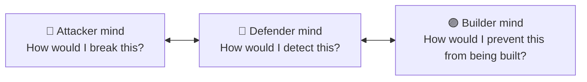

# 🧠 Mindset of a White Hat

Tools change every year. Mindset is forever. This chapter is short because it's the most important.

## The Core Disposition

A great security professional has **three mental modes** they switch between fluidly:

If you only have the red-team mind, you're a tool. If you only have the blue-team mind, you're reactive. Build all three from day one.

## The 10 Principles

### 1. Curiosity over showing off

The best hackers ask "what does this button do?" with the energy of a five-year-old. Showing off invites trouble; curiosity unlocks knowledge. Find this in yourself and feed it.

### 2. Read the docs others won't

The fastest way to be 95th-percentile is to actually **read the RFCs, the source code, the man pages, the CVE write-ups**. Most people skim. Don't be most people.

### 3. Break things on purpose, in safe places

You will break a lot of VMs. Snapshot, break, learn, restore. The lab is your dojo.

### 4. Document everything

If it's not written down, it didn't happen. Your notes are your second brain, your portfolio, and — during real engagements — the source of every report you'll ever ship.

### 5. Respect the system

Even when "the system" is a vulnerable VM, treat it with the discipline you'd use against a real target. Sloppy lab habits become sloppy engagement habits.

### 6. Get comfortable not knowing

The field is too big. You will hit unfamiliar territory weekly. The skill isn't *knowing*; it's the **ability to learn fast** when you don't.

### 7. Build the muscle of explaining

Every concept you master, explain to someone (or to a blog, or to a rubber duck). If you can't explain it, you don't truly know it. Bonus: blog posts directly land you interviews.

### 8. Defenders are not your enemy

Some hackers see SOC teams as the enemy. Wrong. Defenders make your work meaningful. Befriend them. Many top red teamers came from blue, and vice versa.

### 9. Time-box your obsession

You'll hit a rabbit hole and emerge six hours later with eyes like saucers. Sometimes that's growth. More often it's diminishing returns. Set timers. Take walks. The bug will still be there tomorrow.

### 10. Pay it forward

Every senior person who ever helped you did so because someone helped them once. The community is small. Mentor someone. Write a blog. Help a junior on Discord. It's the field's compounding currency.

## The Attacker's Five Questions

When you face any system, drill these:

1. **What is this system supposed to do?** (Trust boundaries, intended use)
2. **Who/what does it trust?** (Inputs, dependencies, identities)
3. **What happens if I lie to it?** (Malformed input, type confusion)
4. **What does it remember?** (State, sessions, caches, logs)
5. **What protects it, and how do I avoid the protection?** (Auth, rate limit, WAF, EDR)

Apply these to a login form, a router, a smart fridge — same questions, different answers.

## The Defender's Five Questions

Mirror skill:

1. **What's normal here?** (Baseline)
2. **What evidence would an attack leave?** (Telemetry sources)
3. **Where would a smart attacker land first?** (Initial access vectors)
4. **What can I detect *before* impact?** (Early-stage TTPs)
5. **If I miss it, can I recover?** (Backups, segmentation, IR plan)

## Common Pitfalls (and how to dodge them)

| Pitfall | The fix |
|---------|---------|
| Tool-first thinking ("which tool do I run?") | Concept-first ("what am I trying to learn about the target?") |
| Memorizing exploits | Understanding the *vulnerability class* |
| Quitting boxes too early | Set a 4-hour rule before reading walkthroughs |
| Reading walkthroughs *before* trying | Read only **after** you've solved or genuinely stuck |
| Watching too much YouTube | Watch one talk, then write a tool inspired by it |
| Comparing yourself to senior researchers | Compare yourself to *you, three months ago* |
| "I'll start when I have time" | You won't. Schedule 30 min/day. Start tonight. |

## The Long Game

Cybersecurity is one of the few fields where:

- You can self-teach to a six-figure salary in 2–3 years
- A great GitHub portfolio beats a degree at most companies
- Government agencies actively recruit people without traditional CS backgrounds (they care about clearance + skill + integrity)
- The work is genuinely meaningful — you protect real people from real harm

But it is also a field where:

- Burnout is common (high-stakes work, on-call rotations)
- Imposter syndrome never fully leaves
- Continuous learning isn't optional — it's the *job*
- Ethical missteps end careers

The mindset that wins long-term is **calm, curious, disciplined, kind, and honest**. Tools come and go.

→ [Begin Phase 1: Foundations](../01-foundations/index.md)
