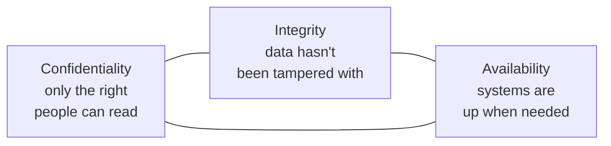
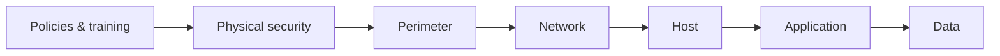
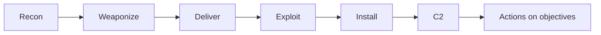
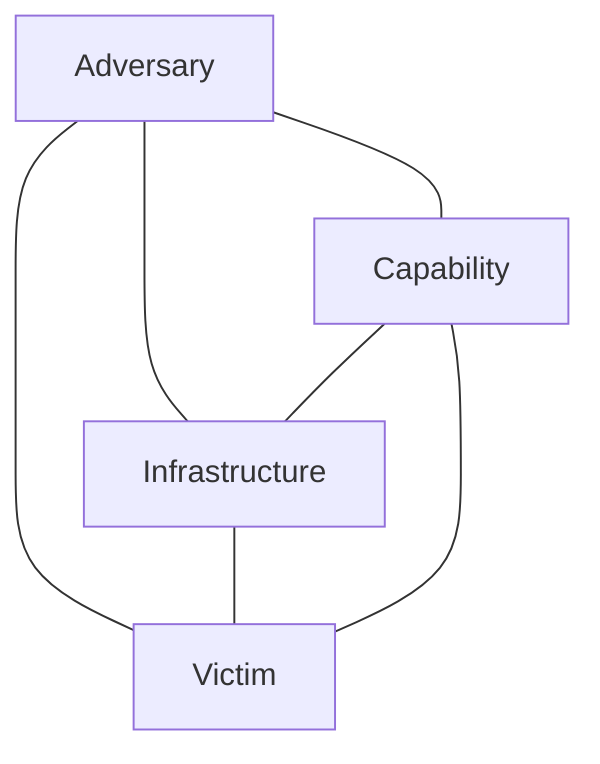

# 🛡️ Cybersecurity Fundamentals

The vocabulary and frameworks every security professional shares. You'll use this language in interviews, reports, and standups for the rest of your career.

## 1. The CIA Triad

The three core security goals:



Every control you ever design protects one or more of these. When you can't have all three, you trade off explicitly.

| Goal | Threats | Controls |
|------|---------|----------|
| Confidentiality | Eavesdropping, theft, exposure | Encryption, access control, classification |
| Integrity | Tampering, fraud, errors | Hashes, MACs, signatures, change control |
| Availability | DoS, hardware failure, ransomware | Redundancy, backups, capacity planning, DDoS scrubbing |

Some practitioners add **Authenticity** and **Non-repudiation** → "the Parkerian Hexad."

## 2. AAA — Authentication, Authorization, Accounting

Closely related, often confused:

| Term | Question it answers | Example |
|------|---------------------|---------|
| **Identification** | Who are you claiming to be? | username |
| **Authentication** | Prove it | password, MFA, certificate |
| **Authorization** | What may you do? | RBAC, ACLs, scopes |
| **Accounting / Auditing** | What did you do? | logs, SIEM trails |

Authentication factors:

1. **Something you know** — password, PIN, security questions
2. **Something you have** — hardware key, phone, smart card
3. **Something you are** — fingerprint, face, voice
4. **Somewhere you are** — geolocation, IP
5. **Something you do** — typing rhythm, mouse pattern (behavioral biometrics)

**MFA** (multi-factor) requires factors from **different** categories. A password plus a security question is not MFA.

## 3. Defense in Depth

Layered defenses so a single failure doesn't compromise the system:



Each layer should:

- Be independent (a flaw in one doesn't disable others)
- Be diverse (different mechanisms, vendors)
- Slow the attacker enough to be detected

**Counterpart concept:** **Zero Trust** — never assume a layer is trustworthy. Verify every request.

## 4. The Threat Model

A threat model answers four questions:

1. **What are we building?** (architecture diagram)
2. **What can go wrong?** (threats)
3. **What are we going to do about it?** (mitigations)
4. **Did we do a good enough job?** (validation)

Popular frameworks:

- **STRIDE** (Microsoft) — Spoofing, Tampering, Repudiation, Information disclosure, Denial of service, Elevation of privilege
- **DREAD** — risk rating (deprecated by MS but still used)
- **PASTA** — Process for Attack Simulation and Threat Analysis
- **OCTAVE** — risk-based, organizational
- **LINDDUN** — privacy-focused

Beginner mode: list components → for each, ask STRIDE questions → record threats → propose mitigations.

## 5. Kill Chains & Attack Frameworks

Models that describe how attackers operate:

### Lockheed Martin Cyber Kill Chain (2011)



Linear, network-intrusion-focused. Limit: doesn't model lateral movement well.

### MITRE ATT&CK

The **single most important framework** to learn. Catalogs adversary tactics, techniques, and procedures (TTPs) observed in the wild:

- **Tactics** (the why): Initial Access, Execution, Persistence, Privilege Escalation, Defense Evasion, Credential Access, Discovery, Lateral Movement, Collection, Command and Control, Exfiltration, Impact
- **Techniques / Sub-techniques** (the how): T1059 Command and Scripting Interpreter → T1059.001 PowerShell, T1059.003 Windows Cmd, etc.
- **Procedures** (specific implementations by named groups)

Use ATT&CK to:

- **Tag findings** in pentest reports (e.g., "Kerberoasting — T1558.003")
- **Map detections** to coverage in SIEM ("we detect 60 % of Discovery techniques")
- **Plan red-team scenarios** ("emulate APT29 — these specific techniques")

Tool: **MITRE ATT&CK Navigator** — visual coverage matrix.

### Diamond Model (2013)



Four corners of any intrusion. Useful for threat-intel correlation.

### Unified Kill Chain (Pols, 2017)

18 phases combining Lockheed + MITRE — the modern, lateral-movement-aware version.

## 6. Risk

**Risk = Likelihood × Impact** (or, more rigorously, expected loss).

A useful equation in qualitative form:

```
Risk = Threat × Vulnerability × Asset Value
```

You manage risk in four ways:

| Strategy | Example |
|----------|---------|
| **Mitigate** | Patch the vuln |
| **Transfer** | Cyber insurance |
| **Avoid** | Don't run the risky service |
| **Accept** | Document & monitor |

**Residual risk** is what's left after mitigations. There is **no zero-risk system**.

## 7. CVSS — Common Vulnerability Scoring System

Standardized way to score vulnerabilities. Current version: **CVSS v4.0 (2023)**, though CVSS v3.1 still dominates reports.

A v3.1 vector example:

```
CVSS:3.1/AV:N/AC:L/PR:N/UI:N/S:U/C:H/I:H/A:H
```

| Metric | Meaning |
|--------|---------|
| AV | Attack Vector (Network/Adjacent/Local/Physical) |
| AC | Attack Complexity (Low/High) |
| PR | Privileges Required (None/Low/High) |
| UI | User Interaction (None/Required) |
| S | Scope (Unchanged/Changed) |
| C / I / A | Confidentiality / Integrity / Availability impact |

A score of 9.8 ("Critical") is calculated from these.

**CVSS is a starting point, not a verdict.** Your environment changes priority dramatically — a CVSS 4.0 bug exposed to the internet may matter more than a CVSS 9 bug behind two firewalls.

## 8. Frameworks & Standards

You will encounter these names constantly:

| Framework | Purpose | Where used |
|-----------|---------|------------|
| **NIST CSF** (Identify-Protect-Detect-Respond-Recover) | Voluntary US framework | Most US enterprises |
| **NIST SP 800-53** | Federal control catalog | US gov agencies, FedRAMP |
| **NIST SP 800-171** | Protecting CUI in non-fed systems | DoD contractors (DFARS) |
| **NIST SP 800-30 / 39 / 37** | Risk management |  |
| **ISO/IEC 27001** | ISMS certification | Global |
| **ISO/IEC 27002** | Security controls reference |  |
| **CIS Critical Security Controls** | Prioritized list of 18 controls | Practical adoption |
| **CIS Benchmarks** | Hardening configs | Linux, Windows, cloud |
| **OWASP Top 10** | Web app risks | Web dev / pentest |
| **OWASP ASVS** | App security verification | Standard for assessments |
| **OWASP MASVS** | Mobile equivalent |  |
| **PCI-DSS** | Payment card industry |  |
| **HIPAA Security Rule** | US healthcare |  |
| **SOX** | US public-company financial systems |  |
| **GDPR** | EU privacy |  |
| **DPDP Act 2023** | India privacy |  |
| **CERT-In Direction (28 Apr 2022)** | India incident reporting & log retention |  |
| **MITRE ATT&CK / D3FEND / CWE / CAPEC** | Free knowledge bases |  |

For **US gov careers** know NIST CSF + 800-53 + 800-171 cold. For **India** know IT Act, DPDP Act, CERT-In direction. We cover both more in [Phase 6](../06-career/index.md).

## 9. Security Principles to Live By

These are timeless:

1. **Least privilege** — minimum rights necessary, nothing more
2. **Defense in depth** — multiple independent layers
3. **Fail securely** — when something breaks, default to denying access
4. **Separation of duties** — no single person can complete a sensitive action alone
5. **Complete mediation** — check authorization on every access, not just first
6. **Open design** — security shouldn't depend on secret algorithms (Kerckhoffs)
7. **Economy of mechanism** — keep design simple
8. **Psychological acceptability** — controls that users hate get bypassed
9. **Don't trust the client** — anything the user controls can be tampered with
10. **Assume breach** — design for "they're already in"

## 10. Threat Actors

The "who" matters because their goals shape what they do:

| Actor | Motive | TTPs |
|-------|--------|------|
| **Nation-state / APT** | Espionage, sabotage, geopolitical | Custom malware, long dwell, supply chain |
| **Organized crime** | Money | Ransomware, banking trojans, fraud |
| **Hacktivists** | Ideology | DDoS, defacement, leaks |
| **Insiders** | Money, revenge, ideology | Data theft, sabotage |
| **Script kiddies** | Notoriety, fun | Public exploits, low skill |
| **Penetration testers** | Authorized assessment | Same techniques, different goal |
| **Bug-bounty hunters** | Income, reputation | Defined scope, responsible disclosure |
| **Researchers** | Knowledge, advisories | Academic, vendor-coordinated |

Tracking groups (Mandiant APT##, MITRE G####, CrowdStrike's animals): a way to attribute and predict. Don't take attribution as fact — it's an analytic judgment.

## 11. Security Operations Roles

You'll meet these on the job:

| Role | What they do |
|------|--------------|
| **SOC Analyst (Tier 1/2/3)** | Monitor SIEM, triage alerts, escalate |
| **Incident Responder** | Contain & investigate active incidents |
| **Threat Hunter** | Proactive search for evil that bypasses alerts |
| **Penetration Tester / Red Teamer** | Authorized offensive testing |
| **Application Security Engineer** | Secure SDLC, code review, threat modeling |
| **Cloud Security Engineer** | AWS/GCP/Azure controls, posture mgmt |
| **DFIR Engineer** | Digital forensics + incident response |
| **Threat Intel Analyst** | Track adversaries, write reports, feed CTI |
| **Detection Engineer** | Write/maintain SIEM rules, Sigma, YARA |
| **Security Architect** | Design secure systems |
| **Security Engineer (generalist)** | Build & operate security tools |
| **GRC Analyst** | Compliance, risk, audits |
| **CISO** | Executive accountability for security |

## 12. India- and US-Specific Vocabulary

Quick reference for documents you'll see:

### US

- **CISA** — Cybersecurity and Infrastructure Security Agency (DHS)
- **NSA** — National Security Agency
- **NIST** — National Institute of Standards and Technology
- **FBI Cyber Division** — investigative
- **USCYBERCOM** — DoD cyber
- **DHS** — parent of CISA
- **NVD** — National Vulnerability Database
- **KEV** — CISA's "Known Exploited Vulnerabilities" catalog
- **BOD** — Binding Operational Directive (CISA → federal agencies)
- **FedRAMP** — federal cloud authorization
- **FISMA** — federal info-security law

### India

- **CERT-In** — Indian Computer Emergency Response Team (MeitY)
- **MeitY** — Ministry of Electronics and IT
- **NCIIPC** — National Critical Information Infrastructure Protection Centre (under NTRO)
- **NTRO** — National Technical Research Organisation
- **DRDO** — Defence Research and Development Organisation
- **I4C** — Indian Cyber Crime Coordination Centre (MHA)
- **DCyA** — Defence Cyber Agency (tri-services)
- **NCSC** — National Cyber Security Coordinator (PMO)
- **STQC** — Standardisation Testing & Quality Certification (under MeitY)

## Self-Test

1. Define the CIA triad. Give one threat and one mitigation per element.
2. Distinguish identification, authentication, authorization, accounting.
3. List MITRE ATT&CK's 14 tactics in (roughly) chronological order.
4. What does CVSS:3.1/AV:N/AC:L/PR:N/UI:N/S:U/C:H/I:H/A:H mean? Roughly what score?
5. Pick a system you use daily. Apply STRIDE to identify three threats.
6. Differentiate NIST CSF, NIST 800-53, and ISO 27001 in one sentence each.

→ Next: [Networking](networking.md)
