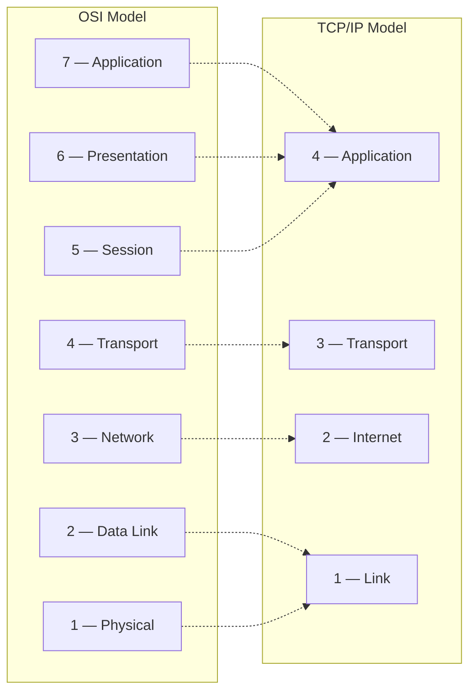
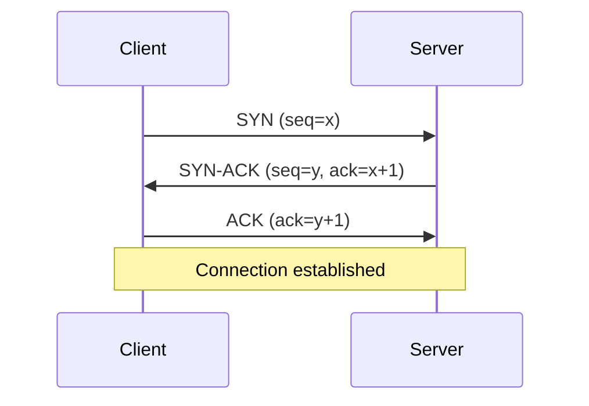
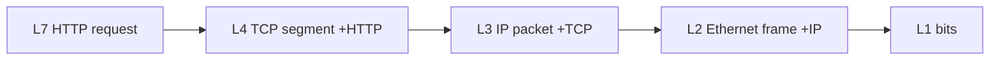
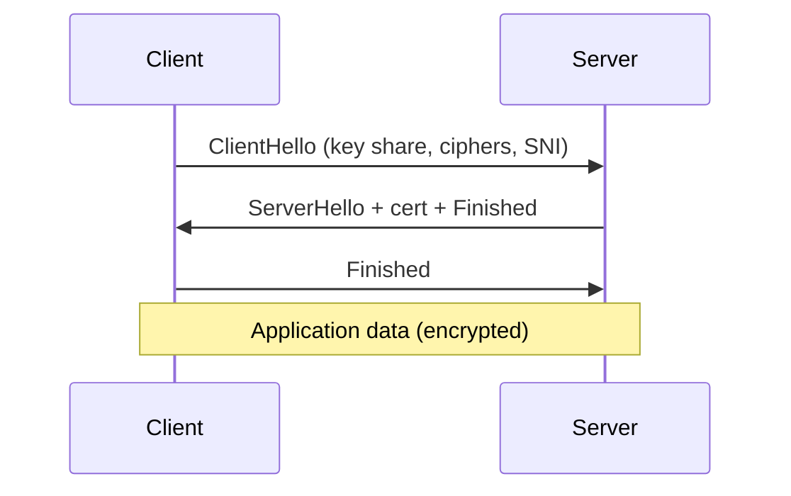
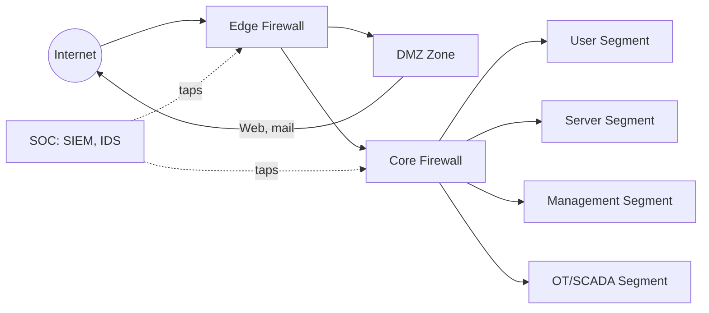

# 🌐 Networking

If you're shaky on networking, **this is where most security careers stall**. Spend more time here than feels comfortable.

## 1. Why Two Models?

- **OSI (Open Systems Interconnection)** — 7 layers, theoretical, great for diagnosis ("the problem is at L4")
- **TCP/IP** — 4 layers, what the internet actually runs on

We **think** in OSI but **encode** in TCP/IP.



!!! tip "Mnemonic (bottom-up)"
    **P**lease **D**o **N**ot **T**hrow **S**ausage **P**izza **A**way: Physical, Data link, Network, Transport, Session, Presentation, Application.

## 2. The 7 Layers — Security Perspective

### Layer 1 — Physical

Bits over wire/fiber/RF.

| Threat | Defense |
|--------|---------|
| Cable / fiber taps | Conduit, vaulted runs, intrusion-detection cabling |
| Rogue access points | Wireless surveys, WIPS |
| Hardware implants (BadUSB, Rubber Ducky) | Endpoint device control, USB allow-listing |
| EMI / TEMPEST emanations | Shielding (SCIFs use this) |

### Layer 2 — Data Link

Frames between adjacent nodes. **MAC addresses live here.** Examples: Ethernet, Wi-Fi, ARP.

| Threat | Defense |
|--------|---------|
| ARP spoofing / poisoning | Dynamic ARP Inspection, static ARP |
| MAC flooding (CAM table overflow) | Port security, sticky MAC |
| VLAN hopping | Disable DTP, native-VLAN ≠ user VLAN |
| Rogue DHCP | DHCP snooping |
| LLMNR / NBT-NS poisoning | Disable LLMNR (covered in AD chapter) |

### Layer 3 — Network

Packets between hosts. **IP addresses live here.** IPv4, IPv6, ICMP, IPsec, OSPF, BGP.

| Threat | Defense |
|--------|---------|
| IP spoofing | uRPF, ingress filtering (BCP 38) |
| ICMP abuse (ping sweeps, smurf, tunneling) | Rate-limit ICMP, DPI |
| Routing attacks (BGP hijack) | RPKI, prefix filtering, MANRS |
| Fragmentation attacks | Modern firewalls reassemble |

### Layer 4 — Transport

End-to-end delivery. **Ports live here.**

| | TCP | UDP |
|-|-----|-----|
| Connection | Yes (3-way handshake) | No |
| Reliability | Yes (ACKs, retransmits) | No |
| Ordering | Yes | No |
| Use cases | HTTP/S, SSH, SMTP | DNS, NTP, video, gaming |
| Header size | 20 bytes (min) | 8 bytes |

#### TCP three-way handshake



This handshake is the basis of every TCP scan. **Memorize the sequence.**

#### TCP flags

| Flag | Use |
|------|-----|
| **SYN** | Synchronize — start connection |
| **ACK** | Acknowledge data |
| **FIN** | Finish — close gracefully |
| **RST** | Reset — abort |
| **PSH** | Push data immediately |
| **URG** | Urgent (rare) |

Different scan types use different flag combinations:

- **SYN scan** (`nmap -sS`) — half-open, fast, somewhat stealthy
- **Connect scan** (`nmap -sT`) — full handshake, slow, leaves logs
- **FIN/Xmas/Null scans** — exploit RFC 793 ambiguity, work only on some stacks

### Layer 5 — Session

Application connections / sessions. **TLS technically straddles 5–6.**

### Layer 6 — Presentation

Format, encryption, compression. **Insecure deserialization** lives here (Java, .NET, Python pickle, PHP).

### Layer 7 — Application

HTTP/S, DNS, SMTP, FTP, SSH, etc. Most modern bugs live here. OWASP Top 10 is at L7.

## 3. Encapsulation

A request from your laptop to a webserver looks like nested envelopes:



Headers added on the way **down**, stripped on the way **up**. Every security tool — IDS, firewall, EDR — operates at one or more layers and sees only what's exposed at that layer.

## 4. IPv4 Header (the parts that matter)

| Field | Why |
|-------|-----|
| **Version** | 4 |
| **TTL** | Decremented per router. OS fingerprinting (Linux 64, Windows 128, Cisco 255). Used by traceroute. |
| **Protocol** | What's inside (1=ICMP, 6=TCP, 17=UDP, 50=ESP, 51=AH) |
| **Fragment Offset / Flags** | Old fragmentation attacks (teardrop, ping-of-death) |
| **Source / Dest Address** | 32-bit IPv4 addresses |

## 5. IPv4 vs IPv6

| | IPv4 | IPv6 |
|-|------|------|
| Address size | 32 bit (4.3B) | 128 bit |
| Notation | `192.0.2.42` | `2001:db8::42` |
| Header | Variable | Fixed 40 bytes |
| Broadcast | Yes | No (multicast/anycast only) |
| ARP | Yes | NDP |
| NAT | Common | Rare (NAT66) |
| Auto-config | DHCP | SLAAC + DHCPv6 |

!!! warning "Most networks have IPv6 enabled and unmonitored."
    Attackers exploit this — Responder, mitm6 — every day. **Disable or monitor IPv6** if your network doesn't actually use it.

## 6. The Top Ports You Must Know Cold

| Port | Protocol | Notes |
|------|----------|-------|
| 20/21 | FTP | Cleartext; replaced by SFTP/FTPS |
| 22 | SSH / SFTP / SCP | Encrypted shell |
| 23 | Telnet | Cleartext — find = report |
| 25 | SMTP | Mail relay |
| 53 | DNS | UDP + TCP |
| 67/68 | DHCP | UDP |
| 69 | TFTP | UDP, no auth |
| 80 | HTTP | Plaintext web |
| 88 | Kerberos | KDC; AD critical |
| 110 | POP3 | Cleartext mail |
| 111 | RPCBind | Sun RPC |
| 123 | NTP | UDP |
| 135 | RPC Endpoint Mapper | Windows DCE/RPC |
| 137-139 | NetBIOS / SMB-over-NetBIOS | |
| 143 | IMAP | Cleartext mail |
| 161/162 | SNMP / Trap | UDP — community strings often `public/private` |
| 179 | BGP | TCP |
| 389 | LDAP | Directory |
| 443 | HTTPS | TLS |
| 445 | SMB / CIFS | EternalBlue, etc. |
| 500 | IPSec IKE | UDP |
| 514 | Syslog | UDP |
| 587 | SMTP submission | Modern client→server |
| 623 | IPMI | UDP — BMCs, often ancient creds |
| 636 | LDAPS | LDAP over TLS |
| 873 | rsync | |
| 993 | IMAPS | |
| 995 | POP3S | |
| 1433/1434 | MS SQL / SQL Browser | |
| 1521 | Oracle DB | |
| 2049 | NFS | |
| 2375/2376 | Docker (insecure / TLS) | Find = report |
| 3306 | MySQL / MariaDB | |
| 3389 | RDP | Windows remote desktop |
| 5432 | PostgreSQL | |
| 5900 | VNC | |
| 5985/5986 | WinRM (HTTP/HTTPS) | PowerShell remoting |
| 6379 | Redis | Often unauthenticated |
| 6443 | Kubernetes API | |
| 8080/8443 | HTTP/S alt | Tomcat, Jenkins, dev panels |
| 9200/9300 | Elasticsearch | |
| 11211 | memcached | UDP amp |
| 27017 | MongoDB | Often unauth |

!!! tip "How to memorize"
    Anki cards. Top 50 first. After two weeks, recall is automatic.

## 7. DNS — The Phone Book of the Internet

#### Record types

| Type | Use |
|------|-----|
| A / AAAA | IPv4 / IPv6 address |
| CNAME | Alias |
| MX | Mail exchanger |
| NS | Name server |
| SOA | Start of authority |
| TXT | Free-form (SPF, DKIM, DMARC) |
| PTR | Reverse (IP → name) |
| SRV | Service location (heavy AD use) |
| CAA | Which CAs can issue certs |
| DNSKEY/DS/RRSIG | DNSSEC |

#### Quick queries

```bash
dig example.com A
dig example.com MX +short
dig @8.8.8.8 example.com TXT
dig +trace example.com
dig axfr @ns1.example.com example.com    # zone transfer (often blocked)
```

#### Security issues

- **DNS spoofing / cache poisoning** (Kaminsky 2008)
- **DNS amplification** (open resolvers used in DDoS)
- **DNS tunneling** (exfil over TXT/A records)
- **Subdomain takeover** (dangling CNAME to deleted cloud resource)
- **DGA** (rotating domains for malware C2)
- **DoH/DoT** (encrypted DNS — privacy↑, blue-team visibility↓)

## 8. HTTP/S — The Modern Internet Protocol

#### Methods

| Method | Purpose |
|--------|---------|
| GET | Retrieve (idempotent) |
| POST | Create / submit |
| PUT | Replace |
| PATCH | Partial update |
| DELETE | Remove |
| HEAD | GET without body |
| OPTIONS | What's allowed (CORS preflight) |
| CONNECT | Tunnel (proxies) |
| TRACE | Echoes the request — risk if enabled |

#### Status code families

| Range | Meaning |
|-------|---------|
| 1xx | Informational |
| 2xx | Success |
| 3xx | Redirect |
| 4xx | Client error (401, 403, 404, 429…) |
| 5xx | Server error |

#### Versions

- **HTTP/1.0** — TCP, one request per connection
- **HTTP/1.1** — keep-alive, pipelining
- **HTTP/2** — binary, multiplexed, HPACK compression
- **HTTP/3** — over QUIC (UDP), faster handshake

Each version has its own attack class — request smuggling, HPACK abuse, etc. Phase 3 covers them.

#### Security headers worth knowing

| Header | What it does |
|--------|-------------|
| `Strict-Transport-Security` | Force HTTPS |
| `Content-Security-Policy` | Mitigate XSS |
| `X-Content-Type-Options: nosniff` | Stop MIME sniffing |
| `X-Frame-Options` / CSP `frame-ancestors` | Click-jacking |
| `Referrer-Policy` | Privacy |
| `Permissions-Policy` | Disable powerful APIs |

## 9. TLS — The Encryption Layer

| Version | Status |
|---------|--------|
| SSLv2/3 | Broken — disable |
| TLS 1.0/1.1 | Deprecated 2021 |
| **TLS 1.2** | Still safe with strong ciphers |
| **TLS 1.3** | Modern, simpler, faster, mandatory PFS |

#### TLS 1.3 handshake



One round-trip. Tools: `testssl.sh`, `sslyze`, `nmap --script ssl-enum-ciphers`, `openssl s_client`.

## 10. Subnetting — The Skill Interviewers Love

### Why it matters in security

- **Recon scope:** a `/24` is 254 hosts, a `/16` is 65,534. You scan them very differently.
- **Lateral movement:** knowing which networks contain which assets lets you pivot.
- **Firewall rules:** every rule has a source/dest CIDR.
- **Cloud VPCs:** AWS/Azure/GCP networks are all CIDR-based.

### CIDR cheat table

| CIDR | Mask | # Addresses | # Usable Hosts |
|------|------|-------------|----------------|
| /8 | 255.0.0.0 | 16,777,216 | 16,777,214 |
| /16 | 255.255.0.0 | 65,536 | 65,534 |
| /20 | 255.255.240.0 | 4,096 | 4,094 |
| /22 | 255.255.252.0 | 1,024 | 1,022 |
| /23 | 255.255.254.0 | 512 | 510 |
| **/24** | **255.255.255.0** | **256** | **254** |
| /25 | 255.255.255.128 | 128 | 126 |
| /26 | 255.255.255.192 | 64 | 62 |
| /27 | 255.255.255.224 | 32 | 30 |
| /28 | 255.255.255.240 | 16 | 14 |
| /29 | 255.255.255.248 | 8 | 6 |
| /30 | 255.255.255.252 | 4 | 2 |
| /31 | 255.255.255.254 | 2 | 2 (RFC 3021 P2P) |
| /32 | 255.255.255.255 | 1 | 1 (single host) |

Each "+1" in the prefix length **halves** the size.

### Subnetting by hand (3 steps)

**Problem:** Split `10.0.0.0/22` into 4 equal subnets.

1. **Bit budget:** 4 subnets need 2 extra bits → new prefix `/24`.
2. **Subnet size:** `/24` = 256 addresses each.
3. **Enumerate** by adding 256 in the third octet:

| Subnet | Range |
|--------|-------|
| `10.0.0.0/24` | `10.0.0.0` – `10.0.0.255` |
| `10.0.1.0/24` | `10.0.1.0` – `10.0.1.255` |
| `10.0.2.0/24` | `10.0.2.0` – `10.0.2.255` |
| `10.0.3.0/24` | `10.0.3.0` – `10.0.3.255` |

### Practice (cover the answers!)

1. Hosts in `172.16.50.0/27`?
2. Broadcast of `192.168.10.0/26`?
3. Is `10.0.5.130` inside `10.0.5.128/25`?
4. Largest subnet with exactly 100 hosts?
5. Network address of `172.20.34.211/19`?

??? success "Answers"
    1. /27 = 32 addresses, **30 usable**.
    2. /26 = 64 addresses; block 0–63. **Broadcast = 192.168.10.63**.
    3. /25 = 128; range `10.0.5.128–255`. **Yes**.
    4. /25 = 126 usable hosts. So **/25**.
    5. /19 step in 3rd octet = 32. Floor of 34 → 32. **172.20.32.0/19**.

### Special address ranges

| Range | Purpose |
|-------|---------|
| `10.0.0.0/8` | Private (RFC 1918) |
| `172.16.0.0/12` | Private (RFC 1918) |
| `192.168.0.0/16` | Private (RFC 1918) |
| `100.64.0.0/10` | Carrier-grade NAT |
| `127.0.0.0/8` | Loopback |
| `169.254.0.0/16` | Link-local (APIPA, AWS metadata `169.254.169.254`) |
| `224.0.0.0/4` | Multicast |
| `0.0.0.0/8` | "This network" |

!!! danger "169.254.169.254 — the cloud metadata IP"
    On AWS / Azure / GCP / DO / OCI, this single IP returns the VM's metadata, often including credentials. SSRF that reaches it caused some of the largest cloud breaches in history (Capital One 2019). Phase 4 covers this in depth.

## 11. Routing Basics

How a packet gets across networks:

1. Host has a route to its **default gateway**.
2. Each router consults its **routing table** (longest-prefix match wins).
3. Decrements TTL, replaces L2 headers, forwards.
4. Final router has destination on a connected network → ARP for host MAC.

```bash
# Linux
ip route show
sudo ip route add 10.10.10.0/24 via 192.168.1.254
sudo ip route del 10.10.10.0/24

# Windows
route print
Get-NetRoute -AddressFamily IPv4
```

### Routing protocols

| Protocol | Type | Where used |
|----------|------|------------|
| RIP | Distance vector (legacy) | Tiny networks |
| **OSPF** | Link-state, internal | Most enterprises |
| EIGRP | Cisco hybrid | Cisco enterprises |
| IS-IS | Link-state | Service providers |
| **BGP** | Path-vector, external | The glue of the internet |

**BGP** is famously trust-based; **RPKI** + **MANRS** are the modern mitigations.

### NAT

Three flavors:

- **SNAT** — rewrite source. Outbound from private addresses.
- **DNAT** — rewrite destination. Port forwarding.
- **PAT** (NAPT) — many-to-one. Home-router default.

NAT is **not a security feature** — it incidentally hides topology. Don't rely on it.

## 12. Defensive Network Architecture



Concepts:

- **DMZ** — zone for internet-facing services
- **Network segmentation** — east-west traffic control
- **Micro-segmentation** — per-workload policy (Zero Trust)
- **Bastion / jump host** — single audited entry to sensitive segments
- **Out-of-band management** — separate physical net for admin

## 13. Wireshark Quick Setup

```bash
sudo apt install wireshark -y
sudo usermod -aG wireshark $USER  # log out / back in

# Capture a TLS handshake
sudo tcpdump -i any -w /tmp/handshake.pcap host example.com and port 443
curl https://example.com/ -o /dev/null
# Open handshake.pcap in Wireshark
```

### Filter expressions you'll use forever

```text
tcp.flags.syn == 1 and tcp.flags.ack == 0    # SYN scan probes
tcp.analysis.retransmission                  # network problems
http.request.method == "POST"                # POST requests only
dns                                          # all DNS
ip.addr == 10.0.0.5 and tcp.port == 443      # one host, one port
!(arp or icmp)                               # filter noise
tls.handshake.type == 1                      # client hellos
```

## 14. Daily Tools Cheat Sheet

```bash
ip a            # interfaces & addresses
ip r            # routes
ip n            # neighbor (ARP/NDP) cache
ss -tulnp       # listening sockets

ping 8.8.8.8
ping6 2606:4700:4700::1111
mtr example.com           # ping + traceroute
traceroute example.com
tracepath example.com     # no root needed

dig example.com
host example.com
nslookup example.com

tcpdump -i eth0 -n -vvv host 10.0.0.5 and tcp port 443
tshark -i eth0 -Y 'http.request' -T fields -e ip.dst -e http.host
```

## Self-Test

1. Walk through the **TCP 3-way handshake** flag by flag.
2. Default TTL on Linux? Windows? How is it used to fingerprint?
3. ARP vs NDP?
4. At which layer does TLS operate? (Trick — discuss.)
5. What is VLAN hopping? Two main techniques?
6. Subnet `10.10.0.0/16` into 8 equal parts.
7. Write a Wireshark filter for "all DNS responses to my host."
8. Why is `169.254.169.254` interesting in cloud SSRF?

→ Next: [Linux](linux.md)
