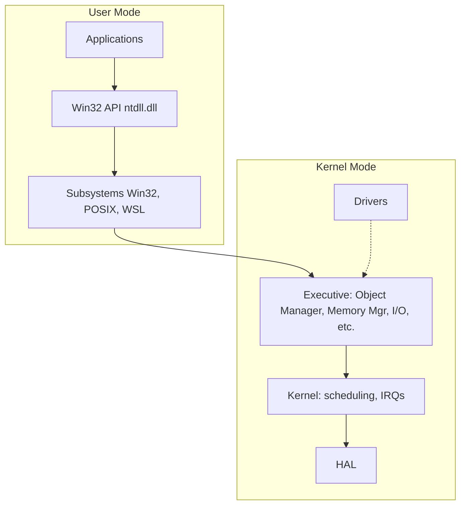
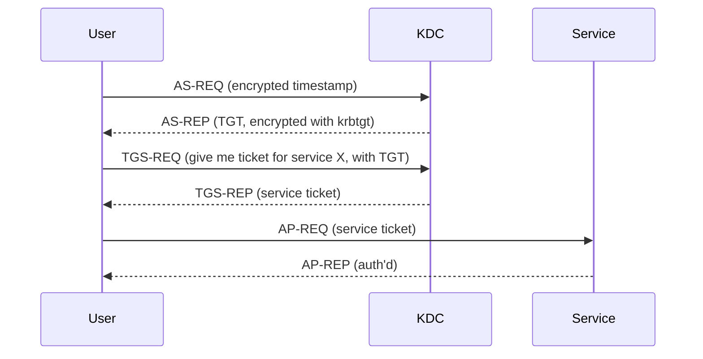
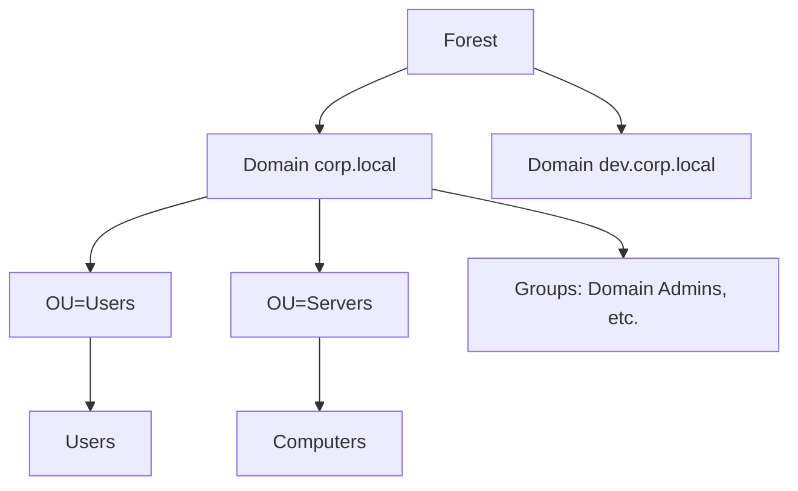

# 🪟 Windows

The OS that dominates corporate environments — and therefore most pentests. Active Directory, NTLM, Kerberos, the registry, and PowerShell are the language of internal red teaming. Master enough Windows to navigate confidently as both attacker and defender.

## 1. NT Architecture (the parts that matter)

Windows runs the **NT kernel** with two main spaces:



For security, you'll touch:

| Concept | Why |
|---------|-----|
| **Process tokens** | Carry user/group identity, privileges. UAC, PsExec, token theft live here. |
| **Sessions** | Session 0 (services), 1+ interactive. Lots of attack lore. |
| **Integrity Levels** | Untrusted → Low → Medium → High → System. UAC prompt = elevation request. |
| **DLLs** | Hijacking, side-loading, search-order abuse |
| **Services** | Long-running processes. Auto-start ≈ persistence. |
| **Scheduled Tasks** | Cron's cousin. Persistence + privesc. |
| **Registry** | Configuration database. Persistence + IOCs. |
| **WMI** | Management plane, scriptable, weaponized constantly |
| **PowerShell** | Microsoft's offensive *and* defensive language |

## 2. The Registry

A hierarchical database with five "hives":

| Hive | What |
|------|------|
| `HKLM` (HKEY_LOCAL_MACHINE) | System-wide config |
| `HKCU` (HKEY_CURRENT_USER) | Per-user config (mapped from HKEY_USERS\<SID>) |
| `HKU` (HKEY_USERS) | All loaded user profiles |
| `HKCR` (HKEY_CLASSES_ROOT) | File associations + COM (a merged view) |
| `HKCC` (HKEY_CURRENT_CONFIG) | Hardware profile |

Backing files (defenders care):

| File | Hive |
|------|------|
| `C:\Windows\System32\config\SYSTEM` | HKLM\SYSTEM |
| `C:\Windows\System32\config\SOFTWARE` | HKLM\SOFTWARE |
| `C:\Windows\System32\config\SAM` | HKLM\SAM (the local password database) |
| `C:\Windows\System32\config\SECURITY` | HKLM\SECURITY |
| `C:\Users\<u>\NTUSER.DAT` | HKCU |

### Persistence keys (greatest hits)

A non-exhaustive list every analyst should recognize:

| Key | What it does |
|-----|--------------|
| `HKCU\Software\Microsoft\Windows\CurrentVersion\Run` | Runs at user login |
| `HKLM\Software\Microsoft\Windows\CurrentVersion\Run` | Runs at any user login |
| `HKLM\Software\Microsoft\Windows NT\CurrentVersion\Winlogon\Userinit` | Loaded at logon |
| `HKLM\System\CurrentControlSet\Services\<svc>\ImagePath` | Service binary |
| `HKLM\Software\Microsoft\Windows NT\CurrentVersion\Image File Execution Options\<exe>\Debugger` | "IFEO" hijack |
| `HKLM\Software\Microsoft\Active Setup\Installed Components\` | Per-user run-once |
| `HKLM\Software\Microsoft\Windows\CurrentVersion\Explorer\Shell Folders` | Folder paths |
| `HKLM\Software\Classes\<extension>\shell\open\command` | File-association abuse |

Phase 5 / DFIR will revisit these as IOCs.

## 3. Authentication on Windows

Two parallel protocols, both still in use:

### NTLM (legacy, everywhere)

Challenge-response. Client proves it knows the password without sending it. Three flavors:

- **LM** — broken (DES-based, 14-char limit). Disable.
- **NTLMv1** — broken cryptographically. Disable.
- **NTLMv2** — current; relays and offline cracks still possible.

A captured `NTLMv2-SSP` hash looks like:

```
alice::CORP:1122334455667788:abc...:bcd...
```

It's not the user's password hash but a **challenge-response derivation** — crackable with hashcat (`-m 5600`).

**Pass-the-Hash (PtH)**: with the user's NT hash, you can authenticate to most NTLM-accepting services without knowing the plaintext password. The NT hash is `MD4(UTF-16LE(password))`.

### Kerberos (preferred, default in AD)



Famous attack techniques (Phase 3 deep dives):

| Technique | MITRE | Idea |
|-----------|-------|------|
| **Kerberoasting** | T1558.003 | Request TGS for SPN, crack offline |
| **AS-REP Roasting** | T1558.004 | Accounts with `DONT_REQ_PREAUTH` |
| **Golden Ticket** | T1558.001 | Forge TGT with stolen `krbtgt` hash |
| **Silver Ticket** | T1558.002 | Forge service ticket with service hash |
| **Diamond / Sapphire ticket** | T1558.005 | Modern variants |
| **Pass-the-Ticket** | T1550.003 | Reuse stolen TGT/TGS |
| **Unconstrained delegation** | T1558.005 | Steal TGTs of users hitting the host |
| **Constrained / RBCD abuse** | T1550.003 | Resource-based delegation tricks |

## 4. Active Directory — The 5-Minute Primer

A central directory that authenticates and authorizes users across an organization.



Concepts to know:

| Term | Meaning |
|------|---------|
| **Forest** | Top of trust hierarchy, shared schema |
| **Domain** | Administrative boundary, own DCs |
| **DC (Domain Controller)** | Server that runs AD DS |
| **Tree** | Contiguous DNS namespace |
| **OU** (Organizational Unit) | Container for objects, GPO target |
| **GPO** (Group Policy Object) | Settings applied to OUs |
| **SID** (Security Identifier) | Unique principal ID, e.g. `S-1-5-21-...-1000` |
| **DN** (Distinguished Name) | LDAP path: `CN=Alice,OU=IT,DC=corp,DC=local` |
| **SPN** (Service Principal Name) | Service identity: `MSSQLSvc/db1.corp.local:1433` |
| **Schema** | Defines object classes & attributes |
| **Trust** | Inter-domain/forest auth relationship |
| **GC** (Global Catalog) | Forest-wide search index (port 3268) |

LDAP queries (`ldapsearch`, PowerShell `Get-ADUser`, BloodHound, ldapdomaindump) drive most enumeration. You'll spend a *lot* of time on AD in Phase 3.

## 5. PowerShell — The Defensive *and* Offensive Language

PowerShell is built into every Windows since 7/2008 R2, scripts are cmdlet-based, output is **objects** (not text), and it has deep .NET access.

### Basics

```powershell
Get-Command           # all commands
Get-Help Get-Process -Examples
Get-Process | Where-Object CPU -gt 100 | Sort-Object CPU -Descending | Select-Object -First 5

# Pipelines pass objects, not text
Get-ChildItem -Recurse |
    Where-Object { $_.Length -gt 10MB } |
    Select-Object FullName, Length |
    Export-Csv -NoTypeInformation big-files.csv

# Run remote
Invoke-Command -ComputerName srv01 -ScriptBlock { Get-Service spooler }
Enter-PSSession -ComputerName srv01            # interactive

# Encode a script as base64 (used by attackers and defenders alike)
$cmd = "Get-Process"
$b   = [Convert]::ToBase64String([Text.Encoding]::Unicode.GetBytes($cmd))
powershell -EncodedCommand $b
```

### Security features (defender side)

| Feature | What it does |
|---------|-------------|
| **Execution Policy** | Soft barrier — `Restricted`, `RemoteSigned`, `Bypass`. **Not a security boundary.** |
| **AMSI** (Antimalware Scan Interface) | Inspects scripts before execution. Common bypass target. |
| **Constrained Language Mode** | Restricts to safe types. WDAC + CLM is strong. |
| **Script Block Logging** (Event ID 4104) | Logs all script blocks. Critical for hunters. |
| **Module Logging** (4103) | Logs cmdlet calls + parameters |
| **Transcript Logging** | Saves session transcripts |
| **JEA** (Just Enough Administration) | Fine-grained constrained endpoints |
| **WDAC / Device Guard** | Code-integrity policies |

A modern Windows host with AMSI + Script Block Logging + WDAC + EDR is hostile to untyped attacker PowerShell. Attackers respond with .NET / C# tooling, BYO interpreters, or Living-off-the-Land Binaries (**LOLBINs**, see <https://lolbas-project.github.io>).

## 6. Built-in Tools — The Windows Equivalents

| Linux | Windows |
|-------|---------|
| `ps` | `Get-Process` / `tasklist` |
| `kill` | `Stop-Process` / `taskkill` |
| `cat` | `Get-Content` / `type` |
| `grep` | `Select-String` / `findstr` |
| `find` | `Get-ChildItem -Recurse` / `dir /s` |
| `top` | `Get-Process | Sort CPU -desc` |
| `df`/`du` | `Get-PSDrive` / `Get-Volume` |
| `mount` | `Get-PSDrive` / `mountvol` |
| `ifconfig`/`ip a` | `Get-NetIPConfiguration` / `ipconfig /all` |
| `netstat` | `Get-NetTCPConnection` / `netstat -ano` |
| `route` | `Get-NetRoute` / `route print` |
| `iptables` | `Get-NetFirewallRule` / `netsh advfirewall` |
| `crontab` | `Get-ScheduledTask` |
| `service` | `Get-Service` / `sc.exe` |
| `useradd` | `New-LocalUser` / `net user` |
| `groupadd` | `New-LocalGroup` / `net localgroup` |
| `chmod` | `icacls` / `Set-Acl` |
| `tar`/`zip` | `Compress-Archive` |
| `whoami` | `whoami` (also `whoami /priv`, `/groups`, `/all`) |
| `uname -a` | `systeminfo` / `Get-ComputerInfo` |
| `dmesg` | `Get-WinEvent -LogName System` |

Skim this until at least the right column is unsurprising.

## 7. Sysinternals — Microsoft's Power Toolkit

Free, official, indispensable. Download <https://learn.microsoft.com/sysinternals/>.

| Tool | Purpose |
|------|---------|
| **Process Explorer** | `top` + `ps` on steroids — verify signers, check handles |
| **Process Monitor** | Real-time file / registry / process / network events |
| **Autoruns** | Every persistence point on the box (Run keys, services, scheduled tasks, drivers, Winlogon, etc.) |
| **TCPView** | Live network connections |
| **PsExec** | Remote shell over SMB |
| **Sysmon** | Verbose event logger — defenders' dream, attackers' fingerprint |
| **Strings** | `strings` for Windows |
| **Sigcheck** | Verify digital signatures |
| **Handle** | List handles per process |
| **AccessChk** | Effective permissions |

If you're hunting on a host, **Autoruns + Process Explorer + Process Monitor + Sysmon** is the high-value pack.

## 8. Windows Event Logs — What Defenders Hunt On

Stored at `C:\Windows\System32\winevt\Logs\` (`.evtx`).

```powershell
Get-WinEvent -LogName Security -MaxEvents 50 |
    Where-Object Id -in 4624,4625,4672,4688,4768,4769

Get-WinEvent -FilterHashtable @{LogName='Security'; Id=4624; StartTime=(Get-Date).AddHours(-1)}
```

### Top Event IDs to memorize

| ID | Log | Meaning |
|----|-----|---------|
| **4624** | Security | Successful logon (LogonType reveals how) |
| **4625** | Security | Failed logon |
| **4672** | Security | Special privileges assigned (admin logon) |
| **4688** | Security | Process created (with command line if enabled) |
| **4697** | Security | Service installed |
| **4720/22/24/26/38** | Security | User account changes |
| **4732/35/56** | Security | Group membership changes |
| **4768** | Security | TGT requested (Kerberos) |
| **4769** | Security | TGS requested |
| **4771** | Security | Kerberos pre-auth failed |
| **4776** | Security | NTLM authentication |
| **4798/4799** | Security | Group enum (membership lookups) |
| **5140** | Security | Network share accessed |
| **5145** | Security | Detailed file share access |
| **7045** | System | Service installed (older path) |
| **4104** | PowerShell/Operational | Script Block Logging |
| **4103** | PowerShell/Operational | Module Logging |
| **1, 3, 7, 8, 11, 13** | Sysmon | Various — **3 = network, 1 = process create** |

#### Logon Types (Event 4624 / 4625 field)

| Type | Meaning |
|------|---------|
| 2 | Interactive (console) |
| 3 | Network (file share, ADMIN$, NTLM auth) |
| 4 | Batch (scheduled task) |
| 5 | Service |
| 7 | Unlock |
| 8 | NetworkCleartext (web auth basic) |
| 9 | NewCredentials (`runas /netonly`) |
| 10 | RemoteInteractive (RDP) |
| 11 | CachedInteractive |

A Type 3 logon followed by Type 10 is the textbook lateral-movement footprint.

## 9. Sysmon

Free Sysinternals driver that publishes far more events than the OS does by default. Configure with a community ruleset (SwiftOnSecurity's, Olaf Hartong's modular config) and ship to a SIEM.

```cmd
sysmon -accepteula -i sysmon-config.xml
sysmon -c sysmon-config.xml      # apply new config
```

Top-value Sysmon events:

| Event ID | Meaning |
|----------|---------|
| 1 | Process create (full command line + hash) |
| 3 | Network connection |
| 7 | Image / DLL loaded |
| 8 | CreateRemoteThread |
| 10 | ProcessAccess (cross-process opens — mimikatz signature) |
| 11 | FileCreate |
| 13 | RegistryValueSet |
| 22 | DNSEvent |

Phase 5 (Defense) builds detections on these.

## 10. Defender, EDR, and the Modern Endpoint

Layered defenses on a modern Windows host:

- **Microsoft Defender Antivirus** (built-in, free)
- **Microsoft Defender for Endpoint (MDE)** — paid EDR
- **Third-party EDRs** — CrowdStrike Falcon, SentinelOne, Carbon Black, Cortex XDR, Sophos, Trend Micro Apex
- **AppLocker / WDAC** — application control
- **Credential Guard** — VBS-isolated LSASS (kills mimikatz on lsass dump)
- **Attack Surface Reduction (ASR) rules** — preventive policies
- **BitLocker** — full-disk encryption
- **Smart App Control / SmartScreen** — reputation-based blocks

Every Phase 3 technique we cover, you should also know **how a modern EDR likely sees it**.

## 11. Hardening Windows (high level)

For when you're the defender:

- **Patch Tuesday + cumulative updates** religiously (use WSUS, Intune, or third-party patching)
- **Disable SMBv1** and **NTLMv1**
- **Require SMB signing** + LDAP signing/channel binding
- **Local Admin Password Solution (LAPS)** for local admins
- **MFA everywhere** (Conditional Access)
- **Reduce privileged accounts**; use Tiered Admin / Privileged Access Workstations (PAW)
- **AppLocker / WDAC** in enforcing mode
- **Enable Credential Guard, Defender, ASR rules**
- **Enable Sysmon + ship logs to SIEM**
- **Disable LLMNR, NetBIOS, mDNS** unless required
- **Block outbound SMB** at the perimeter
- **CIS Benchmarks** for desktop and server

## 12. Quick Privilege Escalation Mental Map (Windows)

Phase 3 has the full chapter; this is your skim list:

| Vector | Quick check |
|--------|-------------|
| **Kernel exploits** | `systeminfo` / `wmic qfe` → diff vs <https://github.com/SecWiki/windows-kernel-exploits> |
| **Service path quoting / weak permissions** | `accesschk -uwcqv "Authenticated Users" *`; `wmic service get name,pathname,startname,startmode` |
| **AlwaysInstallElevated** | `reg query HKCU\Software\Policies\Microsoft\Windows\Installer /v AlwaysInstallElevated` |
| **DLL hijack / search order** | Procmon for "NAME NOT FOUND" + writable path |
| **Scheduled task abuse** | `schtasks /query /fo LIST /v` |
| **Token impersonation** (Juicy/RoguePotato) | `whoami /priv` for `SeImpersonatePrivilege` |
| **Stored credentials** | `cmdkey /list`, DPAPI blobs, `runas /savecred` use |
| **Unattended files** | `c:\Windows\Panther\unattend.xml`, sysprep |
| **Group memberships** | `whoami /groups` — Backup Operators, Server Operators, etc. |
| **Print Spooler abuses** | PrintNightmare CVE-2021-34527 family |
| **PrivExchange / ADCS misconfig** | ESC1–ESC11 paths |

Run `winPEAS.exe` / `winPEASany.exe` and read the output. Same advice as Linux: understand *why* something is flagged.

## Self-Test

1. Difference between NTLMv2 and Kerberos at a high level?
2. What's the format of an NT hash, and how is it produced?
3. Which event ID is "successful logon"? Which logon type means RDP?
4. Why is `SeImpersonatePrivilege` interesting to an attacker?
5. Three persistence locations in the registry.
6. Where does the SAM database file live, and why does it matter to a hunter?
7. What does `whoami /priv` show and how would an attacker use it?
8. What is LAPS and what problem does it solve?

→ Next: [Cryptography](cryptography.md)
