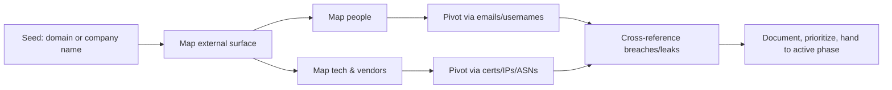

# 🛰️ OSINT — Open-Source Intelligence

> Before a single packet hits the target, a serious operator already knows the company's tech stack, executive team, third-party vendors, leaked credentials, exposed buckets, and which of their employees just bought a house. OSINT is *quiet recon* — and quiet recon is what separates pros from script kiddies.

---

## 1. What OSINT Is (and Isn't)

**OSINT** = intelligence collected from **publicly available sources** — no authentication bypass, no unauthorized access. Sources include:

- Search engines (Google, Bing, DuckDuckGo)
- Social networks (LinkedIn, X, Facebook, GitHub, Reddit)
- Code hosts and package registries (GitHub, GitLab, NPM, PyPI, Docker Hub)
- DNS, WHOIS, BGP, ASN data
- Certificate transparency logs
- Internet-wide scanners (Shodan, Censys, FOFA, ZoomEye, BinaryEdge)
- Government and corporate registries (SEC EDGAR, MCA21 in India, Companies House UK)
- Archive sites (Wayback Machine, Archive.today, Common Crawl)
- Leak databases (HIBP, DeHashed, IntelX)
- Mobile app stores, breach dumps, paste sites

OSINT is **not**:
- Hacking accounts you don't own
- Buying access to closed databases
- Social engineering humans into telling you things (that's HUMINT)
- Logging into a target's services with leaked creds (that's unauthorized access — even if you found the password "publicly")

!!! danger "Lawful but not always ethical"
    OSINT is *legal* in most jurisdictions. That doesn't mean every OSINT action is *ethical*. Stalking individuals, doxing private citizens, or pivoting on collected data without authorization can cross legal lines fast. Stick to your **Rules of Engagement**.

---

## 2. The OSINT Mindset

Three principles that separate amateurs from professionals:

1. **Pivot constantly.** Every artifact (email, domain, username, photo, phone) connects to others. The goal is to map the graph.
2. **Verify, then verify again.** OSINT is full of stale data, planted disinformation, and accidental misattribution. One source ≠ confirmed fact.
3. **Stay invisible.** OSINT only works while the target is unaware. Don't tip them off by visiting their site logged-in, requesting password resets, or scraping at 5,000 RPS from your home IP.

The professional workflow:



---

## 3. Domain & Infrastructure OSINT

Start from a domain and pivot outward.

### 3.1 WHOIS & RDAP

WHOIS gives ownership, registrar, registration dates, and historical records.

```bash
whois example.com                    # classic protocol (port 43)
whois -h whois.iana.org example      # find authoritative server first
curl -s https://rdap.org/domain/example.com | jq .   # modern RDAP/JSON
```

For **historical WHOIS** (privacy proxies hide modern data, but old records often leak admin emails):
- WhoisXMLAPI, SecurityTrails, DomainTools (paid)
- ViewDNS.info (free, limited)

### 3.2 DNS

Every record type tells a story:

| Type | What it reveals |
|---|---|
| `A` / `AAAA` | Hosting IPs (cloud, on-prem, CDN) |
| `MX` | Email provider (Google Workspace, Microsoft 365, Proofpoint) |
| `TXT` | SPF, DMARC, vendor verifications (`google-site-verification`, `atlassian-domain-verification`) |
| `CNAME` | Third-party services (Salesforce, HubSpot, Mailchimp) |
| `NS` | DNS provider (Cloudflare, Route53, Akamai) |
| `SOA` | Admin email, primary nameserver |
| `CAA` | Allowed Certificate Authorities |
| `SRV` | Specific services (XMPP, SIP, Kerberos) |

```bash
dig +short example.com any
dig +short MX example.com
dig +short TXT example.com
dig +noall +answer +multiline example.com any | tee dns_dump.txt
```

**TXT records are gold:** `v=spf1 include:_spf.salesforce.com include:mailgun.org -all` instantly tells you the target uses Salesforce and Mailgun for email.

### 3.3 Certificate Transparency

Every TLS certificate issued by a public CA is logged forever. CT logs are searchable:

- [crt.sh](https://crt.sh/) — best free interface, supports SQL-like queries
- [Censys.io Certificates](https://search.censys.io/certificates)
- [Cert Spotter](https://sslmate.com/certspotter/)

A single search for `%.example.com` often returns hundreds of subdomains the target never advertised:

```bash
curl -s "https://crt.sh/?q=%25.example.com&output=json" \
  | jq -r '.[].name_value' | tr ',' '\n' | sort -u
```

We ship `scripts/recon/ct_subdomain_enum.py` for this — it deduplicates, optionally resolves, and writes JSON.

### 3.4 Subdomain Enumeration

Beyond CT logs, combine **passive** sources for breadth:

| Tool | What it does |
|---|---|
| `subfinder` | Aggregates 30+ passive sources |
| `amass enum -passive` | Slower but exhaustive; great graph output |
| `assetfinder` | Quick + free |
| `findomain` | Multi-source CLI |
| `gau`, `waybackurls` | Pull URLs (with subdomains) from archive.org & Common Crawl |
| `chaos` (ProjectDiscovery) | API to ProjectDiscovery's continuously updated database |

A solid passive pipeline:

```bash
subfinder -d example.com -all -silent > subs.txt
amass enum -passive -d example.com -silent >> subs.txt
echo example.com | gau --subs >> subs.txt
sort -u subs.txt > subs_all.txt
wc -l subs_all.txt
```

Then resolve and probe (this is the boundary into *active* — even DNS lookups touch DNS servers, but they don't touch the target's infra unless they host their own DNS):

```bash
dnsx -l subs_all.txt -a -resp-only | sort -u > resolved.txt
httpx -l subs_all.txt -silent -title -tech-detect -status-code > live.txt
```

### 3.5 Infrastructure pivots: ASN, BGP, IP ranges

Once you have IPs, pivot to **everything else** in the same ASN:

```bash
whois -h whois.cymru.com " -v 1.2.3.4"   # IP → ASN
# Then enumerate the ASN's entire IP space:
whois -h whois.radb.net -- '-i origin AS15169' | grep -E "^route" 
```

[bgp.he.net](https://bgp.he.net/) is great for browsing this visually. **ASN pivots reveal all of a company's IPs**, including dev/staging/test environments they forgot to put behind Cloudflare.

### 3.6 Internet-wide scanners

[**Shodan**](https://www.shodan.io/) and [**Censys**](https://search.censys.io/) continuously scan the entire IPv4 space and index banners. They are arguably the most powerful OSINT tools that exist.

A few high-value Shodan dorks:

```text
org:"Example Corp"                        # all IPs attributed to the org
ssl:"example.com"                         # certs containing the string
hostname:.example.com http.title:"login"  # exposed login pages
port:5985 "Microsoft-HTTPAPI"             # WinRM exposed (very bad)
port:6379 -authentication                 # unauthed Redis
"X-Jenkins" port:8080                     # Jenkins servers
product:"Apache" version:"2.4.49"         # CVE-2021-41773 candidates
```

[Censys's BigQuery datasets](https://docs.censys.com/docs/censys-data-on-google-bigquery) let you scan-the-internet from SQL.

---

## 4. People & Social OSINT

Web app exploitation is great, but **most real intrusions start with phishing one of the company's people**. Mapping the human attack surface is core recon.

### 4.1 Email harvesting

```bash
theHarvester -d example.com -b all      # the OG tool
hunter.io                               # paid, fantastic
phonebook.cz / dehashed                 # leaked & verified emails
```

Then validate without sending email:

```bash
# SMTP VRFY/RCPT can confirm an address (but most servers disable it):
swaks --to user@example.com --server mail.example.com -q RCPT
```

### 4.2 LinkedIn → email format

A target's email pattern (`first.last@`, `flast@`, `firstl@`) plus a list of LinkedIn employees gives you a phishing target list in minutes. Pattern detection tools:

- `linkedin2username` — generates probable usernames from a company's LinkedIn page
- `crosslinked` — same idea, multiple formats

Real-world OPSEC note: **don't view target LinkedIn profiles from a logged-in account that links to your real identity.** Use the "private mode" or a research account.

### 4.3 Username pivoting

People reuse usernames across sites. Tools:

- `sherlock`, `maigret` — username → 350+ social platforms
- `whatsmyname` (web)

A single Reddit / GitHub / Twitter username can map to a full digital footprint.

### 4.4 Breach data

- [Have I Been Pwned](https://haveibeenpwned.com/) — free, ethical, the gold standard
- DeHashed, IntelX, LeakCheck — paid, fuller datasets

These tell you which of the target's employees had passwords leaked. **If those passwords match a current corporate login → game over before you sent a packet.**

!!! warning "Legal line"
    Looking up a company's domain on HIBP is fine. Buying a password-leak database to use those passwords against the target's services is *unauthorized access*, even if the data was free. ROE applies.

---

## 5. Code & Cloud OSINT

The single highest-yield modern OSINT category — companies leak secrets in public code constantly.

### 5.1 GitHub dorking

```text
# in GitHub search
"example.com" password
"example.com" extension:env
"AKIA" "secret" filename:.env  
org:examplecorp filename:credentials
```

Tools that automate it:

- `gitleaks`, `trufflehog` — scan repos/orgs for committed secrets
- `noseyparker` — extremely fast multi-pattern scanner
- `gitrob` — older, still useful for structure

We ship `scripts/recon/github_leak_scanner.py` which queries GitHub's code search API for common secret patterns scoped to a target organization.

### 5.2 Cloud bucket hunting

Public S3 / Azure Blob / GCS buckets are everywhere:

```bash
# brute-force common patterns
for prefix in dev staging prod backup; do
  curl -sI "https://${prefix}-example.s3.amazonaws.com/" | head -1
done
```

Tools: `cloud_enum`, `s3scanner`, `gcpbucketbrute`. CT logs sometimes contain `*.s3.amazonaws.com` certs that reveal bucket names.

### 5.3 Container registries & package leaks

- Docker Hub: `docker search examplecorp`
- GHCR, Quay.io, ECR public
- NPM/PyPI/RubyGems — companies sometimes publish internal packages publicly *by mistake*. Look for `examplecorp-*` packages.

---

## 6. Archive & Historical OSINT

The web doesn't forget. Use archives to find:

- Old versions of pages (deleted admin panels, legacy login forms)
- Old JS bundles with API endpoints / hardcoded URLs
- Old robots.txt with disallowed paths
- Snapshots of error pages that leak stack traces

Sources:

- [Wayback Machine](https://web.archive.org/) — single-URL deep history
- [Archive.today](https://archive.ph/) — sometimes has what Wayback doesn't
- [Common Crawl](https://commoncrawl.org/) — petabyte-scale, queryable from S3
- `gau`, `waybackurls`, `katana -jc` — bulk URL discovery

We ship `scripts/recon/wayback_url_extractor.py` to harvest historic URLs and filter for likely-interesting paths (`/api/`, `/admin/`, `/.git/`, etc.).

---

## 7. India- & US-Specific OSINT Sources

For people aiming at government cybersecurity roles, knowing the *jurisdictional* sources matters.

**United States:**
- [SEC EDGAR](https://www.sec.gov/edgar) — public-company filings, often reveal subsidiaries, vendors, breach disclosures (Item 1.05 of 8-K)
- [USAspending.gov](https://www.usaspending.gov/) — federal contractors and what they do
- [SAM.gov](https://sam.gov/) — federal contracting profiles
- [FCC](https://www.fcc.gov/) for communications licenses
- State business registries (each state has one)

**India:**
- [MCA21](https://www.mca.gov.in/) — every registered company's filings, directors, charges
- [GST portal](https://services.gst.gov.in/services/searchtp) — verify GSTIN, business status
- [DGFT](https://dgft.gov.in/) — import/export codes
- [eCourts](https://ecourts.gov.in/) — case lookups
- [CERT-In Vulnerability Notes](https://www.cert-in.org.in/) — recent disclosed advisories

These give you organizational structure, financial pressure points, regulatory obligations, and breach history — context that helps you understand what a target *cares about* and what assets they're likely to protect (or neglect).

---

## 8. OSINT for Threat Intelligence (Blue-Team Crossover)

OSINT is not just for offense. Defenders use it to:

- Track threat actors (TTP collection from blogs, OTX, MISP feeds)
- Validate suspicious indicators (VirusTotal, AlienVault OTX, AbuseIPDB)
- Monitor brand impersonation (typosquats, fake mobile apps)
- Detect leaked credentials early (HIBP-Enterprise, SpyCloud, dark-web monitoring)
- Find their *own* exposed assets before attackers do (this is "Attack Surface Management")

Frameworks worth learning:

- **MITRE ATT&CK** — actor and TTP catalog
- **Diamond Model** — adversary, capability, infrastructure, victim
- **Pyramid of Pain** — IOC types ranked by attacker cost-to-change

If you're hiring into a SOC or threat-intel team, this is half your job.

---

## 9. Tools Quick Reference

| Category | Tools |
|---|---|
| Domain/DNS | `dig`, `dnsx`, `dnsrecon`, `dnsenum` |
| Subdomains | `subfinder`, `amass`, `assetfinder`, `findomain`, `chaos` |
| URL history | `gau`, `waybackurls`, `katana` |
| Certs | `crt.sh`, `censys`, `tlsx` |
| Internet scan | `shodan`, `censys`, `fofa`, `zoomeye`, `binaryedge` |
| Email/people | `theHarvester`, `hunter.io`, `linkedin2username`, `sherlock`, `maigret` |
| Breach | `HIBP`, `dehashed`, `intelx`, `phonebook.cz` |
| GitHub | `gitleaks`, `trufflehog`, `noseyparker`, `github-search` |
| Cloud | `cloud_enum`, `s3scanner`, `gcpbucketbrute` |
| Frameworks | `recon-ng`, `Maltego`, `SpiderFoot`, `OSINT Framework` |

---

## 10. Hands-On Lab — Map a Target From Scratch

Pick a bug-bounty program (HackerOne, Bugcrowd) **in scope** and do an end-to-end OSINT pass:

1. WHOIS, DNS, MX, TXT, NS records
2. Subdomain enumeration via 3+ passive sources
3. Live-host probing with `httpx`
4. Tech fingerprinting with `whatweb` / `wappalyzer`
5. CT-log dump → diff against subdomain list (you'll find more)
6. Shodan + Censys queries on the org
7. ASN enumeration
8. GitHub org scan with `trufflehog`
9. Wayback URL extraction → grep for interesting paths
10. Compile findings into a **single Markdown report** with timestamps and sources

Time-box it to 4 hours. Repeat on a different target weekly. After 5–10 of these you'll be quicker than 80% of pen-testers.

---

## 11. Interview Questions

You should be able to:

- Explain the difference between passive and active recon and give 3 examples of each.
- Walk through how you'd map a company's external attack surface from a domain name.
- Describe how Certificate Transparency works at a protocol level.
- Explain why Shodan's `org:` operator can reveal more than `hostname:`.
- Detail how a GitHub leak can lead to full cloud takeover (committed AWS key → STS → assumed role → S3 → RDS dump).
- Discuss the legal boundary between OSINT and unauthorized access in your jurisdiction.

---

## 12. Further Reading

- *Open Source Intelligence Techniques*, Michael Bazzell (latest edition; he updates yearly)
- IntelTechniques.com — workflow tools and links
- OSINT Curious Project — community blog and podcast
- [trace-labs.org](https://www.tracelabs.org/) — OSINT for missing-persons CTFs (great practice, and ethical)
- The **OSINT Framework** (osintframework.com) — visual link tree

---

[← Phase 2 Index](index.md) · [Passive & Active Recon →](passive-active-recon.md)
