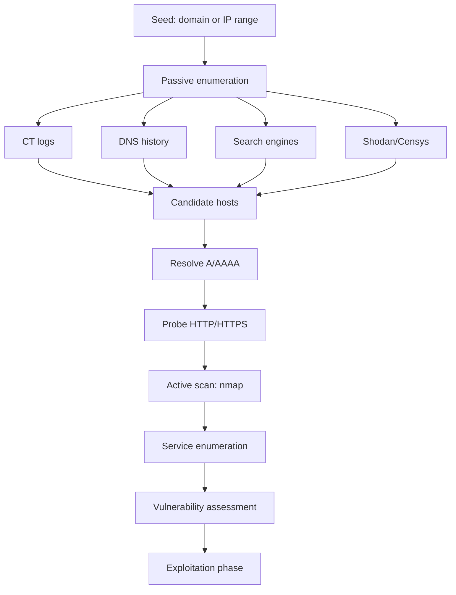

# 🔭 Passive & Active Reconnaissance

> OSINT was about gathering what's already public. Recon is about deliberately probing — first without touching the target (passive), then by sending crafted packets (active). The line is blurry; the *legal* line is **authorization**.

---

## 1. Passive vs Active — A Sharper Definition

| | Passive | Active |
|---|---|---|
| Packets to target? | No (or none they can attribute to you) | Yes |
| Detectable by target? | Not really | Yes (logs, IDS, WAF) |
| Speed | Often slow | Fast |
| Data freshness | Hours–months stale | Real-time |
| Authorization needed? | Practically no, but ROE applies | **Yes** |

A few examples that confuse beginners:

- **Resolving a target's domain** — passive in spirit (you're hitting *DNS*, not the target), but their authoritative DNS server *will* see your query if they self-host DNS.
- **Visiting their public website unauthenticated** — technically active (HTTP request hits their server). Most engagements treat this as fine, but a hyper-paranoid ROE may forbid it before scope is confirmed.
- **Using Shodan's stored banner** — passive. Shodan scanned them, not you.
- **Triggering a Slack-bot password reset email** — *very active*. The target sees an email address attempt and a metadata trail.

When in doubt, default to passive until your engagement letter is signed.

---

## 2. The Recon Pipeline



Each stage **filters** the previous one. You start with thousands of records and end with a prioritized list of 10–20 high-value hosts.

---

## 3. Passive Recon Deep Dive

### 3.1 DNS history & passive DNS

Public **passive DNS** databases store every (domain → IP) mapping ever observed:

- [SecurityTrails](https://securitytrails.com/) — best free tier
- [VirusTotal](https://www.virustotal.com/) — enterprise threat intel; passive DNS in "Relations" tab
- [DNSDB](https://www.farsightsecurity.com/) — paid, gold standard
- [Mnemonic PassiveDNS](https://passivedns.mnemonic.no/)

Passive DNS reveals:
- **Old IPs** (often unprotected; the target moved to Cloudflare but the origin is still reachable)
- **Subdomains never advertised**
- **Hosting-provider switches** (telling you about migrations or vendor relationships)

### 3.2 Cloudflare/WAF bypass via origin discovery

If a target hides behind Cloudflare/Akamai/Fastly:

1. Search CT logs for `*.target.com` — origin certs sometimes leak the real IP via SAN.
2. Search Shodan for `ssl:"target.com"` and exclude the WAF's IP ranges.
3. Search SecurityTrails historical records for the A record before they migrated.
4. Email-server lookups (`dig MX`) — origin mail servers often share infra with web origin.
5. Subdomain takeovers — `dev.target.com` may not be behind Cloudflare even if `www.target.com` is.

This is bread-and-butter for bug bounty and red-teaming.

### 3.3 Search-engine recon ("Google dorking")

Operators that pay rent in OSINT:

```text
site:target.com                                # everything Google has
site:target.com -www                           # subdomains
site:target.com inurl:admin                    # admin paths
site:target.com filetype:pdf                   # documents (often metadata-rich)
site:target.com intitle:"index of"             # directory listings
site:target.com ext:env OR ext:bak OR ext:old  # backups & secrets
site:pastebin.com "target.com"                 # paste leaks
site:github.com "target.com" password
"target.com" "internal use only"
```

The **Google Hacking Database** (GHDB) at exploit-db.com curates thousands more.

We ship `scripts/recon/google_dorker.py` that **generates** dork queries for a target — it doesn't auto-search (search engines rate-limit and require ToS-respecting use), but it produces a copy-paste-ready list categorized by intent.

### 3.4 Wayback & archive recon

```bash
# All historic URLs ever crawled for a domain
curl -s "https://web.archive.org/cdx/search/cdx?url=target.com/*&output=json&fl=original&collapse=urlkey" | jq -r '.[1:][][]' | sort -u

# Just the JS files (often contain API endpoints)
gau --subs target.com | grep '\.js$' | sort -u

# Just URLs with parameters (interesting for IDOR/SQLi)
gau --subs target.com | grep '?'
```

Then `cat js_files.txt | xargs -I {} curl -s {} | grep -E "(api|key|token|secret)"`.

### 3.5 Metadata extraction

Documents on a target's site often contain author names, internal paths, software versions:

```bash
# Download all PDFs and Word docs from a target
wget -r -A pdf,doc,docx,xls,xlsx,ppt,pptx -nd target.com

# Strip metadata
exiftool *.pdf | grep -E "Author|Producer|Creator|Software|Title"

# Or use FOCA / metagoofil for the full pipeline
```

You'll routinely find:
- Internal usernames (matches LinkedIn → email format)
- Internal server names (`\\HQ-FILE01\Shares\...`)
- Office version + patch level → CVE candidates

---

## 4. Active Recon

Once you have authorization, switch on the lights.

### 4.1 Liveness probing

```bash
# ICMP — fastest, but blocked by many firewalls
nmap -sn -PE 10.0.0.0/24

# TCP SYN to common ports — reaches things ICMP misses
nmap -sn -PS22,80,443,3389 10.0.0.0/24

# HTTP probing for web services
httpx -l hosts.txt -ports 80,443,8080,8443 -silent -title -tech-detect -status-code
```

### 4.2 Reverse-DNS sweeps

```bash
for ip in $(seq 1 254); do
  host 10.0.0.$ip 2>/dev/null | grep -v NXDOMAIN
done
```

Often reveals naming conventions: `db-prod-01`, `jenkins.corp.local`, `vpn-gw`, `dc1`.

### 4.3 Virtual-host discovery

Many web servers host multiple sites on one IP. The IP responds with one site for `target.com` and another for `dev.target.com`.

```bash
ffuf -u https://1.2.3.4 -H "Host: FUZZ.target.com" \
     -w subdomains.txt -fc 404 -fs 0
```

We ship `scripts/recon/vhost_finder.py` that automates this with response-size diffing.

### 4.4 Web-content discovery

Once a host serves HTTP, hunt for hidden paths:

```bash
# Directory + file brute-force
ffuf -u https://target.com/FUZZ -w wordlists/dirs.txt -e .php,.bak,.zip,.old \
     -mc 200,204,301,302,307,401,403 -fs 0

# feroxbuster — recursive, respects rate limits
feroxbuster -u https://target.com -w /usr/share/seclists/Discovery/Web-Content/raft-large-words.txt
```

Wordlists matter more than tools. **SecLists** is the standard:

```bash
git clone https://github.com/danielmiessler/SecLists /opt/SecLists
```

We ship `scripts/web/dir_bruter.py` — a polite, rate-limited, smart-404-detecting bruteforcer suitable for engagements that prohibit hammering targets.

### 4.5 Parameter discovery

URLs hide undocumented query parameters. Try every word as a parameter name and watch for response changes:

```bash
arjun -u https://target.com/api/user
ffuf -u "https://target.com/api/user?FUZZ=test" -w params.txt -fs 1234
```

This finds debug flags (`?debug=1`), unfiltered IDs (`?internal_id=1`), and feature toggles.

### 4.6 JavaScript analysis

Modern SPAs ship megabytes of JS to the browser. Inside that JS:
- API endpoints (often *not* documented elsewhere)
- Hardcoded keys / IDs
- Internal URLs (`api-internal.target.com`)
- Client-side authorization checks (which the server often forgets to duplicate)

```bash
# Pull all JS, run linkfinder
katana -u https://target.com -jc -d 5 | grep '\.js$' > js.txt
xargs -I {} python3 LinkFinder.py -i {} -o cli < js.txt > endpoints.txt
```

Tools: `LinkFinder`, `JSScanner`, `getJS`, `subjs`. AI-assisted secret detection is the bleeding edge here — `noseyparker` works on JS bundles too.

---

## 5. Stealth Considerations

If your engagement requires evading detection (red-team-lite, evasive testing):

- **Slow your scans.** `nmap -T2` instead of `-T4`. Spread over hours.
- **Source-IP diversity.** Cloud relays, residential proxies, Tor (legal questions, check ROE).
- **Avoid noisy patterns.** SYN scans of `1-65535` light up every IDS. Pick targeted ports.
- **No User-Agent fingerprints.** Tools like `httpx` and `nuclei` ship default UAs that WAFs flag.
- **Domain fronting & ESNI** — beyond Phase 2, but know the words.

If your engagement is just a vulnerability assessment (no stealth required), **don't waste time on evasion** — hammer it and report.

---

## 6. Detection (Blue-Team View)

If you're defending, here's how recon looks from the SOC:

| Activity | How you spot it |
|---|---|
| DNS recon | Spike in `ANY` / `AXFR` queries on your auth servers |
| Subdomain bruteforce | High-volume NXDOMAIN responses |
| Port scan (SYN) | Many `S` flag packets, no follow-up `ACK`; firewall hit counters spike |
| HTTP path bruteforce | Many `404`s from one source per second |
| Slow scan | Same source, low rate, hitting unusual ports — **slow scans are noisier in the long term** because they live in logs longer |
| Wayback / CT mining | Invisible to you (it's passive) |

Detections to deploy:

- DNS query volume + entropy alerting
- Web-server `404` rate per source IP (Suricata, Falco, custom)
- Honeypot ports (a single open port on `1234` that nobody internal uses → all hits are attackers)
- Authentication telemetry (failed logins by user, by source AS)

We ship `scripts/defense/mini_honeypot.py` (Stage 1) for the honeypot piece.

---

## 7. Hands-On Lab

Pick a bug-bounty target (e.g., HackerOne's `*.uber.com`-style scope). For 4 hours:

1. Enumerate subdomains via 3+ passive sources.
2. Resolve all → `httpx` probe → live hosts list.
3. Pick 5 interesting hosts; do CT-log + Wayback + Shodan deep-dive on each.
4. For 1 host with permission to scan: run `nmap -sV -sC -p- --min-rate 1000`.
5. Pull all JS files; grep for `api`, `key`, `token`.
6. Discover web content with `ffuf` against one in-scope endpoint.
7. Document everything in a Markdown report: hosts, services, interesting paths, observations.

Repeat weekly. After 5 reports you'll have a personal recon playbook.

---

## 8. Interview Questions

- What's the difference between `nmap -sn -PE` and `-sn -PS22`?
- Walk through how you'd find a target's origin IP behind Cloudflare.
- Why does `gau` often return URLs that the target's `robots.txt` would block?
- What's the difference between SecurityTrails passive DNS and `dig`?
- How would you detect, from a SOC, that an attacker is doing subdomain bruteforce against you?
- Why would an attacker prefer a slow scan, and why might it be *more* detectable in a mature SOC?

---

## 9. Tools Quick Reference

| Phase | Tools |
|---|---|
| WHOIS / DNS | `whois`, `dig`, `dnsx`, `dnsrecon`, `dnsenum`, `host` |
| Passive subdomain | `subfinder`, `amass -passive`, `assetfinder`, `chaos`, `findomain` |
| Active subdomain | `amass enum -active`, `dnsx -bruteforce`, `puredns` |
| URL history | `gau`, `waybackurls`, `katana -jc` |
| Liveness | `httpx`, `naabu`, `masscan`, `nmap -sn` |
| Content discovery | `ffuf`, `feroxbuster`, `gobuster`, `dirsearch` |
| Parameters | `arjun`, `param-miner` (Burp), `x8` |
| JS analysis | `LinkFinder`, `subjs`, `getJS`, `katana -jc` |
| Stack fingerprint | `whatweb`, `wappalyzer`, `httpx -tech-detect`, `webanalyze` |

---

## 10. Further Reading

- *The Web Application Hacker's Handbook* — chapter on mapping the application
- HackerOne / Bugcrowd public disclosure reports — read 50, you'll see recon patterns repeat
- ProjectDiscovery's docs — `subfinder`, `httpx`, `nuclei`, `katana`
- *Real-World Bug Hunting*, Peter Yaworski

---

[← OSINT](osint.md) · [Network Scanning →](scanning.md)
