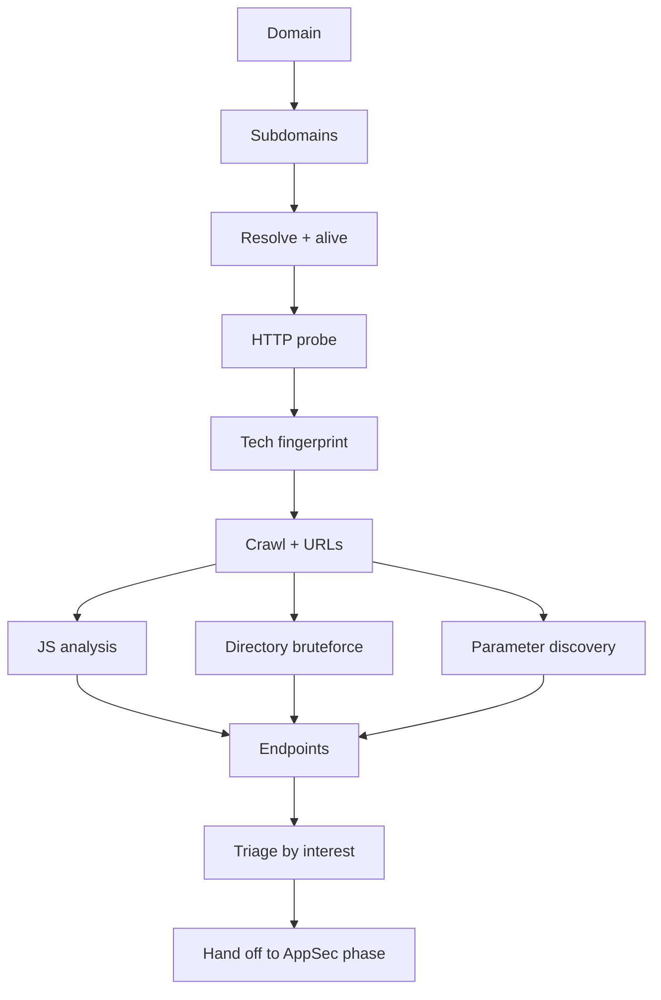
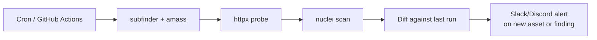

# 🌐 Web Application Recon

> Web is where most modern attack surface lives, and where most modern bug-bounty money is made. Web recon is its own discipline — discovering subdomains, virtual hosts, hidden content, undocumented APIs, and the parts of an application the developers forgot existed.

---

## 1. The Web Recon Pipeline



This is the workflow every senior bug hunter and external pen-tester runs. Tools change every six months; the **shape** of the pipeline doesn't.

---

## 2. Subdomain Enumeration — The Modern Stack

Recap from the OSINT chapter, plus the tactics that go beyond passive sources.

### 2.1 Passive (no traffic to target)

```bash
subfinder -d target.com -all -silent          # 30+ sources
amass enum -passive -d target.com -silent     # broader, slower
echo target.com | gau --subs                  # archive URLs reveal subs
chaos -d target.com -silent                   # ProjectDiscovery DB
findomain --target target.com --quiet
```

### 2.2 Active

```bash
# DNS bruteforce against a wordlist
puredns bruteforce wordlists/subs.txt target.com -r resolvers.txt
dnsx -d target.com -w wordlists/subs.txt -a -silent

# Permutations on existing subs
gotator -sub subs.txt -depth 1 -numbers 5 | puredns resolve --resolvers resolvers.txt
```

`gotator` and `dnsgen` generate permutations like `dev1.target.com → dev2.target.com → dev-api.target.com` — finds the *next* host in a naming series.

### 2.3 Deep DNS history

SecurityTrails, VirusTotal, RiskIQ, BinaryEdge — paid, but a single subscription often pays for itself in one engagement. They show subs that no longer resolve (and may be **takeover-able**).

### 2.4 The combined wordlist

A great wordlist beats fancy tooling. Combine:

```bash
cat /opt/SecLists/Discovery/DNS/subdomains-top1million-110000.txt \
    /opt/SecLists/Discovery/DNS/dns-Jhaddix.txt \
    /opt/SecLists/Discovery/DNS/bitquark-subdomains-top100000.txt \
  | sort -u > big-subs.txt
```

We ship **`scripts/recon/subdomain_enum.py`** — a multi-source orchestrator that wraps `subfinder` + `amass` + CT-log + `gau` and produces a deduplicated, alive-checked, fingerprinted list in one command.

---

## 3. Virtual-Host Discovery

DNS subdomains are one thing; **vhosts that aren't in DNS** are another. Many companies route internal apps via `Host:` header on a single IP.

```bash
# Brute the Host header
ffuf -u https://target.com -H "Host: FUZZ.target.com" \
     -w wordlists/subs.txt -fc 404 -fs 0

# Or against a specific IP
ffuf -u https://1.2.3.4 -H "Host: FUZZ.target.com" \
     -w wordlists/subs.txt -ac
```

`-ac` auto-calibrates against a baseline so the size of generic 404s gets filtered out. Watch for hits with response sizes that differ from the baseline.

We ship **`scripts/recon/vhost_finder.py`** — uses response-body diffing to find hidden vhosts even when the server returns 200 for everything.

---

## 4. Liveness, Tech Fingerprinting, Screenshots

Once you have hostnames, find which are alive and characterize them:

```bash
# Probe everything
httpx -l subs.txt -ports 80,443,8080,8443,8000,8888,3000,5000 \
      -silent -title -tech-detect -status-code -location -ip -cname \
      -json -o probed.json

# Screenshots — visual triage saves hours
httpx -l subs.txt -screenshot -silent -srd screenshots/
gowitness file -f subs.txt --screenshot-path shots/
aquatone -ports xlarge -out aqua/  < subs.txt
```

A 1,000-subdomain wall of screenshots gives you instant intuition: which look like login pages, admin panels, dev dashboards, default Nginx, etc.

We ship **`scripts/recon/tech_fingerprint.py`** — combines headers + favicon hash + body regex matching to identify stacks even when `Server:` is hidden.

### 4.1 Favicon hashes

Favicons are a strong fingerprint. Same favicon across hosts → same product → same vendor → same CVEs.

```python
import mmh3, base64, httpx
# Shodan-compatible favicon hash
def shodan_favhash(url: str) -> int:
    raw = httpx.get(url, follow_redirects=True, timeout=10).content
    encoded = base64.encodebytes(raw)
    return mmh3.hash(encoded)
```

Then on Shodan: `http.favicon.hash:-1234567890` returns every host with the same favicon — possibly thousands of related boxes.

---

## 5. Content Discovery — Finding the Hidden Routes

Web apps ship with paths that aren't linked from anywhere. You have to brute-force them.

### 5.1 Tools

| Tool | Strength |
|---|---|
| `ffuf` | Fastest; flexible filtering; recursion |
| `feroxbuster` | Recursive; pause/resume; modern UX |
| `gobuster` | Stable; many modes (dir/dns/vhost) |
| `dirsearch` | Python; great default wordlists |
| `katana` | Crawler + brute hybrid |
| `kiterunner` | API-route brute via Swagger/OpenAPI/Postman corpora |

### 5.2 Wordlist hierarchy

Don't just throw "common.txt" at everything. Match wordlist to context:

```bash
# Generic web roots
SecLists/Discovery/Web-Content/raft-large-words-lowercase.txt
SecLists/Discovery/Web-Content/big.txt

# By framework
SecLists/Discovery/Web-Content/CMS/wp_plugins.fuzz.txt
SecLists/Discovery/Web-Content/Spring-Boot.fuzz.txt
SecLists/Discovery/Web-Content/django.txt

# API routes
SecLists/Discovery/Web-Content/api/api-endpoints-res.txt
SecLists/Discovery/Web-Content/swagger.txt
```

### 5.3 Smart 404 handling

Naive bruteforce floods false positives because many apps return `200 OK` even for missing routes (SPA routing, etc.). Defenses:

- **`-fs <bytes>`** — filter responses of a given size (the SPA shell).
- **`-fr <regex>`** — filter by content regex.
- **`-ac`** — auto-calibrate a baseline.
- **Hash the body** of `/_random_98712398/` and skip matching responses.

```bash
ffuf -u https://target.com/FUZZ \
     -w big-words.txt \
     -e .php,.bak,.zip,.old,.tar,.tar.gz,.json \
     -ac -mc 200,204,301,302,307,401,403 \
     -fs 1234 -t 50 -p 0.1
```

We ship **`scripts/web/dir_bruter.py`** with smart 404 detection and rate limiting suitable for production engagements where ROE forbids hammering targets.

### 5.4 Recursive

```bash
feroxbuster -u https://target.com -w wordlist.txt -d 3 --extensions php,html,bak
```

Recursion finds `/admin/api/v2/users/`-style nested paths. Cap depth (`-d 2..3`) or you'll never finish.

### 5.5 Specific high-value paths to always check

```text
/.git/HEAD
/.env
/.svn/entries
/.DS_Store
/robots.txt
/sitemap.xml
/security.txt
/.well-known/security.txt
/.well-known/openid-configuration
/swagger.json /swagger-ui/ /openapi.json /api-docs
/server-status
/server-info
/actuator              (Spring Boot)
/actuator/env
/actuator/heapdump
/console               (many frameworks)
/admin /administrator /panel
/wp-config.php.bak     (WordPress)
/.aws/credentials
/.npmrc
/composer.lock
/package.json
/web.config
/phpinfo.php
```

A single `/.git/` directory exposed = full source code download via `git-dumper`. **One of the top 3 highest-yield bug-bounty findings ever.**

---

## 6. Parameter Discovery

URLs hide undocumented query parameters. Discover them by brute force + reflection detection.

```bash
# arjun — heuristic parameter discovery
arjun -u https://target.com/api/user

# x8 — modern Rust replacement
x8 -u https://target.com/api/user -w wordlists/params.txt

# ffuf for raw control
ffuf -u "https://target.com/api/user?FUZZ=1234" \
     -w wordlists/params.txt \
     -mc all -ac \
     -mr 'reflected|1234'
```

Common discoveries:

- **`?debug=1`** → verbose error pages
- **`?internal_id=...`** → IDOR
- **`?redirect=...`** → open redirect → SSRF chain
- **`?xml=...`** → XXE
- **`?file=...`** → LFI
- **`?test=1`** → enables admin features in QA paths left in prod

---

## 7. JavaScript Analysis

SPAs ship the entire client app as JS. Inside that JS:

- All the API endpoints (`/api/v2/admin/users/{id}`)
- Often hardcoded keys (`API_KEY`, `STRIPE_PUB_KEY`)
- Internal URLs left in code (`api-internal.target.com`)
- Client-side authorization checks (the server often forgets to duplicate them — instant privesc)
- Feature flags, role names, internal product names

### 7.1 Pulling JS

```bash
# Crawl the app, extract JS URLs
katana -u https://target.com -jc -d 5 -silent | grep '\.js$' > js-urls.txt

# Or extract from an HTML page
curl -s https://target.com/ | grep -oP 'src="[^"]+\.js"' | sort -u

# Download all JS
mkdir js && wget -P js -i js-urls.txt
```

### 7.2 Analyzing

```bash
# Endpoints
python3 LinkFinder.py -i 'js/*.js' -o cli > endpoints.txt

# Secret detection
trufflehog filesystem ./js
noseyparker scan ./js && noseyparker report

# Manual grep
grep -rE '(api|auth|key|token|secret|admin|internal|private|debug)' js/
```

### 7.3 SourceMaps

If a `.map` file is exposed, you have the original (un-minified) source. Look for `//# sourceMappingURL=` comments at the end of JS bundles.

```bash
# Reconstruct sources from sourcemaps
shuffler https://target.com/static/main.js.map -o reconstructed/
```

This has shipped entire React/Angular codebases to attackers because someone forgot to disable sourcemaps in production builds.

---

## 8. API-Specific Recon

### 8.1 OpenAPI / Swagger discovery

```bash
# Common paths
for p in /swagger.json /openapi.json /api-docs /api/swagger /v2/api-docs /v3/api-docs /swagger-ui/ /docs/; do
  curl -sk -o /dev/null -w "%{http_code} $p\n" https://target.com$p
done
```

When you find one, you have **the entire API surface documented** — every endpoint, parameter, response shape. `kiterunner` consumes Swagger files and brute-forces routes that aren't documented but follow the same pattern.

### 8.2 GraphQL recon

```bash
# Introspection — the API self-documents
curl -X POST https://target.com/graphql \
  -H "Content-Type: application/json" \
  -d '{"query":"{__schema{types{name fields{name}}}}"}'
```

Tools: `graphw00f` (fingerprint), `clairvoyance` (recover schema even when introspection is disabled), `inql` (Burp extension), `graphql-cop`.

### 8.3 GraphQL specifics

- Single endpoint (`/graphql`) handles everything.
- Authorization is *per-field* — easy to forget. IDOR via GraphQL is ubiquitous.
- Aliases & batching enable rate-limit bypass.
- `__schema` introspection disabled? Try error-based recovery (clairvoyance).

We'll cover GraphQL exploitation in Phase 3.

---

## 9. CDN / WAF Detection & Bypass

```bash
wafw00f https://target.com
nmap --script http-waf-detect,http-waf-fingerprint -p 80,443 target.com
```

If a WAF (Cloudflare, AWS WAF, Akamai, Imperva) is in the path, your scanner output will be partial. Bypass tactics:

- **Find origin IP** (see passive-active-recon §3.2).
- **Bypass via case / encoding** — `SeLeCt`, `%53elect`, double URL-encode.
- **Use HTTP/2 or HTTP/3** — many WAFs only inspect HTTP/1.1.
- **Use uncommon HTTP methods** — `PURGE`, `TRACE`, `PATCH`.
- **Smuggling / desync** — Phase 3 territory.

Bypassing a WAF should always be paired with extra care: the WAF blocking you is **defence in depth** — the *application* may have the vuln, but the WAF is keeping it from being trivially exploited. Document carefully.

---

## 10. Continuous Recon (ASM)

For long-running engagements or your own org's external surface, automate everything in §1–§9 to run continuously and diff:



Tools: `OWASP Amass Intel`, `Project Discovery's PDCP`, `Reconmap`, custom GitHub-Actions pipelines. We ship `scripts/automation/recon_orchestrator.py` (Stage 2 too) — chains subfinder → dnsx → httpx → nuclei into one CLI.

---

## 11. Hands-On Lab

Pick a public bug-bounty program (in scope: HackerOne, Bugcrowd, Intigriti). Time-box 6 hours.

1. Subdomain enumeration via 4+ passive sources + 1 active brute.
2. Liveness probe + screenshots → manually browse the visually interesting ones.
3. Tech fingerprint + favicon-hash pivot on Shodan.
4. Content discovery on top 5 hosts with smart 404.
5. JS analysis on the SPA(s) — extract endpoints, search for secrets.
6. Parameter discovery on the most interesting endpoint.
7. API surface discovery (Swagger / GraphQL).
8. WAF detection.
9. Compile a **single Markdown report** with timestamps and screenshots.
10. Compare your report after 1 week of running continuously.

Repeat weekly. After 5–10 of these you'll have built your personal recon pipeline.

---

## 12. Interview Questions

- Walk through how you'd map a target's web attack surface from a single domain.
- What's a virtual host and why might one not appear in DNS?
- What does favicon-hash pivoting do?
- How would you detect a `.git` exposure and what's the impact?
- Why is a WAF often a yellow flag, not a green one?
- How would you build a continuous attack-surface-management pipeline for a 50-domain org?

---

## 13. Tools Quick Reference

| Phase | Tools |
|---|---|
| Passive subs | `subfinder`, `amass -passive`, `assetfinder`, `gau`, `chaos` |
| Active subs | `puredns`, `dnsx`, `gotator`, `dnsgen` |
| Vhosts | `ffuf -H Host:`, `vhostfinder`, `chad` |
| Liveness | `httpx`, `naabu` |
| Tech | `httpx -tech-detect`, `whatweb`, `wappalyzer-cli`, `webanalyze` |
| Screenshots | `gowitness`, `aquatone`, `httpx -screenshot` |
| Content discovery | `ffuf`, `feroxbuster`, `dirsearch`, `gobuster`, `katana` |
| Params | `arjun`, `x8`, `param-miner` (Burp), `ffuf` |
| JS | `LinkFinder`, `subjs`, `getJS`, `katana -jc`, `noseyparker`, `trufflehog` |
| API | `kiterunner`, `swagger-stats`, `graphw00f`, `clairvoyance`, `inql` |
| WAF | `wafw00f`, `whatwaf` |
| Orchestration | `reconftw`, `bug-bounty-recon`, custom |

---

## 14. Further Reading

- Jason Haddix's recon talks (annual updates) — every bug hunter watches these
- Tomnomnom's `gf`, `unfurl`, `meg`, `assetfinder` — toolchain-as-blog-posts
- ProjectDiscovery's blog
- HackerOne / Bugcrowd's public Hacktivity feeds — read 50 reports
- *Real-World Bug Hunting*, Peter Yaworski

---

> Phase 2 ends here. You have the recon and assessment fluency to walk into any engagement with a methodology. **Phase 3** is where you start to break things — beginning with the Web AppSec methodology.

[← Vulnerability Assessment](vulnerability-assessment.md) · [Phase 3: Offensive →](../03-offensive/index.md)
