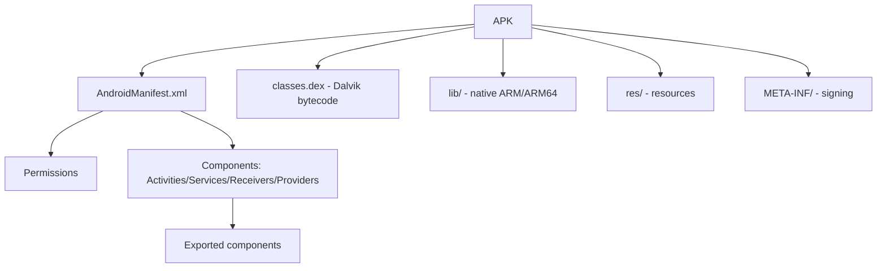

# 📱 Mobile Application Security

> Mobile apps are full clients, not thin shells. They contain business logic, secrets, API endpoints, and often act as their own threat model. This chapter is the introduction to Android and iOS app pen-testing — enough to do useful work and to know where to dig deeper.

---

## 1. Mobile vs Web — What's Different

| | Web | Mobile |
|---|---|---|
| Code reachability | Browser → server only | Full binary on attacker's device |
| Static analysis | JS in browser is the floor | Decompile Dalvik / ARM64; APIs visible |
| Network | Browser enforces TLS / CORS | App must do it; many fail |
| Secrets storage | localStorage, cookies | Keychain / Keystore (often misused) |
| Reverse engineering | Limited (minified JS) | First-class — tools mature |
| Runtime instrumentation | Devtools | Frida, objection (very powerful) |

The biggest delta: **the attacker has the binary**. Anything baked in (API keys, certificates, business logic) is recoverable.

---

## 2. Android — Attack Surface



The **AndroidManifest** is your map. Every component listed there with `android:exported="true"` is reachable from other apps — sometimes from any app on the device.

### 2.1 Pulling the APK

From a phone (rooted or not):

```bash
adb shell pm list packages | grep target
adb shell pm path com.target.app
adb pull /data/app/com.target.app-X/base.apk

# Or from public stores
# - Google Play (use apk extractor app or 3rd-party mirrors like apkpure.com / apkmirror.com)
```

### 2.2 Decoding & Decompiling

```bash
# apktool — manifest, smali, resources (round-trippable; can repack)
apktool d base.apk -o app/

# jadx — Dalvik to Java pseudocode (the standard)
jadx -d out/ base.apk
jadx-gui base.apk          # interactive

# Bytecode-level: baksmali (the hard mode)
baksmali d classes.dex

# Inspect manifest
cat app/AndroidManifest.xml
```

We ship `scripts/mobile/apk_static_analyzer.py` — extracts manifest, decodes permissions, lists exported components, dumps signing certs, scans strings for likely secrets. Single-file, no Android SDK needed.

### 2.3 What to look for in APKs

- **Hardcoded secrets** — API keys, AWS creds, Firebase tokens. `grep -rE 'AKIA|api[_-]?key|secret|token|firebase' out/`
- **Custom URL schemes** — `intent` filters with `android:scheme="myapp"` → potential deep-link injection
- **WebViews** — `setJavaScriptEnabled(true)` + `addJavascriptInterface()` = JS-to-native code execution if attacker controls the URL
- **Insecure storage** — `MODE_WORLD_READABLE`, plaintext SharedPreferences, SQLite databases
- **Network code** — pinning bypasses, custom `TrustManager` that accepts all certs
- **Crypto misuse** — ECB mode, hardcoded IVs, RC4, custom "encryption"
- **Native libraries** — sometimes hold secrets / business logic; reverse with Ghidra

### 2.4 MobSF — automated triage

```bash
docker run -p 8000:8000 opensecurity/mobile-security-framework-mobsf
# upload APK at http://localhost:8000 — get static + dynamic analysis report
```

MobSF auto-runs ~80% of the static checks above. Use it as the first pass; manual deep-dive after.

### 2.5 Dynamic — Frida & objection

Frida injects a JavaScript runtime into the running app, letting you hook any function:

```bash
# Setup (rooted device, jailbroken iOS, or emulator)
frida-ps -U                                # list running processes
frida -U -n com.target.app -l hooks.js     # attach with script
```

Example hook (bypass a root-detection check):

```javascript
Java.perform(() => {
  const RootChecker = Java.use("com.target.app.security.RootChecker");
  RootChecker.isRooted.implementation = function () {
    console.log("[*] root check called — returning false");
    return false;
  };
});
```

**objection** is a CLI built on top of Frida that ships dozens of pre-canned hooks:

```bash
objection -g com.target.app explore
> android sslpinning disable
> android root disable
> android keystore list
> android shell_exec id
```

Together they let you bypass anti-tampering, dump keystore, monitor crypto API calls, replay backend requests with fresh tokens.

### 2.6 Network interception

```bash
# Set up Burp / mitmproxy as system proxy on device
# Then trust the cert as system CA (root needed) or user CA (Android <= 6 only)

# Re-sign APK with attacker-friendly network_security_config that trusts user CAs
apktool d base.apk
# edit res/xml/network_security_config.xml — set <trust-anchors> to <certificates src="user"/>
apktool b -o patched.apk
apksigner sign --ks debug.keystore patched.apk
```

For SSL pinning bypass: Frida + objection's `android sslpinning disable` (or framework-specific scripts on the Frida codeshare). Almost every app's pinning falls to existing public scripts.

### 2.7 Component injection — exported components

If the manifest exports an Activity or Service:

```bash
# Invoke an exported activity from adb
adb shell am start -n com.target.app/.AdminActivity --es payload "<malicious>"

# Send to an exported BroadcastReceiver
adb shell am broadcast -a com.target.app.ACTION -e key value
```

Common bugs: exported activity bypasses login, exported provider exposes the SQLite DB, exported service handles deep-link intents naively → SQLi or path traversal.

---

## 3. iOS — Attack Surface

iOS is more locked down than Android, but jailbroken devices give you Linux-level control.

### 3.1 Pulling the IPA

```bash
# From a jailbroken device with frida + frida-ios-dump
python3 dump.py com.target.app
```

For non-jailbroken: install the app, decrypt with `Clutch` or `bagbak`, or pull a `.ipa` from third-party sources (legal risk).

### 3.2 Decoding & Decompiling

```bash
# IPA is a zip
unzip target.ipa -d target/

# Inside Payload/Target.app/:
#   - Info.plist
#   - Target (Mach-O binary)
#   - embedded.mobileprovision (if dev/enterprise build)

# Class names + method signatures from the binary
class-dump-z Target
class-dump Target

# Decompile
ghidra      # opens Mach-O directly
hopper      # paid, very good for iOS
ida pro     # the gold standard
```

### 3.3 What to look for

- **Info.plist** — `LSApplicationQueriesSchemes`, `NSAppTransportSecurity` (HTTP exceptions are a smell), `URL Schemes`
- **Hardcoded secrets** — same as Android: `strings`, `grep`
- **Keychain misuse** — `kSecAttrAccessibleAlways` instead of `WhenUnlockedThisDeviceOnly`
- **Insecure storage** — plist files in `Documents/`, unencrypted Core Data
- **Custom URL schemes** — universal links can sometimes be hijacked
- **WKWebView** — `evaluateJavaScript` on attacker-controlled content
- **Cert pinning** — bypassed via Frida just like Android

### 3.4 Frida on iOS

Same workflow as Android:

```bash
frida -U -n Target -l hooks.js
```

Bypass biometric / passcode prompts, dump keychain, hook crypto, replay requests.

`objection` works on iOS too:

```bash
objection -g Target explore
> ios keychain dump
> ios sslpinning disable
> ios cookies get
> ios nsuserdefaults get
```

### 3.5 Network on iOS

- Install Burp's CA on device (Settings → Profile → trust)
- Set HTTP proxy in Wi-Fi settings
- For pinning: Frida bypass scripts (most apps fall to objection's default)

---

## 4. The OWASP Mobile Top 10 (2024 edition)

Memorize these categories:

| | Category |
|---|---|
| **M1** | Improper Credential Usage |
| **M2** | Inadequate Supply Chain Security |
| **M3** | Insecure Authentication / Authorization |
| **M4** | Insufficient Input/Output Validation |
| **M5** | Insecure Communication |
| **M6** | Inadequate Privacy Controls |
| **M7** | Insufficient Binary Protections |
| **M8** | Security Misconfiguration |
| **M9** | Insecure Data Storage |
| **M10** | Insufficient Cryptography |

**OWASP MASVS** (Mobile Application Security Verification Standard) and **MASTG** (Testing Guide) are the canonical references. Read them.

---

## 5. Common Bug Classes

### 5.1 Insecure data storage

```java
// Android — NEVER do this
SharedPreferences sp = getSharedPreferences("prefs", MODE_WORLD_READABLE);
sp.edit().putString("auth_token", token).apply();

// On a rooted device:
adb shell run-as com.target.app cat /data/data/com.target.app/shared_prefs/prefs.xml
```

### 5.2 Backend-trust shifted to client

The classic API mistake: client checks "is this user a premium user?" and then calls `/api/premium/data`. The server should re-check on every call. Routinely missed → IDOR.

### 5.3 Custom URL scheme hijack

If two apps register `myapp://` and Android sends the intent to whichever app installed first, an attacker app can hijack OAuth callbacks → token theft.

iOS's Universal Links solve this; many apps don't migrate.

### 5.4 Insecure WebView

```java
WebView wv = new WebView(this);
wv.getSettings().setJavaScriptEnabled(true);
wv.addJavascriptInterface(new ExposedClass(), "Native");
wv.loadUrl(attackerControllableURL);   // -> JS-to-native RCE
```

### 5.5 Crypto failures

- ECB mode
- Static IV
- Rolled-your-own crypto wrapping AES "for extra security"
- Hardcoded keys
- KDF that is just SHA-256 of the password

---

## 6. Hands-On Lab

Vulnerable training apps:

| App | Platform |
|---|---|
| **DIVA** | Android (older, classic) |
| **InsecureBankv2** | Android |
| **Pivaa** | Android |
| **OWASP MSTG Crackmes** | Android + iOS |
| **DVIA-v2** | iOS |

Workflow:
1. Decompile with jadx, read code.
2. Run MobSF on the APK.
3. Set up Burp + bypass pinning with objection.
4. Use Frida to hook root-checks.
5. Find every OWASP Mobile Top 10 in the app.

Estimated time: 2 weeks for Android fluency, 2 more for iOS.

---

## 7. Detection (Blue-Team View)

For app developers / mobile security teams:

- **Anti-tamper / anti-debug** in your own app — frustrate attackers, don't rely on it
- **SSL pinning** with multiple pins (cert + intermediate + backup)
- **Root/jailbreak detection** — but assume it'll be bypassed; design backend not to trust client
- **Server-side enforcement** of all authorization
- **Bug bounty program** for your mobile apps
- **Mobile RASP (Runtime Application Self-Protection)** — Approov, Promon, Guardsquare DexGuard for serious apps

The big shift in mobile security 2024–2026: **server-side validation of attestation**. Apple App Attest / Google Play Integrity API let your server verify a request actually came from a genuine app instance — vastly better than client-side root detection.

---

## 8. Interview Questions

- Walk through static analysis of an APK.
- How does SSL pinning work, and how do you bypass it?
- An app stores a JWT in `SharedPreferences` — how is that bad?
- What's the difference between exported and non-exported Activities?
- Frida's `Java.perform` — what does it do?
- Explain the iOS Keychain protection levels.

---

## 9. Tools Quick Reference

| Tool | Purpose |
|---|---|
| `apktool`, `jadx`, `baksmali` | Android decompilation |
| `class-dump`, `Hopper`, `Ghidra`, `IDA` | iOS decompilation |
| `MobSF` | Automated static + dynamic |
| `Frida`, `objection` | Runtime instrumentation |
| `Burp Suite`, `mitmproxy` | Network interception |
| `apksigner`, `zipalign` | Re-sign modified APKs |
| `frida-ios-dump`, `bagbak` | iOS app decryption |
| `Drozer` | Android security auditing |
| `Magisk` | Android rooting |

---

## 10. Further Reading

- **OWASP MASTG** — the bible (mas.owasp.org)
- *Android Hacker's Handbook*, Drake et al.
- *iOS Hacker's Handbook*, Miller et al.
- Frida codeshare (codeshare.frida.re) — public hook scripts
- Ivan Fratric's iOS research blogs

---

[← Wireless Attacks](wireless.md) · [Network Pivoting →](pivoting.md)
