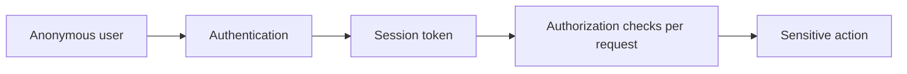
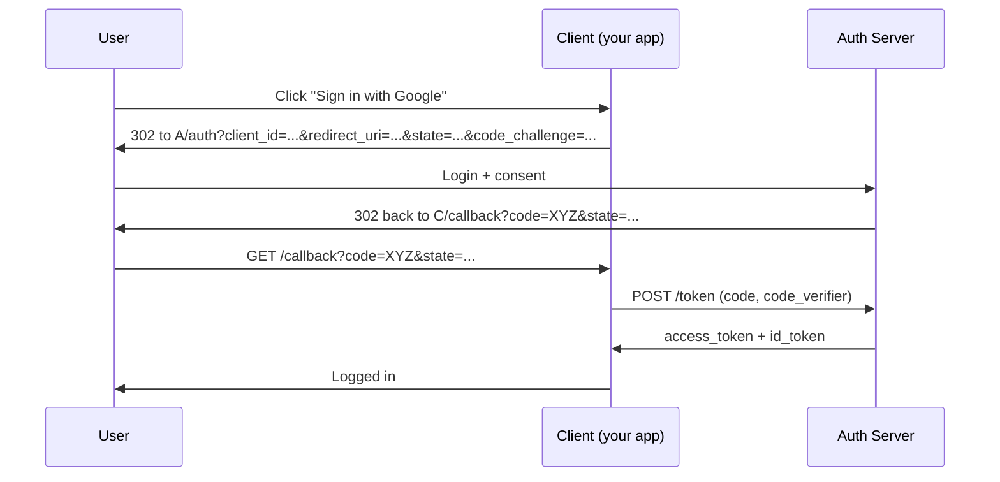

# 🔐 Authentication, Authorization & Session Attacks

> Authentication is "who are you?". Authorization is "what can you do?". Session management is "how do we remember it across requests?". Each of those layers has been broken in spectacular ways. This chapter covers the full taxonomy — login forms, MFA, JWT, OAuth, SAML, and SSO — from both the attack and defense sides.

---

## 1. Why This Chapter Sits Between Web AppSec and System Hacking

Almost every web app has a login. Almost every modern app uses tokens (JWT) or federated auth (OAuth/OIDC, SAML). Authentication issues are the **#7 OWASP category** and consistently among the most-rewarded bug-bounty bugs because they routinely lead to full account takeover.



A break at any link → game over. We'll cover each.

---

## 2. Username Enumeration

Before brute-forcing, attackers want a **valid user list**. Tells:

- **Different responses** for "user not found" vs "wrong password"
- **Timing differences** — server hashes the wrong password fast for unknown users
- **Account-recovery flows** that say "we sent an email to that address" only if it exists
- **Sign-up forms** that say "username taken"
- **OAuth login** flows that bounce back with different errors
- **2FA prompts** that appear only after a valid username is entered

Defenses: identical response (status, body, length, timing) regardless of whether the user exists. Easier said than done — the password-recovery flow especially is hard to make truly indistinguishable.

---

## 3. Brute Force, Credential Stuffing, Password Spray

Three related but distinct attacks:

| Attack | Pattern |
|---|---|
| **Brute force** | One user, many passwords |
| **Credential stuffing** | Many `(user, password)` pairs from past breaches |
| **Password spray** | Many users, *one* common password (e.g., `Spring2026!`) |

Spraying is most effective because it stays under per-user lockout thresholds. With 10,000 LinkedIn-harvested users and `Welcome2026!`, you'll often find 1–3% who used that exact password.

### 3.1 Tools

```bash
# Hydra — multi-protocol brute (HTTP, FTP, SSH, RDP, SMB, MySQL, ...)
hydra -L users.txt -P passwords.txt 10.0.0.5 ssh -t 4 -f

# HTTP form brute
hydra -L users.txt -P passwords.txt 10.0.0.5 http-post-form \
  "/login.php:user=^USER^&pass=^PASS^:F=Invalid"

# Patator — flexible Python alternative
patator http_fuzz url=https://target.com/login \
  body='user=FILE0&pass=FILE1' 0=users.txt 1=passwords.txt -x ignore:fgrep='Invalid'

# nxc / NetExec — for Windows protocols
nxc smb 10.0.0.0/24 -u users.txt -p Spring2026! --continue-on-success
```

### 3.2 Defenses (and how attackers bypass them)

| Defense | Bypass |
|---|---|
| Per-user lockout after 5 failures | Password spray (one password per user) |
| Per-IP rate limit | IP rotation: cloud relays, residential proxies, Tor |
| CAPTCHA | Anti-CAPTCHA services, headless browser farms |
| MFA | SIM-swap, push-bombing, OAuth-token theft, MFA-fatigue prompts |
| Geo-velocity ("impossible travel") | VPN endpoints near the user's known IP |

Defense in depth: rate limit + lockout + 2FA + behavior analytics + login alerts to user.

---

## 4. MFA Bypass Techniques

MFA isn't infallible. Common weaknesses:

- **SMS interception / SIM swap.** Bedrock of high-value attacks.
- **Push-bombing / MFA fatigue.** Spam push prompts; victim eventually taps Approve.
- **Stale recovery codes** that don't get rotated when 2FA is reset.
- **2FA bypass via "trusted device" cookie** that never expires.
- **OAuth/OIDC `response_type=code` flows** that expose tokens directly to the browser, bypassing 2FA after initial login.
- **Race conditions** — submit OTP and password before the OTP is validated as used.
- **API endpoints that enforce 2FA on the UI but not on the API** (very common).
- **Backup-code endpoint** that doesn't rate-limit.

Methodology: after auth, look for any endpoint that *does* something sensitive (change email, add SSH key, delete account) and try it **without** completing MFA. If it works, you have an MFA bypass.

---

## 5. Session Management

A session token is a bearer credential — anyone with it is "you". Test:

- **Storage.** `HttpOnly`? `Secure`? `SameSite`?
- **Predictability.** Sequential? Time-based? Use Burp Sequencer to sample 1,000 tokens.
- **Fixation.** Does the server accept a token *you* sent? After login, does it generate a new one?
- **Invalidation.** Logout → does the old token still work? Password change → do all sessions invalidate?
- **Concurrency.** Two browsers logged in to one account — does it allow that? Should it?
- **Cross-site.** `SameSite=None`? Allows CSRF.
- **Shared between subdomains.** `Domain=.target.com`? A subdomain XSS now reads main-domain cookies.

A common bug: server generates a session token, you log in, server *keeps the same token*. An attacker who got that token via XSS earlier still has access.

---

## 6. JWT (JSON Web Tokens)

JWTs are *the* modern bearer token. Three base64url-encoded parts: `header.payload.signature`.

```text
eyJhbGciOiJIUzI1NiIsInR5cCI6IkpXVCJ9.eyJ1c2VyIjoiYWxpY2UiLCJpYXQiOjE3MTQwMDB9.SflKxw...
```

The header declares the algorithm (`alg`), the payload contains claims, the signature proves it wasn't tampered with — *if* the server checks it correctly.

### 6.1 Classic JWT bugs

**1. `alg: none`.** RFC 7519 specifies `none` as a valid algorithm — meaning no signature. Many libraries accepted JWTs with `alg: none` if not configured to reject it.

```python
# Forge an admin token
import base64, json
header = base64.urlsafe_b64encode(json.dumps({"alg":"none","typ":"JWT"}).encode()).rstrip(b"=")
payload = base64.urlsafe_b64encode(json.dumps({"user":"admin","role":"admin"}).encode()).rstrip(b"=")
token = f"{header.decode()}.{payload.decode()}."
```

**2. Weak HMAC secret.** `HS256` uses a shared secret. If that secret is `secret`, `password`, or any common word — game over.

```bash
# john / hashcat can brute it
hashcat -a 0 -m 16500 token.txt rockyou.txt
```

**3. Algorithm confusion (RS256 → HS256).** If the server's `verify` function trusts the `alg` header, an attacker can take an `RS256` (asymmetric, public key known) token and submit it as `HS256` using the public key as the HMAC secret. Server hashes-with-pubkey, and it matches.

**4. `kid` (Key ID) injection.** Some libraries fetch the verification key based on the token's `kid` claim. SQL injection or path traversal in `kid` → swap the key for one you control.

```text
{"alg":"HS256","kid":"../../../../dev/null","typ":"JWT"}
```

If the server reads `/dev/null` (empty) and uses it as the HMAC key, signing with empty key → valid token.

**5. JWK header injection.** Some libraries trust an embedded `jwk` header. Embed *your own* JWK; sign with the matching private key; the server uses your public key to verify.

**6. Missing `exp` validation.** Tokens that never expire = stolen tokens that work forever.

### 6.2 Tools

```bash
# jwt_tool — automated check for all the above
python3 jwt_tool.py "$TOKEN" -M pb     # playbook scan
python3 jwt_tool.py "$TOKEN" -X a      # alg:none
python3 jwt_tool.py "$TOKEN" -X k      # kid manipulation
python3 jwt_tool.py "$TOKEN" -C -d wordlist.txt   # crack HS secret

# Burp extension: JWT Editor
```

We ship `scripts/web/jwt_attack.py` — a single-file checker that flags `alg:none`, brute-forces weak HMAC secrets, detects missing `exp`, sensitive claims, and algorithm-confusion candidates. Educational; only operates on tokens you provide. (Stage 1 also shipped `jwt_analyzer.py` which is the read-only audit cousin.)

### 6.3 Defenses

- **Pin allowed algorithms** server-side (e.g., `HS256` *only*; or `RS256` *only*); never trust `alg`.
- **Strong shared secret** (32+ random bytes) for HMAC.
- **Short-lived access tokens** (5–15 min) + refresh tokens stored differently.
- **Reject `alg:none`** unconditionally.
- **Validate `iss`, `aud`, `exp`, `nbf`** every request.
- For high-value flows, use **opaque session tokens** (random IDs server-side mapped to state) instead of JWTs. JWTs are great for federation, often overused for sessions.

---

## 7. OAuth 2.0 & OpenID Connect

The de facto standard for "Sign in with Google/Microsoft/GitHub". Several flows; modern apps use **Authorization Code + PKCE**.



### 7.1 Common bugs

**1. Open redirect on `redirect_uri`.** Attacker registers a malicious app with `redirect_uri=https://target.com/legit-callback`, but if the auth server matches `redirect_uri` by prefix, attacker can redirect to `https://target.com.evil.com/`.

**2. `state` parameter missing or unverified.** Without `state`, the callback is CSRF-able — attacker pastes their own `code` into the victim's session.

**3. PKCE missing.** Without PKCE, an attacker who steals the code (via referer leak, log file, or proxy) can exchange it for tokens.

**4. Implicit flow (`response_type=token`).** Returns the access token in the URL fragment. Logged in browser history. Deprecated; some apps still support it.

**5. Account takeover via OAuth provider misconfiguration.** App auto-links accounts by email — attacker creates an unverified Google account with target's email and signs in.

**6. Weak `client_secret` storage.** SPAs sometimes ship the client secret in JS. Anyone can impersonate the app.

### 7.2 SSRF + OAuth = bad day

Internal-facing OAuth providers (Okta, Azure AD) can be abused via SSRF — the SSRF target's `redirect_uri` becomes the attacker's exfiltration channel for tokens.

### 7.3 Tools / methodology

- Burp Pro (the OAuth Scanner extension or manual flow inspection)
- `oauth-rce` — niche but useful
- Read RFC 6749 once; the next time you see an OAuth flow it'll all click.

---

## 8. SAML

XML-based federated auth, common in enterprise SSO. Older than OIDC but still ubiquitous.

```xml
<saml:Assertion>
  <saml:Subject><saml:NameID>alice@corp.com</saml:NameID></saml:Subject>
  <ds:Signature>...</ds:Signature>
</saml:Assertion>
```

The signature proves the IdP issued the assertion. Bugs:

**1. XML Signature Wrapping (XSW).** Multiple `<Assertion>` blocks: signature covers the legitimate one, parser uses the unsigned attacker-controlled one.

**2. Unsigned assertion accepted.** Some SP libraries verify the signature only if present.

**3. XXE in SAML response.** Attacker assertion contains XXE → SP fetches attacker URLs, file disclosure, SSRF.

**4. XML comment in NameID.** `<NameID>admin<!-- -->@corp.com</NameID>` — some parsers strip the comment, identifying the user as `admin@corp.com`.

**5. Replay.** No `NotOnOrAfter` validation, no nonce → reuse old assertion.

Tools: SAML Raider (Burp extension), `samlee`, manual XML editing with replay.

---

## 9. Hands-On Lab

PortSwigger Web Security Academy:

- **Authentication** labs (~15)
- **JWT** labs (~10)
- **OAuth** labs (~8)
- **SAML** — covered in their identity-management section

DVWA + Juice Shop also have brute-force, JWT, and login bypass challenges.

For OSCP-style: HackTheBox boxes that involve auth bypass (JWT, GraphQL auth bypass) are excellent practice.

---

## 10. Detection (Blue-Team View)

| Attack | Signal | Tooling |
|---|---|---|
| Brute force / spraying | High failure rate; unusual user-count per source IP | SIEM correlation, `auth.log` analysis |
| Credential stuffing | Many distinct usernames, low-volume per user, bot-like UA | Behavioral analytics; bot mitigation (Akamai BotManager, Cloudflare) |
| MFA push-bombing | Many MFA prompts in short window | Identity provider dashboards; Duo logs |
| JWT abuse | `alg:none` tokens, unusual `kid`, malformed JWTs | App-layer logging |
| OAuth abuse | Repeated `state` mismatches, unusual `redirect_uri` | App-layer logging |
| Session hijack | Same session ID from two distinct IPs/UAs | Custom rule on session store |

We ship `scripts/defense/failed_ssh_analyzer.py` (Stage 1) for SSH-specific brute-force triage. Web brute-force needs application-layer logging — most companies don't have this and pay for it later.

---

## 11. Interview Questions

- Difference between brute force, credential stuffing, and password spraying — when does each apply?
- How does `alg:none` work? Why is the fix more subtle than "reject `none`"?
- Walk through OAuth Authorization Code + PKCE.
- What is XML Signature Wrapping?
- How would you detect MFA push-bombing from a SOC view?
- Why are JWTs often the wrong choice for sessions?
- How does an attacker with stolen JWT *and* shared secret stay undetected?

---

## 12. Tools Quick Reference

| Topic | Tools |
|---|---|
| Brute force | `hydra`, `patator`, `medusa`, `nxc`, Burp Intruder |
| JWT | `jwt_tool`, Burp JWT Editor, our `jwt_attack.py` & `jwt_analyzer.py` |
| OAuth | Burp Pro, manual flow inspection |
| SAML | SAML Raider, `samlee` |
| Session analysis | Burp Sequencer |
| Password cracking | `hashcat`, `john` |

---

## 13. Further Reading

- PortSwigger Web Security Academy — Authentication, JWT, OAuth, SAML topics
- Auth0 / Okta blogs (vendor but technically excellent)
- "OAuth 2.0 Threat Model and Security Considerations" (RFC 6819)
- *Identity Attack Vectors*, Morey Haber

---

[← XSS, CSRF & SSRF](web-xss-csrf-ssrf.md) · [Linux Privilege Escalation →](linux-privesc.md)
