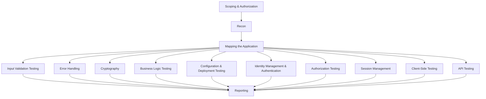

# 🕸️ Web Application Security — Methodology & OWASP Top 10

> The OWASP Top 10 is the *industry's* shorthand for "what most often goes wrong." This chapter is the methodology — how to test a web app systematically — plus a tour of the Top 10 with the canonical example of each. The chapters that follow zoom into the heaviest hitters.

---

## 1. The Web App Pen-Test Methodology

A reliable web app pen-test follows roughly these stages, in order:



This is the structure of the **OWASP Web Security Testing Guide (WSTG)** — the most thorough free reference that exists. Every senior web pen-tester has the WSTG mental map.

### 1.1 What "mapping the application" means

For every page/endpoint you discover:

- HTTP method and full URL.
- Required parameters (and their types).
- Authentication state required.
- Server-side technology guesses.
- Notable response patterns (redirects, error pages, content types).

You're producing a **site map** that becomes the input to all later testing. Burp's site-map auto-builds as you browse.

---

## 2. Tools — The Web Pen-Tester's Loadout

| Category | Tools |
|---|---|
| **Intercepting proxy** | **Burp Suite Pro** (gold standard), Burp Community (free), OWASP ZAP, Caido (modern Burp competitor) |
| **DAST** | Burp Pro Scanner, Nuclei, ZAP, Acunetix, AppScan |
| **Fuzzing** | ffuf, feroxbuster, wfuzz, Burp Intruder, Turbo Intruder |
| **API** | Postman, Hoppscotch, Burp + Param Miner, kiterunner |
| **JS analysis** | Burp + JS Miner, LinkFinder, retire.js |
| **SQLi** | sqlmap, Burp + extensions |
| **XSS** | dalfox, XSStrike, Burp Pro |
| **SSRF** | Burp Collaborator, ngrok, interact.sh |
| **Browser** | Firefox + dev tools (best for testing), Chrome + Burp |
| **CLI** | curl, httpie, http (httpx CLI), websocat |

**Burp Pro is worth every dollar.** If your employer doesn't provide it, ask. The Pro scanner alone catches things Community can't reach.

---

## 3. Configuring Burp From Scratch

### 3.1 Install + cert

```bash
# Install Burp (Community is free)
# Configure browser proxy: 127.0.0.1:8080
# Visit http://burp/ → "CA Certificate" → install in browser as trusted CA
```

For Firefox, use a separate Firefox profile (`firefox -P research`) so day-to-day browsing isn't proxied.

### 3.2 Project settings worth changing immediately

- **Target → Scope** — define in-scope hosts so out-of-scope traffic doesn't pollute history.
- **Intercept** — turn off until you need it (otherwise you'll drown in modal dialogs).
- **Proxy → Match-and-replace** — handy for stripping rate-limit headers or adding auth.
- **Filter the Proxy History** to "in-scope only".

### 3.3 Essential extensions (BApp Store)

- **Logger++** — searchable detailed log of every request
- **Param Miner** — finds hidden parameters and headers
- **JS Miner** / **JS Link Finder** — JS endpoint extraction
- **Backslash Powered Scanner** — clever active scanner extension
- **Turbo Intruder** — extreme-rate fuzzer (millions of requests)
- **Active Scan++** — adds checks to the built-in scanner
- **Authorize** — automated authorization testing
- **Hackvertor** — encoding/decoding plus crypto
- **GraphQL Raider** — GraphQL helpers

### 3.4 Workflow

The Burp tabs in the order you'll touch them:

1. **Proxy → HTTP history** — every request you've made.
2. **Target → Site map** — the application tree.
3. **Repeater** — modify and replay one request at a time. Most of your time lives here.
4. **Intruder** — automated parameter fuzzing.
5. **Decoder / Comparer / Sequencer** — utilities.
6. **Scanner** (Pro only) — automated DAST.
7. **Collaborator** (Pro) — out-of-band detection (DNS/HTTP callbacks).

---

## 4. The OWASP Top 10 (2021 edition, current as of 2026)

Each item is the *category* of weakness, not a single vuln. Real apps usually have multiple.

| | Category | What it covers |
|---|---|---|
| **A01** | Broken Access Control | IDOR, missing function-level checks, privilege escalation |
| **A02** | Cryptographic Failures | Weak/no encryption, leaked secrets, bad TLS, weak hashes |
| **A03** | Injection | SQLi, NoSQLi, OS command, LDAP, XPath, ORM injection |
| **A04** | Insecure Design | Missing controls baked into architecture |
| **A05** | Security Misconfiguration | Default creds, debug pages, verbose errors, S3 buckets |
| **A06** | Vulnerable & Outdated Components | Old libraries, unpatched frameworks |
| **A07** | Identification & Authentication Failures | Weak passwords, session fixation, weak MFA, JWT errors |
| **A08** | Software & Data Integrity Failures | Insecure deserialization, unsigned updates, supply chain |
| **A09** | Security Logging & Monitoring Failures | No logs, no alerts, attackers undetected |
| **A10** | Server-Side Request Forgery (SSRF) | Server fetches attacker-controlled URLs |

The 2025/2026 OWASP draft is in flight and adds AI/LLM-related categories; we'll cover those in Phase 4 (Specializations).

---

## 5. A01 — Broken Access Control

**The #1 vulnerability category since OWASP started measuring.**

Two flavors:

### 5.1 IDOR (Insecure Direct Object Reference)

```http
GET /api/orders/12345 HTTP/1.1
Cookie: session=alice...
```

If `12346` returns Bob's order, that's IDOR. Test by:

- Changing IDs in the URL or body.
- Using two accounts side by side.
- Looking for sequential IDs vs UUIDs (sequential is easier; UUIDs aren't safe either if they're predictable).

### 5.2 Missing function-level access control

```http
GET /admin/users HTTP/1.1
Cookie: session=alice    # alice is a normal user
```

If `/admin/users` returns data because the dev "hid" it from the menu but didn't check on the server, that's missing function-level checks.

**Burp's "Authorize" extension** automates this: log in as a low-priv user, replay the high-priv user's requests, watch which ones still succeed.

We'll dedicate the next chapter on **authentication & authorization** to this.

---

## 6. A02 — Cryptographic Failures (was "Sensitive Data Exposure")

Things you'll find:

- HTTP (no TLS) for login or sensitive forms
- TLS with weak ciphers / outdated versions
- Passwords stored as MD5 / SHA-1 / SHA-256 (no salt, no KDF)
- Hardcoded secrets in JavaScript / mobile apps
- Encryption with ECB mode, predictable IVs, or static keys
- Self-signed or expired certs in prod

Tools:

```bash
testssl.sh https://target.com           # full TLS audit
sslyze --regular target.com             # alternative
nmap --script ssl-enum-ciphers -p 443 target.com
```

The cryptography chapter (Phase 1) covered the math. Here, the focus is **finding** misuse — pair with §5 of that chapter (TLS attacks).

---

## 7. A03 — Injection

Still in the top 3 forever. Categories:

| Type | Example payload | Where |
|---|---|---|
| **SQL injection** | `' OR 1=1--` | Login forms, search, IDs |
| **NoSQL injection** | `{"$gt": ""}` | MongoDB params |
| **OS command injection** | `; cat /etc/passwd` | Anything that calls system commands |
| **LDAP injection** | `*)(uid=*))(\|(uid=*` | Directory lookups |
| **XPath injection** | `' or '1'='1` | XML-backed apps |
| **Header injection / CRLF** | `\r\nSet-Cookie: ...` | Redirect URLs, logging |
| **SSTI (Server-side template injection)** | `{{7*7}}`, `${7*7}` | Email templates, error pages |
| **HQL/JPQL** | similar to SQLi | Java apps |
| **GraphQL** | aliases, batched ops | GraphQL endpoints |

Each gets its own chapter. **Injection** is next.

---

## 8. A04 — Insecure Design

Architectural weaknesses you can't fix with input validation.

Examples:
- Password reset flow that leaks whether an email is registered.
- Money transfer with no second-factor on large amounts.
- "Forgot password" → security question that's discoverable on LinkedIn.
- Account enumeration via timing differences.

Found by **threat modeling** the application, not by scanning. It's the most overlooked category — and the most devastating when missed.

---

## 9. A05 — Security Misconfiguration

The catch-all. Common findings:

- Default admin/admin credentials
- Debug endpoints in production (`/debug`, `/console`, `/_profiler`)
- Stack traces in error pages
- Directory listing enabled
- CORS configured as `Access-Control-Allow-Origin: *` with credentials
- `X-Frame-Options` missing → clickjacking
- Public S3/Azure/GCS buckets
- Open `.git`, `.svn`, `.env`
- Spring Actuator endpoints exposed
- CI servers (Jenkins, GitLab) exposed

Most automated scanners (Nuclei, Burp Pro) catch these. **Always run Nuclei first** — it'll find the easy stuff in 60 seconds.

---

## 10. A06 — Vulnerable & Outdated Components

Same idea as Phase 2 §6 (SCA). For web apps specifically:

- jQuery < 3.5 (XSS in DOM manipulation)
- WordPress + plugins (huge attack surface)
- Old Apache Struts (CVE-2017-5638 — Equifax breach)
- Old Spring Framework (Spring4Shell, CVE-2022-22965)
- Log4j (CVE-2021-44228)
- ImageMagick (ghostscript exploits)
- jQuery-File-Upload, ckeditor, tinymce — historical CVE machines

Tools: `retire.js`, `nuclei -t cves/`, `wpscan`, `joomscan`, `droopescan`.

---

## 11. A07 — Identification & Authentication Failures

The chapter after this one. Covers:
- Brute-force / credential-stuffing weaknesses
- Weak password policies
- Broken MFA (SMS bypass, recovery flow flaws)
- Session fixation & insecure session IDs
- JWT vulnerabilities (`alg: none`, weak HS256, key confusion, kid injection)
- OAuth 2.0 / OIDC misconfigurations (open redirect, state mismatch, PKCE bypass)
- SAML XML attacks (XXE, signature wrapping)

---

## 12. A08 — Software & Data Integrity Failures

- **Insecure deserialization** — Java `readObject`, Python `pickle`, PHP `unserialize`, .NET `BinaryFormatter`. Often → RCE.
- **Unsigned updates** — auto-updaters fetching code over HTTP.
- **Supply chain** — typosquats on PyPI/NPM, compromised CI runners, dependency confusion.

We'll cover deserialization in Phase 3's advanced chapter.

---

## 13. A09 — Security Logging & Monitoring Failures

Easy to overlook in a pen-test. Indicators:

- No `429 Too Many Requests` after 1,000 failed logins.
- No alerts on impossible travel.
- No log of who downloaded which file.
- Logs that include passwords or session tokens (also an A02 failure).
- Logs world-readable on the filesystem.

Report this in your pen-test even if you can't exploit it — it's a finding because it makes the *next* breach worse.

---

## 14. A10 — Server-Side Request Forgery (SSRF)

The server fetches a URL the attacker provides. Examples:

```http
POST /preview HTTP/1.1
url=http://169.254.169.254/latest/meta-data/iam/security-credentials/  # AWS metadata
url=file:///etc/passwd
url=gopher://internal-redis:6379/_*1%0d%0a$8%0d%0aFLUSHALL%0d%0a
```

In cloud environments, SSRF + IMDSv1 = full credential theft = full account takeover. This is so common it earned its own Top 10 category.

We'll cover SSRF in depth in the **CSRF & SSRF** chapter.

---

## 15. The Web Pen-Test Workflow in 90 Minutes

A senior tester landing on a fresh target runs roughly this in the first 90 minutes:

1. **0–5 min** — Browse the app like a normal user. Sign up, log in, click around.
2. **5–10 min** — Run Nuclei against the host, scoped templates only.
3. **10–20 min** — `feroxbuster` for content discovery; review findings.
4. **20–30 min** — Burp Pro Scanner crawl + audit.
5. **30–40 min** — Manually test login (account enumeration, brute throttle, MFA bypass).
6. **40–60 min** — Triage IDOR on every endpoint with an ID parameter.
7. **60–75 min** — Inject SQLi/SSTI/XSS/CMD injection markers in every parameter.
8. **75–90 min** — Look at JavaScript for endpoints + secrets.

After 90 minutes you have a strong baseline. The next days deepen and refine.

---

## 16. Hands-On Lab — DVWA + Juice Shop

Set up:

```bash
docker run -d -p 80:80 vulnerables/web-dvwa
docker run -d -p 3000:3000 bkimminich/juice-shop
```

DVWA = guided OWASP Top 10 walk-through (recommended first). Juice Shop = realistic SPA with 100+ challenges (recommended after DVWA).

Workflow per challenge:

1. Read the challenge description.
2. Try to exploit it manually.
3. If stuck, read the hint.
4. Look at the **server-side source** (DVWA shows it!) to understand why it worked.
5. Repeat.

Spend 4 weeks on these. After Juice Shop's hard challenges you're ready for HackTheBox web boxes.

---

## 17. Interview Questions

- Walk me through your web app pen-test methodology end to end.
- What's the difference between IDOR and missing function-level access control?
- How do you set up Burp from scratch?
- Tell me about A04 — Insecure Design — and give an example.
- What's the difference between SSRF and CSRF?
- How would you find Spring Actuator endpoints exposed on a target?
- A scanner returns 200 findings; how do you prioritize?

---

## 18. Further Reading

- **OWASP Web Security Testing Guide (WSTG)** — owasp.org/www-project-web-security-testing-guide
- **OWASP Cheat Sheet Series** — fast reference per topic
- *The Web Application Hacker's Handbook* (still the standard, despite age)
- *Real-World Bug Hunting*, Peter Yaworski
- PortSwigger's **Web Security Academy** — free, world-class labs
- HackerOne's "Hacker101" video course
- Bug-bounty disclosed reports on hackerone.com/hacktivity

---

[← Phase 3 Index](index.md) · [Injection Attacks →](web-injection.md)
