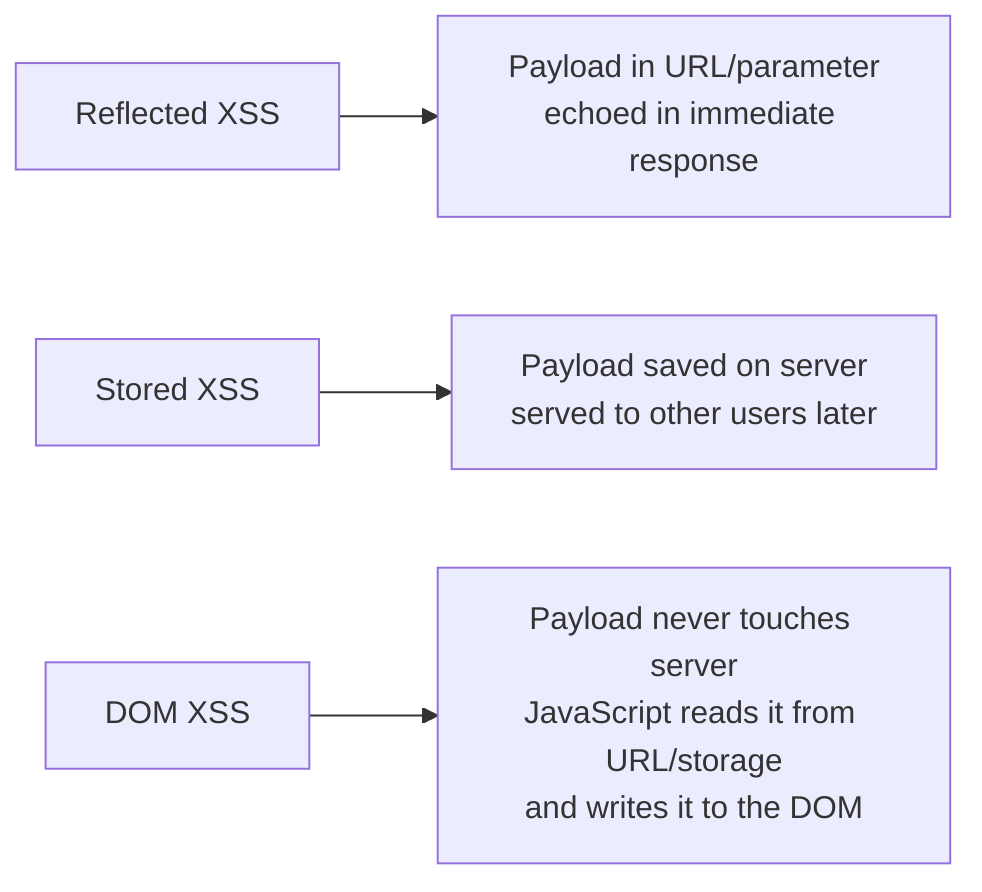

# 🎭 XSS, CSRF & SSRF

> Three vulnerabilities that share a theme: the attacker tricks something — the browser, the user's session, or the server — into doing something on their behalf. They are arguably the most consequential client-side and server-side bugs in modern web apps.

---

## 1. Cross-Site Scripting (XSS)

XSS is **JavaScript injection in the victim's browser**, in the security context of the vulnerable site. Once attacker JS runs, it has full access to the page's DOM, cookies (unless `HttpOnly`), localStorage, and ongoing API sessions.

### 1.1 The three flavors



| Type | How payload arrives | Persistence | Severity |
|---|---|---|---|
| Reflected | Crafted link the victim must click | One request | Medium–High |
| Stored | Saved by the server (comments, profile, support tickets) | Permanent | Critical |
| DOM-based | Read client-side from URL/storage; written to DOM unsafely | Per-page-load | Medium–Critical |

### 1.2 Detecting XSS

Inject **markers** in every parameter and look at the rendered HTML:

```text
<xx>marker
'>"><xx>marker
javascript:alert(1)
"><svg onload=alert(1)>

{{7*7}}
```

If your marker appears un-escaped in the HTML/JS context, the parameter is reflective. The next question is: *where* exactly did it land?

### 1.3 Context matters

Same payload, different meaning depending on where the input is reflected:

| Context | Example reflection | Payload that escapes |
|---|---|---|
| HTML body | `<div>USER</div>` | `<svg onload=alert(1)>` |
| HTML attribute | `<input value="USER">` | `" autofocus onfocus=alert(1) x="` |
| Single-quoted attr | `<a href='USER'>` | `' onmouseover='alert(1)` |
| JS string | `var x = "USER"` | `";alert(1);//` |
| JS template | `` `${USER}` `` | `${alert(1)}` |
| URL value | `<a href="USER">` | `javascript:alert(1)` |
| CSS | `<style>body{color:USER}</style>` | `red;}body{background:url(javascript:alert(1));` (legacy) |

A great XSS hunter is fluent in all of these. PortSwigger's XSS cheat sheet lists hundreds of payloads per context.

### 1.4 DOM-based XSS

Source → Sink. The payload is read from one place (`source`) and written to another (`sink`) without sanitization:

| Sources | Sinks |
|---|---|
| `location.search`, `location.hash`, `document.referrer` | `innerHTML`, `outerHTML`, `document.write` |
| `localStorage`, `sessionStorage`, cookies | `eval`, `Function`, `setTimeout` (with string) |
| `postMessage` data | `element.src`, `element.href` |

Tools: Burp DOM Invader (Pro), `LiveOverflow`'s domxsswiki.

### 1.5 What attackers do once they have XSS

- Steal cookies (if not `HttpOnly`)
- Steal session by reading localStorage tokens
- Make authenticated requests *as the victim* to the same origin
- Inject a fake login form (phish for credentials)
- Pivot to internal endpoints via SSRF-from-browser
- Cryptojack, deliver malware, trigger drive-by downloads

Stored XSS in an admin panel = the admin gets compromised → full app takeover.

### 1.6 Tools

```bash
# dalfox — modern XSS scanner with smart context detection
dalfox url 'https://target.com/search?q=test' --custom-payload payloads.txt
dalfox file urls.txt --pipe

# XSStrike — older but still useful
python3 xsstrike.py -u 'https://target.com/?q=test'

# Burp Pro Scanner finds most reflected/stored
# DOM Invader (Burp extension) finds DOM-based
```

We ship `scripts/web/xss_payload_generator.py` — produces context-specific payloads given a hint at where the reflection appears (HTML attribute, JS string, URL, etc.). Educational; not a scanner.

### 1.7 Defenses

- **Output encoding** by context. Templating engines (Jinja2, Twig, Razor) auto-escape HTML by default. Don't disable autoescape.
- **CSP (Content Security Policy)** with `nonce`-based inline-script policy. Strict CSP makes most XSS unexploitable even when present.
- **Trusted Types** in Chromium: makes unsafe DOM sinks throw at runtime unless wrapped.
- **`HttpOnly` cookies** — JS can't read them.
- **`SameSite=Strict` or `Lax`** on session cookies.
- **Sanitize HTML** with `DOMPurify` if you must accept rich-text input.

---

## 2. CSRF (Cross-Site Request Forgery)

CSRF tricks the *victim's browser* into making an authenticated request to a target site, on the attacker's behalf. The browser dutifully attaches the victim's cookies; the server can't tell it wasn't intentional.

### 2.1 The classic form

The attacker hosts:

```html
<!-- on attacker.com -->
<form action="https://bank.com/transfer" method="POST">
  <input name="to" value="attacker">
  <input name="amount" value="10000">
</form>
<script>document.forms[0].submit()</script>
```

If `bank.com` accepts the request based purely on session cookies, the transfer happens — silently — when the victim visits attacker.com while logged in to bank.com.

### 2.2 Detection

- Look for state-changing endpoints (POST, PUT, DELETE).
- Note whether they require:
  - A unique anti-CSRF token (e.g. `X-CSRF-Token` header or hidden form field)
  - A custom header that browsers don't send cross-origin (`X-Requested-With: XMLHttpRequest`)
  - A `SameSite` cookie that prevents cross-site submission
- Try removing the token and resending. Try changing the token to a random value. Try removing the custom header.

### 2.3 SameSite cookies

Modern browsers default cookies to `SameSite=Lax`. That blocks **most** CSRF for top-level POSTs. Edge cases that still allow CSRF:

- `SameSite=None; Secure` cookies (explicitly opted-in by the dev for embedding) → fully exploitable.
- GET-based state changes (which shouldn't exist but do).
- Top-level navigation (`Lax` allows top-level GET).
- Subdomain attacks if the cookie is `Domain=.target.com`.

### 2.4 Defenses

- **CSRF tokens** — random per-session value the server validates. Frameworks (Django, Rails, Spring Security, Express+csurf) all ship implementations.
- **`SameSite=Strict` or `Lax` on session cookies.** Today this is the strongest default.
- **Custom headers** + CORS preflight — `fetch` cannot send custom headers cross-origin without preflight, and the server can require the header.
- **Re-authentication** for high-value operations.
- **Origin / Referer checks.**

### 2.5 CSRF chained with XSS

CSRF tokens are a defense against CSRF — not against XSS. If the attacker has XSS on the same origin, they can read the CSRF token from the page and make the request normally. **XSS bypasses every CSRF defense.**

---

## 3. SSRF (Server-Side Request Forgery)

The server fetches a URL the attacker provides. Now the attacker uses the server's network position to reach things the attacker couldn't reach directly:

- Internal IPs (`10.0.0.1`, `192.168.0.0/16`, `172.16.0.0/12`)
- Cloud metadata endpoints (`http://169.254.169.254/...`)
- localhost services (`http://127.0.0.1:8080/admin`)
- File system via `file://` (legacy)
- Internal admin APIs that trust the server's IP

### 3.1 Where SSRF lives

- **URL fetchers** — "preview this URL", thumbnail generators, webhook senders, OAuth callback validators, RSS aggregators, DocumentMagick / ImageMagick / wkhtmltopdf, PDF/HTML converters, file imports ("import from URL").
- **Avatars / images by URL.**
- **Server-side WebSockets / proxies.**

Anywhere your input becomes part of a URL the server fetches.

### 3.2 Cloud metadata — the holy grail

```bash
# AWS IMDSv1 (still supported on a lot of legacy infra)
curl http://169.254.169.254/latest/meta-data/iam/security-credentials/
curl http://169.254.169.254/latest/meta-data/iam/security-credentials/<role>

# GCP
curl -H "Metadata-Flavor: Google" http://metadata.google.internal/computeMetadata/v1/instance/service-accounts/default/token

# Azure
curl -H "Metadata: true" "http://169.254.169.254/metadata/instance?api-version=2021-02-01"
```

Successful SSRF + IMDSv1 → cloud credentials → potentially full account takeover. AWS introduced **IMDSv2** (session-token-based) to blunt this; the org has to enforce IMDSv2-only on all instances.

### 3.3 Filter bypasses

When the server tries to block internal IPs, the bypass surface is enormous:

| Trick | Why it works |
|---|---|
| `http://127.1` | Browsers and many libs expand to `127.0.0.1` |
| `http://0` | Same |
| `http://localhost@evil.com/` | URL parsing confusion: where's the host? |
| `http://[::1]/` | IPv6 loopback |
| `http://169.254.169.254.nip.io/` | DNS to internal IP |
| `http://xn--c1yn36f/` | Punycode |
| Octal: `http://0177.0.0.1/` | Octal IPv4 |
| Decimal: `http://2130706433/` | Integer-encoded IPv4 |
| URL hex: `http://%6c%6f%63%61%6c%68%6f%73%74/` | URL-encoded |
| Open redirect: `http://attacker.com/redirect?to=http://169.254.169.254/` | Server follows redirects |
| DNS rebinding | First DNS response = public, second = private; race the validator |

### 3.4 Detection

```http
# Probe with a URL you control
?url=https://attacker.collaborator.net/

# Did the server callback?
# If yes, you have SSRF. Now expand:

?url=http://127.0.0.1/
?url=http://169.254.169.254/latest/meta-data/
?url=http://[::1]:6379/
?url=file:///etc/passwd
```

Burp Collaborator (Pro) or `interactsh` listens. Without OOB you can still detect via **time differences** — a hung connection to a closed port behaves differently from one to an open port.

### 3.5 Blind SSRF

If the response isn't reflected, you can still:

- Detect via OOB callback (DNS or HTTP).
- Port-scan internal subnets via timing.
- Trigger known-vulnerable internal services (e.g., unauth Redis on `:6379`) via `gopher://`:

```text
gopher://127.0.0.1:6379/_*1%0d%0a$8%0d%0aFLUSHALL%0d%0a*3%0d%0a$3%0d%0aSET%0d%0a$1%0d%0a1%0d%0a$N%0d%0apayload
```

This is how SSRF → Redis → cron-write → RCE chains have happened repeatedly.

### 3.6 Defenses

- **Allowlist** the URLs your server is allowed to fetch (host + scheme).
- **Block the metadata IPs** at the network layer (`169.254.169.254`), not just in code.
- **Disable HTTP redirects** in the fetching library, or follow them only when the target stays in allowlist.
- **Resolve DNS once** and reuse the IP (prevents DNS rebinding).
- **Use a separate egress proxy** (one without access to internal networks).
- **Enforce IMDSv2** on AWS.
- **Drop dangerous schemes** (`file://`, `gopher://`, `dict://`).

---

## 4. CSWSH — Cross-Site WebSocket Hijacking

WebSockets don't have the SOP guarantees of `fetch`. If a WebSocket endpoint authenticates by cookie alone, an attacker page can open a WebSocket from `attacker.com` to `target.com/ws` and read/write as the victim.

Defense: validate the `Origin` header on the WS handshake, or require a subprotocol token.

---

## 5. CORS Misconfigurations

CORS isn't a vulnerability per se, but bad configurations enable cross-origin data theft.

The dangerous combo:

```http
Access-Control-Allow-Origin: <reflects request Origin>
Access-Control-Allow-Credentials: true
```

If the server reflects *any* `Origin`, then `attacker.com` can `fetch(...)` with credentials and read the response. Common variants:

- `Allow-Origin: null` — `null` is the origin of `data:` URLs and sandboxed iframes; attackers can produce a `null`-origin context.
- Substring match (e.g., `^https?://.*\.target\.com$`) that `attacker.target.com.evil.com` matches.
- Reflecting a full attacker-controlled origin.

Check with:

```bash
curl -H "Origin: https://evil.com" -I https://target.com/api/me
```

If `Access-Control-Allow-Origin: https://evil.com` and `Allow-Credentials: true`, you have a CORS exploit primitive.

---

## 6. Open Redirects

Often dismissed as low-severity, but they:

- Enable phishing (the phishing URL is on the legit domain).
- Bypass SSRF allowlists when an internal URL allowlists "URLs on `target.com`".
- Bypass OAuth `redirect_uri` validation when the consumer uses substring matching.

Defenses: redirect only to a fixed allowlist of paths.

---

## 7. Hands-On Lab

PortSwigger Web Security Academy has world-class labs for all three:

- **XSS** — ~30 labs, covering reflected, stored, DOM, CSP bypass, dangling markup, mutation XSS.
- **CSRF** — ~10 labs.
- **SSRF** — ~10 labs.
- **CORS** — separate set.
- **WebSockets** — small set.

Time: ~40 hours over 4 weeks. Pair with HackTheBox web boxes after.

---

## 8. Detection (Blue-Team View)

| Vuln | Signal |
|---|---|
| XSS | `<script`, `onerror=`, `javascript:` in URL params or POST body in WAF logs |
| CSRF | High-velocity POST from one referrer to a sensitive endpoint, no token; absent custom header |
| SSRF | App server initiating outbound connections to RFC1918 / link-local / metadata IPs |
| CORS abuse | Repeated requests with rotating `Origin` headers |
| Open redirect | `?next=https://...` or similar parameters with external hostnames |

Egress monitoring + DNS query logs are the most reliable detection layer for SSRF — far more than WAF.

---

## 9. Interview Questions

- Walk through how you'd prove XSS in a search field that reflects input inside a `<script>` block.
- Why does CSP `nonce`-based inline-script work, and what bypasses exist?
- A POST endpoint requires a CSRF token *and* the cookie is `SameSite=Lax`. Is CSRF possible?
- Walk through SSRF → AWS metadata → role assumption → S3 dump.
- What's IMDSv2 and how does it break the classic SSRF chain?
- How would a SOC detect SSRF on a backend service?

---

## 10. Tools Quick Reference

| Class | Tools |
|---|---|
| XSS | `dalfox`, `XSStrike`, Burp Pro, DOM Invader, manual |
| CSRF | manual (PoC HTML), Burp Pro Scanner |
| SSRF | Burp Collaborator, `interactsh`, manual probing, `gopherus` |
| CORS | manual `curl -H Origin:` |
| Misc | PayloadsAllTheThings repo |

---

## 11. Further Reading

- PortSwigger Web Security Academy — full-coverage free labs
- *The Tangled Web*, Michał Zalewski — exhaustive on browser security
- HackTricks — `book.hacktricks.wiki`
- Frans Rosén / detectify blog posts on SSRF
- Mathias Bynens & Sandro Gauci — XSS payload research

---

> Phase 3's web AppSec foundations end here. The next chapter — **Authentication, Authorization & Session Attacks** — covers the cluster of bugs around login, MFA, JWT, OAuth, and SAML. After that, system hacking on Linux and Windows. Stage 3 will pick up from there.

[← Injection](web-injection.md) · [Phase 4: Specializations →](../04-specializations/index.md)
