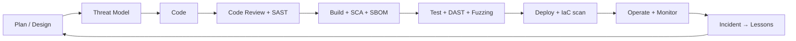

# 🛡️ Application Security & Secure SDLC

> The track that quietly pays the most. AppSec engineers at Meta, Google, Stripe, and Cloudflare clear $300k+ TC because they sit between developers and security, speak both languages, and stop bugs before they ship.

For roles in: **product security at any tech company**, **bug bounty triage teams**, **security-focused open-source projects**, **government secure-software efforts (CISA Secure-by-Design, OpenSSF, CRA compliance in EU/India)**.

## What AppSec actually means

AppSec ≠ pentesting. A pentester finds bugs in a deployed app. An AppSec engineer **shapes the engineering process** so the bug never lands in main:

- Reviews designs before code is written (threat modeling)
- Writes detection rules for static analyzers and CI gates
- Reviews PRs for security-sensitive changes
- Builds shared libraries that make secure paths the easy default
- Triages bug bounty reports and works with engineers to fix
- Maintains the SDLC playbook so every team scales safely

You'll spend your week reading code, writing code, and arguing with developers. If that sounds bad, AppSec isn't for you. If it sounds great, this is the most leveraged role in security.

## The Secure SDLC (S-SDLC)



Every stage gets a security artifact. Skip a stage and you ship CVEs.

## Threat modeling

The first deliverable, before any code is written.

### STRIDE — the simplest framework

For each component / data flow / trust boundary, ask:

| Letter | Threat | Example |
|---|---|---|
| **S** | Spoofing identity | Forge a session token |
| **T** | Tampering with data | Modify cart price client-side |
| **R** | Repudiation | User claims "I didn't make that transfer" |
| **I** | Information disclosure | Error message leaks DB stack trace |
| **D** | Denial of service | Unbounded recursion in input parser |
| **E** | Elevation of privilege | Regular user becomes admin |

### LINDDUN — privacy threats

For systems handling personal data (mandatory under GDPR, India's DPDP Act, US state privacy laws):

| Letter | Threat |
|---|---|
| **L** | Linking | Combine datasets to reidentify |
| **I** | Identifying | Single-attribute identification |
| **N** | Non-repudiation (privacy meaning: can't credibly deny) | Forensic logs reveal too much |
| **D** | Detecting | Fact of presence is sensitive |
| **D** | Data disclosure | Direct exposure |
| **U** | Unawareness/unintervenability | User can't opt out / correct |
| **N** | Non-compliance | Violates law/policy |

### PASTA, OCTAVE, attack trees

Heavier frameworks for higher-stakes systems (defense, finance, infrastructure). Pick one, apply consistently. Don't pick three and apply none.

### Tools that help

- **[Microsoft Threat Modeling Tool](https://aka.ms/tmt)** — STRIDE-driven, free, Windows-only
- **[OWASP Threat Dragon](https://www.threatdragon.com/)** — open source, web-based
- **[pytm](https://github.com/izar/pytm)** — write threat models in Python (declarative). My favorite for engineers who hate GUIs.
- **[IriusRisk](https://www.iriusrisk.com/)** — commercial, integrates with Jira / GitHub

```python
# pytm example - declarative threat model
from pytm import TM, Server, Datastore, Actor, Boundary, Dataflow

tm = TM("Web App TM")
internet = Boundary("Internet")
dmz = Boundary("DMZ")

user = Actor("User"); user.inBoundary = internet
web = Server("Web Server"); web.inBoundary = dmz
db = Datastore("User DB"); db.inBoundary = dmz; db.isEncrypted = True

Dataflow(user, web, "HTTPS request").protocol = "HTTPS"
Dataflow(web, db, "Query").protocol = "TLS"

tm.process()                # generates STRIDE threats automatically
```

## SAST — Static Application Security Testing

Tools that read source code and flag patterns. Run in CI on every PR.

### What good SAST catches

- Hardcoded secrets (API keys, passwords, tokens)
- Use of dangerous functions (`eval`, `exec`, `pickle.loads`, `system`)
- Tainted data flows (HTTP input → SQL query, file path)
- Insecure crypto (MD5, ECB mode, hardcoded IVs)
- Misuse of frameworks (Django `mark_safe`, React `dangerouslySetInnerHTML`)

### Tools

| Tool | Strength |
|---|---|
| **[Semgrep](https://semgrep.dev/)** | Fast, language-agnostic, rules in YAML — write your own in 5 min |
| **[CodeQL](https://codeql.github.com/)** | GitHub's. Most powerful (taint tracking) but steep learning curve |
| **[Snyk Code](https://snyk.io/product/snyk-code/)** | Commercial, good IDE integration |
| **[SonarQube](https://www.sonarsource.com/)** | Code quality + security, ubiquitous in enterprises |
| **[Bandit](https://github.com/PyCQA/bandit)** (Python), **[gosec](https://github.com/securego/gosec)** (Go), **[brakeman](https://brakemanscanner.org/)** (Rails) | Language-specific, free |
| **[Joern](https://joern.io/)** | Code property graphs — great for novel queries on huge codebases |

### Writing a good Semgrep rule

```yaml
rules:
  - id: dangerous-pickle-load
    pattern: pickle.loads(...)
    message: |
      pickle.loads() executes arbitrary code. Never call on untrusted input.
      Use json.loads or a safer format (msgpack, protobuf, safetensors).
    severity: ERROR
    languages: [python]
    metadata:
      cwe: "CWE-502: Deserialization of Untrusted Data"
      owasp: "A08:2021 - Software and Data Integrity Failures"
```

The trick to good SAST is **low false positive rate**. Developers ignore noisy tools. Tune ruthlessly — disable rules that fire on safe patterns common in your codebase, and write codebase-specific rules for your unsafe patterns.

## DAST — Dynamic Application Security Testing

Tools that test the running application from the outside (HTTP).

| Tool | Use |
|---|---|
| **[OWASP ZAP](https://www.zaproxy.org/)** | Free, scriptable, automation-friendly |
| **[Burp Suite Pro](https://portswigger.net/burp)** | Industry standard for manual + scanner |
| **[Nuclei](https://github.com/projectdiscovery/nuclei)** | Template-based, great for known-CVE checks at scale |
| **[Acunetix / Invicti](https://www.invicti.com/)** | Commercial, mature scanners |
| **StackHawk, Bright Security** | Modern, CI-native DAST |

In CI, run a DAST against staging on every release-candidate. Block on high-severity findings; track medium/low.

## SCA — Software Composition Analysis

Track every dependency, known CVE, and license. Mandatory for any non-trivial project.

| Tool | Notes |
|---|---|
| **[Dependabot](https://github.com/dependabot)** / **[Renovate](https://github.com/renovatebot/renovate)** | Auto-PR for outdated deps |
| **[Snyk Open Source](https://snyk.io/)** / **[Mend](https://www.mend.io/)** | Commercial, prioritizes by reachability |
| **[trivy](https://aquasecurity.github.io/trivy/)** | Open source, fast, scans containers + filesystems + IaC |
| **[grype](https://github.com/anchore/grype)** | Anchore's, often paired with **syft** for SBOM gen |
| **[osv-scanner](https://github.com/google/osv-scanner)** | Google's, pulls from osv.dev (lightweight, no DB needed) |
| **[pip-audit](https://github.com/pypa/pip-audit)** | Python-specific, official PyPA project |

Run on every build. Fail the build on critical CVEs in production deps.

## SBOM — Software Bill of Materials

A list of every component in your software. Required by US Executive Order 14028 for federal software, and EU Cyber Resilience Act for products sold in Europe.

Standards:
- **CycloneDX** (OWASP) — the practical winner, JSON-friendly
- **SPDX** (Linux Foundation) — older, ISO/IEC 5962, common in legal contexts

Generate with:
```bash
syft packages dir:. -o cyclonedx-json > sbom.json
trivy fs --format cyclonedx --output sbom.json .
```

## Supply chain security

The biggest growth area in AppSec.

### The threats

| Attack | Real example |
|---|---|
| Typosquatting (`requets` instead of `requests`) | hundreds of malicious PyPI packages found yearly |
| Dependency confusion ([Birsan, 2021](https://medium.com/@alex.birsan/dependency-confusion-4a5d60fec610)) | $130k bug bounty haul from Apple, MS, others |
| Compromised maintainer account | event-stream → flatmap-stream (2018), ua-parser-js (2021) |
| Long-game maintainer infiltration | xz/liblzma (CVE-2024-3094) — multi-year operation |
| Build system compromise | SolarWinds Sunburst (2020), CodeCov (2021), 3CX (2023) |
| Malicious Hugging Face / npm / PyPI uploads | weekly, ongoing |

### Defenses

- **[SLSA](https://slsa.dev/)** (Supply-chain Levels for Software Artifacts) — Google's framework, levels 1-4 of build integrity
- **[Sigstore](https://www.sigstore.dev/)** — keyless signing for OSS, includes `cosign` (containers), `gitsign` (commits), Rekor (transparency log)
- **[in-toto](https://in-toto.io/)** — attestations for every build step
- **[GUAC](https://guac.sh/)** — graphs of artifact provenance
- **Pinned dependencies** — exact versions, exact hashes (lockfiles, `package-lock.json`, `Pipfile.lock`)
- **Internal package registries** — avoid dependency confusion: same-named internal packages always win
- **Reviewed maintainer access** — every maintainer 2FA, hardware key, recent activity. Maintainer takeover is the most dangerous supply chain attack pattern.

## Secure coding by language

### Python
- `subprocess.run([cmd, arg])` — never `subprocess.run(f"{cmd} {arg}", shell=True)`
- `json.loads`, never `pickle.loads` for untrusted data
- Use `secrets` module for any token, not `random`
- ORM (Django ORM, SQLAlchemy) parameterized queries — never `f"SELECT {x}"`
- For YAML, `yaml.safe_load` (default `yaml.load` is RCE)

### Java
- `PreparedStatement` always
- `ProcessBuilder` with array args
- Beware Jackson polymorphic deserialization — disable default typing
- `SecureRandom` not `Random`

### JavaScript / TypeScript
- React: never `dangerouslySetInnerHTML` with untrusted content
- `JSON.parse` not `eval`
- For server templates: framework auto-escape always (Pug, EJS, etc. — verify defaults)
- `crypto.randomUUID()`, `crypto.getRandomValues` not `Math.random`

### Go
- `database/sql` with `?` placeholders
- `crypto/rand`, `crypto/subtle.ConstantTimeCompare`
- HTTP timeouts on every server: `ReadTimeout`, `WriteTimeout`, `IdleTimeout`

### Rust
- Avoid `unsafe` blocks; if you need them, audit relentlessly
- `cargo audit` in CI
- For deserialization: `serde` with deny-unknown-fields where possible

## Cryptography review

Common mistakes you'll find in code reviews:
- Using MD5 / SHA-1 for anything other than non-security checksums
- AES-ECB mode (penguin meme. always.)
- Hardcoded IVs, hardcoded keys
- `==` for HMAC comparison (timing oracle) — use `hmac.compare_digest`
- Custom crypto (rolling your own RSA, "encrypted with XOR")
- Using `bcrypt` with low cost factor in 2026 (use 12+) or unbounded password length (>72 bytes truncate)
- Storing JWTs without `exp`, or using `alg:none`-acceptant libraries
- Reusing nonces (catastrophic for AES-GCM)

Defaults to recommend:
- Hashing passwords: **Argon2id**. Fall back to **bcrypt** with cost 12+
- Authenticated encryption: **AES-GCM** (with proper nonce management) or **ChaCha20-Poly1305**
- Public key: **Ed25519** (signatures), **X25519** (key exchange)
- Random: OS entropy (`/dev/urandom`, `secrets`, `crypto/rand`) — never PRNG seeded with timestamps

## Containers and IaC security

### Container hardening checklist
- Distroless or minimal base images (Alpine, Wolfi, Chainguard)
- Non-root `USER` in Dockerfile
- Read-only root filesystem (`--read-only`)
- Drop all capabilities, add only what's needed (`--cap-drop=ALL`)
- No privileged mode, no `--pid=host`, no `--net=host`
- Pin base image by SHA256 digest, not tag
- Scan images with **trivy / grype** in CI

### Kubernetes
- **Pod Security Standards** — `restricted` profile is the default to aim for
- **NetworkPolicies** — deny by default, allow per-namespace
- **RBAC** — least privilege per ServiceAccount, no `cluster-admin` for apps
- **OPA Gatekeeper** or **Kyverno** for admission policies
- **falco** for runtime detection (suspicious syscall patterns)

### IaC (Terraform / CloudFormation / Helm)
- **[checkov](https://www.checkov.io/)** — static analysis for Terraform, CloudFormation, ARM, K8s
- **[tfsec](https://github.com/aquasecurity/tfsec)** / **[terrascan](https://github.com/tenable/terrascan)** — Terraform-specific
- **[KICS](https://kics.io/)** — multi-format IaC scanner

## Bug bounty program management

If you run a bug bounty program (or want to triage one):

- **Scope clarity** — what's in, what's out, asset-by-asset
- **Severity matrix** — CVSS isn't enough; document your tier definitions
- **Triage SLA** — first response < 48h, severity decision < 5 days
- **Pay quickly** — researcher trust matters more than process. The faster you pay valid criticals, the better reports you'll get
- **Public disclosure timeline** — agreed up front, default 90 days
- **Internal CVE process** — for findings that affect your customers, what's your patch + advisory workflow?

The big platforms — HackerOne, Bugcrowd, Intigriti, YesWeHack — all provide triage staffing if you don't have in-house. Useful in year 1, often replaced by year 3.

## Tools and automation glue

| Glue tool | What it does |
|---|---|
| **[OpenSSF Scorecard](https://github.com/ossf/scorecard)** | Auto-scores repo security posture (branch protection, signed releases, etc.) |
| **[allstar](https://github.com/ossf/allstar)** | Enforces Scorecard policies at org level |
| **[gh-actions-runner-controller](https://github.com/actions/actions-runner-controller)** + ephemeral runners | Avoid persistent runner compromise (the GitHub OIDC supply-chain pattern) |
| **[step-security/harden-runner](https://github.com/step-security/harden-runner)** | Block egress in CI runners |
| **[opentofu](https://opentofu.org/)** policy-as-code | Replace HashiCorp Terraform Sentinel for OSS use |

## Hands-on labs

- **[OWASP WebGoat](https://owasp.org/www-project-webgoat/)** — vulnerable Java app, intro to web bugs
- **[OWASP Juice Shop](https://owasp.org/www-project-juice-shop/)** — Node.js modern web app with 100+ challenges
- **[DVWA](https://github.com/digininja/DVWA)** — classic
- **[GameOfHacks (Checkmarx)](https://www.gameofhacks.com/)** — code review skill quizzes
- **[SecureFlag platform](https://www.secureflag.com/)** — paid, hands-on coding labs by language
- **[VulnHub VMs](https://www.vulnhub.com/)** — vulnerable boxes
- **[HackTheBox AppSec track](https://app.hackthebox.com/tracks)** — multi-machine

## Certifications worth considering

| Cert | Worth it for |
|---|---|
| **OSWE** (OffSec Web Expert) | Source-code analysis to RCE chains. Hardest hands-on web cert |
| **CSSLP** (ISC²) | Management/policy roles, builds vocabulary |
| **GWAPT / GWEB / GMOB** (SANS) | Comprehensive web/API/mobile, expensive |
| **eWPTX** (eLearnSecurity) | Affordable, modern, hands-on |
| **PNPT** (TCM) | Full pentest cert, includes web, AD, report-writing |
| **Burp Suite Certified Practitioner** | Cheap, covers PortSwigger Web Security Academy material |

## Real-world incidents to learn from

- **Log4Shell (CVE-2021-44228)** — JNDI lookups in user-controlled strings → RCE. Read the [LunaSec writeup](https://www.lunasec.io/docs/blog/log4j-zero-day/) and the upstream patch sequence.
- **Spring4Shell (CVE-2022-22965)** — Java reflection bypass in Spring Framework, 11 years dormant.
- **Polyfill.io supply chain (June 2024)** — 100k+ websites loading attacker-controlled JS for months after domain change-of-hands.
- **Microsoft Storm-0558 token theft (July 2023)** — leaked MSA signing key let attacker forge access tokens for any Exchange Online tenant. Read [CISA's review](https://www.cisa.gov/sites/default/files/2024-04/CSRB_Review_of_the_Summer_2023_MEO_Intrusion_Final_508c.pdf).
- **xz/liblzma (CVE-2024-3094)** — patient maintainer takeover, near-miss on backdooring most Linux distros' SSH.

## Interview questions

1. *"Walk me through threat modeling a new feature: 'users can upload PDF resumes that we parse and email to recruiters.'"*
2. *"How do you prioritize 200 SAST findings on a Monday morning?"*
3. *"What's the difference between SAST, DAST, IAST, and SCA?"*
4. *"Explain SLSA levels."*
5. *"What goes wrong when a developer uses `Math.random()` for session tokens?"*
6. *"How do you respond when a bug bounty researcher won't accept your severity assessment?"*
7. *"What's the dual-LLM pattern and when would you use it?"* (yes, modern AppSec interviews ask this now)

## Recommended reading

- *Designing Secure Software* (Loren Kohnfelder) — by the engineer who literally invented STRIDE at Microsoft
- *Secure by Design* (Bergh Johnsson, Deogun, Sawano) — Java-flavored but the principles are universal
- *Building Secure and Reliable Systems* (Google SRE) — free online: [sre.google/books/](https://sre.google/books/)
- *The Tangled Web* (Michał Zalewski) — browser security mental model
- [PortSwigger Web Security Academy](https://portswigger.net/web-security) — free, by Burp creators, comprehensive
- [Trail of Bits engineering blog](https://blog.trailofbits.com/)
- [Project Zero blog](https://googleprojectzero.blogspot.com/)

## Python script reference

This phase ships:
- [`appsec/sast_secrets_scan.py`](../../scripts/appsec/sast_secrets_scan.py) — recursive secrets scanner with entropy + regex modes, customizable patterns, JSON output

---

[← AI/ML Security](ai-security.md)  ·  [Phase 5 →](../05-defense/index.md)
