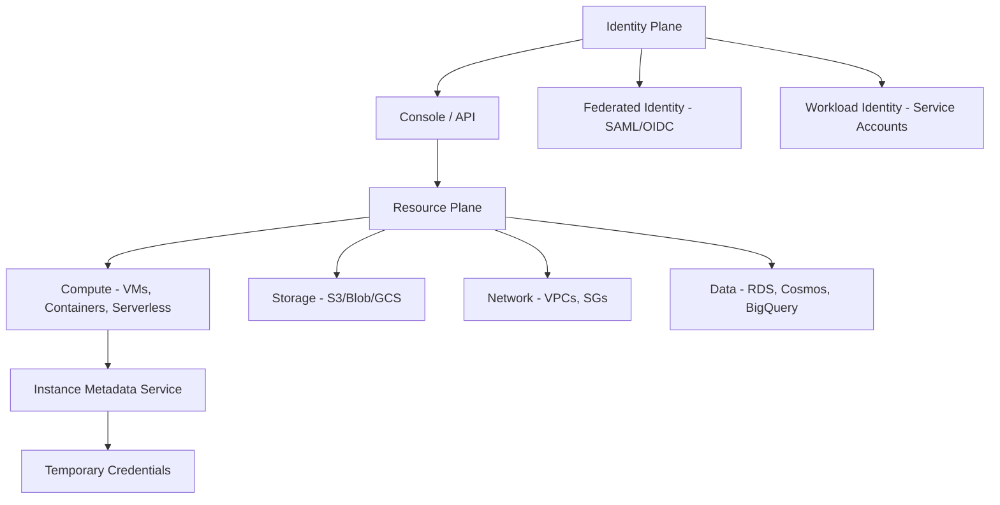
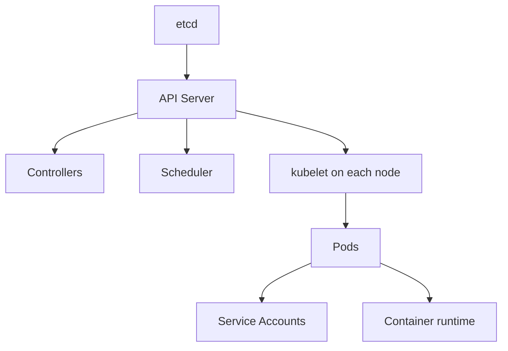

# ☁️ Cloud Security

> Cloud is the dominant attack surface of the 2020s. The 2024 Verizon DBIR put cloud-misconfiguration breaches in the top causes for the first time, and it has stayed there. Cloud security combines classic networking + IAM + a vendor-specific control plane that has its own attack surface — the metadata service alone has launched a thousand breaches.

---

## 1. The Cloud Attack Surface



The two big shifts vs on-prem:

1. **Identity is the perimeter.** A leaked AWS key is a breach in itself — no network traversal needed.
2. **Misconfigurations are public.** S3 buckets, security groups, IAM policies — Shodan/GrayhatWarfare/recently-published research finds them.

Skill in cloud sec means fluency in IAM (the hardest, most underestimated domain) plus knowing the vendor-specific gotchas.

---

## 2. AWS — The Biggest Target

### 2.1 IAM Crash Course

AWS IAM has four primary primitives:

- **Users** — long-term identities with credentials
- **Groups** — collections of users
- **Roles** — temporary identities, assumed by users/services
- **Policies** — JSON documents granting/denying actions

Policy structure:

```json
{
  "Version": "2012-10-17",
  "Statement": [{
    "Effect": "Allow",
    "Action": ["s3:GetObject", "s3:PutObject"],
    "Resource": "arn:aws:s3:::my-bucket/*",
    "Condition": {"StringEquals": {"aws:PrincipalTag/Department": "engineering"}}
  }]
}
```

Privilege escalation paths (the IAM-PrivEsc family — at least 25 documented):

| Vector | What lets you escalate |
|---|---|
| `iam:CreateAccessKey` on another user | Mint their long-term credentials |
| `iam:PassRole` + `ec2:RunInstances` | Launch EC2 with admin role attached |
| `iam:PutUserPolicy` / `iam:AttachUserPolicy` on yourself | Attach `AdministratorAccess` |
| `iam:UpdateLoginProfile` on another user | Set their console password |
| `lambda:CreateFunction` + `iam:PassRole` | Run code with another role's permissions |
| `cloudformation:CreateStack` + `iam:PassRole` | Same idea via CloudFormation |
| `glue:CreateDevEndpoint` + `iam:PassRole` | Spin up admin-roled Glue notebook |
| `sts:AssumeRole` with overly permissive trust | Assume an admin role from your account |

The seminal reference is **Spencer Gietzen's IAM Privilege Escalation Methods** (Rhino Security Labs). Every modern auditor uses it.

We ship `scripts/cloud/aws_iam_analyzer.py` — fetches a target principal's policies and flags privesc paths from this catalog.

### 2.2 IMDS — the Metadata Service

Every EC2 instance has access to `http://169.254.169.254/`. With `IMDSv1`, any process or SSRF can read it:

```bash
# Inside instance (or via SSRF that hits 169.254.169.254)
curl http://169.254.169.254/latest/meta-data/iam/security-credentials/
# → role name
curl http://169.254.169.254/latest/meta-data/iam/security-credentials/<role>
# → AccessKeyId, SecretAccessKey, Token
```

Now you have temporary credentials with whatever the role can do — often more than you'd think. With session-manager-friendly policies, this is full account compromise from one SSRF.

**IMDSv2** (session-token-based) is the fix: the metadata service requires a `PUT` with a token first. Most SSRF primitives can't do `PUT` headers correctly. AWS now lets orgs **enforce IMDSv2-only** at the org level — ask any cloud auditor whether it's enforced.

### 2.3 S3

```bash
# Find public buckets
# Brute common patterns:
aws s3 ls s3://target-prod
aws s3 ls s3://target-backup --no-sign-request
aws s3 cp s3://target/file.zip . --no-sign-request

# Large-scale reconnaissance
# - GrayhatWarfare (commercial-ish): public S3 search
# - cloud_enum, s3scanner, AWSBucketDump
```

Bucket misconfigurations, in decreasing order of common-ness:

1. **`s3:GetObject` for `Principal: "*"`** — public read
2. **`s3:ListBucket` for `*`** — directory listing
3. **`s3:PutObject` for `*`** — write (catastrophic; supply-chain attack vector)
4. **Bucket ACLs** with `READ` for `AuthenticatedUsers` (literally any AWS account)
5. **VPC endpoint policies** that look restrictive but actually allow cross-account access

We ship `scripts/cloud/s3_bucket_audit.py` — audits an account's own buckets for these patterns. Owner-side review tool.

### 2.4 Recon & Tooling

```bash
# AWS CLI fundamentals
aws sts get-caller-identity                       # who am I?
aws iam get-account-summary
aws iam list-users
aws iam list-policies --scope Local
aws iam get-user-policy --user-name target --policy-name inline

# enumerate-iam — the speedrun tool
python3 enumerate-iam.py --access-key AKIA... --secret-key ...

# Pacu — AWS-pentest framework
pacu                                  # interactive, modular

# Cloudfox — modern enumeration / situational awareness
cloudfox aws --profile target all-checks
```

For *defense* / posture management:

| Tool | Use |
|---|---|
| **Prowler** | Multi-framework (CIS, ISO, PCI, GDPR) audits against AWS + Azure + GCP |
| **ScoutSuite** | Multi-cloud config audit |
| **Steampipe** | SQL-over-cloud-APIs; query like a database |
| **CloudSploit (Aqua)** | Continuous misconfig detection |
| **Stratus Red Team** | Emulate cloud TTPs |

### 2.5 AWS-Specific Detection (CloudTrail / GuardDuty)

CloudTrail logs every API call. You'll be looking for:

- `ConsoleLogin` from new IPs / impossible travel
- `CreateAccessKey` / `UpdateLoginProfile` (privesc primitives)
- `AssumeRole` chains spanning unusual accounts
- `PutBucketPolicy` adding public access
- `RunInstances` with privileged role + custom UserData
- Disabling CloudTrail itself (`StopLogging`, `DeleteTrail`)

GuardDuty does the heavy lifting — turn it on org-wide, integrate with SIEM.

---

## 3. Azure / Entra ID

### 3.1 Identity model

Microsoft has been renaming things forever. Current state (2026):

- **Entra ID** (formerly Azure AD) — the directory service
- **Azure RBAC** — resource-level permissions
- **Conditional Access** — policy engine for sign-ins
- **PIM (Privileged Identity Management)** — just-in-time admin elevation

Azure has *two* permission systems: Entra roles (directory-level) and Azure RBAC (resource-level). They overlap confusingly.

### 3.2 Common attacks

**Password spray to Entra:** `MSOLSpray`, `o365spray`, `ROADtools` token grabbers. Rate-limited but doable; lockout doesn't apply to most orgs.

**Phishing for OAuth tokens:** illicit-consent grants — attacker registers an app, sends victim a `https://login.microsoftonline.com/...?client_id=...&scope=Mail.Read` link, victim consents, attacker's app reads their email forever.

**Conditional Access bypasses:** Conditional Access often excludes "service accounts" or specific protocols (legacy auth, IMAP, SMTP). Find the gaps and use them.

**Privilege escalation in roles:** `Application Administrator` can change apps' creds; `Cloud Application Administrator` similarly. Many privesc paths via app/service-principal trust.

**On-prem → cloud: AD Connect / Pass-Through Auth abuse.** AD Connect server compromise often leads to global admin in connected Entra tenant.

### 3.3 Tools

| Tool | Purpose |
|---|---|
| **AzureHound** | BloodHound's Azure data ingestor |
| **ROADtools / ROADrecon** | Comprehensive Entra recon (Python) |
| **AADInternals** | PowerShell module; legacy auth + Entra hacking |
| **Stormspotter** | Microsoft-built attacker view of Azure |
| **MicroBurst** | PowerShell offensive Azure |
| **MSOLSpray** | Password spray |

### 3.4 Detection

- **Azure AD sign-in logs** — risky sign-ins, impossible travel, anonymous IPs
- **Microsoft Defender for Cloud** — policy + workload alerts
- **Microsoft Sentinel** — SIEM specifically for M365/Azure
- **Activity Log + Resource Logs** — into Log Analytics → Sentinel

---

## 4. GCP

### 4.1 Identity model

- **IAM** — roles assigned at project/folder/org level
- **Service Accounts** — workload identities; can have keys (long-term) or be impersonated
- **Workload Identity Federation** — short-term creds for non-GCP workloads

### 4.2 Common attacks

**Metadata server abuse** — same shape as AWS:

```bash
curl -H "Metadata-Flavor: Google" \
  http://metadata.google.internal/computeMetadata/v1/instance/service-accounts/default/token
```

GCP doesn't have an IMDSv2 equivalent at the same level — the only protection is the `Metadata-Flavor: Google` header requirement, which most SSRF primitives can satisfy. Network policy + workload identity are the real defenses.

**Service account key sprawl** — long-term JSON keys are equivalent to passwords; they routinely end up in Git repos. Detect with TruffleHog / NoseyParker. Rotate / disable key creation org-wide.

**Cloud Function / Cloud Run privesc** — deploying a function with another account's service account → run as that account. Mirror of the AWS Lambda privesc.

**`actAs` permission** — equivalent to AWS's `iam:PassRole`; with it you can attach any service account to a workload.

### 4.3 Tools

```bash
# Recon
gcloud auth list
gcloud projects list
gcloud iam roles list --project <p>

# GCPBucketBrute — bucket discovery
gcpbucketbrute -k example -p ./permutations

# Cloudfox — supports GCP
# ScoutSuite, Prowler, Steampipe — all support GCP
```

---

## 5. Kubernetes

K8s is the de facto cloud-native orchestrator. Attack surface:



### 5.1 Common attacks

**Exposed API server (`6443`)** — anonymous list of pods, secrets, sometimes execute. Shodan + Censys still find these in 2026.

**Kubelet API (`10250`)** — historically allowed unauth pod exec. Modern clusters disable, but legacy ones haven't.

**Service Account token in pod** — every pod by default has `/var/run/secrets/kubernetes.io/serviceaccount/token`. If the SA has permissions to list/create pods → cluster takeover via pod-escape:

```yaml
# Create a pod that mounts the host filesystem
apiVersion: v1
kind: Pod
metadata: {name: pwn}
spec:
  containers:
  - name: pwn
    image: alpine
    command: ["chroot", "/host", "sh", "-c", "..."]
    volumeMounts:
    - {mountPath: /host, name: host-fs}
  volumes:
  - {name: host-fs, hostPath: {path: /}}
```

**RBAC misconfig** — `*:*:*` ClusterRoles given to default SAs; pods running as cluster-admin.

**Privileged pods** — pods with `privileged: true`, `hostNetwork: true`, `hostPID: true`. Each is an escape primitive.

**Container escapes** — kernel CVEs, runc CVEs (e.g., CVE-2019-5736 file descriptor escape, CVE-2024-21626 runc fork-after-exec).

### 5.2 Tools

| Tool | Use |
|---|---|
| **kube-hunter** | Active vulnerability scanning |
| **kube-bench** | CIS K8s benchmark |
| **kubectl-who-can** | Reverse-RBAC: "who can do X?" |
| **kubectl-trace** | eBPF tracing in-cluster |
| **peirates** | Pentest framework for K8s |
| **Falco** | Runtime threat detection (eBPF) |
| **Trivy / Grype** | Image vuln scanning |
| **OPA Gatekeeper / Kyverno** | Policy enforcement |

---

## 6. Cross-Cloud / Multi-Cloud Tooling

| Tool | What it does |
|---|---|
| **Prowler** | Audits AWS + Azure + GCP against multiple frameworks |
| **ScoutSuite** | Same; older but well-maintained |
| **Steampipe** | SQL queries over cloud APIs |
| **Stratus Red Team** | TTP emulation across clouds |
| **CloudFox** | Situational awareness during pentests |
| **Pacu** | AWS attack framework |
| **PMapper** | AWS IAM graph + privesc analysis |
| **AzureHound + BloodHound** | Identity graph for Azure |
| **ROADtools** | Entra deep recon |

---

## 7. The Real Attack Chain — A Composite Example

A real cloud breach looks like this in 2024–2026:

1. Phishing email lands → user clicks → credentials stuffed.
2. M365 token used to access OneDrive; SharePoint indices reveal an "internal API key cheat sheet".
3. Embedded AWS access key in the cheat sheet → `aws sts get-caller-identity` → low-priv user.
4. `enumerate-iam` finds the user has `iam:PassRole` + `lambda:CreateFunction`.
5. Privesc: deploy a Lambda with admin role attached → invoke → get admin creds.
6. With admin: `aws s3 ls --no-sign-request` against every bucket; pull the customer database backup.
7. Exfil through a Cloudfront distribution they create.

Detect-and-block points in that chain:
- MFA enforced at sign-in (1)
- DLP / labeling on SharePoint (2)
- AWS key rotation; secrets scanner on SharePoint search (2)
- IAM access analyzer; SCPs that block `iam:PassRole` to admin roles (4)
- GuardDuty `Privilege Escalation:IAMUser/AnomalousBehavior` (5)
- S3 access analyzer; bucket policies (6)
- VPC flow logs + egress monitoring (7)

A mature cloud security program touches every layer.

---

## 8. Hands-On Lab

- **AWS** — `flaws.cloud` and `flaws2.cloud` (free, classic CTF for AWS misconfigs)
- **Azure** — XPN's [PurpleCloud](https://www.purplecloud.network/) (paid lab) or set up a free-tier subscription and break it yourself
- **GCP** — `gcp-goat` (vulnerable lab)
- **Kubernetes** — `Kubernetes Goat` (KaTacoda / local), `Bust-a-Kube`, MKAT (managed-k8s audit tool)

Cloud-specific certifications worth pursuing in 2026:

- **AWS Security Specialty** — vendor-recognized
- **AZ-500** (Microsoft Cybersecurity)
- **CCSP** — vendor-neutral
- **(IS)2 CCSP** — broad cloud sec
- **GIAC GCSA** — cloud sec automation
- **Pentest-focused: OffSec OSDA / OSCP+** — emerging cloud-pentest specializations

---

## 9. Detection / Defense Quick Wins

If you're hardening your own cloud, these have outsized impact:

- **Enforce MFA** for all human users (root + admins absolutely)
- **No long-term keys** — workload identity / IRSA / managed identities
- **IMDSv2 enforced** on AWS
- **CloudTrail / Activity Log / Audit Logs** on, sent to a separate write-only account
- **GuardDuty / Defender for Cloud / Security Command Center** on
- **Service Control Policies / Management Groups / Org Policies** to forbid the most dangerous actions org-wide
- **Public-access blocks** on S3 / Storage / GCS at account level
- **Egress monitoring** with VPC Flow Logs / NSG Flow Logs

---

## 10. Interview Questions

- AWS IAM — explain `iam:PassRole` and why it's a privesc primitive.
- Walk through SSRF → IMDSv1 → role assumption → S3 dump.
- IMDSv2 — what does it actually do?
- A pod's default SA has `pods/exec` cluster-wide. What can an attacker do?
- Difference between Azure RBAC and Entra roles.
- How do you detect, in CloudTrail, that an attacker is escalating privileges?

---

## 11. Tools Quick Reference

| Tier | Tools |
|---|---|
| Recon | `aws sts get-caller-identity`, `enumerate-iam`, `cloudfox`, `pacu`, AzureHound, ROADtools |
| Bucket hunting | `cloud_enum`, `s3scanner`, `gcpbucketbrute` |
| Audit | Prowler, ScoutSuite, Steampipe, Trivy, Wiz/Snyk (commercial) |
| Attack emulation | Stratus Red Team, Atomic Red Team |
| K8s | kube-hunter, kube-bench, peirates, Falco |
| Tooling we ship | `cloud/aws_iam_analyzer.py`, `cloud/s3_bucket_audit.py` |

---

## 12. Further Reading

- **Hacking The Cloud** — hackingthecloud.com — community-curated
- **AWS Customer Security Incident Response Whitepaper**
- **Microsoft Defender for Cloud blog** — vendor but technically excellent
- *Pentesting AWS*, Karl Gilbert
- *Hacking Kubernetes*, Andrew Martin
- The DBIR's cloud section (every year)

---

[← Phase 4 Index](index.md) · [Malware Analysis →](malware-analysis.md)
