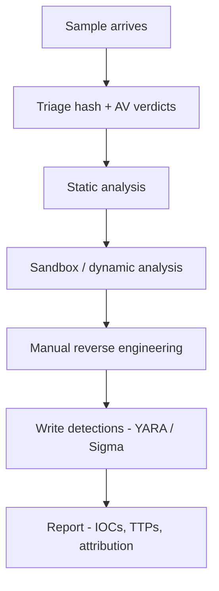
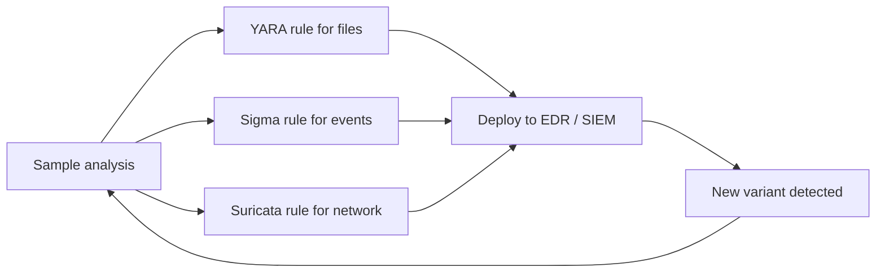

# 🦠 Malware Analysis & Reverse Engineering

> Malware analysis is reading the language of the adversary. Whether you're triaging a ransomware sample for IR, attributing a campaign for CTI, or writing detections for a SOC, the core skills are the same: **static and dynamic analysis** of binaries, distinguishing what's interesting from what's noise, and writing it up so others can defend.

!!! danger "Handle malware safely"
    Real malware is dangerous. Always:
    - Work in a **disposable VM**, snapshotted, with no host shares
    - Disable all networking, or route through INetSim / FakeNet
    - Never click executables on your daily-driver machine
    - Pad / encrypt samples in transit (`malware.zip` with password `infected` is the convention)
    - Use a separate physical machine for the truly nasty stuff (firmware-level malware exists)

---

## 1. The Workflow



The pipeline funnels: thousands of suspicious files → handful that need deep RE. **Spend the most time where automated tools couldn't go.**

---

## 2. The Lab

Recommended setup:

- **Host:** Linux or macOS with VirtualBox / VMware
- **Analysis VM:** Windows 10 (most malware targets), with:
  - **REMnux** as a Linux companion VM (preloaded with tools)
  - **FLARE-VM** as a Windows analysis VM (fireeye/mandiant; preinstalls everything)
- **Network**: `host-only` adapter; **INetSim** or **FakeNet-NG** on REMnux to simulate Internet (DNS, HTTP, FTP, SMTP)
- **Snapshots** before *every* run

```bash
# REMnux setup
curl -s https://REMnux.org/get | bash

# FLARE-VM (run on a fresh Win10/11 VM)
.\install.ps1
```

A quality of life rule: **never let the analysis VM touch the real Internet.** Even passive C2 callbacks reveal you to attackers.

---

## 3. Triage

### 3.1 First 60 seconds

```bash
# Hash & metadata
sha256sum sample.exe
file sample.exe
md5sum sample.exe                       # for VirusTotal

# Submit hash (NOT the sample) to public services first
# - VirusTotal — 70+ engines, behavioral data
# - Hybrid Analysis, Joe Sandbox, Any.Run — sandboxes
# - MalwareBazaar, MalShare — community samples
# - Triage (tria.ge)

# If the hash is unknown publicly, you have something interesting.
# If it's known, you can short-circuit a lot of analysis.
```

### 3.2 PE / ELF inspection

```bash
# Strings — fastest first look
strings -n 8 sample.exe | less
strings -el sample.exe                  # 16-bit unicode strings (Windows)

# PE structure
peframe sample.exe                       # high-level summary
exiftool sample.exe                      # metadata
pefile sample.exe                        # detailed (Python lib)
DIE (Detect It Easy) GUI                 # packers + compiler ID

# ELF
readelf -a sample.elf
objdump -d sample.elf | less
```

We ship `scripts/malware/pe_analyzer.py` — a single-file PE inspector that prints sections, imports, exports, resources, suspicious indicators, and TLS callbacks. Useful as a quick first pass without firing up a heavy tool.

### 3.3 What to look for

| Signal | Meaning |
|---|---|
| Imports `VirtualAlloc + WriteProcessMemory + CreateRemoteThread` | Code injection |
| Imports `URLDownloadToFile + ShellExecute` | Downloader |
| Imports `CryptEncrypt + CryptGenKey` | Ransomware? |
| Imports `RegSetValueEx` on `Run` keys | Persistence |
| Section names like `UPX0`, `MPRESS1`, `.aspack` | Packer |
| High entropy (>7.0) in `.text` | Packed / encrypted |
| TLS callback present | Anti-debug; runs before main |
| Resource section unusually large | Embedded payload |
| Imports `IsDebuggerPresent`, `CheckRemoteDebuggerPresent` | Anti-debug |
| Imports `GetTickCount` + sleep loops | Anti-sandbox timing checks |

---

## 4. Static Analysis Deep Dive

### 4.1 YARA — pattern matching

```yara
rule example_loader {
  meta:
    description = "Detect specific stage-1 loader pattern"
    author = "you"
    date = "2026-01-15"
  strings:
    $api1 = "VirtualAllocEx" ascii
    $api2 = "CreateRemoteThread" ascii
    $url  = /https?:\/\/[a-z0-9.-]+\/(beacon|gate|comm)\.php/ nocase
    $magic = { 4D 5A 90 00 03 00 00 00 04 }   // PE header pattern
  condition:
    uint16(0) == 0x5A4D and 2 of ($api*) and ($url or $magic)
}
```

```bash
yara rules.yar samples/                  # scan
yara -r rules.yar /path/                 # recursive
yarGen.py -m samples/ -o new_rules.yar   # auto-generate
```

The defensive workflow: build YARA rules from samples → deploy to EDR / SIEM → match new variants. **YARA is the lingua franca of detection engineering.**

### 4.2 capa — capability detection

`capa` matches code patterns to MITRE ATT&CK and capability tags ("encrypt data", "communicate via HTTP", "inject into process") — gives you a structured behavioral summary without running.

```bash
capa sample.exe
```

Output looks like:

```
CAPABILITY: communicate via HTTP
  match: function @ 0x401050
  detail: imports WinHTTP API, parses URL
ATT&CK: T1071.001 — Application Layer Protocol: Web Protocols
```

### 4.3 Disassemblers / Decompilers

| Tool | Cost | Notes |
|---|---|---|
| **Ghidra** | Free (NSA) | The default for most analysts in 2026; excellent decompiler |
| **IDA Pro** | $$$$ | Industry standard; best decompiler (Hex-Rays) |
| **Binary Ninja** | $$ | Modern; strong API; cloud version |
| **radare2 / Cutter** | Free | CLI-first; Cutter is the GUI |
| **objdump + grep** | Free | When everything else is blocked |

The workflow:

1. Open in Ghidra
2. Run auto-analysis
3. Find `entry` → walk down
4. Identify Win API calls (Ghidra labels them)
5. Rename functions as you understand them (`FUN_00401234` → `decrypt_config`)
6. Annotate; cross-reference; iterate

After 5–10 samples this becomes natural. After 50, you read x86 like English.

### 4.4 Strings discipline

Don't just `strings | less` — **categorize**:

```bash
strings sample.exe | grep -E "^https?://"
strings sample.exe | grep -E "\\\\(Software|HKEY)"  # registry refs
strings sample.exe | grep -iE "(error|fail|debug)"  # debug strings (often left in)
strings sample.exe | grep -E "[A-Za-z]:\\\\"        # file paths
strings sample.exe | python3 -c 'import sys; [print(l) for l in sys.stdin if len(l.strip()) > 30]'
```

C2 URLs hide as base64, ROT13, single-byte XOR. `cyberchef` helps decode visually.

---

## 5. Dynamic Analysis

### 5.1 Sandboxes

Public:

- **Any.Run** (interactive; freemium)
- **Joe Sandbox**
- **Hatching Triage (tria.ge)**
- **VirusTotal sandbox**
- **Hybrid Analysis (CrowdStrike Falcon Sandbox)**

Self-hosted:

- **Cuckoo / CAPE Sandbox** — open source
- **DRAKVUF** — VMI-based; harder to detect
- **Cape, Joesandbox-ce** — modern forks

Sandboxes run the sample in an isolated VM and produce:
- Network traffic (.pcap)
- API call logs
- Registry / file changes
- Screenshots
- Behavioral signatures

The downside: malware **knows about sandboxes** and increasingly evades them (sleep timers, mouse-movement checks, hardware fingerprinting, "is the username `Sandbox`?"). Manual analysis is still required for advanced samples.

### 5.2 Manual dynamic — the toolkit

Run **inside your isolated VM**, with snapshots:

| Tool | Watches |
|---|---|
| **Process Monitor (procmon)** | File / registry / process / network events |
| **Process Hacker / System Informer** | Live process tree, handles, modules, memory |
| **API Monitor** (rohitab) | Specific Win API calls with arguments |
| **Wireshark** | Network traffic |
| **FakeNet-NG** | Simulate Internet, log every connection |
| **Regshot** | Snapshot registry before/after |
| **ProcDOT** | Visualize procmon output as a graph |

The classic dynamic-analysis flow:

```text
1. Snapshot the VM
2. Start procmon (filter to the process), Wireshark, FakeNet-NG
3. Detonate the sample
4. Wait 30s — 5min depending
5. Stop tools; collect logs
6. Revert snapshot for next run
```

### 5.3 Debuggers

For unpacking / understanding evasion:

- **x64dbg / x32dbg** — the modern Windows user-mode standard
- **WinDbg / WinDbg Preview** — Microsoft's; required for kernel debugging
- **OllyDbg** — legacy, still has fans
- **GDB + pwndbg/peda** — Linux

Workflow:

1. Open packed binary in x64dbg
2. Set breakpoint on `VirtualAlloc`, `VirtualProtect`, `LoadLibrary`
3. Step through unpacking stub
4. Dump unpacked memory once `RWX` page is populated
5. Reanalyze the dump statically

Unpacking is the gateway skill. The major packers (UPX, MPRESS, Themida, VMProtect, Enigma) each have their own challenges — UPX is `upx -d`; Themida takes weeks of practice.

---

## 6. Common Malware Families to Recognize

Pattern-recognition skills come from familiarity. The 2024–2026 most-relevant families:

| Family | Type | Notes |
|---|---|---|
| **Cobalt Strike** | C2 | Most-abused commercial tool; "Beacon" implant |
| **Sliver** | C2 | Open-source CS alternative |
| **Brute Ratel** | C2 | Newer commercial |
| **Emotet** | Loader | Reborn after takedown; massive distribution |
| **IcedID / Bumblebee** | Loader | Ransomware precursors |
| **QakBot / Qbot** | Banking-trojan turned loader | Took down 2023, partial revival |
| **LockBit / BlackCat / Royal / Akira** | Ransomware | Read DFIR Report write-ups |
| **PlugX / ShadowPad** | APT (Chinese-aligned) | China-nexus campaigns |
| **TrickBot** | Banking trojan | Well-documented |
| **AsyncRAT / DarkComet / NjRAT** | Commodity RAT | Beginner-friendly to analyze |
| **AgentTesla / FormBook** | Stealer | Common in malspam |
| **Lumma / RedLine / Vidar** | Infostealer | The 2024–2026 commodity stealer wave |

Track campaigns through:
- The DFIR Report (thedfirreport.com)
- Mandiant / Google TAG / Palo Alto Unit 42 / Microsoft MSTIC blogs
- vx-underground (sample collection + writeups)
- Malpedia (Fraunhofer FKIE) — family encyclopedia

---

## 7. Indicators & Reporting

### 7.1 IOCs

A finished analysis produces:

- **File hashes** (MD5/SHA1/SHA256/imphash) for the sample + droppers
- **Network IOCs** — domains, IPs, URLs, JA3/JA4 fingerprints
- **Host IOCs** — file paths, mutex names, registry keys, scheduled tasks, services
- **Behavioral IOCs** — command-line patterns, parent-child relationships
- **YARA rules** for static detection
- **Sigma rules** for log-based detection

Stage 1's `scripts/defense/ioc_extractor.py` extracts IOCs from text — useful when summarizing a threat-intel report.

### 7.2 Sigma rules

Sigma is to logs what YARA is to files. Vendor-neutral rule format compiled to Splunk SPL / Elastic / Sentinel / etc.

```yaml
title: Suspicious wmic process call
id: a3c9b...
status: stable
description: wmic launching cmd suggests lateral movement or recon
logsource:
  product: windows
  category: process_creation
detection:
  selection:
    Image|endswith: '\wmic.exe'
    CommandLine|contains:
      - 'process call'
      - 'shadowcopy'
  condition: selection
level: high
tags: [attack.execution, attack.t1047]
```

The SigmaHQ repo on GitHub has thousands; deploy them to your SIEM as your detection baseline.

### 7.3 The MITRE ATT&CK lens

Every behavior maps to an ATT&CK technique. Speak ATT&CK fluently:

- **T1059** — Command and Scripting Interpreter
- **T1547** — Boot or Logon Autostart Execution
- **T1055** — Process Injection
- **T1071** — Application Layer Protocol (C2)
- **T1486** — Data Encrypted for Impact (ransomware)

Reports / detections / threat-intel all reference ATT&CK. ATT&CK Navigator visualizes coverage.

---

## 8. Anti-Analysis Tricks (And How to Defeat Them)

Modern malware *expects* analysis. Common evasion:

| Trick | Bypass |
|---|---|
| `IsDebuggerPresent`, PEB checks | Patch return; use `ScyllaHide` plugin in x64dbg |
| Timing — `GetTickCount` before/after | Patch the timer; let the sample think no time passed |
| Mouse / window-name checks | Set `username = "user"`, install Office, simulate input |
| WMI hardware fingerprinting | Patch `Win32_BIOS`/`Win32_ComputerSystem` returns |
| Domain check (only run on domain-joined hosts) | Spoof domain join |
| Sleep loops (delay until sandbox times out) | Hook `Sleep`, return immediately |
| API hashing (no readable imports) | Resolve at runtime via `kernel32!GetProcAddress`; trace |
| Process hollowing | Watch `WriteProcessMemory + SetThreadContext + ResumeThread` |
| Reflective DLL injection | Watch `VirtualAllocEx + RWX + CreateRemoteThread` |
| Heaven's Gate / Wow64 transitions | Advanced; specific RE skill |

A few hours per evasion technique → encyclopedia of countermeasures. This is the bulk of malware RE work.

---

## 9. Hands-On Lab

Sources of safe samples:

- **MalwareBazaar** — categorized, hash-searchable
- **VX-Underground** — huge corpus + writeups
- **theZoo** — old but classic; lots of named families
- **Practical Malware Analysis** book companion samples (free)
- **MalwareTech's Beginner Malware Analysis Course**

Suggested ladder:

1. Analyze a packed UPX downloader. Unpack, find C2 URL.
2. Static + dynamic on a commodity RAT (NjRAT, AsyncRAT). Extract config.
3. Ransomware sample (e.g., a research-friendly LockBit clone). Identify encryption routine, key handling.
4. Cobalt Strike Beacon — extract config with `1768.py` or `cs-extract-key.py`.
5. APT-grade sample — pick a sample from a well-documented campaign and reproduce the analysis.

Time: 6 months of weekly samples → competent. 2–3 years → senior.

---

## 10. Detection Engineering — From RE to Defense

The endgame of malware analysis is *detections that find the next variant*:



A good detection engineer outputs:

- **YARA**: matches the family even after recompilation
- **Sigma**: matches the *behavior*, surviving repackaging
- **Suricata / Snort**: matches network signatures
- **Sysmon config**: ensures relevant events are logged

The Sigma + Sysmon + Velociraptor + EDR stack is the modern blue-team baseline for detection coverage.

---

## 11. Interview Questions

- Walk through your initial triage of an unknown EXE.
- What does high entropy in the `.text` section suggest, and how do you confirm?
- Difference between YARA and Sigma — when do you write which?
- A sample uses API hashing. How do you find the imports?
- Walk through extracting the C2 URL from a Cobalt Strike Beacon.
- Sandbox returned "no behavior" but the file is clearly malicious. What do you check?

---

## 12. Tools Quick Reference

| Tier | Tools |
|---|---|
| Triage | `pefile`, `peframe`, `exiftool`, our `pe_analyzer.py`, DIE |
| Static | YARA, capa, Ghidra, IDA, Binary Ninja, radare2 |
| Dynamic | procmon, Process Hacker, API Monitor, Wireshark, FakeNet-NG, x64dbg |
| Sandboxing | Any.Run, Joe, Triage, Cuckoo / CAPE, DRAKVUF |
| Detection | YARA, Sigma, Suricata, Sysmon |
| Repos | MalwareBazaar, VX-Underground, MalShare, theZoo |
| References | Malpedia, MITRE ATT&CK |

---

## 13. Further Reading

- **Practical Malware Analysis**, Sikorski & Honig (still the bible)
- *The Antivirus Hacker's Handbook*
- *Practical Reverse Engineering*, Dang/Gazet/Bachaalany
- The DFIR Report blog (thedfirreport.com) — case studies
- vx-underground papers
- MalwareTech's blog + courses
- Aleksandra Doniec's "MalwareTech" challenges

---

[← Cloud Security](cloud.md) · [Phase 4 Index →](index.md)
