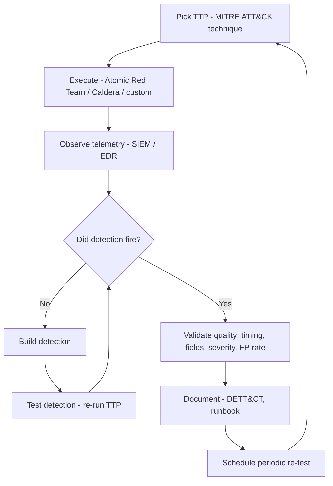

# 🟣 Purple Team & Detection Validation

> Red and blue, working in the open, on the same problem. Purple team is the maturity stage of every security program — the explicit acknowledgment that adversarial testing only matters if defenders learn from it, and defenses only matter if they survive contact with adversaries.

For roles in: **internal purple teams (any large org)**, **detection engineering specialists**, **adversary emulation engineers (vendor + government)**, **MITRE engineers**, **MSSP MDR validation teams**.

## What purple team actually is

Three common definitions exist; learn all three:

1. **A function** — a permanent team that runs continuous adversary emulation and detection validation
2. **An exercise** — time-boxed engagements where red and blue work together with full transparency
3. **A culture** — every red engagement ends in a blue debrief; every detection is tested adversarially

The first organization-level decision is which definition you're operating under. A "purple team day" is different from a "purple team capability" is different from a "purple team mindset."

## Purple team vs red team vs pentest

```
┌──────────┬──────────────┬──────────────┬─────────────────┐
│          │   Pentest    │   Red Team   │   Purple Team   │
├──────────┼──────────────┼──────────────┼─────────────────┤
│ Goal     │ Find bugs    │ Steal jewels │ Improve defense │
│ Stealth  │ No           │ Yes          │ No (open)       │
│ Blue     │ Knows scope  │ Doesn't know │ Co-located      │
│ Output   │ Findings     │ Story + gaps │ Detections      │
│ Iterate  │ Annual       │ Annual+      │ Weekly          │
│ Cost     │ $            │ $$$$         │ $$              │
│ Maturity │ Required     │ Mid-mature   │ Mature          │
└──────────┴──────────────┴──────────────┴─────────────────┘
```

You don't replace red team with purple. They serve different purposes. Red team validates against an adversary you can't predict. Purple team builds detections against ones you can.

## The detection validation loop



This loop is the heartbeat of a purple team. Run it constantly across your most-cared-about TTPs. Track coverage in a matrix.

## Adversary emulation plans

The basis of structured purple teaming. An emulation plan tells you, for a chosen threat actor:

1. Which techniques they use (mapped to ATT&CK)
2. Which tools they use (often public proxies — Cobalt Strike, Mimikatz, etc.)
3. The order they typically operate
4. The artifacts and IOCs they leave

Then you execute the plan, end-to-end, in a controlled environment.

### MITRE Adversary Emulation Library

[https://github.com/center-for-threat-informed-defense/adversary_emulation_library](https://github.com/center-for-threat-informed-defense/adversary_emulation_library)

Free, open-source emulation plans for major threat groups: APT3, APT29, FIN6, FIN7, menuPass, OilRig, Carbanak, Sandworm, OceanLotus, Wizard Spider, Turla, more added each year.

Each plan includes:
- Background on the actor
- Step-by-step intrusion phases
- Atomic test commands
- Detection guidance per step

### CTID (Center for Threat-Informed Defense)

The MITRE-affiliated nonprofit producing these. Their other useful releases:
- **Insider Threat TTP Knowledge Base**
- **Mappings — ATT&CK to NIST 800-53, CVE-to-ATT&CK, Cloud Provider IAM**
- **Defending IaaS Workloads with ATT&CK**
- **Top ATT&CK Techniques** (data-driven prioritization)
- **Sensor Mappings** (telemetry sources mapped to detectable techniques)

## Tools for execution

### Atomic Red Team (Red Canary)

[https://github.com/redcanaryco/atomic-red-team](https://github.com/redcanaryco/atomic-red-team)

A library of small, single-test scripts mapped to ATT&CK. ~3000+ tests, free, run with [Invoke-AtomicRedTeam](https://github.com/redcanaryco/invoke-atomicredteam) (PowerShell).

```powershell
# Install
IEX (IWR 'https://raw.githubusercontent.com/redcanaryco/invoke-atomicredteam/master/install-atomicredteam.ps1' -UseBasicParsing)
Install-AtomicRedTeam -getAtomics

# List tests for technique T1003.001 (LSASS Memory)
Invoke-AtomicTest T1003.001 -ShowDetails

# Execute test
Invoke-AtomicTest T1003.001 -TestNumbers 1
# Or run a whole technique
Invoke-AtomicTest T1003.001
# Cleanup
Invoke-AtomicTest T1003.001 -Cleanup
```

Perfect for the inner loop: pick a technique, fire it, watch your SIEM, write the missing detection.

### MITRE Caldera

[https://github.com/mitre/caldera](https://github.com/mitre/caldera)

Full adversary-emulation framework. Server + agents (Sandcat, Manx, Ragdoll). Plug in adversary profiles — sequences of techniques — and run end-to-end campaigns automatically.

Strengths: orchestrated, multi-stage, planner module that adapts to environment. Weakness: bigger lift to deploy than Atomic Red Team; less granular tweakability.

### Stratus Red Team (Cloud)

[https://github.com/datadog/stratus-red-team](https://github.com/datadog/stratus-red-team)

Datadog's open-source cloud-native ART. AWS, Azure, GCP, Kubernetes techniques. Each technique self-prep + warm-up + detonate + cleanup.

```bash
stratus list                              # all techniques
stratus list --platform aws               # AWS only
stratus warmup aws.persistence.iam-backdoor-user
stratus detonate aws.persistence.iam-backdoor-user
stratus status                            # what's deployed
stratus cleanup --all                     # clean up
```

### Other execution tools

| Tool | Notes |
|---|---|
| **[CALDERA](https://caldera.mitre.org/)** | MITRE's flagship; most capable orchestration |
| **[Atomic Red Team](https://atomicredteam.io/)** | Per-technique tests; quickest start |
| **[Stratus Red Team](https://github.com/datadog/stratus-red-team)** | Cloud-only ART analog |
| **[PurpleSharp](https://github.com/mvelazc0/PurpleSharp)** | C# tool for AD-focused emulation |
| **[APTSimulator](https://github.com/NextronSystems/APTSimulator)** | Florian Roth's, fast desktop-side simulation |
| **[Endgame's Red Team Automation (RTA)](https://github.com/endgameinc/RTA)** | Python-based, mature |
| **[Infection Monkey](https://www.akamai.com/products/infection-monkey)** (Akamai) | Self-spreading test agent for lateral movement |
| **[AttackIQ](https://www.attackiq.com/)** / **[SafeBreach](https://www.safebreach.com/)** / **[Cymulate](https://cymulate.com/)** / **[XM Cyber](https://www.xmcyber.com/)** | Commercial Breach & Attack Simulation (BAS) platforms |

## Tracking & measuring with VECTR

[Security Risk Advisors' VECTR](https://github.com/SecurityRiskAdvisors/VECTR) is the open-source standard for tracking purple team exercises. It records:

- The campaign + scope
- Each test case (ATT&CK technique + procedure)
- Whether prevention/detection fired
- The data source / tool that provided the signal
- Timing details
- Heat maps over time, across teams, by technique

Output: a real coverage matrix that improves measurably between exercises. Without something like VECTR, "we did purple team exercise" becomes a check-the-box activity with no carry-forward value.

## DETT&CT — coverage with confidence

[Rabobank's DETT&CT](https://github.com/rabobank-cdc/DeTTECT) maps your detections and data sources onto the MITRE ATT&CK matrix, with a confidence score.

The killer feature: not just "I have a detection for T1003.001," but "*how good* is that detection, what data sources does it depend on, and how often have I tested it?" Output is a Navigator JSON — a heat map you can show executives.

Run after every exercise. Confidence scores climb (or drop) as you learn what your detections actually catch.

## Threat-informed defense

The umbrella term for the philosophy: prioritize defense investments based on **what real adversaries actually do**, not abstract risk frameworks.

The CTID and Mandiant both publish "top ATT&CK techniques" lists by data analysis of real intrusions. As of 2024–25, the techniques most commonly observed in big-game ransomware:

1. T1078 — Valid Accounts
2. T1059.001 — PowerShell
3. T1486 — Data Encrypted for Impact (the ransomware itself)
4. T1490 — Inhibit System Recovery
5. T1003.001 — LSASS Memory
6. T1021.002 — SMB/Admin Shares (lateral)
7. T1112 — Modify Registry
8. T1110 — Brute Force
9. T1547.001 — Run Keys (persistence)
10. T1027 — Obfuscated Files

Coverage of these ten gets you most of the way against the most common adversaries. Coverage of zero of them means you're undefended against the actual threat landscape.

## A purple team exercise — typical timeline

**Week 1: Scoping**
- Pick adversary to emulate (e.g., FIN7)
- Pick scope (a specific business unit, environment, or asset class)
- Agree on objectives, success criteria, telemetry to capture
- Define what "found a gap" means
- Approval from CISO + business owner

**Week 2: Prep**
- Red team prepares the emulation chain
- Blue team is in the loop, knows it's coming, but not exact timing/details
- Lab validation of every technique on a clean test box first
- Backup plans for if production telemetry gaps prevent learning

**Week 3: Execution**
- Day 1: Initial access / phish
- Day 2: Foothold / persistence / discovery
- Day 3: Lateral movement
- Day 4: Privilege escalation / credential access
- Day 5: Action on objectives
- Each day: red executes morning, blue investigates afternoon, joint debrief end-of-day. Red shares exact commands so blue can dig into telemetry directly.

**Week 4: Analysis & action**
- Walk through every technique: did blue see it? With what telemetry? How would they have known it was malicious?
- Write detection backlog for every gap
- Update DETT&CT and VECTR
- Schedule re-test for 90 days out

**Week 5+: Re-test**
- Same techniques, possibly varied. Did the new detections catch them? Are old ones still good?

## Day-1 checklist for a new purple program

If you're standing one up, in priority order:

1. **Get a list of your top 15 ATT&CK techniques** — talk to threat intel; if you don't have it, use CTID's top techniques + known sector reports
2. **Audit existing detections** — what techniques do you currently cover? At what confidence?
3. **Run Atomic Red Team for those 15 techniques in a lab** — observe telemetry, validate detections fire
4. **Write detections for the misses**
5. **Establish a cadence** — biweekly or monthly purple-team session; one technique per week minimum
6. **Stand up VECTR** — track everything from day one
7. **Establish a JIT (Joint Improvement Tracker)** — gaps + owners + due dates
8. **Quarterly trend report** — coverage delta over time, top wins, top remaining gaps

## Anti-patterns to avoid

- **Pen-test theater.** Running Caldera once, finding 50 gaps, fixing none. Without a backlog and re-test, you're worse off than never having done it.
- **One-and-done coverage.** "We have a detection for T1003.001" — but it was written 3 years ago, nobody's tested it, the EDR was reconfigured twice since. Re-test every detection annually at minimum.
- **Tool-fetishization.** Buying a $500k BAS platform without an analyst to interpret its results. The tool is the easy part.
- **Red-blames-blue / blue-blames-red.** The purple culture requires checking egos at the door. The exercise is *adversarial against the system*, not against each other.
- **Hiding the worst gaps.** A purple report that doesn't surface uncomfortable findings to leadership is a purple report that won't get budget for fixes.

## Hands-on practice

- **[DetectionLab](https://detectionlab.network/)** + **[Atomic Red Team](https://atomicredteam.io/)** — complete home lab. Spin up the lab, run atomics, write detections.
- **[Splunk Attack Range](https://github.com/splunk/attack_range)** — Splunk's lab + attack simulation, Terraform-deployable
- **[Caldera training](https://caldera.mitre.org/)** — free, official
- **[BlueTeamLabs Online — Purple Team challenges](https://blueteamlabs.online/)** — gamified
- **[CRTL exam (Zero-Point Security)](https://training.zeropointsecurity.co.uk/)** — emphasizes detection awareness, blue debriefs

## Certifications

| Cert | Provider | Notes |
|---|---|---|
| **ZPS Certified Red Team Operator (CRTO + CRTL)** | Zero-Point Security | Includes purple-team awareness |
| **Mandiant Red Team / Purple Team courses** | Mandiant | Expensive but excellent |
| **SANS SEC599 (Defeating Advanced Adversaries)** | SANS | Detection-engineering focused |
| **SANS SEC699 (Purple Team Tactics)** | SANS | Purple-specific course; expensive |
| **eCPTX → eCRE** (eLearnSecurity) | eLearnSecurity | Continuing series |

There's no single "purple team cert" that's a clear winner. Most practitioners come laterally — strong red + cross-trained on detection, or strong blue + comfortable executing TTPs.

## Real-world purple programs to learn from

- **MITRE ATT&CK Evaluations** ([attackevals.mitre-engenuity.org](https://attackevals.mitre-engenuity.org/)) — vendor evaluations using real adversary emulations against EDR products. Read the methodology and detection-by-detection results — they're the model for rigorous purple work.
- **Mandiant ATT&CK Evaluation reports** — Mandiant publishes their own analyses of vendor performance.
- **Microsoft Detection Engineering team** — public talks (BlueHat, RSA) describe their internal purple loop.
- **Google's autonomous purple-teaming research** — emerging, [GTI's blogs](https://cloud.google.com/blog/topics/threat-intelligence) cover some of it.

## Interview questions

1. *"Walk me through how you'd build a coverage matrix for ATT&CK Initial Access techniques."*
2. *"Atomic Red Team vs Caldera vs commercial BAS — when do you reach for each?"*
3. *"You ran an emulation, got an alert. How do you decide if the detection is good enough?"*
4. *"Detection-as-code: what does a healthy detection-engineering CI/CD pipeline look like?"*
5. *"What's DETT&CT and how does it differ from ATT&CK Navigator?"*
6. *"How would you measure purple team effectiveness over a year?"*
7. *"You've found a gap in T1003.001 detection. Walk me through writing, testing, deploying a fix."*

## Recommended reading

- *Purple Team Strategies* (Reilly / Naef / Halberstadt) — practical book on standing up and running programs
- [Jorge Orchilles's purple-team materials](https://www.jorgeorchilles.com/) — author of the *C2 Matrix* and SANS SEC699
- [Florian Roth's Sigma & detection writings](https://cyb3rops.medium.com/)
- [Red Canary's Threat Detection Report](https://redcanary.com/threat-detection-report/) — annual, IOA-focused, gold standard
- [Adam Mashinchi's writings on emulation](https://medium.com/@amashinchi)
- [SCYTHE blog](https://www.scythe.io/library) — Bryson Bort's company, emulation-platform vendor with great free content
- [The Center for Threat-Informed Defense](https://ctid.mitre-engenuity.org/) — every published artifact

## Phase 5 wrap-up

Phase 5 takes you through the four pillars of operational defense:

- **Red Team** — emulating adversaries, externally
- **Blue Team** — detecting, alerting, responding daily
- **DFIR** — investigating after detection
- **Threat Intel** — informing all of the above
- **Purple Team** — closing the loop between offense and defense

These five competencies are the heart of every modern security operation. The career step from Phase 5 — into [Phase 6: Career](../06-career/index.md) — is where the technical discipline meets professional practice: how you communicate findings, build a portfolio, and break into the government and private sector roles you've been preparing for.

---

[← Threat Intel](threat-intel.md)  ·  [Phase 6 →](../06-career/index.md)
