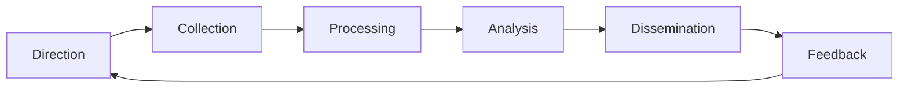

# 🎯 Cyber Threat Intelligence (CTI)

> Detection without intelligence is shooting in the dark. Threat intelligence is the discipline of turning observed adversary behavior into decisions: what to defend, what to detect, who to share with, and what to expect next.

For roles in: **CTI analyst at vendors (Mandiant, CrowdStrike, Recorded Future, Mitiga, ReliaQuest)**, **strategic CTI at large enterprises (banks, energy, pharma)**, **government CTI (CISA, FBI, NSA, CERT-In, NCSC, JPCERT)**, **ISAC analysts (FS-ISAC, H-ISAC, E-ISAC, ICS-ISAC)**, **journalism / OSINT investigators (Bellingcat, OCCRP)**.

## Why threat intel matters

A SOC without CTI is reactive. A SOC with CTI is proactive — it knows which adversary is most likely to target it, what TTPs they use, and what to detect *before* the attack reaches its environment. The difference between "we have alerts" and "we have the right alerts" is intelligence.

Three levels:

| Level | Audience | Output |
|---|---|---|
| **Strategic** | Execs, board | Trend reports, geopolitical context, risk briefings |
| **Operational** | SOC managers, threat hunters | Threat actor profiles, campaign reports, predictions |
| **Tactical** | Detection engineers, analysts | IOCs, TTPs, Sigma rules, YARA signatures |

Most newcomers conflate "tactical IOCs" with "all of CTI" — but a feed of IPs from VirusTotal is the lowest tier of value.

## The intelligence lifecycle



- **Direction** — what intelligence questions does the organization need answered?
- **Collection** — gather raw data from open / commercial / internal sources
- **Processing** — normalize, deduplicate, structure (STIX, MISP)
- **Analysis** — turn data into intelligence: claims with confidence levels and sourcing
- **Dissemination** — get it to the right people in the right format (a feed for SOC, a report for execs)
- **Feedback** — was it useful? Did it answer the question?

If you're producing reports nobody reads, you're failing at direction or dissemination, not analysis.

## IOCs vs TTPs — the distinction that matters

| Type | Example | Half-life | Defender value |
|---|---|---|---|
| Hash | `e3b0c44...` | Hours | Block; weak detection |
| IP address | `185.220.101.50` | Days | Block; check who else hit |
| Domain | `cdn-update.tk` | Days–weeks | Block; pivot to similar |
| URL pattern | `/wp-includes/.htaccess.php` | Weeks | Useful for detection |
| File path / persistence | `C:\Users\Public\update.ps1` | Months | Hunt for it |
| Registry key | `HKCU\...\Run\OneDrive` | Months | Persistence detection |
| TTP / behavior | "Encoded PowerShell from Office macro" | Years | Strongest detection |

The classic [Pyramid of Pain (David Bianco, 2013)](https://detect-respond.blogspot.com/2013/03/the-pyramid-of-pain.html) ranks IOC types by how painful they are for the attacker to change. Detect at the top of the pyramid, block at the bottom.

## Frameworks you'll work in

### MITRE ATT&CK

The taxonomy of adversary behaviors. **Tactics** (the why — Initial Access, Persistence, Lateral Movement, etc.) contain **Techniques** (the how — T1059 Command and Scripting Interpreter), which have **Sub-techniques** (T1059.001 PowerShell).

Use it for:
- Tagging detections / incidents
- Coverage analysis (DETT&CT, ATT&CK Navigator)
- Adversary profiles ("APT29 uses these techniques")
- Communication ("T1003.001 lsass dumping" is universal)

### Diamond Model of Intrusion Analysis

Every intrusion is the relationship between four nodes:

```
       Adversary
        /      \
       /        \
Capability ------ Infrastructure
       \        /
        \      /
         Victim
```

You analyze a campaign by pivoting on edges: adversary → infrastructure (what domains?), infrastructure → victim (who else uses this DNS?), capability → adversary (whose tool is this?). Ideal mental model for attribution.

### Cyber Kill Chain (Lockheed Martin, 2011)

The earlier of the two big frameworks. Linear:

```
Recon → Weaponize → Deliver → Exploit → Install → C2 → Actions on Objectives
```

Less granular than ATT&CK, but useful for executive narratives ("they got past Delivery, but we caught them at Install").

### F3EAD

Find, Fix, Finish, Exploit, Analyze, Disseminate. Borrowed from special-ops targeting. Structures *response* operations against threat actors — you find, contain, eradicate, then turn the artifacts back into intelligence.

## Sharing standards

### STIX 2.1

[Structured Threat Information eXpression](https://oasis-open.github.io/cti-documentation/) — JSON schema for everything in the threat domain (indicators, campaigns, threat actors, malware, attack patterns).

```json
{
  "type": "indicator",
  "spec_version": "2.1",
  "id": "indicator--26ffb872-1dd9-446e-b6f5-d58527e5b5d2",
  "created": "2026-04-15T16:23:11.000Z",
  "name": "Malicious C2 domain",
  "pattern": "[domain-name:value = 'cdn-update.tk']",
  "pattern_type": "stix",
  "valid_from": "2026-04-15T16:23:11.000Z",
  "labels": ["malicious-activity"]
}
```

Our [`threat-intel/stix_query.py`](../../scripts/threat-intel/stix_query.py) script queries STIX 2.1 bundles for IoC and TTP extraction.

### TAXII 2.1

[Trusted Automated eXchange of Indicator Information](https://oasis-open.github.io/cti-documentation/taxii/intro) — the API for exchanging STIX. Servers expose collections; clients pull. Most TI platforms (MISP, OpenCTI, ThreatQ, Anomali, Recorded Future) speak it.

### MISP (Malware Information Sharing Platform)

[MISP](https://www.misp-project.org/) is the de facto open-source TIP (Threat Intelligence Platform). Its native format predates STIX 2.x but exports/imports both. CIRCL (Luxembourg CERT) is the original maintainer. Used heavily by EU CSIRTs, FS-ISAC, and increasingly Indian sectoral CSIRTs.

Key concepts:
- **Events** = bundles of related IOCs/context
- **Attributes** = individual IOCs with type
- **Galaxies** = curated taxonomies (threat actors, MITRE, malpedia)
- **Sharing groups** = controlled distribution
- **Feeds** = ingest sources, including federated MISP-to-MISP

### OpenCTI

[Filigran's OpenCTI](https://www.opencti.io/) — newer, graph-database-driven (Grakn → recent versions Elastic + RedisInsight). Thinks natively in STIX 2.1. Excellent UI for exploring relationships ("show me all techniques used by APT29 against pharma sector").

### Other TIPs

- **Anomali ThreatStream** — commercial, mature
- **ThreatQ** — commercial, used by many SOCs
- **EclecticIQ** — European, defense / government clientele
- **Recorded Future** — commercial intelligence company + platform
- **Microsoft Defender Threat Intelligence (MDTI)** — RiskIQ-derived

## Threat actor naming — and the chaos of it

Each vendor names threat actors differently, and the names persist forever:

| Group (CrowdStrike) | Mandiant | Microsoft (now weather/animals) | Other |
|---|---|---|---|
| Cozy Bear | APT29 | Midnight Blizzard | Nobelium, The Dukes |
| Fancy Bear | APT28 | Forest Blizzard | Sofacy, Sednit |
| Charming Kitten | APT35 | Mint Sandstorm | Phosphorus |
| Lazarus | APT38 / TEMP.Hermit | Diamond Sleet | Hidden Cobra |
| Volt Typhoon | UNC3236 | Volt Typhoon | Vanguard Panda |
| Scattered Spider | UNC3944 | Octo Tempest | 0ktapus, Roasted 0ktapus |

The [CTI Aggregated Threat Actor Naming](https://github.com/StrangerealIntel/EternalLiberty) project tries to map these. Microsoft moved to weather-themed naming (Sleet, Sandstorm, Typhoon, Tempest, Blizzard, Rain) by origin — useful, but you'll still see the old names everywhere in reports.

## Attribution — the most misunderstood topic

Public attribution claims (state-sponsored vs financially motivated, country of origin) are a **probabilistic conclusion** based on:

- Tool overlap with previous campaigns
- Infrastructure reuse (rare with disciplined groups)
- Targeting patterns (sectors, geographies)
- Language / timezone artifacts in code or beacon callbacks
- Code similarity / CodeQL signatures
- Operational mistakes (logged into Github with their real account, etc.)

Public attribution is about confidence levels, not certainty. CTI analysts use words like *low confidence*, *moderate confidence*, *high confidence* with [ICD-203 estimative language](https://www.dni.gov/files/documents/ICD/ICD%20203%20Analytic%20Standards.pdf). Don't say "Russia did it." Say "We assess with moderate confidence that this activity is consistent with APT29 / SVR-attributed operations."

## OSINT for CTI

Tooling and tradecraft:

- **Domain & cert investigation**: [crt.sh](https://crt.sh/), [Censys](https://search.censys.io/), [Shodan](https://www.shodan.io/), [SecurityTrails](https://securitytrails.com/), [ZoomEye](https://www.zoomeye.org/)
- **Passive DNS**: [VirusTotal](https://www.virustotal.com/), [PassiveTotal/RiskIQ](https://www.riskiq.com/) (now MS), [DomainTools](https://www.domaintools.com/), [Farsight DNSDB](https://www.farsightsecurity.com/)
- **Malware**: [VirusTotal](https://www.virustotal.com/), [MalwareBazaar (abuse.ch)](https://bazaar.abuse.ch/), [Hybrid Analysis](https://www.hybrid-analysis.com/), [Joe Sandbox](https://www.joesandbox.com/), [ANY.RUN](https://any.run/)
- **Phishing & threats**: [URLscan.io](https://urlscan.io/), [PhishTank](https://www.phishtank.com/), [OpenPhish](https://openphish.com/)
- **Code repositories**: GitHub Code Search, [grep.app](https://grep.app/), [Sourcegraph](https://sourcegraph.com/)
- **Leak sites**: [Have I Been Pwned](https://haveibeenpwned.com/), [DeHashed](https://www.dehashed.com/), [Intelligence X](https://intelx.io/) (paid)
- **Dark web monitoring**: Recorded Future, Flashpoint, ZeroFox, Searchlight Cyber (commercial); manual via Tor, Tails, careful OPSEC
- **Geolocation / timezone**: from screenshots, language artifacts, working hours

Tradecraft: **never log into anything from your real identity during OSINT**. Use a research browser profile (or VM), separate accounts, separate VPN/Tor egress as appropriate, never reuse OPSEC.

## Threat reports worth reading regularly

Subscribe and read these:

- **CrowdStrike Global Threat Report** (annual)
- **Mandiant M-Trends** (annual)
- **Microsoft Digital Defense Report** (annual)
- **Verizon Data Breach Investigations Report (DBIR)** (annual) — the one statistic-laden report executives actually read
- **Recorded Future quarterly threat reports**
- **CISA advisories** ([cisa.gov/news-events/cybersecurity-advisories](https://www.cisa.gov/news-events/cybersecurity-advisories))
- **CERT-In advisories** ([cert-in.org.in](https://www.cert-in.org.in/))
- **NCSC UK threat reports**
- **ENISA Threat Landscape** (EU annual)
- **The DFIR Report** (free quarterly real-incident writeups — don't skip)
- **Volexity blog** — top-tier APT research
- **Citizen Lab** — civil society / spyware research
- **Bellingcat** — investigative OSINT (often non-cyber but methodologically excellent)

## ISACs and sharing communities

Information Sharing and Analysis Centers — sector-specific, member-driven:

| ISAC | Sector |
|---|---|
| **FS-ISAC** | Financial services (global) |
| **H-ISAC** | Health (global) |
| **E-ISAC** | Electricity (NERC, North America) |
| **NH-ISAC** → H-ISAC | Healthcare |
| **A-ISAC** | Aviation |
| **MS-ISAC** | US state, local, tribal, territorial gov |
| **EI-ISAC** | US elections |
| **Auto-ISAC** | Automotive |
| **K12-ISAC** | US schools |
| **IT-ISAC** | Tech industry |
| **NTAS / NCSC India sectoral CERTs** | India sectoral CSIRTs (Power, BFSI, Health, Telecom, Transport, Strategic) |

Membership is paid (often expensive). The value: peer sharing, early warnings, sector-specific intel that would never make it into public reports.

**FIRST** ([first.org](https://www.first.org/)) — the Forum of Incident Response and Security Teams. Global federation of CERTs/CSIRTs/PSIRTs. CERT-In, US-CERT, JPCERT, etc. are all members. CVSS, TLP, EPSS all originate or are maintained here.

## Indian CTI ecosystem

- **CERT-In** (cert-in.org.in) — national CERT, MeitY. Empowered under Section 70B of the IT Act. Mandatory 6-hour incident reporting under the 2022 directive. Operates [CSK (Cyber Swachhta Kendra)](https://www.csk.gov.in/) for botnet remediation.
- **NCIIPC** (nciipc.gov.in) — Critical Information Infrastructure protection (under NTRO, Sec 70A IT Act). Sectoral oversight.
- **I4C** (Indian Cyber Crime Coordination Centre, MHA) — investigates and coordinates national cybercrime response.
- **NCSC** (National Cyber Security Coordinator, NSCS / PMO) — strategic policy.
- **CCMP** — Cyber Crisis Management Plan, framework for sector-level CSIRTs.
- **Sectoral CSIRTs** — CSIRT-Power, CSIRT-Fin (RBI), CSIRT-Health, CSIRT-Telecom, etc.
- **DSCI** (NASSCOM) — industry CTI sharing, runs CISO communities.

## TLP — Traffic Light Protocol

Marking system for shared intelligence (FIRST-maintained, [v2.0 active since 2022](https://www.first.org/tlp/)):

| Marking | Sharing |
|---|---|
| **TLP:RED** | Eyes-only, named recipients. Do not share. |
| **TLP:AMBER+STRICT** | Recipient organization only. |
| **TLP:AMBER** | Recipient org + clients/partners with strict need-to-know. |
| **TLP:GREEN** | Community / peers, not public. |
| **TLP:CLEAR** | Public. (Old name: TLP:WHITE) |

Mark every intel product. Respect markings or you get blacklisted from sharing communities forever.

## EPSS, CVSS, KEV — the prioritization triangle

CVSS gives severity (0–10). Doesn't tell you what's actually exploited.

- **EPSS** ([first.org/epss](https://www.first.org/epss/)) — Exploit Prediction Scoring System. Daily-updated probability that a CVE will be exploited in the next 30 days.
- **CISA KEV** ([cisa.gov/known-exploited-vulnerabilities-catalog](https://www.cisa.gov/known-exploited-vulnerabilities-catalog)) — Known Exploited Vulnerabilities. CVEs CISA has confirmed are being actively exploited. US federal agencies must patch within deadlines.

Real prioritization: **CVSS × EPSS × asset criticality + KEV override**. A CVSS 9.8 with EPSS 0.001 might wait. A CVSS 7.5 in KEV is patch-this-week.

## Indicators of *Attack* (IoA) — the future

IoCs are perishable. Indicators of Attack — describing the *behavior* — last longer:

```
IoC: hash 41a7..., domain cdn-update.tk
IoA: encoded PowerShell launched from Office app, parent winword.exe → powershell.exe with -enc
```

Modern detection-as-code repositories (SigmaHQ, Sublime Security's `marshal-crawler`, Elastic Detection Rules) ship IoAs first, IoCs as supporting context.

## Building a CTI program from zero

If you're tasked with starting one, the order of operations:

1. **Gather requirements.** What questions are leadership asking? What incidents do you wish you'd predicted?
2. **Inventory existing intel.** What feeds do you already get (vendor TI, ISACs, vendor EDRs)?
3. **Stand up a TIP.** OpenCTI for free, MISP for sharing, commercial if budget exists.
4. **Pick 3–5 priority threat actors.** Tag every TTP they use in ATT&CK. Build a coverage matrix.
5. **Build pipelines.** TIP → SIEM (for IOCs), TIP → analysts (for context), TIP → comms (for reports).
6. **Define your products.** Daily IOC feed, weekly summary, monthly threat brief, quarterly trend report.
7. **Measure.** Did your IOCs hit? Did your hunts find anything? Did execs read the report?

## Tools to know

| Tool | Use |
|---|---|
| **MISP** | Open-source TIP. Sharing-first. |
| **OpenCTI** | Open-source TIP. Graph-first. |
| **Yeti** | Lighter open-source TIP / aggregator |
| **MITRE ATT&CK Navigator** | Visualize coverage matrices |
| **DETT&CT** | Map detection coverage to ATT&CK with confidence scoring |
| **VECTR** ([SRA](https://github.com/SecurityRiskAdvisors/VECTR)) | Track detection / response testing across exercises |
| **MITRE Caldera** | Adversary emulation |
| **MITRE ATT&CK Workbench** | Local ATT&CK customization |
| **stix2 (Python lib)** | Build/parse STIX 2.1 in Python |
| **PyMISP** | Programmatic MISP access |
| **TheHive + Cortex** | IR case management + analyzers |
| **PolicyAnalyzer (Mandiant)** | Threat actor coverage analysis |
| **vt-py** | VirusTotal API wrapper |

## Hands-on practice

- **[CyberDefenders CTI challenges](https://cyberdefenders.org/blueteam-ctf-challenges/?level=1&category=Threat+Intel)** — graded
- **[Detection Lab + Atomic Red Team](https://detectionlab.network/)** — generate the telemetry, write the detections
- **[OpenCTI demo instance](https://demo.opencti.io/)** — explore relationships
- **[MISP training VMs](https://www.misp-project.org/training/)** — official, free
- **[FIRST CTI courses](https://www.first.org/education/trainings)** — for-cost but high quality

## Certifications

| Cert | Provider | Notes |
|---|---|---|
| **GCTI** | SANS | Cyber Threat Intelligence — top of field |
| **CRTIA** | Mandiant | Mandiant's own cert |
| **CTIA** | EC-Council | Broad, paper-style |
| **MISP user / admin** | CIRCL | Tool-specific, good for ops roles |
| **CySA+** | CompTIA | Includes CTI basics, entry-level |

## Real campaigns to study

For each, ask: *what was the intelligence picture before, during, and after?*

- **APT1 (PLA Unit 61398) — Mandiant 2013 report** — the report that started modern public CTI. Read it cover to cover.
- **Sandworm (GRU Unit 74455)** — BlackEnergy → Industroyer → NotPetya → Olympic Destroyer. Andy Greenberg's *Sandworm* book documents the trail.
- **Lazarus (DPRK)** — Sony 2014, Bangladesh Bank 2016, WannaCry 2017, 3CX 2023. Long-running, evolving toolset.
- **Equation Group (Snowden / Shadow Brokers leak, 2016–17)** — NSA TAO tooling exposed; EternalBlue powered WannaCry.
- **Volt Typhoon (PRC, 2023–24)** — strategic dormant access in US critical infrastructure; high-confidence pre-positioning.
- **Storm-0558 (PRC, 2023)** — MSA token-forging key theft. CSRB report is a CTI masterclass.

## Interview questions

1. *"What's the difference between an IOC and a TTP? Why does it matter?"*
2. *"Walk me through the Pyramid of Pain."*
3. *"You receive a STIX 2.1 bundle from a partner CSIRT. How do you operationalize it?"*
4. *"What's your confidence framework when attributing an intrusion?"*
5. *"Compare CVSS, EPSS, and CISA KEV. How would you use them together?"*
6. *"What's TLP, and what happens if you mis-share something marked TLP:AMBER?"*
7. *"You're tasked with stand-up of a CTI capability for a healthcare org. Sketch your first 90 days."*

## Recommended reading

- *Intelligence-Driven Incident Response* (Brown / Roberts) — DFIR + CTI integration
- *Threat Hunting and Adversary Emulation* (Daniel Miessler / various)
- *The Cuckoo's Egg* (Cliff Stoll) — the original IR / CTI memoir
- *Sandworm* (Andy Greenberg) — Sandworm-focused, but the methods of investigation are the actual lesson
- *This Is How They Tell Me the World Ends* (Nicole Perlroth) — zero-day market history
- [CTI-DRIVEN reading list (Katie Nickels)](https://medium.com/@likethecoins/cti-self-study-plan-part-1-968b5a8daf9a)
- [Sergio Caltagirone's Diamond Model paper (2013)](https://apps.dtic.mil/sti/citations/ADA586960) — the original

## Python script reference

This phase ships:
- [`threat-intel/stix_query.py`](../../scripts/threat-intel/stix_query.py) — query STIX 2.1 bundles for IoC and TTP extraction

---

[← DFIR](dfir.md)  ·  [Purple Team →](purple-team.md)
