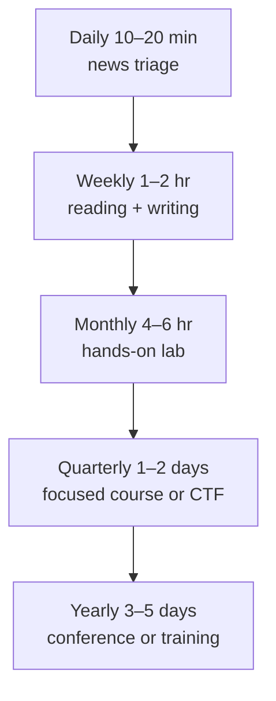

# 🌱 Continuous Learning

> The technical half-life in cybersecurity is roughly 18 months. Anything you learned three years ago that wasn't fundamental — TTP names, tool defaults, control plane APIs, threat actor groupings, regulation thresholds — has likely shifted. The senior practitioners you'll work with are not smarter than you. They've just built a maintainable system for staying current.

This is the system. It's the chapter you'll come back to once a year to retune your inputs as old feeds go silent and new ones emerge.

---

## The cadence model

Continuous learning collapses if you try to do everything daily. Layer it instead:



| Cadence | Time | Purpose | Examples |
|---|---|---|---|
| Daily | 10–20 min | News and alert triage | RSS skim, X/Mastodon, vendor advisories |
| Weekly | 1–2 hours | Depth reading + writing | One paper, one blog post, one journal entry |
| Monthly | 4–6 hours | Hands-on lab | Reproduce one TTP, build one detection |
| Quarterly | 1–2 days | Skill expansion | Course module, CTF event, conference talk |
| Yearly | 3–5 days | Major skill or community investment | Major training (SANS, OffSec), conference travel |

Hit four out of five most weeks and you'll be ahead of 80% of practitioners.

!!! tip "The 80/20 of staying current"
    The biggest single jump in your information quality comes from replacing **passive scrolling** (LinkedIn / X / Reddit feed) with **curated pull** (RSS, newsletters, a small Mastodon list). Five minutes of curated reading is worth an hour of feed scrolling.

---

## Daily inputs — RSS, newsletters, social

### RSS — the practitioner's information backbone

RSS is unfashionable and unbeatable. It's pull-based (no algorithm), private (no tracking), and durable (feeds outlive platforms). Use **Feedly**, **Inoreader**, **NetNewsWire** (Mac/iOS), or self-host **FreshRSS** / **miniflux** / **Tiny Tiny RSS**.

### A starter feed list (security generalist)

| Feed | What you get | Why |
|---|---|---|
| Krebs on Security | Investigative reporting on cyber crime | Original journalism, often early on incidents |
| Bleeping Computer | Daily news, ransomware tracking | Fast, broad coverage |
| The Hacker News | Daily news | High volume; skim headlines only |
| Dark Reading | Industry analysis | Slower, more strategic |
| Schneier on Security | Essays, link roundups | The closest thing to a security canon |
| Risky Business newsletter | Weekly newsletter of newsletters | Patrick Gray's Friday catch-up; skim if you read nothing else |
| TLDR Sec (Clint Gibler) | Weekly AppSec/cloud roundup | Best curation in cloud + AppSec |
| Last Week as a vCISO (Ross Haleliuk) | Weekly market and strategic threads | Industry-side view |
| SANS NewsBites | 2× weekly news roundup | Established, formal |
| CISA Cybersecurity Alerts and KEV | Federal advisories | Authoritative, mandatory if you do US gov work |
| CERT-In Advisories | Indian advisories | Authoritative for India |
| Microsoft Security Blog (MSRC + Defender + Sentinel) | Vendor research | First-party threat intel |
| Mandiant / Google Cloud Threat Intel | APT campaign reports | Gold standard for nation-state |
| CrowdStrike Falcon blog | Adversary ecosystem reporting | Adversary universe taxonomy |
| The DFIR Report | Real intrusion case studies, free | Single highest-value blue-team feed |
| Volexity, Huntress, Red Canary blogs | Mid-game IR + detection content | Practical, signature-rich |
| Wiz, Datadog Security, Palo Alto Unit 42 blogs | Cloud + container | Cloud-native attack research |
| Project Zero blog (Google) | Vulnerability research | Long-form, technical, biased toward exploit dev |
| 0xPatrik / Hexacorn / RoddyB / Specter Ops blogs | Niche detection + offensive research | Specialist depth |
| Nettitude / NCC Group / IOActive / Trail of Bits blogs | Consultant-led research | Diverse, often original |
| Recurity Labs / Doyensec / Latacora / Praetorian blogs | AppSec research | Modern AppSec |

You don't need all of these. Pick **15–25 feeds** that match your specialty and the rest of your stack will reveal itself organically.

### Specialty add-ons

**Detection engineering & SOC**

- Florian Roth (Neo23x0)
- SigmaHQ blog and rules repo (watch the repo on GitHub)
- F-Secure Countercept / WithSecure Labs
- Elastic Security Labs
- Splunk Threat Research Team
- Microsoft Sentinel community blog

**Offensive and red team**

- Specter Ops blog (Will Schroeder, Lee Christensen, Andy Robbins)
- Outflank, FortyNorth Security
- Synacktiv blog, IncludeSec, Grimm
- Posts by `_dirkjan`, `_xpn_`, `harmj0y`, `mubix`, `tiraniddo`

**Cloud security**

- Christophe Tafani-Dereeper (Datadog)
- Rich Mogull / Securosis
- Daniel Grzelak's tweets/blog
- AWS Security Blog
- Google Cloud Security Blog
- Microsoft Defender for Cloud blog
- Wiz Research

**Reverse engineering and exploit dev**

- Project Zero (Google)
- Quarkslab blog, Synacktiv blog
- The Zero Day Initiative blog
- @hexrays_dev (IDA), @vector35 (Binary Ninja) release notes
- Gynvael Coldwind, LiveOverflow

**Threat intelligence**

- Mandiant Advantage / GTIC
- Recorded Future Insikt Group
- DomainTools
- CISA Insights / CISA AAs
- Cyber Threat Coalition / CISA JCDC
- Sandworm Team analysis (anything by Andy Greenberg)

**AI/ML security**

- Trail of Bits AI red team
- Embrace the Red (Johann Rehberger)
- Simon Willison's blog (LLM-focused; not security-only but consistently sharp)
- HiddenLayer blog
- OWASP LLM Top 10 mailing list
- AI Snake Oil (Arvind Narayanan, Sayash Kapoor)

**ICS / OT**

- Dragos Industrial Cybersecurity Blog
- Claroty Team82
- Nozomi Networks blog
- SANS ICS blog (Mike Assante's legacy + current)
- ICS-CERT / CISA ICS advisories

### Newsletters worth a paid subscription

- **Risky Business News (Catalin Cimpanu)** — daily news brief; the standard
- **TLDR Sec** — Clint Gibler's weekly AppSec/cloud roundup, free
- **CloudSec Weekly** — Marco Lancini, free
- **This Week in 4n6** — Phill Moore's DFIR weekly link roundup, free
- **Detection Engineering Weekly** — David French, free
- **Pragmatic Engineer Security** — Gergely Orosz's security-adjacent industry letters
- **VulnHuntr / Vulnerability Notes** — track the discovered-CVE pulse

### Podcasts

| Podcast | Format | Best for |
|---|---|---|
| **Risky Business** (Patrick Gray) | Weekly news + interview | The single most-recommended security podcast |
| **Darknet Diaries** (Jack Rhysider) | Storytelling, monthly | Narrative cyber crime stories |
| **Hacking Humans** (CyberWire) | Social engineering focus | Phishing/scams in plain language |
| **Click Here** (Recorded Future) | Investigative journalism | National security angle |
| **Defensive Security** (Jerry Bell, Andrew Kalat) | Weekly news commentary | Long-running blue team perspective |
| **The Hacker And The Fed** (Chris Tarbell, Hector Monsegur) | Conversational | Inside-baseball perspective |
| **Smashing Security** | News + humor | Lighter weekly listening |
| **CyberWire Daily** | News brief | Daily 20-min update |
| **DFIR Podcast / Forensic Lunch** | DFIR-specific | Long-form forensics interviews |
| **SANS Internet Stormcast** | 5 minutes daily | Microcasts on current threats |
| **Beers with Talos** | Monthly | Threat research with Cisco Talos |
| **No Name Security** (Errata Security) | Old-school commentary | Robert Graham's longer-form takes |

A practical listening pattern: one daily microcast (Stormcast or CyberWire Daily) on the morning commute, one weekly long-form on Friday afternoon admin time.

### Mastodon, Bluesky, X (Twitter), and the social feeds

Choose one platform. Building a useful feed in three is unsustainable.

**Mastodon (`infosec.exchange`)** is currently the highest-quality security community for working practitioners. Many top researchers maintain their primary presence there.

**Bluesky** has grown a real security community since 2024 — slower-paced than X, more focused than Mastodon.

**X / Twitter** still has the highest *raw volume* of security content but is increasingly hard to filter. If you stay, build a **strict list** of 50–100 accounts and read only the list — never the algorithmic feed.

A starter Mastodon follow list to seed your feed:

- `@hacks4pancakes@infosec.exchange` — Lesley Carhart, IR + ICS
- `@swift_on_security@infosec.exchange` — Detection, Sysmon
- `@gossithedog@cyberplace.social` — Kevin Beaumont, public-incident commentary
- `@malwaretech@infosec.exchange` — Marcus Hutchins, malware analysis
- `@runasand@indieweb.social` / `@matthewdgreen@ioc.exchange` — Crypto / academia
- `@hrbrmstr@mastodon.social` — Bob Rudis, data-driven analysis
- `@kim_zetter@mastodon.online` — Investigative reporting
- `@mttaggart@infosec.exchange` — DFIR + community
- `@SwiftOnSecurity` (X), `@_johnhammond` (X) — practitioner-creators with high signal

Spend 10 minutes a day, max. If you find yourself scrolling more, mute or unfollow ruthlessly.

### YouTube channels

The single richest free training resource in cybersecurity. Subscribe selectively; the algorithm will then surface adjacent good content.

| Channel | Specialty |
|---|---|
| **IppSec** | HTB walkthroughs — the canonical one |
| **John Hammond** | CTFs, malware analysis, blue team |
| **LiveOverflow** | Binary exploitation, deep technical |
| **Computerphile** | Foundational concepts, well-produced |
| **STÖK** | Bug bounty methodology |
| **NahamSec** | Bug bounty + community |
| **The Cyber Mentor (Heath Adams)** | Pentesting fundamentals |
| **HackerSploit** | Linux + offensive |
| **Black Hat / DEF CON official channels** | Conference recordings |
| **SANS DFIR Summit, BSides** (various) | Free conference recordings |
| **13Cubed** (Richard Davis) | Windows DFIR |
| **DFIRScience** (Joshua Hickman) | Mobile + Windows forensics |
| **MalwareAnalysisForHedgehogs (Karsten Hahn)** | Malware analysis tutorials |
| **OALabs** | Malware reverse engineering streams |
| **stacksmashing** | Hardware hacking |
| **Hak5 / David Bombal** | Networking + tooling |

Pace yourself. Watching 60 hours of content in a month and producing nothing is worse for retention than watching 6 hours and reproducing what you saw.

---

## Weekly inputs — papers and writing

The single biggest separation between mid and senior practitioners is the senior practitioners read papers.

### Where to find papers worth reading

- **arXiv `cs.CR`** — the firehose. Search by week.
- **USENIX Security**, **IEEE S&P**, **NDSS**, **ACM CCS** — top four academic conferences. All proceedings open-access within a year.
- **WOOT, FOCI, Usenix Security workshops** — applied, often more directly useful than the main track
- **Google Project Zero** publications — research-grade applied security
- **Microsoft Security Response Center** writeups
- **MITRE Engenuity** evaluations and reports
- **DFRWS USA / DFRWS EU** papers — DFIR-specific
- **HotPETs** — privacy
- **AAAI / NeurIPS / ICML adversarial ML papers** for AI security
- **Quarterly threat reports** from Mandiant, CrowdStrike, Microsoft, Verizon DBIR, ENISA, NCSC, CISA, CERT-In

A reasonable target: **one paper per week**, taking notes, even if it's a paper you only half-understand. Skim widely, read deeply on the 1 in 10 that matter most to you.

### How to read a paper efficiently

The classic three-pass technique (Keshav, 2007):

1. **First pass (10 min)** — title, abstract, intro, section headings, conclusion, references. You'll know whether to read further.
2. **Second pass (1 hour)** — body of the paper, ignoring proofs and detailed methodology. Take notes. Form your own argument about strengths and weaknesses.
3. **Third pass (4+ hours)** — only for papers in your direct specialty. Reproduce results. Verify proofs. Write your own commentary.

Most papers stop at pass 1 or 2.

### Writing as learning

The act of writing what you learned is the strongest retention mechanism we know. A weekly journal entry — public or private — beats reading three additional papers.

A repeating template that works:

```
This week I worked on:
This week I learned:
This week I struggled with:
Next week I'll try:
```

Five sentences. Ten minutes. Compounding for years.

---

## Monthly inputs — labs and TTP reproduction

Reading and listening alone produce surface knowledge that evaporates under interview pressure or in-incident pressure. Build muscle by reproducing TTPs in a lab once a month.

### A reusable pattern

1. **Pick one specific TTP** — preferably one that appeared in the news or a recent CTI report. Examples: AS-REP roasting, ESXi ransomware deployment via vCenter abuse, TeamCity CVE-2024-27198 exploitation, Kubernetes service-account token theft.
2. **Set up the smallest possible lab** that reproduces it. GOAD for AD; DetectionLab for Windows + Sysmon + Splunk; Kubernetes-the-hard-way for k8s; a single Docker host for malware detonation.
3. **Run the attack.** End to end, multiple times.
4. **Capture the telemetry** — packets, EVTX, audit logs, container logs, cloud trail.
5. **Build the detection.** Sigma rule, Suricata signature, Falco rule, KQL query.
6. **Validate.** Re-run the attack with the detection on. Tune for false positives by running normal user workflows.
7. **Write it up.** Even if private. Especially if private.

The compound effect after 12 months is enormous: 12 named TTPs you've reproduced, with detections you've authored.

### Lab platforms worth investing in long-term

| Lab | Purpose | Effort to maintain | Cost |
|---|---|---|---|
| **GOAD** (Game of Active Directory) | AD attack range | Medium | Free; needs ~16 GB RAM |
| **DetectionLab** | Windows + Sysmon + Splunk + Velociraptor | Medium | Free; needs ~32 GB RAM |
| **Kubernetes-the-hard-way + Falco + Tetragon** | k8s detection | High | Free; needs cloud or beefy host |
| **AWS Security Lab CDK templates** | Cloud attack/defense | Low | Free; runtime ~$5–20/month |
| **HackTheBox + Pro Labs** | Curated offensive scenarios | None | $20+/mo, $90+/mo |
| **OffSec Proving Grounds (Practice + Play)** | Curated boxes | None | $19/mo |
| **PWN.College** | Binary exploitation, open courseware | None | Free |
| **PortSwigger Web Security Academy** | Web vulnerabilities | None | Free |
| **TryHackMe + advanced tracks** | Guided learning | None | Free + premium tiers |
| **AttackIQ Academy / SafeBreach lessons** | Adversary emulation | None | Free |

Pick **one** persistent lab (GOAD or DetectionLab) and rebuild it from scratch every quarter to keep your IaC chops sharp.

---

## Quarterly investments — courses, CTFs, focused effort

A 1–2 day quarterly investment compounds into meaningful skill expansion over years.

### CTFs worth blocking the calendar for

(See the dedicated [CTFs chapter](ctfs.md) for a full taxonomy. Highlights here.)

- **picoCTF** (March–April) — annual, beginner-friendly; team optional; free
- **Google CTF** (June–August) — quals + finals
- **DEF CON Quals** (May) and **DEF CON Finals** (August)
- **CSAW CTF** (September) — student-friendly, broad
- **HackTheBox Business CTF** (annual) — team event, attractive prizes
- **HackTheBox University CTF** — team event for students/recent grads
- **NSA Codebreaker Challenge** (US, fall) — multi-week, university-targeted but open
- **InCTF** (India, annual, December) — flagship Indian university CTF
- **Bi0sCTF / HackIM** — Indian CTFs run by Amrita and similar groups
- **SANS Holiday Hack Challenge** (December–January) — beginner to advanced, free

### Online courses (free or low-cost)

- **PortSwigger Web Security Academy** — the gold standard for web. Finish all topics over 6–12 months.
- **PWN.College** — open courseware on binary exploitation, OS, cryptography
- **SANS Cyber Aces Online** — fundamentals, free
- **MIT 6.857 Network and Computer Security** — open courseware
- **Stanford CS155 / CS253** — open courseware, web + system security
- **TryHackMe paths** (Junior Penetration Tester, SOC Level 1, SOC Level 2, Red Teaming, etc.) — well-structured paid tracks
- **HTB Academy** (CPTS, CBBH, CDSA paths) — modern, certification-aligned
- **Google Cybersecurity Professional Certificate** (Coursera) — entry-level, well-produced
- **Microsoft Learn Security** — free, ties to SC-200, SC-100, AZ-500
- **AWS Skill Builder Security** — free, ties to Security Specialty
- **Splunk Education** — free fundamentals + paid advanced
- **Coursera "Practical Security Investigations"** (Sumo / Cybrary) — free auditing
- **Linux Foundation Security courses** — free + paid (LFS258 Kubernetes, LFS260 K8s Security)

### Vendor training

Most enterprise security tools have free training portals that *also* count as professional development. Even if you don't use the tool today, you'll touch it eventually.

- **Splunk Education** — free Fundamentals 1–2
- **Microsoft Learn** — free Sentinel + Defender paths, voucher-discounted SC-200 exam
- **AWS Skill Builder** — free Security Learning Plan
- **GCP Coursera path** — free auditing
- **Wiz Academy**, **Snyk Learn**, **HashiCorp Learn** — free, modern
- **Palo Alto Networks Beacon**, **Cisco Networking Academy**, **Fortinet NSE 1–3** — free fundamentals
- **CrowdStrike University**, **SentinelOne University** — usually customer-only but some free intro modules

---

## Yearly investments — major training and conferences

The expensive end of the funnel. Plan a year in advance.

### Conferences worth attending in person

| Conference | Region | When | Notes |
|---|---|---|---|
| **DEF CON** | Las Vegas, USA | August | Largest hacker conference; villages > main track for most |
| **Black Hat USA** | Las Vegas, USA | August | Industry; trainings worth more than briefings |
| **Black Hat Europe / Asia** | Various | Nov / Apr | Smaller, more research-y |
| **RSA Conference** | San Francisco, USA | April/May | Vendor-heavy; networking goldmine |
| **SANS Summits** (various: DFIR, ICS, Threat Hunting, etc.) | Multiple | Year-round | Single-track, high-quality |
| **BSides** (everywhere) | Local | Year-round | Cheap, friendly, first-talk friendly |
| **ShmooCon** | Washington, DC | January | Federal-adjacent, hard tickets |
| **DerbyCon-likes** (Wild West Hackin' Fest, GrrCON, Hackfest) | Regional US | Various | Mid-size, friendly |
| **HackInTheBox (HITB)** | Various | Various | Strong international research |
| **Nullcon Goa** | India | Sept (was Mar) | Flagship Indian commercial conference |
| **c0c0n** | Kerala, India | October | India's longest-running security conference |
| **OWASP Global AppSec** | Various | Twice yearly | AppSec-focused |
| **CYBERTECH** | Tel Aviv | January | Industry/Israeli ecosystem |
| **FIRST Conference** | Various | June | Incident response + CSIRTs |
| **Infosecurity Europe** | London | June | Industry/networking |
| **Kaspersky SAS** | Various | Annual | Threat research, invitation-leaning |

### Choosing trainings

The premium end (SANS, OffSec, Black Hat trainings, Antisyphon) costs $4–$8K per course. Tactics:

- **Employer reimbursement** — start with the assumption your employer should pay. The cost of not asking is $0.
- **Work Study programs** — SANS Work Study lets you attend any course in exchange for ~30 hours of in-class assistance. Massive discount.
- **Scholarships** — SANS, OffSec, ISC2, ISACA, WiCyS all run them annually
- **GIAC voucher offers** — periodic discount windows
- **Antisyphon Pay-What-You-Can** — high-quality alternative, sliding scale
- **FedVTE** (US federal employees, contractors, veterans) — free to qualifying personnel; covers SANS-equivalent material

### Major skill expansions worth a year

In the rough order most working practitioners benefit from picking one up:

1. **Cloud security** — pick AWS, Azure, or GCP based on your environment. The whole-platform skill takes ~12 months to become legitimately useful.
2. **Detection engineering at scale** — Sigma + Splunk/KQL + ATT&CK to fluency. About 6–9 months.
3. **A second language** — Go for cloud and tooling, Rust for systems, C for binary exploitation, JavaScript for web/AppSec.
4. **Container/Kubernetes security** — CKS-level competence. ~6–9 months part-time.
5. **AI/ML security** — including model internals, not just prompt injection. Genuinely emerging; ~12 months to be among the first wave of practitioners.
6. **Reverse engineering & exploit development** — the longest commitment, often a multi-year arc.

Pick one a year. Resist the temptation to pick three.

---

## Mentorship — both directions

Both halves of mentorship are part of continuous learning. Asking for it and giving it.

### Finding a mentor

Most candidates wait too long. Don't.

The most reliable approach: identify five practitioners ten years ahead of you whose work you genuinely engage with, follow their work for six months, then write to one with a specific request. Not "will you be my mentor?" — that almost always fails — but a specific question or problem.

A template that works:

> Subject: Your Black Hat Asia talk on [topic] — quick question
>
> [3 lines who you are and how you found them]
> [3 lines specific question you can't easily answer yourself]
> [1 line: "If a 30-minute call would be easier than a reply, I'd be grateful. Either way, thank you."]

Send it. Move on. About 30% of well-written cold notes get a response.

If the response is positive and the conversation goes well, *don't* ask "will you mentor me?" Just keep coming back, occasionally, with substantive questions and updates. Real mentorship emerges from cumulative interactions, not formal designations.

### Programs

- **Mentorcruise** — paid, structured
- **WiCyS Mentorship Program** — annual, women in cybersecurity
- **CyberMentor (TCM Security) Discord** — community, free
- **SANS Cybersecurity Mentorship Program** (where offered)
- **Local OWASP and Null chapters** — informal but real
- **Day of Shecurity, Hak5 community, BlackHoodie** — niche, often free, high-trust

### Becoming a mentor

The most underestimated continuous-learning lever. Teaching forces you to clarify your own model. The first time you mentor a junior on something you "know," you'll notice all the holes you've never had to fill.

Start small: answer questions on the SANS Discord, in `#beginner-questions` on the BSides community Slacks, in /r/cybersecurity. Donate two hours a month. The long-term reputation effect is significant.

---

## Communities worth being part of

A practical short list, not exhaustive.

### Global

- **OWASP local chapter** + **OWASP Slack**
- **DEF CON local groups** (DC408, DC11001, DC91120, DC90210, etc.)
- **BSides local organization committees**
- **WiCyS** (Women in Cybersecurity)
- **CyberJutsu** — women, gender minorities
- **Blacks in Cybersecurity**
- **The Diana Initiative**
- **ISC2 / ISACA local chapters**
- **MISP community** (TI sharing)
- **FIRST.org membership** (incident response community; org-affiliated)

### US-focused

- **InfraGard** (FBI partnership for critical infrastructure)
- **H-ISAC**, **MS-ISAC**, **IT-ISAC** (sector ISACs)
- **CISA JCDC** (Joint Cyber Defense Collaborative)
- **AFCEA** chapters
- **National CyberWatch Center** (community college pipeline)

### India-focused

- **Null** (chapters in Mumbai, Bangalore, Delhi, Pune, Hyderabad, Chennai)
- **HasGeek security tracks**
- **Open Web Application Security Project India** (OWASP chapters)
- **DSCI** (Data Security Council of India) — industry body
- **NASSCOM Tech CISO Circle**
- **CSIR-CDAC Resource Person Network**
- **AICRA / IC3 community** for student-track cyber competitions
- **CyberPeace Foundation**, **Software Freedom Law Center India** for policy + tech

### Online-only

- **infosec.exchange (Mastodon)**
- **BSidesOnline / BSides Discord**
- **Pwn.College** Discord
- **r/netsec**, **r/AskNetsec**, **r/cybersecurity**, **r/blueteamsec**, **r/redteamsec**
- **HackTheBox forums** + **HackTheBox Discord**
- **The DFIR community Discord**
- **Detection Engineering / "DERR" Discord**
- **NETSEC Focus / OffSec Discord**

A simple rule: **be active in two communities, lurk in two more, ignore the rest.** Trying to be present in twelve places ensures you're not really present in any of them.

---

## Reading list — by track

The "if you only read X" list per specialty. None of these are paid links.

### Foundational (everyone)

- *The Phoenix Project* — Gene Kim. Operations and culture.
- *The Cuckoo's Egg* — Cliff Stoll. The original IR memoir.
- *Sandworm* — Andy Greenberg. Modern nation-state operations.
- *This Is How They Tell Me the World Ends* — Nicole Perlroth. Zero-day market history.
- *Crypto* — Steven Levy. Cryptography history.
- *Practical Cryptography for Developers* — Svetlin Nakov (free online).
- *Cybersecurity and Cyberwar* — Singer & Friedman. Policy primer.

### Defensive / SOC / DFIR

- *The Practice of Network Security Monitoring* — Richard Bejtlich
- *Applied Network Security Monitoring* — Sanders & Smith
- *Crafting the InfoSec Playbook* — Jeff Bollinger et al.
- *Blue Team Handbook: Incident Response Edition* — Don Murdoch
- *Intelligence-Driven Incident Response* — Roberts & Brown (2nd ed.)
- *Practical Threat Intelligence and Data-Driven Threat Hunting* — Costa-Gazcón
- *The Art of Memory Forensics* — Ligh, Case, Levy, Walters

### Offensive / red team

- *The Hacker Playbook* series (3) — Peter Kim
- *Penetration Testing* — Georgia Weidman
- *The Web Application Hacker's Handbook* — Stuttard & Pinto (still the bible despite age)
- *Real-World Bug Hunting* — Peter Yaworski
- *RTFM: Red Team Field Manual* — Ben Clark
- *Operator Handbook* — Joshua Picolet
- *Active Directory Security* — Sean Metcalf material (online + slides)

### Reverse engineering / exploit development

- *Practical Malware Analysis* — Sikorski & Honig
- *Practical Reverse Engineering* — Dang, Gazet, Bachaalany
- *The Shellcoder's Handbook* — Anley et al.
- *Hacking: The Art of Exploitation* — Jon Erickson
- *A Guide to Kernel Exploitation* — Perla & Oldani

### Cloud security

- *Hands-On Security in DevOps* — Tony Hsiang-Chih Hsu
- *Cloud Native Security* — Chris Binnie & Rory McCune
- *Practical Cloud Security* — Chris Dotson
- *AWS Cloud Security Cookbook* — Heartin Kanikathottu
- AWS / GCP / Azure platform documentation security pillars

### Application security

- *The Tangled Web* — Michał Zalewski
- *Bug Bounty Bootcamp* — Vickie Li
- *Iron-Clad Java* — Jim Manico & August Detlefsen
- *Designing Secure Software* — Loren Kohnfelder

### Strategy / leadership

- *Cyber Conflict After the End of History* — Yochai Benkler et al.
- *Click Here to Kill Everybody* — Bruce Schneier
- *The Hacked World Order* — Adam Segal
- *7 Habits of Highly Effective People* — Stephen Covey (sounds dated, isn't)

---

## Avoiding burnout

Continuous learning fails not because the inputs are bad but because the practitioner burns out.

### Signs to watch for

- You can't remember the last week you didn't read security news on a Saturday
- Your reading time has displaced your hands-on time
- You read negative news (breaches, fired CISOs, lawsuits) more than research
- You're more anxious after reading than before
- You measure self-worth by certs in progress

### Tactics that work

- **One day a week off** from anything cyber-related. Phones aside; weekend hobby in the air.
- **Annual audit** of your inputs — drop any feed/podcast/account that no longer earns its place.
- **Pomodoro for reading** — 25 min on, 5 min off. The off is non-negotiable.
- **Long-form over short-form** when stressed — a paper or book regulates the nervous system better than feeds.
- **Touch grass weekly.** Literally. The non-cyber part of your life is the basin of attraction your career needs to stay healthy.
- **Acknowledge that you can't keep up.** Nobody can. The practitioners who pretend to are bluffing.

A career-long reminder: cybersecurity is high-status now and the inflow of new talent is unprecedented. Senior practitioners who lasted have one thing in common — they stopped trying to consume the firehose and **picked one thing to be excellent at, year by year**.

---

## A "minimum viable" continuous-learning practice

For when life gets in the way:

```
Daily   (10 min)  Skim Risky Business newsletter or a single trusted RSS feed
Weekly  (1 hour)  Read one TLDR Sec issue + one paper abstract
Monthly (2 hours) Listen to 2 long-form podcasts during commutes
Quarter (4 hours) One CTF, course module, or lab reproduction
Yearly  (3 days)  One conference (in-person or remote)
```

This costs about three hours per week on average. It will keep you ahead of 70% of practitioners. Add to it as bandwidth allows.

---

## Year-one continuous-learning checklist for a new hire

For someone who just landed their first cyber role and wants to build the habit from day zero:

- [ ] Set up an RSS reader; subscribe to 15 feeds matching your team's stack
- [ ] Subscribe to TLDR Sec, Risky Biz News, your relevant ISAC
- [ ] Pick one Mastodon, Bluesky, or X account as your primary; build a 50-account list
- [ ] Pick one podcast for your daily commute and one for your weekly admin time
- [ ] Subscribe to your employer's vendor-stack training portal
- [ ] Find your local OWASP / Null / DEF CON group; attend within 60 days
- [ ] Volunteer at one BSides event in your first year
- [ ] Identify three potential mentors and follow their work for six months
- [ ] Submit your first conference talk (BSides / Null / OWASP local) by month 9
- [ ] Read one canonical book per quarter — start with *Sandworm* or *The Cuckoo's Egg*
- [ ] Block four 1-day Fridays for focused TTP reproduction labs
- [ ] Track everything in a continuous-learning journal (Markdown is fine)
- [ ] Set a 12-month review on your calendar: what worked, what didn't, drop and add inputs

The compound effect over five years is dramatic. Three hours a week, well aimed, beats forty hours of frantic last-minute cert prep every single time.

---

## Related chapters

- [Building a Security Portfolio](portfolio.md) — outputs of continuous learning become portfolio material
- [Certifications Roadmap](certifications.md) — certs as one (limited) signal of continuous learning
- [Resume, LinkedIn & Interviewing](resume-linkedin-interview.md) — surfacing continuous learning credibly
- [CTFs, Labs & Practice](ctfs.md) — the deepest practice loop
- [US Government Cyber Careers](gov-careers-us.md) and [India Government Cyber Careers](gov-careers-india.md) — lifelong-learning expectations of public-sector cyber roles

---

[← CTFs, Labs & Practice](ctfs.md)  ·  [Phase 6 home →](index.md)
