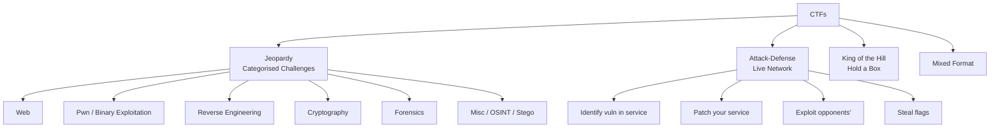
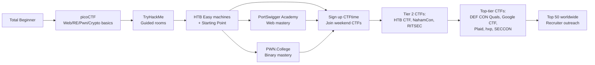
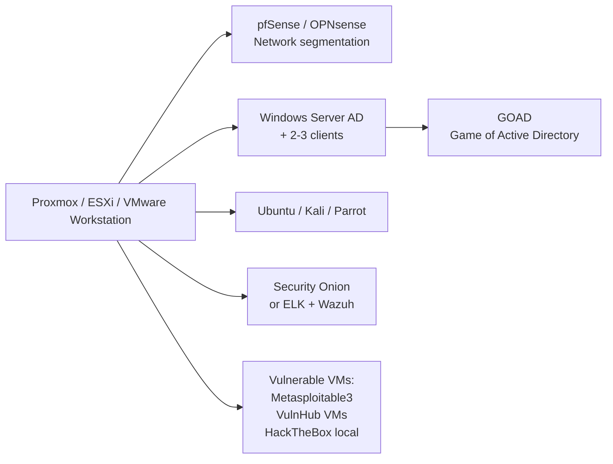
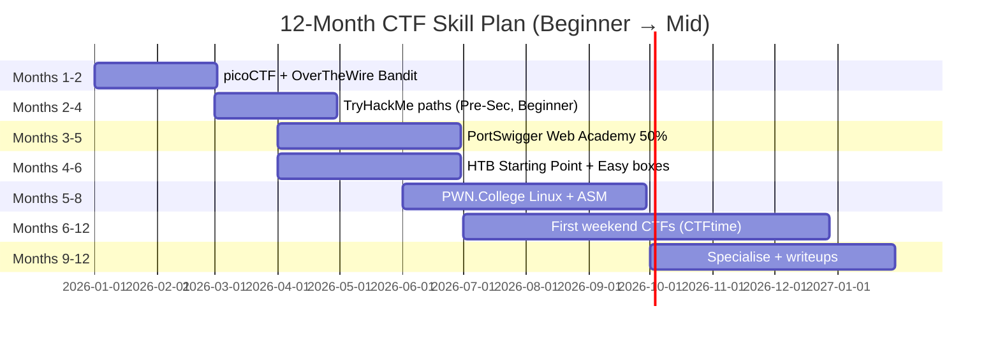

---
tags:
  - phase-6
  - career
  - ctf
  - practice
  - skill-building
---

# CTFs, Labs & Practice — Building Skill, Reputation, and Job Opportunities 🚩

> *"There's no substitute for solving real challenges under time pressure. Two years of CTFs will teach you more than five years of reading."*

CTFs (Capture The Flag competitions) are how modern offensive security skill is built and demonstrated. They're also how teams find each other, how recruiters find you, and how you sustain learning long after coursework ends. This chapter maps the **landscape**, the **progression**, the **techniques to grind**, and the **strategies to win**.

---

## Why CTFs Matter

| Reason | Why It Compounds |
|---|---|
| Immediate feedback | Flag right or wrong — no ambiguity |
| Diverse skill exposure | One event covers web, crypto, pwn, RE, forensics, OSINT |
| Real adversarial thinking | Challenges are designed to be solved by attack, not theory |
| Resume-grade signal | Top CTF teams are recruited directly by NSA, Google, Trail of Bits, GitLab, etc. |
| Community | Best path to find mentors and teammates |

CTF performance is **the most credible offensive-security signal** for entry-level candidates. Many top firms (Trail of Bits, Project Zero, Theori, Atredis, GitHub Security Lab) explicitly hire from CTF teams.

---

## The CTF Taxonomy

### Jeopardy — The Workhorse Format

Categorised challenges, points based on difficulty. Solve to claim flag (typically `flag{...}` or `picoCTF{...}`).

**Pros**: Async, asynchronous solving, individual learning, large field.
**Cons**: Doesn't model real attacks fully; favours puzzles over pen-test methodology.

### Attack-Defense — The Live Combat Format

Each team gets identical vulnerable services running on their box. Goals:

1. Find vulnerabilities in your services
2. **Patch your services** (without breaking SLA)
3. Exploit opponents' services to steal flags (rotated periodically)

**Used at**: DEF CON CTF Finals, CCDC (Collegiate Cyber Defense Competition), ENISA Open European Cyber Sec Challenge.

### King of the Hill — Hold the Box

Teams compete to compromise and hold a box. First in, lock it down. Defend against takeover.

### Boot2Root / Hack-The-Box Style

Single boxes you root from external — most realistic to pen-testing. Used in HTB, OSCP, PwnCollege.

---

## Progression — From Zero to Black Badge

| Phase | Duration | Focus |
|---|---|---|
| **Foundations** | 2-4 months | picoCTF, OverTheWire Bandit, simple HTB Starting Point |
| **Specialisation start** | 3-6 months | PortSwigger Web Academy + PWN.College + crypto basics |
| **First weekend CTFs** | 6-12 months | Mid-tier CTFs on CTFtime, solo or 2-3 person team |
| **Team & rank climb** | 1-2 years | Join an established team, contribute to top CTFs |
| **Top tier** | 2-4+ years | Compete at DEF CON Finals, Google CTF Finals |

---

## The Big Five Beginner Platforms

### 1. **picoCTF** — Carnegie Mellon — `picoctf.org`

The undisputed best place to start. Year-round practice + annual competition (high-school focused, but anyone can play).

**Categories**: General Skills, Cryptography, Web Exploitation, Forensics, Reverse Engineering, Binary Exploitation.

**Why it's perfect for starters**: hints provided, walkthroughs available, gentle ramp.

### 2. **TryHackMe** — `tryhackme.com`

Guided, room-based learning paths with terminal in browser.

**Best paths**:

- *Pre-Security* (network/Linux foundations)
- *Complete Beginner*
- *Jr Penetration Tester*
- *Web Fundamentals*
- *Offensive Pentesting*
- *SOC Level 1*

Excellent for transitioning theory→practice.

### 3. **Hack The Box** — `hackthebox.com`

Industry standard for offensive practice. Three sub-platforms:

- **Machines** — pwn boxes, retired ones have walkthroughs
- **Challenges** — Jeopardy-style by category
- **Pro Labs** — multi-box AD networks (Dante, Offshore, RastaLabs, Cybernetics) — best simulator of OSCP/OSEP-style work

Also runs **HTB Academy** — comprehensive courseware (CPTS, CBBH paths).

### 4. **PortSwigger Web Security Academy** — `portswigger.net/web-security`

Free. Best web-app vulnerability training in existence. From SQLi/XSS through OAuth, GraphQL, prototype pollution, HTTP/2 desync. **Every web hacker should complete every lab.**

### 5. **PWN.College** — `pwn.college`

ASU's binary exploitation curriculum. Genuinely PhD-level pwn content, free, with auto-grader. Tracks: Linux process kernel, x86_64 ASM, shellcoding, sandboxing, race conditions, kernel exploitation, browser exploitation.

### Honourable Mentions

- **Root Me** — `root-me.org` — huge challenge library
- **CTFLearn** — beginner-friendly catalog
- **OverTheWire** — `overthewire.org` — Bandit/Natas/Leviathan war games
- **HackTheBox Starting Point** — entry track with hand-holding
- **Crackmes.one** — RE crackmes
- **VulnHub** — VM challenges (offline)
- **Cyberdefenders.org / Letsdefend.io / Blue Team Labs Online** — for blue/DFIR
- **Range Force** — guided enterprise labs
- **OffSec Proving Grounds (PG Practice / PG Play)** — OSCP-style practice

---

## Major Annual / Recurring CTFs

### Top Tier — Worldwide

| CTF | Organiser | Format | Notes |
|---|---|---|---|
| **DEF CON CTF** | Nautilus Institute (currently) | Quals (Jeopardy) → Finals (Attack/Defense) | The Olympics of CTF — Black Badge for winning |
| **Google CTF** | Google | Quals → Finals | Excellent challenges; finalists invited to Google |
| **Plaid CTF** | Plaid Parliament of Pwning (CMU) | Jeopardy | Legendary difficulty |
| **hxp CTF** | hxp (Germany) | Jeopardy | Very high quality, esp. crypto/pwn |
| **SECCON** | Japan | Jeopardy + Finals | Tokyo finals |
| **Hack-A-Sat** | US Air Force / SpaceForce | Space-focused | Real satellite hacking |
| **HITB CTF** | HITB Sec Conf | Various | Held with Hack In The Box conferences |
| **PlaidCTF, MidnightSun, RealWorldCTF, FAUST CTF, RuCTF, iCTF** | Various | High-tier circuit |

### Indian Circuit

| CTF | Organiser | Notes |
|---|---|---|
| **InCTF** | Amrita Univ. (Team bi0s) | Junior + International tracks |
| **NullCon HackIM** | NullCon | Held alongside conference, Goa |
| **Bi0sCTF** | Team bi0s | High-quality jeopardy |
| **C0c0n CTF** | C0c0n Conference, Kochi | Community |
| **BSides Delhi/Bangalore CTF** | BSides chapters | Community |
| **Smart India Hackathon — Cyber** | MoE/AICTE | Government-sponsored, ministry visibility |
| **Cyber Security Grand Challenge (CSGC)** | DSCI / MeitY | National-level |
| **CyberCenturion India** | NPCI/Industry | Schools |

### US-Adjacent / Defence

| CTF | Notes |
|---|---|
| **CCDC (Collegiate Cyber Defense Competition)** | US universities — defence-only AD format |
| **NCL (National Cyber League)** | US college, individual + team |
| **PicoCTF** | High school + open division — already covered |
| **CyberStakes** | West Point cadets |
| **NSA Codebreaker Challenge** | Reverse-engineering challenge by NSA — solving = direct NSA recruiter contact |

!!! tip "NSA Codebreaker Challenge"
    Free, autumn each year — designed to test SIGINT-relevant skills. **Top finishers are contacted by NSA recruiters.** One of the most underrated direct paths into US government cyber.

### Pwn2Own — The Big Bug-Bounty Competition

ZDI's **Pwn2Own** isn't a traditional CTF — it's a contest where researchers chain 0-days against real targets (browsers, mobile devices, ICS, automotive, cloud) for cash prizes (often $50K-$500K+ per chain) and "Master of Pwn" points. Teams that excel here get hired to lead browser/kernel exploit teams worldwide.

---

## CTFtime — Your Competition Hub

[**ctftime.org**](https://ctftime.org) is the canonical aggregator:

- Calendar of upcoming events
- Team rankings (yearly weighted)
- Writeups archive
- Team profiles

**Action items**:

1. Create an account
2. Create or join a team
3. Subscribe to your time-zone-friendly CTFs
4. Always submit a writeup after — it's your portfolio

---

## How to Train — The Skill Tree

### Web

1. Read **The Web Application Hacker's Handbook** (foundational)
2. Complete **PortSwigger Web Academy** end-to-end (every lab)
3. Read top HackerOne / Bug Bounty disclosure reports daily
4. Practice on HTB web challenges, RootMe web tracks
5. Run **Caido** / **Burp Suite Community** in your daily browsing

**Master**: SQLi (all variants), XSS (DOM/stored/reflected), SSRF, deserialisation (Java, .NET, Python pickle, PHP), prototype pollution, request smuggling (HTTP/1.1 + HTTP/2), OAuth flow attacks, JWT, GraphQL.

### Pwn / Binary Exploitation

1. Read **Hacking: The Art of Exploitation** (Erickson)
2. **PWN.College** entire curriculum
3. **Nightmare** course (guyinatuxedo) — `guyinatuxedo.github.io`
4. **how2heap** (shellphish) — for heap exploitation
5. Practice on `pwnable.kr`, `pwnable.tw`, `crackmes.one`
6. **pwntools** mastery — `docs.pwntools.com`

**Master**: Stack BOF, ROP, format string, heap (tcache, fastbin, unsorted bin, large bin attack, House of Force / Orange / Lore), use-after-free, double-free, kernel pwn (`pwn.college Kernel Security`).

### Reverse Engineering

1. **Practical Malware Analysis** (Sikorski/Honig) labs
2. **Ghidra** (free, NSA) + **IDA Free** + **Cutter** + **Binary Ninja** (paid)
3. **Crackmes** — `crackmes.one`
4. **FLARE-VM** for Windows malware RE
5. **Reverse Engineering for Beginners** (Yurichev) — free PDF, encyclopaedic

**Master**: x86_64 + ARM ASM, anti-debug/anti-VM tricks, packers (UPX, Themida), VM-protected binaries, Windows internals (PE, IAT, TLS callbacks), ELF internals, decompiler usage.

### Cryptography

1. **Cryptopals Crypto Challenges** (`cryptopals.com`) — gold standard
2. **CryptoHack** (`cryptohack.org`) — gamified, active community
3. **Boneh's Cryptography I** (Coursera) — theory
4. **Real-World Crypto** by David Wong — modern crypto
5. Read **A Graduate Course in Applied Cryptography** (Boneh-Shoup, free PDF)

**Master**: AES modes (ECB/CBC/CTR/GCM, padding oracle), RSA (LSB oracle, Coppersmith, Wiener, common modulus, Bleichenbacher), DH/ECC (small-subgroup, invalid curve, twist), MAC forgery, hash length extension, side-channels.

### Forensics

1. **Volatility Foundation training** + Volatility 3 plugins
2. **SANS DFIR posters** (free) — Windows artefacts, Linux artefacts, hunting
3. **Cyberdefenders.org** challenges
4. **Letsdefend.io** investigations
5. **DFIR.training** course list

**Master**: Memory analysis (Windows + Linux), disk forensics (NTFS, ext4, FAT), Windows event log triage, prefetch/shimcache/amcache, registry forensics, browser artefacts, network forensics (Wireshark + Zeek), file carving.

### OSINT

1. **OSINT Framework** (`osintframework.com`)
2. **Bellingcat's Online Investigations Toolkit**
3. **Trace Labs Search Party CTF** — real missing-persons OSINT competitions (resume gold + civic value)
4. **Sector035 Week in OSINT** — newsletter

**Master**: Reverse-image search, geolocation from photos (sun angle, vegetation, signage), pivot from social handles, breach data analysis, certificate transparency, passive DNS.

---

## CTF Strategy — Winning the Weekend

### Before

1. **Pre-form the team** on Discord/Matrix, set channels per category
2. **Pre-register**, pre-set up VPS for any infra you'll need
3. **Pre-tool**: pwntools / ghidra / wireshark / volatility / john / hashcat / sage already installed
4. **Sleep before** — 36-48 hour CTFs are endurance events

### During

1. **Triage first 30 mins** — every member skim every challenge, post category in chat with difficulty estimate
2. **Pair on hard challenges** — fresh eyes break stuck heads
3. **Document as you go** — paste payloads, screenshots into shared doc; you'll write up faster
4. **Don't tunnel**: if stuck >2 hours, move on, return later
5. **Watch the scoreboard** — challenges decay, prioritise pre-decay solves
6. **Last 2 hours** — only attack solvable challenges; don't open new categories

### After

1. **Writeups within a week** — even short ones; CTFtime points + community goodwill + your future memory
2. **Retro** — what worked, what didn't, what skill gap to grind next

---

## Solo vs Team

Solo CTF teaches resourcefulness; team CTF teaches collaboration and exposes you to specialists.

**Solo first** — until you can solve a few challenges per CTF. Then **join an open team** on CTFtime ("looking for team" posts) — many top teams welcome motivated juniors.

**Famous open or junior-friendly teams**:

- **WeAreLegion** — open team
- **AmpereSecurity** — open
- **BabyExploiter** / **TheGoonies** — beginner-welcoming
- **Project Sekai** — emerging
- **Various university teams** — your school may have one; if not, **start one**

**Top-tier closed teams (illustrative — invitation/heavy-skill required)**: PPP (Plaid Parliament of Pwning), DEFKOR00T, Tea Deliverers, Maple Bacon, Shellphish, LosFuzzys, hxp, OOO (Order of the Overflow), Sauercloud, More Smoked Leet Chicken, Tower of Hanoi, bi0s.

---

## Beyond CTFs — The Practice Adjacencies

| Activity | Why |
|---|---|
| **Bug bounties** (HackerOne, Bugcrowd, Intigriti, YesWeHack) | Real money for real bugs — different skill (recon-heavy) |
| **CVE submissions** | Public credit, security clearance benefit |
| **Open source contributions** | Tools you build = portfolio |
| **Conference talks** (BSides → DEF CON) | Speaker = expert, badge access, recruiting |
| **Twitter/Mastodon/BlueSky InfoSec** | Where the field lives, recruiters scout |
| **Personal blog / GitHub** | Documented thought = hiring signal |

---

## Lab Building — Your Persistent Practice Range

A home lab teaches more than any course. Recommended stack:

**Key labs**:

- **GOAD** (Game of Active Directory) — `github.com/Orange-Cyberdefense/GOAD` — vulnerable AD lab, Vagrant-driven
- **DetectionLab** (`github.com/clong/DetectionLab`) — instrumented Windows lab for blue training
- **SecurityOnion** — full IDS/SIEM appliance, free
- **HELK / SOF-ELK** — pre-built ELK stacks
- **AutomatedLab** (PowerShell, Microsoft) — quick AD spin-ups

---

## Career Outcomes — Direct Paths from CTFs

| Outcome | How |
|---|---|
| **Trail of Bits / Theori / Atredis / Margin / Doyensec hire** | Top CTF rank → cold apply or direct invitation |
| **Google Project Zero / Microsoft MSRC / Apple SEAR** | Bug bounty + research blog + CTF rank |
| **NSA / GCHQ / BSI** | NSA Codebreaker / Cyber-Stakes finalist |
| **Indian government** | InCTF / NullCon HackIM top + RVDP submissions |
| **Big Tech red teams (Meta, Netflix, Stripe)** | CTF + bug bounty + conference talk |
| **Big-4 / consultancies** | OSCP + CTF participation |

The point is: **CTF rank is portable, public, durable**. It opens doors that resumes can't.

---

## A Concrete Year-One Plan

---

## Cross-References

- [Certifications →](certifications.md) — CTF + cert combo is unbeatable
- [US Government Careers →](gov-careers-us.md) — NSA Codebreaker is direct path
- [India Government Careers →](gov-careers-india.md) — InCTF is direct path
- [Reporting →](reporting.md) — CTF writeups train your report-writing voice

---

## Further Reading & Resources

- [CTFtime.org](https://ctftime.org) — calendar, teams, writeups
- [picoCTF.org](https://picoctf.org)
- [PortSwigger Web Security Academy](https://portswigger.net/web-security)
- [PWN.College](https://pwn.college)
- [HackTheBox.com](https://hackthebox.com)
- [TryHackMe.com](https://tryhackme.com)
- [Cryptopals.com](https://cryptopals.com)
- [CryptoHack.org](https://cryptohack.org)
- [Pwnable.kr](https://pwnable.kr) and [Pwnable.tw](https://pwnable.tw)
- [Crackmes.one](https://crackmes.one)
- **Books**: *The Web Application Hacker's Handbook* (Stuttard/Pinto), *Hacking: The Art of Exploitation* (Erickson), *Practical Malware Analysis* (Sikorski/Honig), *The Hacker Playbook 3* (Kim), *Operator Handbook* (Netmux)
- **YouTube**: LiveOverflow, IppSec, John Hammond, _PwnFunction, MurmusCTF, Gynvael Coldwind

---

> *Skill compounds. Reputation compounds. Every solved challenge today makes the next one easier — and signals to the people you want to work with that you're for real.*

---

[← 🇮🇳 India Government Careers](gov-careers-india.md)  ·  [Continuous Learning →](continuous-learning.md)
