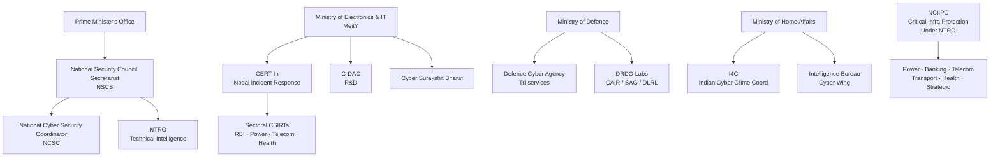
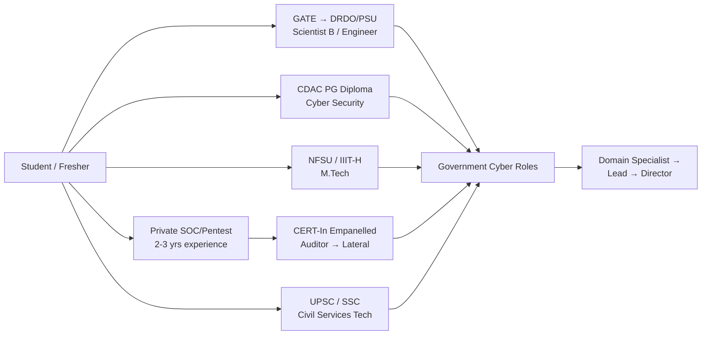
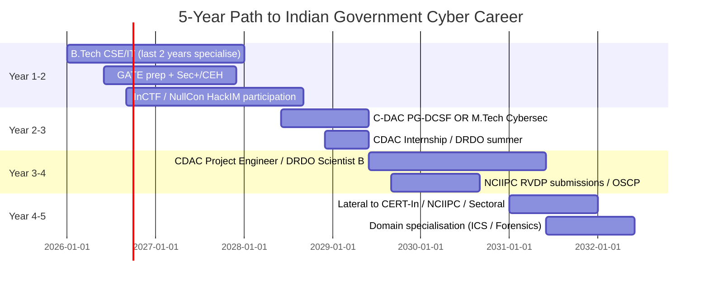

---
tags:
  - phase-6
  - career
  - india
  - government
  - cert-in
  - nciipc
  - drdo
---

# Government Cybersecurity Careers — India 🇮🇳

> *"The defence of India's cyberspace is a strategic imperative — every defender contributes to national security."*

India's cyber landscape has matured rapidly: dedicated agencies, a national cyber strategy in motion, sectoral CSIRTs, defence labs, and a growing private‑public ecosystem. This chapter maps **who hires**, **what they do**, **how to get in**, and **how to stand out** as an aspiring defender or offensive security specialist seeking to serve.

---

## The Indian Cyber Ecosystem at a Glance

This is the operational picture — political, technical, defence, law enforcement, and intelligence streams all touch cyber.

---

## Major Employers — Deep Dive

### CERT-In — Indian Computer Emergency Response Team

**Mandate**: National nodal agency for cyber incident response under MeitY (designated by Section 70B of IT Act 2000).

**Mission**:

- Forecast and alert on cyber security incidents
- Emergency measures for handling cyber security incidents
- Coordinate cyber incident response activities
- Guidelines, advisories, vulnerability notes, whitepapers

**Roles**: Vulnerability Analyst, Incident Responder, Malware Analyst, Threat Intelligence Researcher, Sectoral Liaison Officer, Cyber Security Auditor.

**Hiring**:

- Direct recruitment via MeitY notifications and CERT-In website
- Some posts via CDAC (deputation/contract)
- Eligibility typically: B.Tech/M.Tech CSE/IT/ECE, certifications a plus
- Watch [www.cert-in.org.in](https://www.cert-in.org.in) and [www.meity.gov.in](https://www.meity.gov.in) recruitment sections

**What they look for**: Strong fundamentals, incident response experience, ability to write advisories, sector-specific knowledge (power/finance/telecom).

!!! tip "CERT-In Empanelment"
    CERT-In maintains an **empanelled auditors list** — private firms approved to conduct security audits. Working at an empanelled firm is a common stepping stone and gives you exposure to government and CII systems.

### NCIIPC — National Critical Information Infrastructure Protection Centre

**Mandate**: Protect Critical Information Infrastructure (CII) — designated under Section 70A of IT Act 2000. Operates under NTRO.

**Sectors covered**: Power & Energy, Banking/Financial Services/Insurance, Telecom, Transport, Government, Strategic & Public Enterprises, Healthcare.

**Roles**: CII Auditor, Threat Analyst, Incident Coordinator, Sector Specialist, Researcher.

**Hiring**:

- Through NTRO recruitment cycles (notified rarely; subscribe to NCIIPC mailing list)
- Deputation from PSUs and central armed forces
- B.Tech/M.Tech minimum; sector experience valued (e.g., SCADA/ICS for power)
- [www.nciipc.gov.in](https://www.nciipc.gov.in) — also runs a **Responsible Vulnerability Disclosure Program** (RVDP) — researchers can report bugs in CII and earn recognition

!!! example "RVDP — Foot in the Door"
    Discovering and responsibly disclosing vulnerabilities in CII through NCIIPC's RVDP is a credential. Several researchers have leveraged this for direct contact with the agency.

### NTRO — National Technical Research Organisation

**Mandate**: India's premier technical intelligence agency — equivalent in technical scope to NSA. Reports to NSA (National Security Advisor)/NSCS.

**Verticals**:

- SIGINT (Signals Intelligence)
- IMINT (Imagery Intelligence)
- Cyber Operations
- Crypto

**Roles**: Cyber Operations Officer, Crypto Analyst, SIGINT Specialist, Research Scientist.

**Hiring**:

- Highly opaque — direct recruitment through advertised positions, lateral entry from forces, deputation from labs
- Requires Indian citizenship, clean record, often graduate degree from premier institute (IITs/IISc/NITs)
- Polygraph and detailed background check
- Watch UPSC, SSC, and direct NTRO advertisements (rare)

### DRDO — Defence Research & Development Organisation

DRDO has multiple labs working in cyber/comms/cryptology:

| Lab | Location | Focus |
|---|---|---|
| **CAIR** — Centre for AI & Robotics | Bengaluru | Cyber security, AI, secure comms, network security R&D |
| **SAG** — Scientific Analysis Group | Delhi | Cryptology — design and analysis of cryptographic systems |
| **DLRL** — Defence Electronics Research Lab | Hyderabad | EW, SIGINT, RF/SDR, communications intelligence |
| **DEAL** — Defence Electronics Applications Lab | Dehradun | Communications, satellite, network systems |
| **ANURAG** | Hyderabad | High-performance computing, advanced numerical research |

**Hiring**:

- **Scientist 'B'** entry via DRDO's Recruitment & Assessment Centre (RAC) — open to GATE-qualified BE/B.Tech graduates and direct recruits
- [rac.gov.in](https://rac.gov.in) for Scientist 'B' and 'C' notifications
- Also open positions for Senior Research Fellows (SRF) and Junior Research Fellows (JRF) for project work
- M.Tech/PhD candidates can apply for higher entry levels

**What they want**: Strong CS/EE fundamentals, programming (C/C++/Python), interest in long-term R&D, willingness to work in classified environment.

### Defence Cyber Agency (DCyA)

**Mandate**: Tri-service agency (Army + Navy + Air Force) under HQ Integrated Defence Staff (IDS), HQ at Delhi. Conducts cyber operations for the armed forces.

**Roles**: Cyber Operations Officer, Cyber Defence Officer, OSINT Analyst, SOC Operator (military).

**Hiring**:

- Primarily officers from the three services on deputation
- Civilians: limited — through DRDO/MoD R&D positions interfacing with DCyA
- Best path for civilians: enter as Short Service Commission (SSC-Tech) or via DRDO/strategic R&D contracts

### I4C — Indian Cyber Crime Coordination Centre

**Mandate**: Under MHA (Ministry of Home Affairs). Acts as a nodal point to deal with all types of cybercrimes — coordinates with state police, runs the National Cybercrime Reporting Portal ([cybercrime.gov.in](https://cybercrime.gov.in)).

**Verticals (the "7 Cs")**:

1. National Cybercrime Threat Analytics Unit (TAU)
2. National Cybercrime Reporting Portal
3. National Cybercrime Training Centre (NCTC)
4. Cyber Crime Ecosystem Management Unit
5. National Cyber Crime Research & Innovation Centre
6. National Cyber Crime Forensic Laboratory Ecosystem
7. Joint Cyber Crime Coordination Team Platform

**Roles**: Cyber Forensics Examiner, Threat Analyst, Trainer, Research Officer, Investigator (uniformed cadres).

**Hiring**: Through MHA notifications, deputation from CAPFs/state police, direct recruitment for technical posts.

### Intelligence Bureau (IB) — Cyber Wing

**Mandate**: India's internal intelligence agency under MHA. Cyber wing handles internal cyber threats, surveillance, counter-cyber-terrorism.

**Hiring**:

- **ACIO-II/Executive (Tech)** — Assistant Central Intelligence Officer, Technical — recruited via MHA notification
- B.Tech CSE/IT/ECE typically required for tech posts
- Detailed background check, secrecy required

### RAW — Research and Analysis Wing

**Mandate**: India's external intelligence agency. Maintains a cyber/SIGINT capability.

**Hiring**: Lateral entry through Cabinet Secretariat — opaque process, often via deputation from forces and other intel agencies.

### CDAC — Centre for Development of Advanced Computing

**Mandate**: Premier R&D organisation under MeitY. Multiple centres (Pune, Bengaluru, Hyderabad, Mohali, Noida, Thiruvananthapuram, Chennai, Kolkata).

**Cyber-relevant work**:

- Cyber Security Group (Hyderabad, Mohali, Thiruvananthapuram, Pune)
- Trusted Computing Group
- Forensics tools (CyberCheck — sold to LE agencies)
- Encryption and PKI (CCA — Controller of Certifying Authorities certs)
- Train, audit, build for government

**Hiring**:

- Project Engineers / Project Associates (contractual, often 2-3 year contracts)
- Permanent Scientific Officers via direct recruitment
- [www.cdac.in/index.aspx?id=Careers](https://www.cdac.in/) — frequent openings
- Often a great first stop after college; many move on to CERT-In/NCIIPC/private

!!! tip "CDAC Sandwich Path"
    Join CDAC as a Project Engineer → contribute to cyber/forensics/encryption projects → build clearance-eligible profile → apply to CERT-In, NCIIPC, NTRO, or DRDO with relevant experience.

### NIC-CERT — National Informatics Centre CERT

**Mandate**: NIC under MeitY runs government IT infrastructure. NIC-CERT defends government networks (.gov.in, .nic.in).

**Hiring**: Through NIC recruitment notifications — often Scientist B/C posts or contract.

---

## Sectoral CSIRTs

CERT-In has notified sectoral CSIRTs to handle sector-specific incidents:

- **CSIRT-Fin** — Financial sector (RBI/IDRBT)
- **CSIRT-Power** — Power sector (CEA)
- **CSIRT-Telecom** — Telecom (DoT)
- **CSIRT-Health** — Health sector (MoHFW)
- **CSIRT-Transport** — Transport sector
- **CSIRT-Strategic** — Strategic sectors

These run inside their parent organisations — joining the parent (e.g., RBI, IDRBT for finance) and rotating into the CSIRT is a viable path.

---

## State Cyber Police & Forensics

Every state now has a Cyber Crime Cell or Cyber Crime Police Station. Many have dedicated Cyber Forensics Labs (often partnered with C-DAC/CFSL/state forensic labs).

**Notable**:

- **Maharashtra Cyber** — well-funded state cyber unit
- **Telangana Cyber Bureau**
- **Karnataka CID Cyber Crime**
- **Kerala Cyber Police**

**Hiring**: Through state PSC for civilian technical roles, or as uniformed staff via state police recruitment.

---

## Strategic Public Sector Undertakings (PSUs)

Many PSUs run cyber teams, often interfacing with NCIIPC sectoral mandates:

- **BEL** (Bharat Electronics Ltd.) — defence electronics, secure comms
- **BDL** (Bharat Dynamics) — defence systems
- **ECIL** (Electronics Corp. of India) — strategic electronics, including cyber sec products
- **ITI Limited** — telecom, cyber
- **PFC**, **REC**, **NTPC**, **POSOCO** — power sector CISO/SOC roles
- **SBI**, **PNB**, **BoB**, **RBI**, **NPCI**, **IDRBT** — finance sector CISO/SOC/red team roles
- **BSNL**, **MTNL** — telecom defence

PSU recruitment usually via GATE score (BE/B.Tech) or direct PSU notifications.

---

## Educational & Strategic Institutions

These are great academic-industry hybrid pathways:

- **IIT Cybersecurity Centres** — IIT Madras (RBCDSAI), IIT Kanpur (C3i), IIT Bombay, IIT Hyderabad
- **IIIT Hyderabad** — Centre for Security, Theory and Algorithmic Research (CSTAR)
- **IIIT Bangalore** — Cyber Security Education and Research Centre
- **IISc Bengaluru** — secure systems research
- **NFSU** — National Forensic Sciences University (Gandhinagar) — dedicated cyber forensics programs and direct govt linkages
- **RRSL** — Rashtriya Raksha University (Gandhinagar) — security & strategic studies

These offer M.Tech/PhD programs that feed directly into government R&D and policy roles.

---

## Recruitment Pathways — Synthesised

### 1. GATE → DRDO/PSU (Most Common)

- Take GATE in CS/IT/EC
- Apply to DRDO Scientist B (RAC), BARC, ISRO, NTRO, PSUs (BEL, ECIL, etc.)
- Permanent government job, gazetted officer status
- Slow rise but high security clearance and trust

### 2. C-DAC PG Diploma (PG-DCSF / PG-DCS)

- Centre for Development of Advanced Computing offers Post Graduate Diplomas in Cyber Security & Forensics (PG-DCSF) and Cyber Security (PG-DCS)
- Selection via C-CAT (C-DAC Common Admission Test)
- Strong placement into CDAC itself, government projects, and private CERT-In empanelled firms

### 3. Direct via Notifications

- Subscribe to: [www.cert-in.org.in](https://www.cert-in.org.in), [www.nciipc.gov.in](https://www.nciipc.gov.in), [rac.gov.in](https://rac.gov.in), [www.meity.gov.in](https://www.meity.gov.in), [employmentnews.gov.in](https://employmentnews.gov.in)
- Notifications appear sporadically — subscribe to RSS/email alerts

### 4. Lateral via Empanelled Auditing Firms

- Join a CERT-In empanelled audit firm (top names: SISA, NII, KPMG India, EY India, Aujas, Network Intelligence, ANB, IBM India, Wipro, TCS, Infosys, HCL, etc.)
- Conduct CII audits — gain trust and exposure
- Apply to government roles with audit experience

### 5. Civil Services / SSC Technical

- **UPSC ESE (Engineering Services Examination)** — for engineering services in MoD, Railways, Telecom — limited cyber direct
- **SSC CGL (Tech posts)** — Section Officer (Audit), Inspector posts in cyber-adjacent ministries
- **UPSC CSE** — IPS officers can specialise into cyber crime; IAS into MeitY/MHA cyber roles
- **CAPF (AC)** — Assistant Commandants in CRPF/CISF/BSF/ITBP/SSB — selected officers handle cyber wings

### 6. Cyber Volunteer Programme (Citizen Path)

I4C runs the **Cyber Crime Volunteer** programme — citizens can register at cybercrime.gov.in to assist law enforcement with awareness, content flagging, and (for technical volunteers) cyber threat analysis. Not a salaried role, but a way to engage and prove yourself.

### 7. Skill India / Cyber Surakshit Bharat / IndiaAI

Government skill-building initiatives — **Cyber Surakshit Bharat** (CISO and frontline IT staff training), **IndiaAI Mission** (AI safety, AI red-teaming, deep-tech AI research). Joining as a trainer/researcher offers paths to formal posts.

---

## What to Build — A Profile That Stands Out

For Indian government cyber roles, build:

| Component | How |
|---|---|
| **Education** | B.Tech CSE/IT/ECE; ideally M.Tech in Cyber Security, AI, or Cryptology from IIT/IIIT/NFSU |
| **Government linkage** | C-DAC PG Diploma, CERT-In Internship, NCIIPC RVDP submissions, internship at DRDO/BARC/ISRO |
| **Certifications** | CEH (entry), OSCP (offensive cred), CISA/CISSP (audit/governance), GIAC (advanced), DSCI Privacy/Cyber certifications |
| **Open-source contributions** | Tools used by DFIR/SOC community; Indian-language cyber-awareness content; CVE submissions to NCIIPC RVDP |
| **CTF performance** | InCTF (IIITM-K Kerala), NullCon HackIM, SIH Cyber, Bharat CTF |
| **Publications** | NULLCon, c0c0n, BSidesDelhi/Bangalore/Goa talks; whitepapers on Indian cyber issues |
| **Citizenship & background** | Indian citizen; clean record; stable address history |
| **Languages** | English + Hindi mandatory; regional languages for state postings |

!!! tip "Indian Cyber CTF Circuit"
    - **InCTF** — Amrita University — flagship Indian CTF, has Junior (school) and University tracks
    - **NullCon HackIM** — held alongside NullCon Goa
    - **Bi0sCTF** — by team Bi0s (IIIT-Hyderabad)
    - **Smart India Hackathon — Cyber theme** — government-sponsored hackathon, direct visibility to ministries
    - **C0c0n** — Kochi-based hacking conference with CTF
    - **Bharat CTF** — newer national-level event

---

## Compensation Reality Check

| Role | Approximate Annual Pay (INR) |
|---|---|
| DRDO Scientist B (entry, 7th CPC) | ₹10–12 LPA (Level 10) + perks |
| CDAC Project Engineer (entry, contract) | ₹6–8 LPA |
| CERT-In Consultant (contract) | ₹8–15 LPA |
| NCIIPC Officer | ₹12–20 LPA + perks |
| Sectoral CSIRT Engineer (e.g., RBI/IDRBT) | ₹15–25 LPA |
| State Cyber Police (Tech Officer, Group B) | ₹6–10 LPA |
| Private CERT-In empanelled firm (mid-level) | ₹15–35 LPA |
| Big-4 Consulting (Manager, Cyber) | ₹25–50 LPA |

Government pay is moderate but non-monetary benefits substantial: housing, healthcare, pension, stability, gratuity, leave travel, education for dependents, prestige.

---

## Background, Citizenship & Verification

For sensitive roles (NTRO, DRDO classified projects, NCIIPC), expect:

- Indian citizenship — non-negotiable
- Police verification (state and central)
- Education and employment verification
- Reference checks (often phone/visit to former colleagues, neighbours)
- Sometimes psychological evaluation
- For NTRO: deeper background, sometimes polygraph
- Clean financial record (no defaults)
- Social media review for sensitive postings

!!! warning "Foreign Connections"
    Significant ties to foreign nations (extended family, education, employment, holdings) may complicate clearance for sensitive roles. Disclose everything truthfully on application — discovered omissions disqualify automatically.

---

## Networking & Community

The Indian cyber community is tight-knit and conference-driven:

- **NullCon** (Goa) — flagship Indian security conference
- **c0c0n** (Kochi) — community-oriented, government-friendly
- **BSides Delhi / Bangalore / Goa / Chennai** — community conferences
- **NULL Community** — meetups across cities; many CERT-In/government folks attend
- **OWASP India chapters** — Bangalore, Hyderabad, Delhi, Pune
- **DSCI** (Data Security Council of India, NASSCOM) — runs Annual Information Security Summit (AISS)
- **CISO Platform / CISO Mag** — networking with CISOs (many ex-government)
- **CyberPeace Foundation** — civil society + government collaboration

---

## Indian Cyber Strategy Documents (Read These)

- **National Cyber Security Policy 2013** (under revision — National Cyber Security Strategy 2023+)
- **IT Act 2000** + **Amendment Act 2008** + DPDP Act 2023
- **CERT-In Directions of April 2022** (180-day log retention, 6-hour incident reporting)
- **Personal Data Protection Act 2023 (DPDP)** — governs personal data
- **NCIIPC Sector Rules** — for each CII sector
- **Sectoral guidelines** — RBI Cyber Security Framework, SEBI CSCRF, IRDAI ISNP, TRAI, etc.

Knowing these makes you immediately useful to any team auditing or defending an Indian organisation.

---

## A 5-Year Roadmap — Fresher to Government Cyber Officer

This is one realistic path; many succeed via private experience first.

---

## Cross-References

- [Certifications Roadmap →](certifications.md)
- [US Government Careers →](gov-careers-us.md) — many parallels and contrasts
- [CTF Path →](ctfs.md)
- [Reporting Skills →](reporting.md) — government roles demand impeccable written communication

---

## Further Reading

- **CERT-In website**: cert-in.org.in (advisories, vulnerability notes, whitepapers)
- **NCIIPC website**: nciipc.gov.in (CII guidelines, RVDP)
- **DSCI**: dsci.in (industry reports, frameworks, AISS)
- **MeitY**: meity.gov.in (policy and recruitment)
- **PIB Cyber announcements**: pib.gov.in
- **National Cyber Security Strategy** (when published)
- **Books**: *India's Cyber Security* (Pavithran Rajan), *The Beauty of Cyber Security and Network Security* (DSCI publications)

---

> *India's cyber doctrine is being written now. Defenders who join early shape it. Get your fundamentals iron-clad, build a public record of skill, and the agencies will find you.*

---

[← 🇺🇸 US Government Careers](gov-careers-us.md)  ·  [CTFs, Labs & Practice →](ctfs.md)
