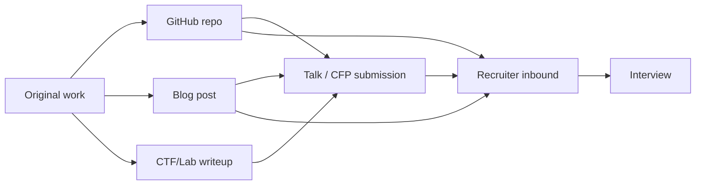
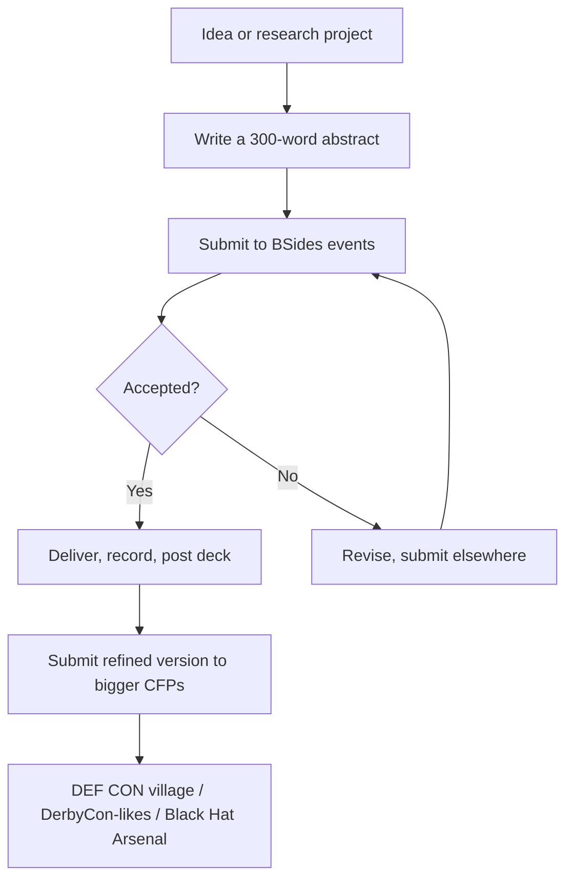

# 🗂️ Building a Security Portfolio

> Certifications get you past the HR filter. A portfolio gets you past the **technical interview**. It's also the single biggest differentiator for the agency hiring managers and contracting recruiters who will read your name before they ever read your résumé.

A portfolio isn't a vanity project. It is *evidence* — concrete, link-clickable proof — that you can do the work you claim to do. For US TS/SCI roles, it also doubles as a public OPSEC test: what you publish is read by the people who will adjudicate your suitability.

---

## Why portfolio matters disproportionately in cyber

In most industries, your résumé is the artifact that gets you hired. In cybersecurity, the portfolio often eclipses it. Three reasons:

1. **The skills compound visibly.** A reverse-engineer, detection engineer, or red teamer leaves a trail — writeups, repos, tool releases, CTF placements, CVE credits — that maps cleanly to how the work is actually done.
2. **Hiring managers self-recruit.** Senior practitioners read security Twitter/Mastodon, follow GitHub releases, and listen to conference talks. They notice good work *before* they advertise a role. Many of the best US and Indian gov-adjacent jobs are filled this way (CACI, Booz Allen, CrowdStrike, Mandiant, Tata Elxsi, L&T Technology Services).
3. **Government interviewers ask for it.** NSA's ECEP and DHS Cyber Talent Management System (CTMS) interviewers explicitly ask "show me something you've built." CERT-In and DRDO panels do the same — usually framed as "describe a project you led from start to finish."

!!! tip "The 30-second portfolio test"
    A recruiter clicks your GitHub or website. **In 30 seconds**, can they tell:
    (1) what you do, (2) what your strongest area is, (3) one piece of evidence of original work?
    If not, your portfolio isn't working. Fix the front door before adding more rooms.

---

## The five portfolio surfaces (in priority order)

| Surface | Audience | Time to build | Effort/week | Career lift |
|---|---|---|---|---|
| **GitHub profile** | Engineers, hiring managers | 2–4 weeks initial | 1–2 hrs | ⭐⭐⭐⭐⭐ |
| **Technical blog** | Hiring managers, peers, future colleagues | 4–8 weeks initial | 2–4 hrs | ⭐⭐⭐⭐⭐ |
| **Writeups (CTF / vuln / IR)** | Peers, recruiters | 1 week each | 2–3 hrs/writeup | ⭐⭐⭐⭐ |
| **Public talks / conference CFPs** | The whole industry | 3–6 months from idea to stage | bursty | ⭐⭐⭐⭐⭐ |
| **Open-source contributions** | Project maintainers, ecosystem | Continuous | 1–3 hrs | ⭐⭐⭐⭐ |

Stack them. They reinforce each other — a blog post links to the GitHub repo, the GitHub repo links to a CTF writeup, the CTF writeup gets shared, the talk pitches the project, the project gets maintainers' attention.

---

## Surface 1 — GitHub profile

GitHub is your **technical résumé**. For most security roles it carries more weight than the document on USAJobs.

### The pinned repo strategy

You get **six pinned repos**. Use all six. They are the first thing every visitor sees.

A strong layout for a defensively-minded candidate:

| Slot | Repo | Type |
|---|---|---|
| 1 | A polished tool you wrote (e.g., a Sigma rule generator, a memory triage helper, a YARA scanner) | Original |
| 2 | A second polished tool — different specialty (cloud audit, web fuzzer) | Original |
| 3 | A research repo — Jupyter notebooks analyzing a malware family / TTP / dataset | Original |
| 4 | A CTF writeup repo — clean, Markdown-only, indexed by category | Original |
| 5 | A meaningful contribution to an ecosystem repo (Sigma rules, nuclei templates, Suricata rules, MITRE ATT&CK Navigator layer, Volatility plugin) | Contribution |
| 6 | A reference / cheat-sheet / curated awesome-list you maintain | Curation |

### Repo quality standards

A single polished repo beats ten abandoned ones. Every repo you pin should have:

- **README.md** — within 60 seconds the reader should know what it does, why it exists, who it's for, and how to run it. Lead with a one-line description, then a screenshot or terminal recording, then `Install` and `Usage` sections. End with `Roadmap` and `License`.
- **License** — MIT or Apache-2.0 for tools; CC-BY-4.0 for writeups. **No license = unusable.** Most enterprises (and gov contractors) cannot legally use unlicensed code.
- **Tests** for tools that take input (CSVs, packets, binaries, EVTX). Even three pytest cases beat zero.
- **CI** — GitHub Actions running tests + a linter (`ruff`, `black`, `mypy`). It's free and signals professional habits.
- **Versioning** — at least one tagged release (`v0.1.0`). Recruiters scan for this.
- **`AUTHORIZED USE ONLY`** disclaimer at the top of any offensive tool. Future you, your future employer, and the lawyer reading your suitability packet will all thank you.
- **Issues triaged** — it's worse to have 14 unread issues than 0 issues. If you can't maintain a repo, archive it cleanly with a note pointing to a successor.

!!! tip "The README that lands interviews"
    Title, one-line tagline, animated GIF or asciinema cast of the tool running, install instructions, "Why this exists" paragraph (the *story*), feature list, `--help` output verbatim, sample output, related projects, license. That's the template.

### What NOT to put on your security GitHub

- **Forks of mainstream offensive tools you didn't substantially modify** — they look like padding.
- **Cracked tools, pirated training material, leaked malware samples.** Instant disqualifier for any cleared role.
- **Anything that processes real victim data** (even in test repos). One stray PII commit will haunt you for years; rewriting Git history doesn't always fix it because mirrors persist.
- **TryHackMe / HTB room solutions for unretired boxes.** Most platforms forbid this in their ToS, and recruiters know to look for it.
- **Stolen content.** "Inspired by" is fine; uncredited copy is not. The community is small.

### Profile README

Pin a `<your-username>/<your-username>` repo. Its README renders on your profile page. Use it for:

- Headline: who you are professionally (one line)
- Currently working on (single bullet, kept current)
- Top areas of expertise (3–5 tags)
- Direct links to blog, CTFtime profile, HTB profile, LinkedIn
- A small set of GitHub-stats badges (sparingly — one or two, not a wall of them)

Avoid the trap of building a flashy profile README and never updating it; an out-of-date "currently working on" line makes you look inactive.

---

## Surface 2 — Technical blog

The blog is where your *thinking* lives. Recruiters and hiring managers read blogs to evaluate two things: **clarity of communication** and **technical depth**.

### Platform choice

| Platform | Pros | Cons |
|---|---|---|
| Own domain + static site (Hugo / Eleventy / Astro) | Full ownership, custom layout, signal of seriousness, no platform risk | More effort to set up, you maintain TLS/CDN |
| GitHub Pages (Hugo / mdBook / MkDocs) | Free, zero infra, version-controlled | Slightly off-the-shelf look |
| Hashnode / Dev.to | Built-in audience, comments, free | Platform lock-in, your traffic isn't yours |
| Medium | Some discovery | Paywall complications, looks dated for tech audiences |
| Substack | Newsletter built-in, growing security audience | Social/curatorial vibe, less searchable |

**Recommendation:** own domain with a static site generator. The signal it sends to a hiring manager — that you set up your own DNS, TLS, and pipeline — is itself a credential. `<yourname>.dev` or `<handle>.io` is enough. Avoid `<handle>.medium.com` unless you're already established there.

### What to write about (without leaking)

You will be tempted to write only highlight-reel content. Don't. The most-read security posts fall into a small number of repeating patterns:

- **"I learned X" deep-dives.** A 2,500-word post on, say, how Kerberos S4U2Self and S4U2Proxy actually work, with a worked example, gets cited for years.
- **CVE walkthroughs of patched/disclosed bugs.** Pick a public CVE, build the lab, reproduce it, explain why the patch works. Bonus points: write the Sigma/Suricata/YARA rule that detects it.
- **Tool releases.** Announce your GitHub repo with the *story* — what problem you hit, what existed already, what was missing, design decisions, future work.
- **Lab reports.** "Detecting AS-REP roasting end-to-end with Wazuh" — set up the lab, run the attack, show the telemetry, write the rule, validate.
- **Writeups.** Retired HTB boxes, completed PortSwigger Web Security Academy labs, finished picoCTF tracks, finished SANS Holiday Hack.
- **Meta/career posts** — sparingly. One per quarter, max. Nobody hires the person who writes only career posts.

!!! warning "Government and contractor restrictions"
    If you currently hold or will soon seek a clearance, anything you publish becomes part of your suitability packet. **Do not blog about**: anything you learned at work, anything you learned from classified-adjacent training, vulnerabilities in deployed government systems even if you found them as a researcher (use the agency's [VDP](https://www.cisa.gov/coordinated-vulnerability-disclosure-process)), anything that touches OPSEC for ongoing investigations. When in doubt, ask your facility security officer (FSO) before publishing.

### Cadence and growth

- **Year 1**: aim for one substantive post per month. Twelve posts is a portfolio.
- **Year 2+**: drop the cadence to one post every 6–10 weeks but raise the depth. A 4,000-word post on a niche topic outperforms four short posts.
- **Cross-post** to Hacker News, [r/netsec](https://www.reddit.com/r/netsec), [Lobsters](https://lobste.rs), the relevant Discord/Slack. Don't spam — one share per post, the day it goes live.
- **Watch your analytics** but don't fixate. The post you think is your best will not be the one that takes off, and that's fine.

### The single highest-ROI post type

A post that introduces an open-source tool you wrote, explains the problem it solves, and walks through one realistic use case. It compounds: it drives traffic to your GitHub, the GitHub stars boost your profile, and the project's lifecycle (issues, PRs, v0.2, v0.3) gives you natural follow-up posts for free.

---

## Surface 3 — Writeups

Writeups are the disciplined journaling habit of cybersecurity. Every box you solve, every challenge you finish, every vulnerability you research — write it up.

### CTF writeups

Standard structure:

1. **Challenge name + category + points + event** (and a link to CTFtime)
2. **TL;DR** — one paragraph, what the bug/trick was
3. **Recon** — what files / endpoints / binaries you got, what the prompt said
4. **Exploration** — what you tried that didn't work, what hint cracked it
5. **Solution** — the actual exploit path with screenshots and code
6. **Flag** — the captured flag (or a redacted form if rules require)
7. **Lessons** — what you learned, what you'll try first next time

Host them in a single GitHub repo (`ctf-writeups`) organized as `EVENT/CATEGORY/CHALLENGE.md`. Add an `index.md` so the root README is browsable.

### Box / lab writeups

For HTB, THM, OffSec PG, PWN.College — same structure. **Only write up retired/free boxes** to avoid ToS violations. HTB explicitly forbids writeups of active machines that include the flags.

### Vulnerability writeups (after responsible disclosure)

These are the highest-value writeups for hiring. After you've coordinated disclosure and the vendor has patched — and *only then* — write up:

- The application or library and version
- How you found it (fuzzing? source review? happy-path deviation?)
- Root cause in code with annotated snippets (only what's necessary)
- The patch the vendor shipped and why it works
- Detection guidance (a YARA / Sigma rule, a Snort signature, a query)
- Timeline of disclosure, with vendor cooperation acknowledged

Hiring managers love these because they show you can find bugs *and* communicate professionally with vendors — a rare combination.

### Incident response writeups

For your own work, incident writeups will normally stay private. But the public IR community has built incredible learning material from sanitized retrospectives. If you're ever in a position to publish (as part of an external advisory team, after legal/PR clears it), the structure is:

- **Executive summary** — 1 paragraph, business impact
- **Initial access** — how the adversary got in
- **Timeline** — TTPs in chronological order, mapped to MITRE ATT&CK
- **Detection gap** — what telemetry would have caught it earlier
- **Remediation** — what was done, how long it took
- **Lessons** — for the broader community

Treat these like aviation accident reports. The community gets safer.

---

## Surface 4 — Public talks

The single highest-leverage portfolio item, and the one most candidates skip because it's scary.

### The CFP funnel

### The bottom rung — start here

These are deliberately approachable:

- **Local BSides** (BSides Las Vegas, BSides Delhi, BSides Bangalore, BSides San Francisco, etc.) — most have rookie tracks
- **OWASP local chapter meetings** — usually accept first-time speakers
- **Null chapter meetups** in India — explicitly built for first-time speakers
- **DEF CON groups** (DC408, DC11001, DC91120) — informal, friendly
- **University security clubs** — easiest first audience
- **Internal company brown-bag** — counts as practice; record it

### The middle rung

- **DEF CON villages** (Recon, Cloud, ICS, Aerospace, Bio Hacking, AI, Red Team) — village CFPs are far less competitive than the main track
- **Black Hat Arsenal** — for tools you've shipped
- **SO-CON / ShmooCon / Hackfest / Nullcon Goa / c0c0n / HackInTheBox**
- **SANS Summit** community talks

### The top rung

- **DEF CON main track**, **Black Hat USA briefings**, **USENIX Security**, **IEEE S&P**, **ACM CCS**, **NDSS** — research-grade work, multi-month preparation, peer review.

### What makes a good CFP submission

A title that promises a specific, useful takeaway (not "Adventures in X"). An abstract that names the *novel* thing you're going to show. Three bullet points of what attendees will learn. A short bio with a portfolio link. **Don't** lie about co-authors or affiliations — small community, fast disqualification.

### After the talk

Post the slides on SpeakerDeck or your blog the same day. If the conference doesn't record talks, record yourself giving the talk to camera and post it within a week. Submit the same talk (or a deeper version) to two more conferences in the next six months — most CFPs welcome already-given talks.

---

## Surface 5 — Open-source contributions

Pick **one** ecosystem-relevant project and become a recognizable contributor. Spreading thin across ten projects looks worse than ten meaningful PRs to one.

### Projects that consistently accept contributions

| Project | What you can contribute | Why it matters |
|---|---|---|
| **SigmaHQ/sigma** | New detection rules, rule fixes, backend fixes | Universally read by blue teams |
| **projectdiscovery/nuclei-templates** | New CVE templates, fingerprints | Used by every modern recon pipeline |
| **OISF/suricata-rules** / **ET Open** | Network detection signatures | NSM standard |
| **mitre-attack/attack-stix-data**, **mitre/caldera** | Technique data, plugins | Resume gold for blue/purple |
| **volatilityfoundation/volatility3** | Plugins, symbol tables | Memory forensics standard |
| **rapid7/metasploit-framework** | Modules, fixes | Brand-name tool, every hiring manager knows it |
| **redcanaryco/atomic-red-team** | Atomic tests | Adversary emulation gold standard |
| **falcosecurity/falco**, **wazuh/wazuh**, **TheHive-Project** | Rules, integrations, plugins | Open SIEM/SOAR ecosystem |
| **OWASP** projects (ZAP, Amass, Juice Shop, ASVS) | Code, docs, content | Brand recognition |
| **Yara-Rules/rules**, **Neo23x0/signature-base** | YARA rules with public references | Threat intel community |

### How to make your first contribution

1. Use the project for two weeks for real work. Find friction.
2. Open one issue describing the friction, with a reproduction case.
3. Wait for triage (sometimes weeks). When a maintainer comments, ask whether they'd accept a PR for it.
4. Read `CONTRIBUTING.md`. Match the project's style precisely.
5. Send a small PR. Tests included. Rebase, not merge. Respond to review fast.
6. After merge, do it again. Become reliable. Maintainers remember.

A second-tier signal — also valuable — is **maintaining a curated `awesome-X` list** that becomes the de-facto reference for some niche. `awesome-detection-engineering`, `awesome-icssec`, `awesome-prompt-injection` — if yours becomes the canonical one, your name is forever associated with the niche.

---

## Bug bounty as a portfolio

A serious bug bounty profile is a complete portfolio in itself, but it's also the slowest-paying one to start. Realistic expectations:

- The first six months you will earn close to nothing. This is normal.
- Reach Top 100 on **HackerOne** or **Bugcrowd** or **Intigriti** and you can walk into almost any AppSec role.
- Even three accepted reports with public CVEs are enough to reference on a résumé.

For US/India gov career paths, prefer **VDPs** (vulnerability disclosure programs) over commercial bounties for two reasons:

1. **DoD VDP** (run by DC3) — every report you submit and that gets accepted is a documented record of legitimate research with the US Department of Defense. It is the single best public-trust signal you can build.
2. **CERT-In Responsible Vulnerability Disclosure Program (RVDP)** — equivalent for India. Reports go through CERT-In and you receive an acknowledgment letter on agency letterhead.
3. Many agencies have their own VDPs: NASA, USPS, GSA TTS (login.gov), the IRS, and the [CISA-coordinated federal VDP platform](https://vdp.cisa.gov).

These produce paper trails — letters, hall-of-fame entries, CVE credits — that recruit-and-clear hiring managers love.

---

## CTFtime, HackTheBox, and platform profiles

Your platform profiles **are** part of your portfolio.

- **CTFtime team page** — pick a serious team or start one. Year-over-year ranking trend matters more than absolute rank.
- **HackTheBox profile** — Pro Hacker rank or above is the typical filter for OSCP-equivalent roles. List your Pro Labs (Dante, Offshore, RastaLabs, Cybernetics) on your résumé.
- **PortSwigger Web Security Academy** — finishing all the labs is genuinely impressive and free. Screenshots of your "All Topics Complete" page belong on your blog.
- **Pwn College / picoCTF / RingZer0 / Root-Me** — any one of these with a high-completion profile shows steady, public effort.
- **Bug bounty platform reputation pages** (HackerOne, Bugcrowd) — link them.

Add a `Profiles` block to your blog's About page with these links. Recruiters click through.

---

## OPSEC and the public-trust portfolio

If your goal is a US TS/SCI clearance or an Indian government RAW/IB role, your portfolio is also a **counterintelligence target**. A few realities to internalize early:

- **Foreign contact policy** — collaborating openly with researchers from countries on the [restricted list](https://www.directives.doe.gov/directives-documents/400-series/0410.1-AManual-2-admchg2/@@images/file) (DoE example) can complicate clearances. Be careful about co-authors.
- **CTF teams** — playing on a team affiliated with foreign nationals isn't disqualifying but **will** be asked about. Keep records of teammates' real identities.
- **Telegram and offshore "underground" forums** — even passive lurking gets noticed. Stay on professional platforms.
- **Pseudonyms** — using a handle is fine. **Tying that handle to credit for unauthorized access** is not. Adjudicators will dig.
- **Cryptocurrency activity** — bug bounty payouts to an exchange you control are clean. Exchanges flagged for sanctions evasion are not.
- **Public political activity** — protected, but anything resembling foreign influence advocacy needs care.

The good news: most of this just means "behave like a professional researcher and document everything." If your work is legal, your sources are legal, and your attribution is honest, you're fine.

---

## Anti-patterns

A short list of moves that have killed candidates' chances during reference checks:

- **Resume-padding** writeups for boxes you didn't actually solve. Interviewers will pick a writeup at random and ask you to reproduce it on a whiteboard.
- **Stolen tools** (forking, renaming, removing original credit). The original author *will* notice; the security community is small enough that it'll come up at the panel.
- **Public POCs of unpatched vulnerabilities** found at a previous employer. This is both legally and ethically out of bounds.
- **Tweeting hot takes about ongoing incidents** while affiliated with the responder. Same-day blog posts about a victim org you're investigating end careers.
- **Anti-vendor posts** about competing products of your future employer. The hiring manager will find them.
- **Empty repos with impressive READMEs.** Recruiters check whether the code actually runs.
- **CTF flag farming** — running scripts against challenge servers in a way that violates rules to inflate ranking. Permanent ban from CTFtime is a known consequence; it travels.

If you've made one of these mistakes already: archive the repo, write a short, honest correction, and move on. Adjudicators reward visible course correction.

---

## Examples worth studying

Public portfolios that consistently land their owners senior roles or are cited as reference points by hiring managers:

- **John Hammond** — YouTube + GitHub combo, blue-leaning. Look at how clean the channel taxonomy is.
- **LiveOverflow** — long-form binary exploitation explainers. The standard for didactic depth.
- **IppSec** — HTB walkthrough channel; the model for technical clarity in video form.
- **NahamSec** — bug bounty + recon community building; broad reach.
- **0xdf / 0xdf.gitlab.io** — HTB writeups, structured rigorously. Shows what consistency over years looks like.
- **Daniel Miessler** (`danielmiessler/SecLists`) — the curated-list strategy, taken to its logical end.
- **Florian Roth** (`Neo23x0`) — detection engineering, YARA rules, threat intel. The model for the "one specialist with deep credibility" archetype.
- **Aman Sachdev / Ashish Bhangale** — Indian researchers with strong public profiles in mobile sec and AppSec respectively; useful study for the regional career path.

Steal structure freely; don't copy content.

---

## A 12-month portfolio plan

A realistic, sustainable build plan from a standing start.

| Month | Focus | Concrete deliverable |
|---|---|---|
| 1 | GitHub baseline | Clean profile README; archive embarrassing old repos; pick a domain; deploy a static blog with one "Hello world" post. |
| 2 | First original repo | One small but polished tool. Tests, CI, README, license, tagged release. |
| 3 | First long-form post | 2,000+ words on a topic you genuinely understand. Cross-post to /r/netsec. |
| 4 | First CTF writeup repo | Pick a beginner CTF, finish 6+ challenges, write each up. |
| 5 | First open-source contribution | One merged PR to a project on the table above. |
| 6 | Lab/research project | Set up GOAD or DetectionLab; reproduce one named TTP end to end and blog about it. |
| 7 | Second original repo | Different domain from the first. |
| 8 | First conference talk | Submit to a local BSides or Null chapter. Practice three times. |
| 9 | Vulnerability research | Pick a small open-source app, fuzz or source-review it, file at least one CVE responsibly. |
| 10 | Curation | Start an `awesome-<niche>` list in an area you care about. |
| 11 | Second talk | Refine month-8 talk; submit to a regional conference. |
| 12 | Reflection + portfolio site | Polish blog; cross-link everything; write a "year in review" post. |

By month 12 you have: 2 original tools, 12 blog posts, 6+ CTF writeups, 1 open-source PR, 1 lab research project, 1 CVE, 1+ conference talks, 1 curated list. That's a top-decile portfolio for a junior-to-mid candidate.

---

## Interview questions you'll get about your portfolio

Be ready for, in roughly increasing difficulty:

- "Walk me through this repo. Why did you build it?"
- "What's the worst design decision you made in this tool? How would you redo it?"
- "If I asked you to add feature X right now on a whiteboard, what does it look like?"
- "Pick a writeup. Without looking at it, reproduce the exploit on the board."
- "What's something you released that flopped, and why?"
- "Have you ever had to retract a post or take down a repo? Why?"
- "Who reviews your work before you ship it?"

The candidates who do best treat these like design reviews — calmly walk through trade-offs and what they'd change.

---

## Related chapters

- [Reporting & Communication](reporting.md) — much of what you write publicly is the same skill as a pentest report.
- [Certifications Roadmap](certifications.md) — certs and portfolio work in parallel, not sequence.
- [Resume, LinkedIn & Interviewing](resume-linkedin-interview.md) — how to surface your portfolio in the application itself.
- [CTFs, Labs & Practice](ctfs.md) — the raw material that fuels writeups.
- [Continuous Learning](continuous-learning.md) — how to keep the portfolio fresh after you're hired.

---

[← Certifications Roadmap](certifications.md)  ·  [Resume, LinkedIn & Interviewing →](resume-linkedin-interview.md)
