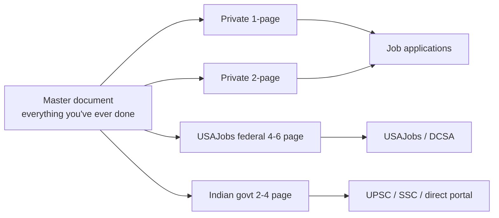

# 📄 Resume, LinkedIn & Interviewing

> A great résumé doesn't get you the job. It gets you the **conversation**. The interview gets you the job. Treat them as separate skills with separate practices.

This chapter is the operational manual for converting your skills, certs, and portfolio into offers. It covers three audiences (private sector, US federal, Indian government), the formats each expects, and the interview rituals you'll meet at each.

---

## Mental model: three resumes, one underlying truth

You will likely need **three different versions** of your résumé throughout your career. They share a single underlying truth — your work history, skills, and achievements — but the format, length, and emphasis differ wildly.

| Version | Audience | Length | Format | Focus |
|---|---|---|---|---|
| **Private sector / commercial** | FAANG, banks, startups, contractors | 1–2 pages | PDF, ATS-readable | Impact, metrics, brand-name tools |
| **US Federal (USAJobs)** | NSA, CISA, FBI, DoD civilian | 4–6 pages | Plain text in USAJobs builder | KSAs, time-in-grade, hours/week, supervisor |
| **Indian government / PSU** | CERT-In, NCIIPC, NTRO, DRDO, DPSUs | 2–4 pages | PDF or DOCX | Education in detail, grades/percentiles, declarations |

Maintain a **master document** — a single Markdown or Google Doc that has *every* role, project, cert, talk, and reference, in full. Compress that into the right format per application. Never write a résumé from scratch under deadline pressure.



---

## Part 1 — The private-sector résumé

### The single page or two-page question

- **0–5 years of experience** → one page, no exceptions. A second page on a junior résumé is a tell.
- **5–12 years** → one or two pages. Two only if the second is densely packed with relevant work.
- **12+ years or technical leadership** → two pages, occasionally three if there's a publications/talks list.

Hiring managers will spend roughly **20 seconds** on the first pass. Optimize for that.

### Section order for cyber roles

A layout that consistently outperforms the generic chronological template:

1. **Contact line** — name, city + country (not full address), phone, professional email, LinkedIn URL, GitHub URL, blog URL
2. **Summary** — three lines. What you are, what you specialize in, what you're targeting. Drop "results-driven" and other filler.
3. **Skills** — categorized, scannable. Not a tag cloud.
4. **Experience** — chronological, most recent first
5. **Projects** — only if they aren't already covered in Experience
6. **Certifications**
7. **Education**
8. **Publications / Talks / CVEs** — for senior roles
9. **Awards / Recognition** — only if substantive (CTF placements, hall of fame, hackathons)

!!! tip "The 6-second test"
    Hand the résumé to a non-cyber friend for 6 seconds, then ask: "What does this person do, and what are they best at?" If they can't answer both, the top of the page is too cluttered.

### Skills section that doesn't read like a buzzword salad

Bad:

```
Python, Bash, Network Security, Cybersecurity, IDS, IPS, SIEM, SOC,
Cloud, AWS, Azure, GCP, Linux, Windows, Forensics, Malware, Pentesting...
```

Good — categorize and right-size:

```
Languages         Python (advanced), Go (intermediate), Bash, PowerShell, SQL
Cloud             AWS (Security Specialty), GCP, Kubernetes (CKS in progress)
Detection         Splunk SPL, Sentinel KQL, Elastic EQL, Sigma authorship, Zeek
Offensive         OSCP, Burp Pro, Cobalt Strike, BloodHound, Impacket
Forensics         Volatility 3, KAPE, Eric Zimmerman tools, Wireshark
Frameworks        MITRE ATT&CK, NIST CSF, ISO 27001, CIS Controls
```

The reader can now tell what you actually do and at what depth.

### Experience bullets — the STAR-IPL formula

Every bullet should hit four beats:

1. **Action verb** (in past tense unless current role)
2. **What** you did (technical specifics)
3. **How** (tools, methods, scope)
4. **Impact** (numbers, time saved, risk reduced, scope of users)

Compare:

> ❌ Worked on SOC alerts and helped improve detections.

> ✅ Authored 47 Sigma detections (mapped to ATT&CK T1059, T1071, T1078, T1547) deployed across a 14k-endpoint Splunk fleet, reducing mean time-to-detect for credential dumping from 4h17m to 11m and removing ~3,200 false positives/month.

The first version is invisible in a stack of 200 résumés. The second one gets a phone screen.

### Where to put metrics if you don't have them yet

Junior candidates often think they have no numbers. They do. Mine them:

- **Lab work**: "Completed all 70+ HackTheBox Pro Hacker rated boxes, including 12 active machines."
- **CTF**: "Placed 14th of 1,872 teams at picoCTF 2026 (Cybersecurity Awareness Month challenge)."
- **Contribution**: "Authored 8 Sigma rules merged into SigmaHQ; rules referenced in CrowdStrike's 2025 Threat Hunting Report."
- **Course**: "Completed PEN-200 with 90 of 100 points on the OSCP exam, including the 40-point Active Directory set."
- **Self-taught**: "Built and maintained a 14-VM home lab simulating a small enterprise (DC, file server, Exchange, IIS, Sysmon → Wazuh → MISP), used to validate 20+ public detections."

### Projects section — what to include

Use the Projects section when your relevant work isn't in Experience yet (early career or a career changer). Each project entry: name, link, one-line description, your specific contribution, the technical stack, the outcome.

```
ROP Gadget Finder · github.com/<you>/rop-gadgets
  Capstone-based gadget finder for x86_64 ELFs; outperforms ROPgadget on
  binaries >50MB by 2.3x (benchmarked with cprofile). Tagged v1.0; 240 stars;
  used in PEN-300 student lab kits. Python 3.11, asyncio, pytest, ruff.
```

### Certifications

List in **descending order of difficulty** (not chronological), and include the issuing body once. Do not list the cert ID number unless asked. If a cert is in progress, say so explicitly with target date.

```
OSCP (PEN-200), 2026 · OSCE³ track in progress (OSWE Q3 2026)
GCIH, GCFA · GIAC
AWS Certified Security – Specialty
CompTIA Security+
```

### Things to remove ruthlessly

- Photo (US/EU/India private sector — illegal for employer to use in screening, looks unprofessional)
- "References available on request" (assumed, wastes a line)
- Hobby bullets unless directly relevant (CTFs are; hiking is not, on a 1-pager)
- Soft-skill claims unbacked by evidence ("strong communicator")
- High-school information once you have a degree
- Logo graphics, color blocks (not ATS-readable)
- Address beyond city, country
- Date of birth, marital status, religion, nationality (legal landmines in US/EU)

### The ATS reality

Most large enterprises use Applicant Tracking Systems (Workday, Greenhouse, Lever, iCIMS). They parse PDFs into structured data. Bad parses get you discarded. To pass cleanly:

- Use a single-column layout — multi-column résumés mangle into word salad
- Use real text, not images of text
- Use standard section headings (`Experience`, `Education`, `Skills`, `Certifications`)
- Use plain bullets (`•` or `-`); avoid fancy unicode
- Embed fonts in the PDF or stick to common ones (Calibri, Helvetica, Arial)
- Save as `Firstname_Lastname_Resume.pdf` — readable filename matters

If you're applying through an explicit portal, copy-paste the relevant skills/keywords from the JD into your skills list verbatim where honest. ATS keyword scoring is real.

---

## Part 2 — The US federal résumé (USAJobs)

The federal résumé is **a different beast entirely**. The same content that wins you a Google interview will fail you at NSA. Approach it with fresh eyes.

### Why the federal résumé is longer

Federal HR specialists screen for **qualifications** before suitability. They are looking for evidence that you meet the **specialized experience** criteria for a specific GS grade and series (e.g., GS-13 in 2210 IT Specialist). To prove it they need:

- Hours per week (40 = full-time)
- Exact dates (`2023-06-12` to `Present`, not `2023 – Now`)
- Supervisor name and contact (you give permission to be called)
- Salary at each role
- Detailed task descriptions — paragraphs, not bullets
- Evidence you've operated *at* the grade you're applying for (the [time-in-grade rule](https://www.opm.gov/policy-data-oversight/classification-qualifications/general-schedule-qualification-policies/#url=Time-in-Grade))

This produces a 4–6 page document. That's correct. Aiming for one page disqualifies you.

### Structure

1. **Personal information** — full legal name, citizenship, federal employment status (current/former employee, veteran, etc.), highest grade held
2. **Job objective** — short paragraph naming the announcement number and grade
3. **Work experience** — for each role:
   - Title, employer, location, supervisor name + phone, hours/week, salary, dates
   - Several paragraphs (not bullets) describing duties, responsibilities, accomplishments
   - Tie each accomplishment to KSAs (Knowledge, Skills, Abilities) or competencies in the job announcement
4. **Education** — institution, degree, GPA if 3.0+, relevant coursework
5. **Certifications** — full names, issuing body, dates, current status
6. **Training** — every relevant course, vendor course, conference workshop. Yes, including SANS courses, Pluralsight paths if substantial, Black Hat trainings.
7. **Publications, presentations, awards** — full citations
8. **Volunteer / community service** — counts in federal hiring. Don't omit it.
9. **Security clearance** — if held: type, date granted, current status, last investigation date

### Mirroring the announcement

Open the announcement. Find the "Specialized Experience Requirements" section. Each phrase there is a **must-pass keyword** for HR. Your résumé must demonstrate each one with a concrete example from your work.

> Announcement says: *"Experience analyzing network packet captures using protocol analyzers (e.g., Wireshark) to identify malicious activity."*

> Your résumé says: *"Analyzed 3.2 TB of pcap data per quarter using Wireshark and Zeek (Bro) protocol analyzers to identify malicious traffic patterns; produced 47 confirmed C2 detections including six previously-unseen Cobalt Strike Malleable C2 profiles, documented in agency Threat Intelligence Database (TID) tickets #4112 through #4158."*

The verbatim phrase shows up. The agency-specific detail shows up. A generalist HR specialist with no SOC background can confidently check the box.

### Common federal résumé mistakes

- **Treating it as a private-sector résumé** — too short, no hours, no supervisor info, no salary
- **Inflating titles** — federal HR can and does call your former supervisor
- **Vague duties** — "responsible for security" doesn't qualify you for any grade
- **Skipping the announcement keywords** — if you don't use the language, you can't score against the criteria
- **Not selecting the right grade** — applying for GS-15 with five years of experience guarantees rejection regardless of skill

For a much deeper treatment, see the [US Government Cyber Careers chapter](gov-careers-us.md). The general manual is on [USAJobs Help](https://help.usajobs.gov/how-to/account/documents/resume).

---

## Part 3 — The Indian government résumé

For CERT-In, NCIIPC, NTRO, DRDO, I4C, DPSUs (BEL, ECIL, BSNL Cyber, ITI), and ministry direct recruitment.

### Where it differs from the private sector

- **Education matters more, longer.** List 10th, 12th, undergraduate, postgraduate — each with school/board/university, year, marks, percentage or CGPA, and division (First Class with Distinction, etc.). This stays on the résumé even at senior levels.
- **Certifications include training programs**, not only industry certs. CDAC PG-DITISS, CERT-In ETP, ISEA training, IIT short courses — list them.
- **Recruitment exam scores** — UPSC ESE, GATE CS, NIELIT scientist exam — list with year and rank/percentile.
- **Declaration block** at the end: a paragraph stating that all information is true to the best of your knowledge, with place, date, and signature line. Yes, even on a digital submission.
- **Photograph** — many Indian government applications require one (passport-style, recent). Private sector: no.
- **Reference letters** are often required at submission, not "available on request." Senior faculty and former government employers carry the most weight.

### Section order

1. Personal information block — name, DOB, address, contact, nationality, category (General/OBC/SC/ST/EWS) if reservation applies
2. Career objective (1–2 lines)
3. Education — most recent first, all the way down to 10th
4. Certifications and training
5. Technical skills
6. Professional experience
7. Projects (especially academic projects for younger candidates)
8. Publications / patents
9. Awards and achievements
10. References (2–3, with full contact and relationship)
11. Declaration

### What recruiters specifically scan for

For DRDO scientist B/C entries: **GATE score and rank** are non-negotiable. GATE rank is the first thing a panel looks at after the candidate code.

For CERT-In and NCIIPC empanelment: **CISA / CISSP / OSCP / GCIH** carry official weight, as do CDAC certifications.

For NTRO: a **clearance pre-screen** happens early; references and verifiable employment history matter more than for civilian agencies.

For DRDO labs (CAIR, SAG, DLRL): **publications and patents** carry visible weight. List them with full citations including the DOI.

For PSU recruitment via UPSC ESE / GATE: the application itself is the form. Your résumé is supplementary at the interview stage. Bring an updated copy with you.

For details on each, see the [India Government Cyber Careers chapter](gov-careers-india.md).

---

## LinkedIn — the always-on résumé

LinkedIn is where recruiters source candidates *before* a role is publicly posted. It is also a 24/7 reputation surface. Treat it like a tended garden, not a one-time setup.

### The five elements that move the needle

1. **Headline** (220 chars) — not your job title verbatim. Include your specialty, target role, and one keyword cluster.
   - ❌ "Security Engineer at Acme Corp"
   - ✅ "Detection Engineer · Sigma + Splunk + KQL · ex-Mandiant · Building blue-team tooling"
2. **About section** — first three lines visible without "see more". Lead with what you do and who you do it for. Body covers depth and a personal hook.
3. **Featured section** — pin your best blog post, your top GitHub repo, a conference talk video, and your CV.
4. **Experience** — match your résumé but expand. LinkedIn doesn't enforce length the way a PDF does.
5. **Skills + endorsements** — pin the three skills that match your target role to the top.

### Recommendations

The single most undervalued LinkedIn feature. Three to five strong recommendations from past managers, peers, or clients dramatically lifts conversion.

- Ask within two weeks of leaving a role, while you're top-of-mind
- Draft what you'd like them to say — most people will appreciate the time saved
- Reciprocate. Recommendations are an exchange.

### Who to follow vs connect with

- **Follow** the *people whose work you read*: researchers, hiring managers in your target orgs, conference organizers. No request needed.
- **Connect with** people you have actually worked with, met at conferences, or had substantive professional interactions with. A short note with the request raises acceptance rate from ~30% to ~80%.

Cold connecting with senior folks at your target agency? Acceptable if you do it sparingly and write a real note. ("Saw your DEFCON 32 talk on Volt Typhoon — the post-exploit detection portion changed how I think about LOLBins. Would value being connected.")

### Posting cadence

- One substantive post per month is enough. More than weekly looks like grandstanding.
- Best post types for technical roles: **a thread breaking down a recent CVE / breach / TTP**, **a screenshot of your tool in action with a one-paragraph story**, **a writeup link with two-sentence framing**.
- Avoid: motivational posts, employer cheerleading, vague "lessons learned."

### LinkedIn search hacks for the job hunt

Use Boolean search in the LinkedIn search bar:

```
("threat intelligence" OR "detection engineer") AND ("hiring" OR "we're hiring") NOT (recruiter)
```

Filter by 1st/2nd-degree connections. Reach out to 2nd-degree contacts at target companies via a mutual connection introduction.

---

## Cover letters — when they matter

For most private-sector cyber roles, cover letters are **optional and rarely read**. Spend 5 minutes per application on a tight three-paragraph letter rather than 45 minutes per application on a fully-tailored one.

For US federal applications and Indian government applications, cover letters are **expected** and **read**. They differ in tone:

- **US federal SOP**: focus on KSAs and announcement keywords. Reference the announcement number.
- **Indian government SOP**: more formal, often opening with "Respected Sir/Madam." Highlight academic record and exam ranks. Mention any reservation category up front (it does not hurt; it ensures correct screening).

For both: specifics, not adjectives. "I am writing to express my strong interest" can be cut every time.

### A three-paragraph private-sector cover-letter template

```
Para 1 — what role, where you saw it, one line of why you're a fit.
Para 2 — one specific story showing you've already done a pivotal piece
         of the job (1–2 sentences setup, 1–2 of action, 1 of impact).
Para 3 — what you want next and how to reach you.
```

Three paragraphs. Half a page. Done.

---

## Networking that doesn't feel slimy

Most cyber jobs are filled through referrals before the public posting. Build the network *before* you need it.

### High-value, low-cost activities

- **Local BSides** — show up, volunteer, and you'll know half the local senior folks within a year
- **OWASP local chapter** — same dynamic, more AppSec
- **Null chapter meetings** (India) — friendly, technical, monthly
- **DEF CON groups** (DC408, DC11001, DC91120) — informal monthly meetups
- **ISACs you can join** as an individual: H-ISAC, IT-ISAC, MS-ISAC for state/local government
- **ISC2 chapters / CISO Roundtables** — for senior-track networking
- **Discord** servers worth being in: SANS Community, BlueTeamCon, Layer8, CyberJutsu, Indian Cyber Defence
- **Mastodon/Bluesky/X security communities** — pick one, lurk for a month, then engage

### How to ask for a referral

The single most effective sentence: *"I'm interested in [role] at [company]. I've already applied / am about to apply. If my background looks reasonable, would you be open to submitting a referral? Happy to pay it forward."*

Specific, time-bounded, easy to say yes or no to, and it acknowledges that a referral is a favor.

### How to ask for an informational interview

Lower-friction version of the above. *"I'm researching the [role / team / company]. I read your post on [specific thing]. Could I have 20 minutes to ask three questions about how you got here?"* Three minutes to compose, fifteen minutes for them, and you'll often leave with a referral anyway.

---

## Interview formats — the five archetypes

Most cybersecurity interviews fall into one of five archetypes, often combined into a single loop.

### 1. The recruiter screen (20–30 min)

Goal: filter for compensation alignment, work authorization, and basic role fit. Almost no technical depth.

Common questions: "Walk me through your résumé in two minutes." "What are you looking for in your next role?" "What's your salary expectation?" "When are you looking to start?"

How to win: **be ready with a polished two-minute story arc** ending in a sentence about what you want next. Have a researched salary range. Treat the recruiter as an ally — they're paid when you get hired.

### 2. The hiring-manager call (30–45 min)

Goal: confirm the recruiter screen and probe for fit with the team's actual problems.

Common questions: "Tell me about a project you led." "What's a time you disagreed with a senior engineer?" "What kind of mentorship are you looking for?" "Why this team specifically?"

How to win: **Two prepared STAR stories** about technical impact and one about handling conflict. Three sharp questions about the team's roadmap, on-call posture, and current pain points.

### 3. The technical screen (45–90 min)

The widest variation. Could be:

- **Live coding** — Python data parsing, log filtering, or API client. Use functions, type hints, error handling.
- **System design** — "Design a SIEM at 100k EPS" or "Design an EDR data pipeline." Capacity, components, trade-offs.
- **Scenario walkthrough** — "We see this alert. What do you do next?" — pure thinking-out-loud.
- **CTF-style** — "Here's a binary / pcap / EVTX. What can you tell us in 30 minutes?"
- **Whiteboarding a TTP** — "Walk me through Kerberoasting from initial access to ticket request to crack."
- **Code review** — "Find the security issues in this snippet."

How to win: **think out loud constantly**. Interviewers grade on process more than outcome. Ask clarifying questions. Verify assumptions. Sketch before coding. Test with a small case.

### 4. The onsite / loop (4–6 hours)

A sequence of the above, often plus a non-technical "values" or behavioral round and a candidate-asks-questions slot. Lunch is **part of the interview** even when stated otherwise; treat it like a normal conversation but assume the interviewer will report on it.

How to win: **stamina**. Treat each round as independent — don't carry frustration from a bad round into the next. Take the offered breaks. Eat. Bring water.

### 5. The take-home (4–8 hours of work, 1–2 weeks turnaround)

Increasingly common for senior roles. Could be a malware sample to analyze, a pcap to investigate, a Sigma rule to write, a VM to triage.

How to win: **constrain yourself to the stated time budget**. Submitting a 40-hour write-up against a 6-hour task signals poor scope discipline. Submit a clear write-up with explicit "what I would do with more time" sections.

---

## Government-specific interview elements

### US — the panel interview

Federal cyber roles often interview as a **structured panel** of three to five people, each asking pre-scripted competency questions. This is bizarre on first encounter and very normal on the second.

Format: each panelist asks the same question of every candidate ("Tell us about a time you led a high-stakes investigation"), in the same order, with similar follow-ups. Panelists score independently against a rubric. Scores aggregate. The candidate who tells the *clearest, most concrete* STAR stories wins, even if a competing candidate is technically stronger.

How to win: **pre-write 8–10 STAR stories** mapped to common federal competencies (Decisiveness, Influence, Integrity, Continual Learning, Leveraging Diversity, Strategic Thinking, etc.). Practice them out loud. Lead with concrete numbers.

### US — the polygraph (NSA, CIA)

A multi-hour examination assessing truthfulness on counterintelligence and lifestyle questions. There is no preparation that "beats" a polygraph; the prep is **knowing yourself**.

- Be ready to discuss your foreign contacts, drug history (especially marijuana — federal-illegal regardless of state law), financial history, and cyber activities in detail and without surprises.
- Lying is a near-certain failure. Discrepancy from your SF-86 is also a near-certain failure.
- "I don't remember the exact date" is fine. "I never did that" when you did is fatal.
- Re-test policies vary by agency. Most allow a re-test after 6–12 months.

### India — the DRDO scientist B interview

GATE qualified → screened-in candidates summoned to a DRDO lab for technical interview by a panel of scientists.

Format: ~30–60 minutes. Two phases. First, deep technical questions on your specialization (cryptography, network security, RE, ML — whatever your subject is on the application). Second, project-walk-through — "Tell us about your M.Tech project / final-year project / industry project," with the panel digging until they find your edges.

How to win: **know your project cold**. Be ready to defend every design choice. Read the panel members' publications if you can identify them in advance — interviews where you cite a panelist's own work go very well.

### India — the SSB-style interview (for IB, NIA, certain RAW posts)

Multi-day assessment combining psychological tests, group discussions, individual interviews, and physical/leadership exercises. Originally military selection methodology, now used for parts of the intelligence services.

How to win: extensive separate preparation. Books like Maj. Gen. R.M. Kharb's *Bullseye* are standard reading.

---

## Salary negotiation

### Private sector

The negotiation rule: **never name the first number**. When asked for your expectation, redirect: *"I'd like to learn more about the role first. What range has the team budgeted for this position?"* If pressed: provide a researched range based on Levels.fyi (US), Glassdoor with salt, [PayScale](https://www.payscale.com), or AmbitionBox (India). Aim for the upper end of the band; you can negotiate down, never up.

After offer:

1. **Don't accept on the call.** *"Thank you, this is exciting. Can I have 48 hours to review with my partner?"* is universally accepted.
2. **Negotiate base, sign-on, equity, and start date — separately.** Base raises future comp. Sign-on doesn't.
3. **Have a competing offer** if you possibly can. Even a verbal one. It changes the conversation.
4. **Get the final offer in writing** before resigning anywhere.

### US federal

Salary follows the [GS pay scale](https://www.opm.gov/policy-data-oversight/pay-leave/salaries-wages/). Limited room to negotiate within a grade — you can sometimes negotiate **step** (1 through 10 within a grade) based on prior salary or "superior qualifications," especially for hard-to-fill cyber roles. Locality pay is automatic.

For 2210-series cyber roles, ask about **Cyber Excepted Service (CES) flexibilities**, the **DHS Cybersecurity Service (CTMS)** band you'd be placed in, and **recruitment incentives** (up to 25% lump-sum sign-on for hard-to-fill positions).

### Indian government

Pay follows the **7th Pay Commission** matrix. Effectively no negotiation room on base; the level you're hired at determines the pay band. *Allowances* (HRA, DA, transport) and *deputation pay* (when posted to another agency) may have some flexibility. Discuss those at the joining negotiation.

For DPSU roles (BEL, ECIL, BSNL): pay is per IDA scales, set by the company board. Slightly more flexible than central government.

For CDAC, CERT-In contractor roles: market-rate, fully negotiable.

---

## The 30/60/90 day plan

Once an offer is made — and definitely before signing — bring a **30/60/90 day plan** to the final round or to your start date. Even one page with realistic milestones puts you immediately above peers.

```
Days 0–30   Listen, learn, and document.
            - Meet every member of the team 1:1
            - Read the runbooks, post-mortems, and last 90 days of tickets
            - Audit the existing detection/tooling stack
            - Identify three friction points to revisit at day 60

Days 31–60  Contribute small wins.
            - Ship the first three documented improvements
            - Take ownership of one runbook
            - Begin rotation in the on-call queue

Days 61–90  Take a meaningful piece of work end-to-end.
            - Lead one project from kickoff through ship
            - Present at a team brown-bag
            - Write the first quarterly summary
```

For US federal roles, this plan also serves as evidence of "hit the ground running" capability that converts a probationary period to permanent more smoothly.

---

## Common interview questions you should rehearse

A short, high-leverage list:

**Behavioral**
- Tell me about a time you found a vulnerability in production. What did you do?
- Describe a time you disagreed with leadership on a security decision.
- Walk me through your worst incident. What did you learn?
- Describe a time you had to learn a new technology fast.
- Tell me about a time you mentored someone.

**Technical (defense)**
- Walk me through how you'd hunt for AS-REP roasting in your environment.
- A user clicked a phishing link. What's your first hour look like?
- How does Kerberoasting differ from AS-REP roasting in detection terms?
- Describe how you'd validate a Sigma rule before deploying.
- What's the difference between Sysmon Event ID 1 and Security 4688?

**Technical (offense)**
- Walk through Active Directory recon from a foothold without raising alerts.
- You have RCE on a Linux box but no shell. What now?
- Describe a creative web vulnerability you've exploited.
- What's your approach to bypassing AMSI?
- How would you persist on a hardened Windows endpoint?

**Strategic / senior**
- Where would you spend an extra $1M of security budget?
- Walk me through a security program you'd build from scratch for a 500-person SaaS.
- What's the metric you'd use to prove your detection engineering team is working?
- How do you decide what *not* to detect?

**Curveballs**
- What's an unpopular opinion you hold about cybersecurity?
- Teach me something I almost certainly don't know.
- What's the last security blog post that genuinely changed how you think?

Practice them aloud. Practice with a friend. Record yourself. Cringe. Improve.

---

## Red flags candidates miss

Things to watch for *during* interviews that should make you reconsider:

- Vague answers about on-call expectations — usually means brutal on-call
- "We work hard but play hard" — translation: long hours
- Disagreement among interviewers about the role's responsibilities — leadership misalignment
- Inability to name three current team initiatives — team in flux or interviewer not on the team
- Glassdoor / Blind / r/cybersecurity threads about the team specifically — read carefully
- Reluctance to share the team's average tenure
- Backchannels going quiet after enthusiastic loops — usually means an internal candidate emerged

Trust the small signals. You're interviewing them too.

---

## Related chapters

- [Building a Security Portfolio](portfolio.md) — what feeds your résumé and LinkedIn
- [Certifications Roadmap](certifications.md) — what feeds your skills section
- [US Government Cyber Careers](gov-careers-us.md) — agency-specific application detail
- [India Government Cyber Careers](gov-careers-india.md) — agency-specific application detail
- [Continuous Learning](continuous-learning.md) — how to keep all of this current

---

[← Building a Security Portfolio](portfolio.md)  ·  [US Government Cyber Careers →](gov-careers-us.md)
