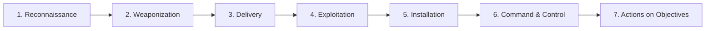

# 01 · Philosophy of Ethical Hacking

!!! quote "The mindset shift"
    A defender asks: *"Is this normal?"* An attacker asks: *"What happens if I do this?"* Everything in offensive security flows from that one reversal.

## 1.1 What ethical hacking actually is

Ethical hacking is the **authorized, documented application of adversary techniques against a target system to discover and demonstrate security weaknesses before a real adversary does.** Four words carry the weight:

- **Authorized** — you have written permission, scoped in time and by asset.
- **Documented** — every action is logged, reproducible, and reportable.
- **Adversary techniques** — real TTPs used by real threat actors, not "scan and pray."
- **Demonstrate** — you don't just list vulnerabilities; you prove impact.

Anything else — running Nmap at your neighbor's Wi-Fi, pentesting your old employer's systems, "red-teaming" your sibling's Instagram — is unauthorized access and a crime. See [Module 02](02-legal.md).

## 1.2 The hacker taxonomy

The popular "white / grey / black hat" breakdown is cute but shallow. Here is the working taxonomy you'll operate in:

| Archetype | Authorization | Motivation | Example |
|-----------|---------------|------------|---------|
| **Penetration Tester** | Contract + SOW + ROE | Paid engagement, time-boxed | Consultant running a web app test for a retail client |
| **Red Team Operator** | Employer contract | Internal adversary emulation | Works for a bank's internal red team, emulates APT29 for 30 days |
| **Bug Bounty Hunter** | Program rules (scope) | Payouts + reputation | Reports XSS in Tesla's bug bounty on HackerOne |
| **Vulnerability Researcher** | Depends (responsible disclosure) | Novel vulnerabilities, CVEs | Finds a 0-day in OpenSSL, coordinates patch with maintainers |
| **Government Cyber Operator** | Classified mission authority | National security | Works for US Cyber Command, FBI Cyber, or an IC element |
| **Threat Actor (criminal)** | **None** | Money, ego, ideology | Ransomware affiliate; not you, ever |
| **Nation-state APT operator** | Their government's authority | Espionage, sabotage | Not you. But you study their TTPs to detect/stop them |

You'll live primarily in the first five. This course routes you toward **government cyber operator** or **red team operator at a cleared contractor**.

!!! info "The "grey hat" myth"
    "Grey hat" usually means "black hat with better PR." If you test something without authorization and then try to get paid or thanked, you are not in a grey zone — you are in an unauthorized-access zone with a hopeful narrative. Don't do it.

## 1.3 The attacker mindset

Four mental reversals separate operators from defenders:

### Reversal 1 — Assume success, not prevention

A defender asks *"how do I prevent X?"* An attacker asks *"if X is prevented, how do I still get in?"*

Every control has a bypass. Every filter has an encoding. Every allowlist has a missing entry. The exercise is not *can I get in*, it is *what's the cheapest path I haven't tried yet?*

### Reversal 2 — Enumeration is 90% of the work

The popular image of hacking is zero-day exploits. The reality is hours of patient listing — subdomains, ports, services, users, shares, permissions, group memberships, scheduled tasks, credentials in old config files. Exploitation is the last 10 minutes of a 10-day engagement.

> **If you try to exploit before you enumerate, you're gambling. If you enumerate thoroughly, exploitation becomes obvious.**

### Reversal 3 — Misuse over use

A defender sees "this endpoint accepts JSON." An attacker sees "this endpoint *assumes* JSON, what happens with XML? With a giant integer? With a URL? With a serialized object? With an SSRF gadget?"

Security bugs live in the gap between how a developer **intended** a feature to be used and every **other** way it can be used. Your job is to populate that gap.

### Reversal 4 — Chains, not singletons

A single low-severity bug is uninteresting. Three low-severity bugs that chain into domain admin are a killshot. Attackers think in chains:

```
LFI (low) 
  → /proc/self/environ leak (info) 
  → SSRF to metadata service (med)
  → IAM role with s3:* (high)
  → customer database exfil (critical)
```

No single step is catastrophic. The chain is.

## 1.4 The kill chains you must know

Three frameworks. Know all three, use the right one for the audience.

### 1.4.1 Lockheed Martin Cyber Kill Chain (the classic)

Linear, 7-stage. Great for executive briefings because it's easy to narrate.



**Weakness:** it's too linear. Real adversaries loop, pivot, and persist for months.

### 1.4.2 MITRE ATT&CK (the operational standard)

A matrix of **tactics** (the "why" of an attacker action) and **techniques** (the "how"). This is the language used at CISA, NSA, in SOC tuning, in red team reports, and in every job interview you'll sit.

**14 Enterprise tactics:**

1. Reconnaissance
2. Resource Development
3. Initial Access
4. Execution
5. Persistence
6. Privilege Escalation
7. Defense Evasion
8. Credential Access
9. Discovery
10. Lateral Movement
11. Collection
12. Command and Control
13. Exfiltration
14. Impact

Each tactic contains dozens of techniques (e.g. `T1059` Command and Scripting Interpreter) and sub-techniques (e.g. `T1059.001` PowerShell, `T1059.003` Windows Command Shell).

!!! tip "Interview tell"
    When an interviewer asks *"walk me through how you'd attack X,"* frame your answer in ATT&CK tactics. You'll sound senior immediately.

### 1.4.3 Unified Kill Chain (the modern synthesis)

Proposed by Paul Pols. 18 phases, grouped into three looping mega-phases:

- **In** — Recon → Weaponization → Delivery → Social Engineering → Exploitation → Persistence → Defense Evasion → Command & Control
- **Through** — Pivoting → Discovery → Privilege Escalation → Execution → Credential Access → Lateral Movement
- **Out** — Collection → Exfiltration → Impact → Objectives

Why it matters: it explicitly models **loops** (you might return to Discovery 15 times during a single engagement) and **internal pivots** that Lockheed's model glosses over.

## 1.5 Your SOAR background is a superpower — here's why

A SOAR engineer thinks in **playbooks**: triggered actions, decision branches, enrichment calls, response orchestration. An offensive operator also thinks in playbooks, just from the other side of the glass.

| SOAR concept | Offensive equivalent |
|--------------|---------------------|
| Alert enrichment | Target enrichment (OSINT, fingerprinting) |
| Decision branches | Exploit condition checks |
| Response actions | Payload delivery + post-exploitation |
| Playbook library | TTP library |
| Integration catalog | Tool/framework catalog (Metasploit, Impacket, BloodHound) |
| Metrics (MTTR, closure rate) | Metrics (time to compromise, detection coverage) |

This isn't metaphor. Every engagement you run will be an executable playbook in your head: *recon triggers → condition: public-facing web app found → action: run web-app recon set → enrichment: tech stack → branch: if PHP, load LFI/RFI paths → …*

**Lean into this.** You will automate things senior pentesters do manually. That's a job-winning differentiator.

## 1.6 What separates a mid-level pentester from an operator

Most pentesters plateau around mid-level. Operators — the ones with the cool jobs — share four habits:

1. **They read source code, not just tool output.** They know what Nmap's `--script vuln` is actually doing and can write their own NSE scripts or Python equivalents.
2. **They build.** They don't run other people's tools exclusively; they write custom payloads, custom C2s, custom recon glue. (This is where your Python matters.)
3. **They understand defenses deeply.** The best red teamers know EDR telemetry better than most SOC analysts.
4. **They write.** Engagement reports, disclosure writeups, technical blogs. If you can't write, your findings don't matter.

## 1.7 US federal / cleared-contractor career paths

Quick tour of where this curriculum aims you:

### Public sector

- **CISA (Cybersecurity and Infrastructure Security Agency)** — hunt, threat intel, vuln disclosure, red teaming via CSD. Entry via USAJOBS, CyberCorps/SFS scholarship, or lateral from contractor.
- **NSA** — a mix of public-facing cybersecurity roles and classified mission work. Look for positions at Cybersecurity Collaboration Center (CCC) and public vuln research teams. TS/SCI with polygraph typically required.
- **FBI Cyber Division** — Special Agent path (requires Special Agent academy) or Computer Scientist / Intelligence Analyst paths (civilian technical).
- **DoD Cyber Command + Service Cyber Components** — often requires military service or civilian with clearance.
- **DOE National Labs** — PNNL, ORNL, Sandia, Idaho — ICS/SCADA and critical-infra security work.

### Cleared contractors (usually the fastest path in)

- **MITRE** — ATT&CK is theirs; they hire heavily for research-adjacent roles.
- **Booz Allen Hamilton** — large cyber practice, many cleared positions.
- **Leidos, Peraton, ManTech, CACI, SAIC** — government-services giants.
- **Mandiant (now Google Public Sector)** — incident response + red team.
- **Two Six Technologies, IronNet, Dragos** — boutique, specialized.

### What they actually look for

In priority order:

1. **Clearance eligibility** (US citizenship + clean background for Secret; deeper for TS/SCI).
2. **Demonstrated technical ability** — OSCP at minimum, CTF track record, public writeups, a GitHub that proves you can build.
3. **Operational discipline** — can you document, report, stay inside scope.
4. **Teachability** — agency work is highly specialized; they'll retrain you, but you have to be learnable.

[Full breakdown in Part 15 → Module 60.](../index.md)

## 1.8 Ethics — the part everyone skips

There is no ethical neutrality in this work. Every technique you learn can harm someone. The guardrails that make you a professional rather than a criminal:

1. **Written authorization, every time, every target.** No verbal "it's fine."
2. **Stay in scope.** If your ROE says "external web apps," you don't touch internal AD because you saw an exposed RDP.
3. **Minimize impact.** If you need to prove you can dump a database, dump *the schema and one row*, not the whole PII store.
4. **Protect what you find.** Findings are sensitive — handle them with clearance-worthy care.
5. **Respect coordinated disclosure.** Don't drop 0-days on Twitter for clout. File with MITRE, coordinate with the vendor.
6. **Never target individuals for personal reasons.** The techniques in this course can be weaponized against exes, journalists, activists. Don't.
7. **Speak up.** If an employer asks you to cross a line, escalate or leave. Federal work has an especially clear line — gov roles are governed by oath and law.

!!! danger "One career-killer that happens every year"
    New pentester finishes OSCP. Gets excited. Runs Nmap against their employer's public IPs "just to see." Employer's SOC tickets it. HR terminates. New pentester now has "insider threat / unauthorized access" in their background check forever. **Do. Not. Do. This.**

## 1.9 Script · `attack_path_visualizer.py`

Concept script for this module. Given a simple YAML description of a compromise path, renders a text-art kill chain aligned to ATT&CK tactics. Useful for writing reports and for training yourself to think in chains.

**Location:** `scripts/part-01/01-philosophy/attack_path_visualizer.py`

Usage:

```bash
python scripts/part-01/01-philosophy/attack_path_visualizer.py \
    --input scripts/part-01/01-philosophy/sample_path.yaml
```

Expected output:

```
─── ATTACK PATH: Retail-Pentest-2026-Q2 ─────────────────────────
[Reconnaissance    ] T1595.002  Active Scanning: Vuln Scanning
      │              └── nmap --script http-enum on *.retail.example
      ▼
[Initial Access    ] T1190      Exploit Public-Facing Application
      │              └── CVE-2024-XXXX in outdated Magento
      ▼
[Execution         ] T1059.004  Unix Shell
      │              └── www-data reverse shell via web exploit
      ▼
[Priv Escalation   ] T1548.001  Setuid/Setgid
      │              └── misconfigured /usr/bin/find → root
      ▼
[Credential Access ] T1552.001  Credentials in Files
      │              └── /root/.aws/credentials discovered
      ▼
[Exfiltration      ] T1537      Transfer Data to Cloud Account
                     └── attacker-controlled S3 bucket
─────────────────────────────────────────────────────────────────
Severity: CRITICAL — external → root → cloud via 5-step chain.
```

See the full script in the `scripts/` tree; it's commented line-by-line.

## 1.10 Real-world scenario — the 2020 SolarWinds briefing

You are a senior analyst at CISA. A federal agency reports anomalous traffic to `avsvmcloud[.]com`. Using ATT&CK, you build this picture in the first 2 hours of triage:

| Tactic | Technique | Observation |
|--------|-----------|-------------|
| Initial Access | T1195.002 Supply Chain Compromise: Compromise Software Supply Chain | SolarWinds Orion update was trojanized |
| Execution | T1218 Signed Binary Proxy Execution | SUNBURST backdoor loaded by Orion's trusted process |
| Defense Evasion | T1070 Indicator Removal on Host | Backdoor waits 12–14 days before beaconing; evades sandbox analysis |
| Command & Control | T1071.004 DNS | C2 hidden in DNS queries to avsvmcloud subdomains |
| Credential Access | T1552 Unsecured Credentials | Post-compromise SAML token forgery (TEARDROP/RAINDROP) |
| Lateral Movement | T1550.001 Use Alternate Auth Material: App Access Token | Golden SAML forged tokens used across cloud tenants |

Being able to read an attack this way — mapping raw telemetry to ATT&CK tactics — is table stakes at federal agencies. Part 13 goes deep on this from the defensive side.

## 1.11 Exercises

1. **Read the MITRE ATT&CK v14+ Enterprise matrix front to back.** Pick any five techniques you've never heard of and write 2-sentence summaries in your engagement notes.
2. **Map a news breach to ATT&CK.** Pick a recent public breach (Change Healthcare 2024, MOVEit 2023, Okta 2022, etc.) and write the kill chain using ATT&CK tactics.
3. **Run `attack_path_visualizer.py`** on the sample YAML. Then modify the YAML to describe a different attack (make one up — e.g., phish → VPN creds → RDP → DC) and re-run.
4. **Write your 90-second "how I'd attack X" answer.** Pick a target type (retail web app, internal AD, AWS account). Write a structured answer using ATT&CK tactics as headers. Practice saying it out loud. This is interview gold.

## 1.12 Further reading

- **MITRE ATT&CK** — <https://attack.mitre.org> (bookmark, read weekly)
- **The Unified Kill Chain** — Paul Pols' paper (free PDF, 2017)
- **Red Team Field Manual** (RTFM) — Ben Clark
- **Blue Team Field Manual** (BTFM) — Alan White, Ben Clark
- **The Web Application Hacker's Handbook** — Stuttard & Pinto (still the bible)
- **Countdown to Zero Day** — Kim Zetter (Stuxnet; read this to understand nation-state operations)
- **Sandworm** — Andy Greenberg (GRU cyber operations)
- **This Is How They Tell Me the World Ends** — Nicole Perlroth (0-day markets; critical context for gov work)

## 1.13 What's next

[Module 02 — Legal & Ethical Framework](02-legal.md). No skipping. Even if you think you "already know" the legal side, Module 02 has the specific statutes, the specific authorization artifacts, and specific case law that will save your career.
