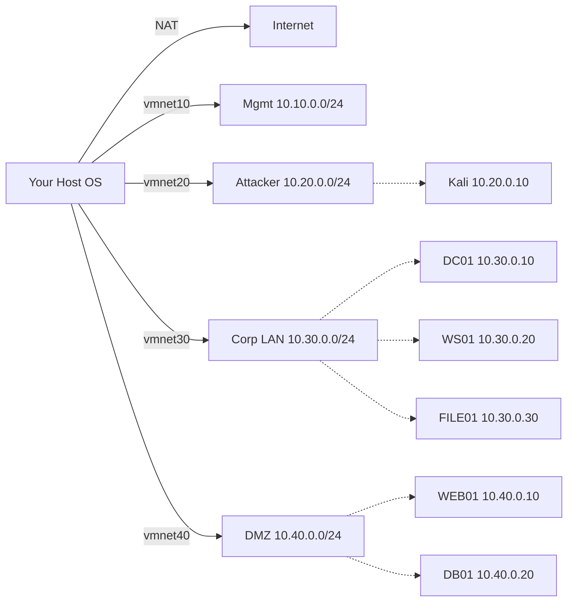

# 03 · Lab Setup

!!! abstract "Goal of this module"
    Build a **fully isolated home lab** where you can safely run every offensive technique in this curriculum. At the end of the module you will have a working hypervisor, segmented networks, a Kali attacker VM, a Windows AD lab (DC + member + workstation), a Linux target, and a catalog of vulnerable apps — all snapshotted and reproducible.

## 3.1 Why you need your own lab

HackTheBox, TryHackMe, and OffSec Proving Grounds are excellent. Use them. But they are **someone else's environment** — you don't see the defender's view, you can't tweak detections, you can't install custom apps, you can't break things the way you need to.

Your own lab lets you:

- Practice full attacker + defender loops (purple team).
- Install exactly the vulnerable versions you want to study.
- Simulate a real enterprise (multi-subnet, DC, members, logging, SIEM).
- Develop and test custom tooling before you ever take it on engagement.
- Record demos for your portfolio.

Every offensive professional has one. Yours should be permanent, versioned, and documented.

## 3.2 Hardware minimums

| Resource | Minimum | Recommended | Notes |
|----------|---------|-------------|-------|
| CPU | 8 cores | 12+ cores with VT-x / AMD-V | Virtualization flags MUST be on in BIOS |
| RAM | 32 GB | 64 GB | Windows VMs are memory-hungry |
| Storage | 1 TB SSD | 2 TB NVMe | Snapshots eat space fast |
| Network | 1 Gbps | 1 Gbps + separate lab subnet | Physical isolation preferred |

If you're under spec, a cloud lab (AWS / Proxmox on a rented Hetzner box) is a valid substitute for Parts 1–6. Labs for Parts 7+ (AD, C2, evasion) really benefit from local hardware.

## 3.3 Hypervisor — pick one

=== "Proxmox VE (recommended)"
    - Free, open source, mature.
    - Full CLI / API — scriptable from Python.
    - Native snapshots, clone templates, VLAN-aware networking.
    - Requires a dedicated host (wipes the disk to install).
    - Download: <https://www.proxmox.com/en/downloads>

=== "VMware Workstation Pro (Windows/Linux) / Fusion (macOS)"
    - Excellent UX, runs on your daily driver.
    - **Free for personal use** since 2024.
    - Snapshots, clones, vmnet editor.
    - Download: <https://www.vmware.com/products/workstation-pro.html>

=== "VirtualBox"
    - Free, cross-platform.
    - Works fine for most of this curriculum.
    - Weaker on performance and AD clustering.
    - Download: <https://www.virtualbox.org/>

=== "Hyper-V (Windows Pro/Enterprise)"
    - Built-in to Windows Pro.
    - Great for Windows VMs; awkward for Kali networking.
    - Free, enterprise-grade.

Recommendation for your situation (SOAR engineer, likely Windows daily driver): **VMware Workstation Pro** for ease, or **Proxmox** on a spare machine for more serious work.

## 3.4 Lab network architecture

The target topology:



Four isolated networks:

| Network | CIDR | Purpose |
|---------|------|---------|
| vmnet10 (Mgmt) | 10.10.0.0/24 | Your host ↔ lab mgmt, Proxmox UI, etc. |
| vmnet20 (Attacker) | 10.20.0.0/24 | Kali, your operator box |
| vmnet30 (Corp LAN) | 10.30.0.0/24 | Internal enterprise simulation (AD) |
| vmnet40 (DMZ) | 10.40.0.0/24 | Public-facing services |

For advanced modules you'll add:
- vmnet50 (OT/ICS) for Part 10's Modbus/DNP3 work.
- vmnet60 (cloud-bridge) for hybrid cloud scenarios.

!!! warning "Isolation first"
    **Block Internet access for Corp LAN and DMZ networks by default.** Use the hypervisor's firewall rules or a tiny pfSense/OPNsense router VM. Otherwise a misfire in a persistence experiment can phone home to something you don't own.

## 3.5 The core VM catalog

Minimum viable lab for Parts 1–6:

### 3.5.1 Attacker VM — Kali Linux

Kali Linux (current release) is the default operator OS. Install the **"everything" metapackage** for completeness, then customize.

Setup steps:

1. Download Kali installer image from <https://www.kali.org/get-kali/>.
2. Create VM: 4 vCPU, 8 GB RAM, 80 GB disk, vmnet20.
3. Install, update: `sudo apt update && sudo apt full-upgrade -y`.
4. Install `kali-linux-everything` (`sudo apt install kali-linux-everything`) — 20 GB of tools; do it once.
5. Set up your Python env:
   ```bash
   sudo apt install -y python3-pip python3-venv pipx
   pipx ensurepath
   pipx install impacket pwntools
   ```
6. Install `tmux` and set up a persistent `.tmux.conf`.
7. Create `/opt/redshift` for your toolkit; clone your `redshift-toolkit` repo there.
8. **Snapshot** — name it `kali-base-clean`. This is your forever-rollback point.

Alternative: **Parrot OS Security** — similar to Kali, lighter in some ways. Use whichever you prefer; the curriculum is tool-agnostic.

### 3.5.2 Windows Server 2022 — Domain Controller

Windows Server 2022 Evaluation is free for 180 days (re-armable). Grab from <https://www.microsoft.com/en-us/evalcenter>.

Configure:

1. 2 vCPU, 4 GB RAM, 80 GB disk, vmnet30. Static IP `10.30.0.10`.
2. Hostname `DC01`.
3. Install roles: **Active Directory Domain Services** + **DNS**.
4. Promote to domain controller: domain `redshift.local`, forest functional level **Windows Server 2016** (gives you more realistic attack surface).
5. Create a handful of users with varying privileges:
   - `jdoe` — standard user, "Pa55w0rd-Standard!"
   - `svc_sql` — service account with SPN for Kerberoasting practice, unconstrained delegation variations
   - `backup_admin` — Domain Admin, just to have a target
6. Create OUs: `IT`, `HR`, `Finance`, `Servers`, `Workstations`.
7. Configure a GPO that deploys a scheduled task running a script from a file share (persistence/lateral practice).
8. Enable command-line process auditing, PowerShell ScriptBlock logging.
9. **Snapshot** — `dc01-base-clean`.

### 3.5.3 Windows 11 Workstation (domain-joined)

1. 2 vCPU, 4 GB RAM, 80 GB disk, vmnet30. DHCP or static `10.30.0.20`.
2. Hostname `WS01`. Join the `redshift.local` domain.
3. Log in as `jdoe`.
4. Install common enterprise-looking software: Chrome, VS Code, Notepad++, 7zip, PuTTY.
5. Place realistic-looking files in `C:\Users\jdoe\Documents` (the kind of files an attacker loves finding — notes, credentials-in-txt).
6. **Snapshot** — `ws01-base-clean`.

### 3.5.4 Linux Member — `files01`

Ubuntu Server 22.04 LTS.

1. 1 vCPU, 2 GB RAM, 40 GB disk, vmnet30, `10.30.0.30`.
2. Install Samba, expose a share, reuse domain creds via SSSD + AD integration.
3. **Snapshot** — `files01-base-clean`.

### 3.5.5 DMZ web target — `web01`

1. Ubuntu Server 22.04, vmnet40, `10.40.0.10`.
2. Host vulnerable apps via Docker:
   - **DVWA** (`docker run --rm -p 8001:80 vulnerables/web-dvwa`)
   - **OWASP Juice Shop** (`docker run --rm -p 8002:3000 bkimminich/juice-shop`)
   - **OWASP WebGoat** (`docker run --rm -p 8003:8080 webgoat/webgoat`)
3. Also install **Metasploitable 2** or **Metasploitable 3** separately on vmnet40 for pure network-service practice.
4. **Snapshot** — `web01-base-clean`.

### 3.5.6 Detection stack (blue-side) — optional but strongly encouraged

A small SIEM + EDR for purple-team exercises:

- **Wazuh** (SIEM/HIDS) — all-in-one VM. Ubuntu, 4 GB RAM, vmnet10.
- **Velociraptor** — excellent free DFIR/hunt tool.
- **Sysmon + WEF** on your Windows boxes, feeding into Wazuh.

You'll lean on this stack heavily from Part 13 onwards. Set it up now while setup is fresh.

## 3.6 Vulnerable app and CTF catalog

In addition to live VMs, pull down these resources:

| Resource | What it is | Best for |
|----------|-----------|----------|
| DVWA | Damn Vulnerable Web App | OWASP Top-10 basics |
| Juice Shop | Modern JS app | API + modern web |
| WebGoat | OWASP educational | Guided lessons |
| bWAPP | 100+ web vulns | Practice variety |
| Metasploitable 3 | Vulnerable Windows/Linux | Network services |
| GOAD (Game of Active Directory) | Pre-built AD lab | AD attacks |
| HackTheBox | Online CTF platform | Ongoing practice |
| TryHackMe | Beginner-friendly CTFs | Learning paths |
| VulnHub | Downloadable VMs | Offline practice |
| PortSwigger Academy | Web-app academy | Free, excellent curriculum |

**[GOAD](https://github.com/Orange-Cyberdefense/GOAD)** deserves a callout. It's a pre-built multi-domain AD lab with known vulnerabilities, deployed by Ansible. If setting up AD manually from §3.5.2 feels daunting, run GOAD instead. You'll use it for Parts 7–11 anyway.

## 3.7 Snapshotting discipline

Rules:

1. **Every VM has a `base-clean` snapshot** taken immediately after OS install + tool install + first shutdown. Never delete.
2. **Every engagement / practice session gets its own branching snapshot** (`base-clean → htb-writeup-2026-05-12`).
3. **Snapshots are not backups.** They consume disk space proportional to change; prune old experimental branches aggressively.
4. **Automate snapshot creation before risky work** (shell scripts or the Python helper in §3.9).

## 3.8 Lab hygiene (operator practices)

Habits to adopt from day 1:

- **Separate your offensive work from your daily life.** Dedicated hardware if possible, dedicated user account if not.
- **No production credentials on the lab.** No personal accounts. Ever.
- **Version your configs.** Your pfSense rules, Kali dotfiles, Proxmox VM definitions — all in git.
- **Engagement notebook per activity.** Markdown file + timestamps + commands + output. Discipline now → painless reports forever.
- **Wipe and re-snap between engagements.** Rotating credentials and artifacts from one engagement into another is a contamination risk.

## 3.9 Script · `lab_health_check.py`

Runs a ping + TCP connect + service banner check across every lab VM, reports which are up and which are down. Catches "oh, I forgot the DC was off" before you waste 10 minutes wondering why Kerberoasting fails.

**Location:** `scripts/part-01/03-lab-setup/lab_health_check.py`

Usage:

```bash
python lab_health_check.py --config lab.yaml
python lab_health_check.py --config lab.yaml --detailed
python lab_health_check.py --config lab.yaml --format json
```

## 3.10 Script · `snapshot_manager.py`

CLI wrapper around your hypervisor's API for consistent snapshot-and-restore workflows. This version targets **Proxmox** via its REST API (authentication by API token). Swap the backend for VMware's `vmrest` if you're on Workstation Pro.

**Location:** `scripts/part-01/03-lab-setup/snapshot_manager.py`

## 3.11 Real-world scenario — setting up a client-replica lab

You're running a red-team engagement against a financial services client in two weeks. The client uses Active Directory 2019, PaloAlto firewalls, CrowdStrike Falcon, and a custom vuln-management app. Before you touch the engagement, you build a **replica lab**:

1. Spin up a Server 2019 DC with a similar user/OU structure (names changed; scrubbed from any client artifacts).
2. Install an EDR trial (the same vendor the client runs).
3. Install the client's public-facing app from a downloaded installer (they provided it for lab purposes, per SOW).
4. Run your planned tradecraft against this replica first.
5. Tune your evasion based on what the EDR sees; iterate.
6. Only then point at the client.

This is how senior operators avoid burning tradecraft on the live engagement. Your lab isn't just where you learn — it's where you de-risk engagements.

## 3.12 Exercises

1. **Install and configure your hypervisor** (Proxmox or VMware Workstation).
2. **Build Kali, DC01, WS01, and web01** from §3.5. Get them all running in their respective vmnets.
3. **Verify isolation** — from WS01 (Corp LAN), confirm you cannot reach the internet directly; you CAN reach DC01; you CANNOT reach web01 (unless you design a specific route).
4. **Write your own lab.yaml** and run `lab_health_check.py` against it. Tune until every box shows green.
5. **Take and label `*-base-clean` snapshots** on every VM.
6. **Install GOAD** on a separate vmnet to kick the tires on AD attacks (you'll use it heavily in Part 7).

## 3.13 Further reading

- **Building Virtual Machine Labs: A Hands-On Guide** — Tony Robinson
- **GOAD project** — <https://github.com/Orange-Cyberdefense/GOAD>
- **Proxmox VE Documentation** — <https://pve.proxmox.com/pve-docs/>
- **Active Directory Security blog** — <https://adsecurity.org/> (Sean Metcalf)
- **Detection Lab** — <https://github.com/clong/DetectionLab> (pre-built Vagrant/Ansible blue+red lab)

!!! success "Exit criteria"
    You're done with Module 03 when:
    
    - [ ] `lab_health_check.py` returns all-green against your lab.
    - [ ] Every VM has a `*-base-clean` snapshot.
    - [ ] You can SSH from Kali to web01, and you can SMB-enumerate DC01 from Kali.
    - [ ] You have the pfSense/hypervisor firewall set up so Corp LAN and DMZ cannot reach the internet by default.
    - [ ] You've written your `lab.yaml` and committed it (with your dotfiles and notes) to a **private** git repo.
